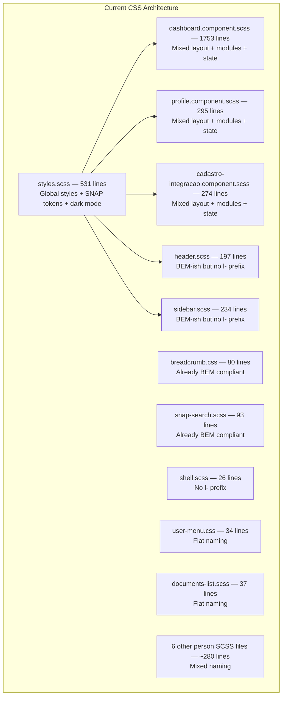
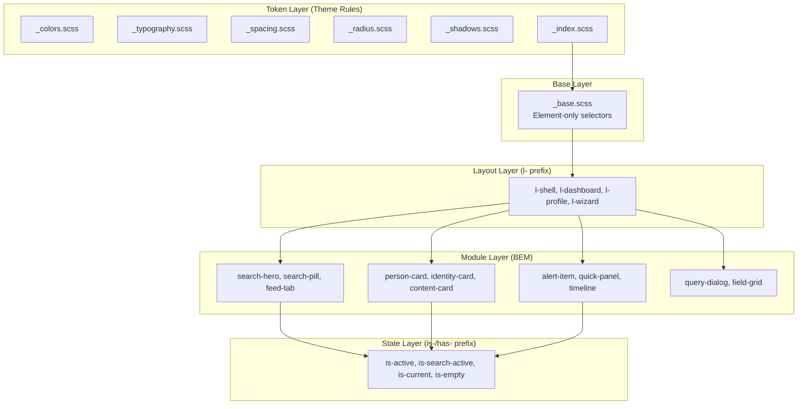
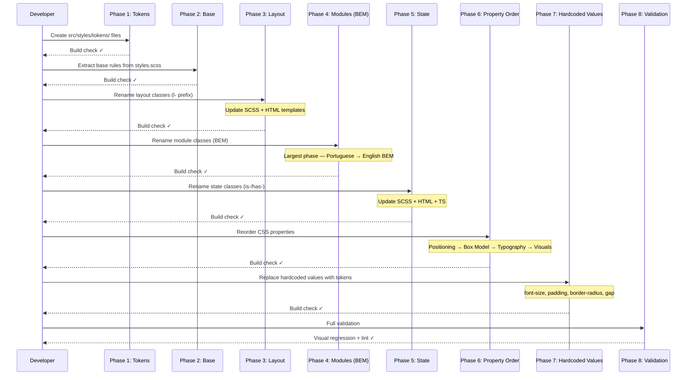

# Design Document: CSS SMACSS Migration

## Overview

The platform-frontend Angular application contains ~3,800 lines of CSS/SCSS across 18 files written during prototyping without following the DS-002 SMACSS CSS Architecture Standard. This migration restructures all custom CSS to comply with DS-002's five SMACSS categories (Base, Layout, Module, State, Theme), enforces BEM naming for modules, applies `l-` prefixes to layout classes, `is-`/`has-` prefixes to state classes, replaces hardcoded values with CSS custom property tokens, reorders properties to the mandated Positioning → Box Model → Typography → Visuals sequence, and translates all Portuguese class names to English.

The migration is purely structural and naming-focused — zero visual changes are expected. Each phase leaves the project in a buildable state. Angular ViewEncapsulation means every component SCSS rename requires a corresponding HTML template update.

## Architecture

### Current State: Monolithic, Unstructured CSS



### Target State: SMACSS-Compliant Architecture




## Migration Sequence Diagram



## Components and Interfaces

### Component 1: Token Infrastructure (`src/styles/tokens/`)

**Purpose**: Centralize all design tokens as CSS custom properties, extracted from the inline definitions in `styles.scss`.

**File Structure**:
```
src/styles/
├── tokens/
│   ├── _colors.scss       # --snap-* color tokens (light + dark)
│   ├── _typography.scss    # --text-xs through --text-2xl
│   ├── _spacing.scss       # --space-1 through --space-8
│   ├── _radius.scss        # --radius-sm, --radius-md, --radius-lg, --radius-full
│   ├── _shadows.scss       # --shadow-sm, --shadow-md, --shadow-lg
│   └── _index.scss         # Barrel @forward
├── _base.scss              # Element-only selectors
└── styles.scss             # Imports tokens + base + global overrides
```

**Responsibilities**:
- Single source of truth for all theme values
- Support light/dark mode via `:root` and `.p-dark` scopes
- Map recurring hardcoded values to semantic token names

### Component 2: Base Rules (`src/styles/_base.scss`)

**Purpose**: Element-only selectors extracted from `styles.scss` — `body`, `h1`–`h6`, `a`, `input`, `button` defaults.

**Interface**: No class selectors. Only element selectors referencing tokens.

### Component 3: Layout Rules (per component SCSS)

**Purpose**: Structural/positioning classes renamed with `l-` prefix. Remain in component-scoped SCSS files (Angular ViewEncapsulation).

**Key Layout Modules**:

| Component | Current Class | Target Class |
|-----------|--------------|-------------|
| Shell | `.shell-layout` | `.l-shell` |
| Shell | `.shell__main` | `.l-shell__main` |
| Shell | `.shell__content` | `.l-shell__content` |
| Dashboard | `.conteudo-principal` | `.l-dashboard` |
| Dashboard | `.coluna-esquerda` | `.l-dashboard__main` |
| Dashboard | `.coluna-direita` | `.l-dashboard__aside` |
| Dashboard | `.grade-monitorados` | `.l-card-grid` |
| Profile | `:host` grid | `.l-profile` (on `:host`) |
| Profile | `.coluna-identidade` | `.l-profile__sidebar` |
| Profile | `.coluna-central` | `.l-profile__main` |
| Profile | `.coluna-direita` | `.l-profile__aside` |
| Cadastro | `.stepper-body` | `.l-wizard` |
| Cadastro | `.step-content` | `.l-wizard__main` |
| Cadastro | `.step-sidebar` | `.l-wizard__aside` |

### Component 4: Module Rules (per component SCSS)

**Purpose**: All component classes renamed to English BEM notation. This is the largest phase.

### Component 5: State Rules (per component SCSS + TS)

**Purpose**: Temporary/toggled state classes renamed with `is-`/`has-` prefix. Requires updates in SCSS, HTML templates, and TypeScript files that toggle these classes.

## Data Models

### Token Value Map

```scss
// _typography.scss — Mapping recurring font-size values to tokens
:root {
  --text-2xs: 0.5rem;       // 8px — badge-criterio
  --text-xs: 0.625rem;      // 10px — small badges, fonte-badge
  --text-sm: 0.6875rem;     // 11px — labels, captions
  --text-base: 0.75rem;     // 12px — secondary text
  --text-md: 0.8125rem;     // 13px — body text, most common
  --text-lg: 0.875rem;      // 14px — standard text
  --text-xl: 1rem;          // 16px — emphasis
  --text-2xl: 1.125rem;     // 18px — section titles
  --text-3xl: 1.25rem;      // 20px — page titles
  --text-4xl: 1.5rem;       // 24px — hero subtitle
  --text-5xl: 1.875rem;     // 30px — hero title
}
```

```scss
// _spacing.scss — Mapping recurring spacing values to tokens
:root {
  --space-0: 0;
  --space-px: 1px;
  --space-0-5: 0.0625rem;   // 1px
  --space-1: 0.125rem;      // 2px
  --space-1-5: 0.25rem;     // 4px
  --space-2: 0.375rem;      // 6px
  --space-2-5: 0.5rem;      // 8px
  --space-3: 0.625rem;      // 10px
  --space-3-5: 0.75rem;     // 12px
  --space-4: 0.875rem;      // 14px
  --space-5: 1rem;          // 16px
  --space-6: 1.25rem;       // 20px
  --space-7: 1.5rem;        // 24px
  --space-8: 2rem;          // 32px
  --space-9: 2.5rem;        // 40px
  --space-10: 3.5rem;       // 56px — hero padding
}
```

```scss
// _radius.scss
:root {
  --radius-xs: 3px;
  --radius-sm: 4px;
  --radius-md: 6px;
  --radius-lg: 8px;
  --radius-xl: 12px;
  --radius-full: 9999px;    // pill shapes
}
```

```scss
// _shadows.scss
:root {
  --shadow-sm: 0 1px 2px 0 rgba(0, 0, 0, 0.05);
  --shadow-md: 0 4px 6px -1px rgba(0, 0, 0, 0.1);
  --shadow-lg: 0 8px 24px rgba(0, 0, 0, 0.15);
  --shadow-xl: 0 4px 20px rgba(0, 0, 0, 0.5);
}

.p-dark {
  --shadow-sm: 0 1px 2px 0 rgba(0, 0, 0, 0.2);
  --shadow-md: 0 4px 6px -1px rgba(0, 0, 0, 0.3);
  --shadow-lg: 0 8px 24px rgba(0, 0, 0, 0.4);
  --shadow-xl: 0 4px 20px rgba(0, 0, 0, 0.7);
}
```


## Complete BEM Naming Map

### dashboard.component.scss (1753 lines)

#### Layout Rules

| Current Class | Target Class | Category |
|--------------|-------------|----------|
| `.conteudo-principal` | `.l-dashboard` | Layout |
| `.coluna-esquerda` | `.l-dashboard__main` | Layout |
| `.coluna-direita` | `.l-dashboard__aside` | Layout |
| `.coluna-monitorados` | `.l-dashboard__monitored` | Layout |
| `.grade-monitorados` | `.l-card-grid` | Layout |

#### Module Rules — Feed Tabs

| Current Class | Target Class |
|--------------|-------------|
| `.busca-tabs-row` | `.feed-tabs` |
| `.busca-tabs-scroll` | `.feed-tabs__scroll` |
| `.busca-tab` | `.feed-tab` |
| `.busca-tab-badge-wrapper` | `.feed-tab__badge-wrapper` |
| `.busca-tab-fechar` | `.feed-tab__close` |
| `.resultados-label` | `.results-label` |

#### Module Rules — Section Title

| Current Class | Target Class |
|--------------|-------------|
| `.titulo-secao` | `.section-heading` |
| `.titulo-acoes` | `.section-heading__actions` |
| `.secao-nome` | `.section-heading__name` |
| `.secao-icone` | `.section-heading__icon` |
| `.secao-titulo-row` | `.section-heading__row` |
| `.secao-titulo` | `.section-heading__title` |
| `.secao-titulo-icone` | `.section-heading__title-icon` |
| `.titulo-badge` | `.count-badge` |
| `.titulo-badge--neutro` | `.count-badge--neutral` |

#### Module Rules — New Person Popover

| Current Class | Target Class |
|--------------|-------------|
| `.nova-pessoa-menu` | `.new-person-menu` |
| `.nova-pessoa-opcao` | `.new-person-menu__option` |
| `.nova-pessoa-opcao--last` | `.new-person-menu__option--last` |
| `.nova-pessoa-opcao-texto` | `.new-person-menu__text` |
| `.nova-pessoa-opcao-titulo` | `.new-person-menu__title` |
| `.nova-pessoa-opcao-subtitulo` | `.new-person-menu__subtitle` |
| `.cta-nova-pessoa` | `.new-person-cta` |

#### Module Rules — Search Hero

| Current Class | Target Class |
|--------------|-------------|
| `.hero-busca` | `.search-hero` |
| `.hero-titulo` | `.search-hero__title` |
| `.titulo-destaque` | `.search-hero__highlight` |
| `.hero-subtitulo` | `.search-hero__subtitle` |
| `.busca-hero-row` | `.search-hero__row` |
| `.busca-pill` | `.search-pill` |
| `.busca-input-pill` | `.search-pill__input` |
| `.busca-icon-btn` | `.search-pill__icon-btn` |
| `.filtros-icon-btn` | `.filter-btn` |
| `.filtros-badge` | `.filter-btn__badge` |

#### Module Rules — Advanced Filters

| Current Class | Target Class |
|--------------|-------------|
| `.filtros-avancados-painel` | `.advanced-filters` |
| `.filtros-avancados-header` | `.advanced-filters__header` |
| `.filtros-avancados-titulo` | `.advanced-filters__title` |
| `.filtros-recolher-btn` | `.advanced-filters__collapse-btn` |
| `.filtros-avancados-separador` | `.advanced-filters__separator` |
| `.filtros-avancados-body` | `.advanced-filters__body` |
| `.filtros-avancados-campo` | `.advanced-filters__field` |
| `.filtros-avancados-acoes` | `.advanced-filters__actions` |
| `.filtros-aplicar-btn` | `.advanced-filters__apply-btn` |
| `.limpar-link` | `.advanced-filters__clear-link` |

#### Module Rules — Base Distribution

| Current Class | Target Class |
|--------------|-------------|
| `.distribuicao-base` | `.base-distribution` |
| `.distribuicao-total` | `.base-distribution__total` |
| `.total-valor` | `.base-distribution__value` |
| `.total-icone` | `.base-distribution__icon` |
| `.total-label` | `.base-distribution__label` |
| `.barra-segmentada` | `.segmented-bar` |
| `.barra-segmento` | `.segmented-bar__segment` |
| `.distribuicao-legenda` | `.base-distribution__legend` |
| `.legenda-item` | `.legend-item` |
| `.legenda-dot` | `.legend-item__dot` |
| `.legenda-texto` | `.legend-item__text` |
| `.legenda-rotulo` | `.legend-item__label` |
| `.legenda-valor` | `.legend-item__value` |

#### Module Rules — Toolbar

| Current Class | Target Class |
|--------------|-------------|
| `.toolbar-ordenacao` | `.sort-toolbar` |
| `.toolbar-sort-sep` | `.sort-toolbar__separator` |
| `.toolbar-sort-btn` | `.sort-toolbar__btn` |
| `.toolbar-sort-btn--ativo` | `.sort-toolbar__btn.is-active` |
| `.toolbar-direita` | `.sort-toolbar__right` |
| `.toolbar-label` | `.sort-toolbar__label` |
| `.toolbar-separator` | `.sort-toolbar__divider` |

#### Module Rules — Pagination

| Current Class | Target Class |
|--------------|-------------|
| `.paginacao-inline` | `.pagination` |
| `.pag-btn` | `.pagination__btn` |
| `.paginacao-bottom` | `.pagination--bottom` |
| `.pag-btn-label` | `.pagination__btn-label` |
| `.paginacao-numeros` | `.pagination__numbers` |
| `.pag-num` | `.pagination__num` |
| `.pag-num--ativo` | `.pagination__num.is-active` |
| `.pag-elipse` | `.pagination__ellipsis` |

#### Module Rules — Person Card

| Current Class | Target Class |
|--------------|-------------|
| `.monitorado-card` | `.person-card` |
| `.monitorado-topo` | `.person-card__top` |
| `.monitorado-foto-wrapper` | `.person-card__photo-wrapper` |
| `.monitorado-foto` | `.person-card__photo` |
| `.monitorado-foto-placeholder` | `.person-card__photo-placeholder` |
| `.monitorado-identidade` | `.person-card__identity` |
| `.monitorado-nome` | `.person-card__name` |
| `.monitorado-vulgo` | `.person-card__alias` |
| `.card-alerta-badge` | `.person-card__alert-badge` |
| `.card-divider` | `.person-card__divider` |
| `.monitorado-detalhes` | `.person-card__details` |
| `.indicador-perfil` | `.person-card__profile-indicator` |
| `.faccao-badge` | `.person-card__faction-badge` |
| `.monitorado-risco` | `.risk-indicator` |
| `.risco-dot` | `.risk-indicator__dot` |
| `.risco-critico` | `.risk-indicator__dot--critical` |
| `.risco-alto` | `.risk-indicator__dot--high` |
| `.risco-medio` | `.risk-indicator__dot--medium` |
| `.risco-baixo` | `.risk-indicator__dot--low` |
| `.risco-texto` | `.risk-indicator__text` |
| `.monitorado-tags` | `.person-card__tags` |
| `.monitorado-alerta-area` | `.person-card__alert-area` |

#### Module Rules — Alert Area (in person card)

| Current Class | Target Class |
|--------------|-------------|
| `.alerta-icone` | `.alert-area__icon` |
| `.alerta-conteudo` | `.alert-area__content` |
| `.alerta-vazio` | `.alert-area__empty` |
| `.alerta-data-inline` | `.alert-area__date` |
| `.alerta-texto-inline` | `.alert-area__text` |
| `.alerta-acao-btn` | `.alert-area__action-btn` |
| `.alerta-nav` | `.alert-area__nav` |
| `.alerta-nav-btn` | `.alert-area__nav-btn` |
| `.alerta-pulse` | `.alert-area__pulse` |

#### Module Rules — Alert List (sidebar panel)

| Current Class | Target Class |
|--------------|-------------|
| `.painel-header` | `.panel-header` |
| `.painel-titulo` | `.panel-header__title` |
| `.painel-titulo-icone` | `.panel-header__icon` |
| `.painel-icone` | `.panel-header__action-icon` |
| `.alertas-lista` | `.alert-list` |
| `.alerta-item` | `.alert-item` |
| `.alerta-foto-wrapper` | `.alert-item__photo-wrapper` |
| `.alerta-foto` | `.alert-item__photo` |
| `.alerta-foto-placeholder` | `.alert-item__photo-placeholder` |
| `.alerta-corpo` | `.alert-item__body` |
| `.alerta-nome` | `.alert-item__name` |
| `.alerta-tipo` | `.alert-item__type` |
| `.alerta-meta` | `.alert-item__meta` |
| `.alerta-data` | `.alert-item__date` |
| `.alerta-acao` | `.alert-item__action` |

#### Module Rules — Pending Items

| Current Class | Target Class |
|--------------|-------------|
| `.categorias-filtro` | `.category-filter` |
| `.categoria-tag` | `.category-filter__tag` |
| `.pendencia-row` | `.pending-item` |
| `.pendencia-data` | `.pending-item__date` |
| `.pendencia-pessoa` | `.pending-item__person` |
| `.pendencia-nome` | `.pending-item__name` |

#### Module Rules — Query Dialog

| Current Class | Target Class |
|--------------|-------------|
| `.dialog-header-custom` | `.query-dialog__header` |
| `.dialog-header-icone` | `.query-dialog__header-icon` |
| `.dialog-header-titulo` | `.query-dialog__header-title` |
| `.dialog-consulta-form` | `.query-dialog__form` |
| `.dialog-campo` | `.query-dialog__field` |
| `.dialog-label` | `.query-dialog__label` |
| `.obrigatorio` | `.query-dialog__required` |
| `.dialog-label-hint` | `.query-dialog__label-hint` |
| `.dialog-input` | `.query-dialog__input` |
| `.dialog-rg-cpf-row` | `.query-dialog__id-row` |
| `.dialog-campo-inner` | `.query-dialog__field-inner` |
| `.dialog-nome-uf-row` | `.query-dialog__name-state-row` |
| `.dialog-campo-uf` | `.query-dialog__state-field` |
| `.dialog-campo-nome` | `.query-dialog__name-field` |
| `.dialog-select-uf` | `.query-dialog__state-select` |
| `.dialog-ou-separador` | `.query-dialog__or-separator` |
| `.dialog-ou-linha` | `.query-dialog__or-line` |
| `.dialog-ou-texto` | `.query-dialog__or-text` |
| `.dialog-hint` | `.query-dialog__hint` |
| `.dialog-btn-cancelar` | `.query-dialog__cancel-btn` |
| `.dialog-btn-consultar` | `.query-dialog__submit-btn` |

#### Module Rules — Search Status

| Current Class | Target Class |
|--------------|-------------|
| `.busca-status` | `.search-status` |
| `.busca-comunicacao` | `.search-status__communication` |
| `.busca-com-icone` | `.search-status__comm-icon` |
| `.busca-linha-animada` | `.search-status__animated-line` |
| `.busca-status-titulo` | `.search-status__title` |
| `.busca-separador` | `.search-status__separator` |
| `.busca-status-aviso` | `.search-status__notice` |
| `.busca-status-aviso-destaque` | `.search-status__notice-highlight` |
| `.busca-contador` | `.search-status__counter` |

#### Module Rules — Background Task Icon

| Current Class | Target Class |
|--------------|-------------|
| `.tarefa-background-icone` | `.bg-task-fab` |
| `.tarefa-spin` | `.bg-task-fab__spinner` |
| `.tarefa-tooltip` | `.bg-task-tooltip` |
| `.tarefa-tooltip-titulo` | `.bg-task-tooltip__title` |
| `.tarefa-tooltip-desc` | `.bg-task-tooltip__description` |

#### State Rules

| Current Class | Target Class | Trigger |
|--------------|-------------|---------|
| `.busca-tab--ativa` | `.is-active` | JS toggle on feed-tab |
| `.busca-ativa` | `.is-search-active` | JS toggle on search icon |
| `.toolbar-sort-btn--ativo` | `.is-active` | JS toggle on sort btn |
| `.pag-num--ativo` | `.is-active` | JS toggle on page num |
| `.categoria-ativa` | `.is-active` | JS toggle on category tag |
| `.alerta-pulse` | `.is-searching` | JS toggle during search |
| `.alerta-vazio` | (keep as module element) | Static content |


### profile.component.scss (295 lines)

#### Layout Rules

| Current Class | Target Class |
|--------------|-------------|
| `:host` (grid layout) | `:host` (keep, add `.l-profile` semantics via grid) |
| `.coluna-identidade` | `.l-profile__sidebar` |
| `.coluna-central` | `.l-profile__main` |
| `.coluna-direita` | `.l-profile__aside` |

#### Module Rules — Page Header

| Current Class | Target Class |
|--------------|-------------|
| `.cabecalho` | `.page-header` |
| `.cab-esquerda` | `.page-header__left` |
| `.cab-voltar` | `.page-header__back-btn` |
| `.cab-titulos` | `.page-header__titles` |
| `.cab-titulo` | `.page-header__title` |
| `.cab-breadcrumb` | `.page-header__breadcrumb` |
| `.cab-acoes` | `.page-header__actions` |
| `.btn-acoes` | `.page-header__action-btn` |

#### Module Rules — Identity Card

| Current Class | Target Class |
|--------------|-------------|
| `.cartao-identidade` | `.identity-card` |
| `.cartao-foto` | `.identity-card__photo` |
| `.cartao-foto-placeholder` | `.identity-card__photo-placeholder` |
| `.cartao-foto-inicial` | `.identity-card__photo-initial` |
| `.cartao-nome` | `.identity-card__name` |
| `.cartao-vulgo` | `.identity-card__alias` |
| `.cartao-dados` | `.identity-card__data` |
| `.cartao-campo` | `.identity-card__field` |
| `.cartao-label` | `.identity-card__label` |
| `.cartao-valor` | `.identity-card__value` |
| `.cartao-artigo` | `.identity-card__article` |
| `.cartao-tags` | `.identity-card__tags` |
| `.cartao-fonte-badge` | `.identity-card__source-badge` |
| `.cartao-divider` | `.identity-card__divider` |
| `.cartao-status` | `.identity-card__status` |
| `.cartao-risco` | `.identity-card__risk` |
| `.cartao-crime` | `.identity-card__crime` |
| `.cartao-dados-compactos` | `.identity-card__compact-data` |
| `.cartao-monitoramento` | `.identity-card__monitoring` |
| `.cartao-botoes` | `.identity-card__buttons` |
| `.cartao-alerta` | `.identity-card__alert` |
| `.btn-monitorar` | `.identity-card__monitor-btn` |
| `.btn-acao` | `.identity-card__action-btn` |
| `.status-label` | `.identity-card__status-label` |
| `.status-seg` | `.identity-card__status-detail` |

#### Module Rules — Content Card (reused in profile + cadastro)

| Current Class | Target Class |
|--------------|-------------|
| `.conteudo-card` | `.content-card` |
| `.conteudo-card-titulo` | `.content-card__title` |
| `.campo-grid` | `.field-grid` |
| `.campo` | `.field-grid__item` |
| `.campo-label` | `.field-grid__label` |
| `.campo-valor` | `.field-grid__value` |
| `.campo-data` | `.field-grid__date` |

#### Module Rules — Sub-sections

| Current Class | Target Class |
|--------------|-------------|
| `.sub-secao` | `.sub-section` |
| `.sub-titulo` | `.sub-section__title` |
| `.item-inline` | `.inline-item` |
| `.item-tipo` | `.inline-item__type` |
| `.item-compacto` | `.compact-item` |
| `.item-titulo` | `.compact-item__title` |
| `.item-desc` | `.compact-item__description` |
| `.item-data` | `.compact-item__date` |
| `.item-meta` | `.compact-item__meta` |

#### Module Rules — Timeline

| Current Class | Target Class |
|--------------|-------------|
| `.timeline-container` | `.timeline` |
| `.timeline-evento` | `.timeline__event` |
| `.timeline-icone` | `.timeline__icon` |
| `.timeline-conteudo` | `.timeline__content` |
| `.timeline-titulo` | `.timeline__title` |
| `.timeline-desc` | `.timeline__description` |
| `.timeline-data` | `.timeline__date` |
| `.timeline-pag` | `.timeline__pagination` |

#### Module Rules — Quick Panel (right column)

| Current Class | Target Class |
|--------------|-------------|
| `.painel-bloco` | `.quick-panel` |
| `.painel-bloco-titulo` | `.quick-panel__title` |
| `.painel-bloco-icone` | `.quick-panel__icon` |
| `.painel-item` | `.quick-panel__item` |
| `.painel-item-info` | `.quick-panel__item-info` |
| `.painel-item-nome` | `.quick-panel__item-name` |
| `.painel-item-detalhe` | `.quick-panel__item-detail` |
| `.painel-link` | `.quick-panel__link` |
| `.painel-alerta` | `.quick-panel__alert` |
| `.painel-alerta-texto` | `.quick-panel__alert-text` |
| `.painel-monitoramento` | `.quick-panel__monitoring` |
| `.painel-links` | `.quick-panel__links` |
| `.btn-grafo` | `.quick-panel__graph-btn` |

#### Module Rules — Visitors

| Current Class | Target Class |
|--------------|-------------|
| `.visitante-item` | `.visitor-item` |
| `.visitante-foto` | `.visitor-item__photo` |
| `.visitante-placeholder` | `.visitor-item__placeholder` |
| `.visitante-info` | `.visitor-item__info` |
| `.visitante-nome` | `.visitor-item__name` |
| `.visitante-qual` | `.visitor-item__relationship` |
| `.visitante-carteira` | `.visitor-item__card-id` |
| `.visitante-badges` | `.visitor-item__badges` |
| `.visitante-analise` | `.visitor-item__analysis` |

#### Module Rules — Lawyers

| Current Class | Target Class |
|--------------|-------------|
| `.advogado-item` | `.lawyer-item` |
| `.advogado-info` | `.lawyer-item__info` |
| `.advogado-nome` | `.lawyer-item__name` |
| `.advogado-oab` | `.lawyer-item__bar-id` |
| `.advogado-clientes` | `.lawyer-item__clients` |

#### Module Rules — Photos

| Current Class | Target Class |
|--------------|-------------|
| `.fotos-grid` | `.photo-grid` |
| `.foto-item` | `.photo-grid__item` |
| `.foto-tipo` | `.photo-grid__type` |
| `.foto-data` | `.photo-grid__date` |

#### Module Rules — Marks/Tattoos

| Current Class | Target Class |
|--------------|-------------|
| `.marca-card` | `.mark-card` |
| `.marca-foto` | `.mark-card__photo` |
| `.marca-info` | `.mark-card__info` |
| `.marca-titulo` | `.mark-card__title` |
| `.marca-desc` | `.mark-card__description` |
| `.marca-local` | `.mark-card__location` |

#### Module Rules — Location History

| Current Class | Target Class |
|--------------|-------------|
| `.localizacao-item` | `.location-item` |
| `.loc-periodo` | `.location-item__period` |
| `.loc-data` | `.location-item__date` |
| `.loc-sep` | `.location-item__separator` |
| `.loc-unidade` | `.location-item__unit` |
| `.loc-detalhe` | `.location-item__detail` |

#### Module Rules — Legal Process

| Current Class | Target Class |
|--------------|-------------|
| `.processo-card` | `.legal-process` |
| `.sentenca-item` | `.sentence-item` |
| `.sentenca-crime` | `.sentence-item__crime` |
| `.sentenca-pena` | `.sentence-item__penalty` |
| `.sentenca-data` | `.sentence-item__date` |

#### Module Rules — Benefits

| Current Class | Target Class |
|--------------|-------------|
| `.beneficio-grid` | `.benefit-grid` |
| `.beneficio-item` | `.benefit-grid__item` |
| `.beneficio-label` | `.benefit-grid__label` |
| `.beneficio-data` | `.benefit-grid__date` |

#### Module Rules — Companies

| Current Class | Target Class |
|--------------|-------------|
| `.empresa-card` | `.company-card` |
| `.empresa-nome` | `.company-card__name` |
| `.empresa-cnpj` | `.company-card__tax-id` |
| `.empresa-meta` | `.company-card__meta` |
| `.socio-item` | `.partner-item` |
| `.socio-qual` | `.partner-item__role` |

#### Module Rules — Empty States

| Current Class | Target Class |
|--------------|-------------|
| `.estado-vazio-tab` | `.empty-state` |
| `.estado-vazio-inline` | `.empty-state--inline` |

#### State Rules

| Current Class | Target Class |
|--------------|-------------|
| `.localizacao-atual` | `.is-current` |
| `.loc-atual` | `.is-current` (text label) |


### cadastro-integracao.component.scss (274 lines)

#### Layout Rules

| Current Class | Target Class |
|--------------|-------------|
| `.stepper-body` | `.l-wizard` |
| `.step-content` | `.l-wizard__main` |
| `.step-sidebar` | `.l-wizard__aside` |

#### Module Rules — Wizard Header (shared with profile)

| Current Class | Target Class |
|--------------|-------------|
| `.stepper-header` | `.page-header` (reuse from profile) |
| `.cab-esquerda` | `.page-header__left` |
| `.cab-voltar` | `.page-header__back-btn` |
| `.cab-titulos` | `.page-header__titles` |
| `.cab-titulo` | `.page-header__title` |
| `.cab-breadcrumb` | `.page-header__breadcrumb` |

#### Module Rules — Step Content

| Current Class | Target Class |
|--------------|-------------|
| `.step-section` | `.step-section` |
| `.step-skeleton` | `.step-skeleton` |
| `.step-footer` | `.step-footer` |
| `.btn-avancar` | `.step-footer__next-btn` |

#### Module Rules — Wizard Sidebar

| Current Class | Target Class |
|--------------|-------------|
| `.sidebar-card` | `.wizard-sidebar` |
| `.sidebar-titulo` | `.wizard-sidebar__title` |
| `.sidebar-campo` | `.wizard-sidebar__field` |
| `.sidebar-label` | `.wizard-sidebar__label` |
| `.sidebar-valor` | `.wizard-sidebar__value` |
| `.sidebar-divider` | `.wizard-sidebar__divider` |
| `.sidebar-secao-titulo` | `.wizard-sidebar__section-title` |
| `.sidebar-fonte` | `.wizard-sidebar__source` |
| `.fonte-ok` | `.wizard-sidebar__source--ok` |
| `.fonte-pend` | `.wizard-sidebar__source--pending` |
| `.sidebar-status` | `.wizard-sidebar__status` |
| `.sidebar-alerta` | `.wizard-sidebar__alert` |

#### Module Rules — Form Card

| Current Class | Target Class |
|--------------|-------------|
| `.form-card` | `.form-card` |
| `.form-campo` | `.form-card__field` |
| `.form-label` | `.form-card__label` |
| `.form-row-2` | `.form-card__row` |
| `.form-secao-titulo` | `.form-card__section-title` |

#### Module Rules — Validation Card

| Current Class | Target Class |
|--------------|-------------|
| `.validacao-card` | `.validation-card` |
| `.validacao-titulo` | `.validation-card__title` |
| `.validacao-item` | `.validation-card__item` |
| `.validacao-item.info` | `.validation-card__item--info` |
| `.validacao-item.warn` | `.validation-card__item--warn` |

#### Module Rules — Hypothesis Card

| Current Class | Target Class |
|--------------|-------------|
| `.hipoteses-card` | `.hypothesis-card` |
| `.hipoteses-titulo` | `.hypothesis-card__title` |
| `.hipotese-item` | `.hypothesis-card__item` |
| `.hipotese-info` | `.hypothesis-card__item-info` |
| `.hipotese-nome` | `.hypothesis-card__name` |
| `.hipotese-vulgo` | `.hypothesis-card__alias` |
| `.hipotese-score` | `.hypothesis-card__score` |
| `.score-alto` | `.hypothesis-card__score--high` |
| `.score-medio` | `.hypothesis-card__score--medium` |
| `.score-baixo` | `.hypothesis-card__score--low` |
| `.hipoteses-hint` | `.hypothesis-card__hint` |

#### Module Rules — SIPEN Result

| Current Class | Target Class |
|--------------|-------------|
| `.criterios-card` | `.criteria-card` |
| `.criterios-titulo` | `.criteria-card__title` |
| `.badge-criterio` | `.criteria-card__badge` |
| `.sipen-resultado-card` | `.sipen-result` |
| `.fonte-primaria-badge` | `.sipen-result__primary-badge` |
| `.sipen-resultado-inner` | `.sipen-result__grid` |
| `.sipen-foto-col` | `.sipen-result__photo-col` |
| `.sipen-foto` | `.sipen-result__photo` |
| `.sipen-nome` | `.sipen-result__name` |
| `.sipen-vulgo` | `.sipen-result__alias` |
| `.sipen-dados-col` | `.sipen-result__data-col` |
| `.sipen-operacional-col` | `.sipen-result__ops-col` |
| `.sipen-resumo` | `.sipen-result__summary` |

#### Module Rules — Decision Grid

| Current Class | Target Class |
|--------------|-------------|
| `.decisao-grid` | `.decision-grid` |
| `.decisao-card` | `.decision-card` |
| `.decisao-icone` | `.decision-card__icon` |
| `.decisao-icone-ok` | `.decision-card__icon--ok` |
| `.decisao-icone-warn` | `.decision-card__icon--warn` |
| `.decisao-titulo` | `.decision-card__title` |
| `.decisao-desc` | `.decision-card__description` |
| `.decisao-recomendado` | `.decision-card__recommended` |

#### Module Rules — Conciliation Table

| Current Class | Target Class |
|--------------|-------------|
| `.conciliacao-header` | `.conciliation__header` |
| `.conciliacao-titulo` | `.conciliation__title` |
| `.conciliacao-subtitulo` | `.conciliation__subtitle` |
| `.conciliacao-legenda` | `.conciliation__legend` |
| `.conciliacao-table` | `.conciliation__table` |
| `.row-divergente` | `.conciliation__row--divergent` |
| `.campo-nome` | `.conciliation__field-name` |
| `.divergencia-icon` | `.conciliation__divergence-icon` |

#### Module Rules — Deduplication

| Current Class | Target Class |
|--------------|-------------|
| `.dedup-item` | `.dedup-item` |
| `.dedup-score` | `.dedup-item__score` |
| `.dedup-nomes` | `.dedup-item__names` |
| `.dedup-nome-a` | `.dedup-item__name-a` |
| `.dedup-nome-b` | `.dedup-item__name-b` |
| `.dedup-vs` | `.dedup-item__vs` |
| `.dedup-motivo` | `.dedup-item__reason` |
| `.dedup-perfis` | `.dedup-item__profiles` |
| `.dedup-acoes` | `.dedup-item__actions` |
| `.btn-comparar` | `.dedup-item__compare-btn` |
| `.btn-adiar` | `.dedup-item__defer-btn` |

#### Module Rules — Comparison View

| Current Class | Target Class |
|--------------|-------------|
| `.comparacao-header` | `.comparison__header` |
| `.comparacao-score` | `.comparison__score` |
| `.comparacao-grid` | `.comparison__grid` |
| `.registro-card` | `.record-card` |
| `.registro-topo` | `.record-card__top` |
| `.registro-foto` | `.record-card__photo` |
| `.registro-foto-placeholder` | `.record-card__photo-placeholder` |
| `.registro-nome` | `.record-card__name` |
| `.registro-id` | `.record-card__id` |
| `.registro-fontes` | `.record-card__sources` |
| `.registro-secao-titulo` | `.record-card__section-title` |
| `.campo-comp` | `.field-comparison` |
| `.campo-comp-nome` | `.field-comparison__name` |
| `.campo-comp-val` | `.field-comparison__value` |
| `.campo-comp.match` | `.field-comparison--match` |
| `.campo-comp.divergente` | `.field-comparison--divergent` |
| `.campo-comp.exclusivo` | `.field-comparison--exclusive` |

#### Module Rules — Impact Card

| Current Class | Target Class |
|--------------|-------------|
| `.impacto-card` | `.impact-card` |
| `.impacto-titulo` | `.impact-card__title` |
| `.impacto-grid` | `.impact-card__grid` |
| `.impacto-item` | `.impact-card__item` |
| `.impacto-num` | `.impact-card__number` |
| `.impacto-label` | `.impact-card__label` |

#### Module Rules — Merge Actions

| Current Class | Target Class |
|--------------|-------------|
| `.merge-acoes` | `.merge-actions` |
| `.btn-mesclar` | `.merge-actions__merge-btn` |

#### Module Rules — SNAP Alerts

| Current Class | Target Class |
|--------------|-------------|
| `.alertas-snap-card` | `.snap-alert-card` |
| `.alertas-snap-titulo` | `.snap-alert-card__title` |
| `.alerta-snap-item` | `.snap-alert-card__item` |

#### State Rules

| Current Class | Target Class |
|--------------|-------------|
| `.decisao-ativa` | `.is-selected` |

### shell.scss (26 lines)

| Current Class | Target Class |
|--------------|-------------|
| `.shell-layout` | `.l-shell` |
| `.shell__main` | `.l-shell__main` |
| `.shell__content` | `.l-shell__content` |

### header.scss (197 lines)

Already uses BEM-like naming with `app-header__*`. Needs:
- No layout prefix needed (header is a module, not a layout container)
- Already English
- Already BEM compliant
- Only needs: property ordering + hardcoded value replacement

### sidebar.scss (234 lines)

Already uses BEM-like naming with `sidebar__*` and `nav-*`. Needs:
- No layout prefix needed (sidebar is a module)
- Already English
- Already BEM compliant
- Only needs: property ordering + hardcoded value replacement

### breadcrumb.css (80 lines)

Already fully BEM compliant (`breadcrumb__list`, `breadcrumb__item--active`, etc.). Needs:
- Only property ordering + hardcoded value replacement

### snap-search.scss (93 lines)

Already fully BEM compliant (`snap-search__header`, `snap-search__title`, etc.). Needs:
- Only property ordering + hardcoded value replacement

### user-menu.css (34 lines)

| Current Class | Target Class |
|--------------|-------------|
| `.user-menu-trigger` | `.user-menu` |
| `.user-info` | `.user-menu__info` |
| `.user-name` | `.user-menu__name` |
| `.user-role` | `.user-menu__role` |
| `.chevron-icon` | `.user-menu__chevron` |

### documents-list.scss (37 lines)

| Current Class | Target Class |
|--------------|-------------|
| `.page-header` | `.page-header` (already English, keep) |
| `.page-title` | `.page-header__title` |
| `.page-title-icon` | `.page-header__icon` |
| `.page-title-text` | `.page-header__text` |
| `.placeholder-text` | `.page-header__placeholder` |

### styles.scss (531 lines)

**Extraction plan**:
1. Move `:root` and `.p-dark` SNAP token blocks → `src/styles/tokens/_colors.scss`
2. Move `body`, `h1`–`h6`, `a`, `input`, `button` defaults → `src/styles/_base.scss`
3. Keep global PrimeNG overrides, form utilities, and page layout helpers in `styles.scss`
4. Rename global layout helpers:
   - `.page-container` → `.l-page`
   - `.page-header` → `.l-page__header`
   - `.form-grid` → `.l-form-grid`
   - `.form-row` → `.l-form-row`
5. Rename global dialog classes to BEM:
   - `.dialog-body` → `.dialog__body`
   - `.dialog-footer` → `.dialog__footer`
6. Rename `.dialog-consulta` → `.query-dialog` (global override)


## Key Functions with Formal Specifications

### Function 1: extractTokens()

```scss
// Extract SNAP tokens from styles.scss into dedicated token files
// Input: styles.scss :root and .p-dark blocks
// Output: src/styles/tokens/_colors.scss, _typography.scss, _spacing.scss, _radius.scss, _shadows.scss
```

**Preconditions:**
- `styles.scss` contains `:root` block with `--snap-*` custom properties
- `styles.scss` contains `.p-dark` block with dark mode overrides
- `src/styles/tokens/` directory does not yet exist

**Postconditions:**
- All `--snap-*` color tokens are in `_colors.scss` under `:root` and `.p-dark`
- New typography tokens (`--text-xs` through `--text-5xl`) are defined in `_typography.scss`
- New spacing tokens (`--space-0` through `--space-10`) are defined in `_spacing.scss`
- New radius tokens (`--radius-xs` through `--radius-full`) are defined in `_radius.scss`
- New shadow tokens are defined in `_shadows.scss`
- `_index.scss` barrel forwards all token files
- `styles.scss` imports `tokens/index` instead of inline token definitions
- Build succeeds with no visual changes

### Function 2: renameLayoutClasses(file)

```scss
// Rename structural/positioning classes to use l- prefix
// Input: component SCSS file + corresponding HTML template
// Output: updated SCSS + HTML with l- prefixed layout classes
```

**Preconditions:**
- File contains layout classes identified in the naming map
- Corresponding HTML template exists and references these classes
- No other component references these classes (ViewEncapsulation)

**Postconditions:**
- All layout classes use `l-` prefix per the naming map
- HTML template references match the new class names
- No orphaned class references in SCSS or HTML
- Build succeeds

### Function 3: renameModuleClasses(file)

```scss
// Rename component classes to English BEM notation
// Input: component SCSS file + HTML template + TypeScript (if class toggling)
// Output: updated files with BEM class names
```

**Preconditions:**
- File contains Portuguese or non-BEM class names identified in the naming map
- All class references are within the component scope (ViewEncapsulation)

**Postconditions:**
- All module classes follow BEM: `block__element--modifier`
- No nested BEM elements (no `block__element__subelement`)
- All Portuguese names translated to English equivalents
- HTML template and TypeScript class references updated
- Build succeeds with no visual changes

### Function 4: renameStateClasses(file)

```scss
// Rename state classes to use is-/has- prefix
// Input: component SCSS + HTML + TypeScript files
// Output: updated files with is-/has- prefixed state classes
```

**Preconditions:**
- File contains state classes (toggled by JS) without `is-`/`has-` prefix
- TypeScript file contains class toggle logic referencing old names

**Postconditions:**
- All JS-toggled state classes use `is-` or `has-` prefix
- BEM modifiers for structural variations remain as `--modifier`
- TypeScript toggle logic references new class names
- Build succeeds

### Function 5: reorderProperties(file)

```scss
// Reorder CSS properties within each rule block
// Input: SCSS file with unordered properties
// Output: SCSS file with properties ordered: Positioning → Box Model → Typography → Visuals
```

**Preconditions:**
- File contains CSS rule blocks with properties in arbitrary order

**Postconditions:**
- Every rule block follows: Positioning → Box Model → Typography → Visuals
- No properties are added, removed, or modified — only reordered
- Build succeeds with no visual changes

### Function 6: replaceHardcodedValues(file)

```scss
// Replace hardcoded CSS values with token references
// Input: SCSS file with hardcoded font-size, padding, border-radius, gap values
// Output: SCSS file referencing --text-*, --space-*, --radius-* tokens
```

**Preconditions:**
- Token files exist with all required token definitions
- File contains hardcoded values that have token equivalents

**Postconditions:**
- All `font-size` values reference `--text-*` tokens
- All `padding`, `margin`, `gap` values reference `--space-*` tokens
- All `border-radius` values reference `--radius-*` tokens
- Values without exact token matches use the closest token
- Build succeeds with no visual changes

## Algorithmic Pseudocode

### Per-File Migration Algorithm

```pascal
ALGORITHM migrateFile(file)
INPUT: file — a component SCSS file path
OUTPUT: migrated SCSS, HTML, and TS files

BEGIN
  // Phase 3: Layout
  layoutMap ← getLayoutMappings(file)
  FOR EACH (oldClass, newClass) IN layoutMap DO
    replaceInScss(file.scss, oldClass, newClass)
    replaceInHtml(file.html, oldClass, newClass)
  END FOR
  ASSERT buildSucceeds()

  // Phase 4: Modules (BEM)
  moduleMap ← getModuleMappings(file)
  FOR EACH (oldClass, newClass) IN moduleMap DO
    replaceInScss(file.scss, oldClass, newClass)
    replaceInHtml(file.html, oldClass, newClass)
    IF classIsToggledInTs(file.ts, oldClass) THEN
      replaceInTs(file.ts, oldClass, newClass)
    END IF
  END FOR
  ASSERT buildSucceeds()

  // Phase 5: State
  stateMap ← getStateMappings(file)
  FOR EACH (oldClass, newClass) IN stateMap DO
    replaceInScss(file.scss, oldClass, newClass)
    replaceInHtml(file.html, oldClass, newClass)
    replaceInTs(file.ts, oldClass, newClass)
  END FOR
  ASSERT buildSucceeds()

  // Phase 6: Property ordering
  FOR EACH ruleBlock IN file.scss DO
    reorderProperties(ruleBlock)
  END FOR
  ASSERT buildSucceeds()

  // Phase 7: Hardcoded values
  FOR EACH declaration IN file.scss DO
    IF declaration.value IS hardcoded AND hasTokenEquivalent(declaration) THEN
      declaration.value ← getTokenReference(declaration)
    END IF
  END FOR
  ASSERT buildSucceeds()
END
```

**Preconditions:**
- Token infrastructure (Phase 1) and base rules (Phase 2) are complete
- The naming map for this file is defined

**Postconditions:**
- File is fully DS-002 compliant
- No visual changes
- Build succeeds after each phase

**Loop Invariants:**
- After each replacement, the build remains successful
- No class reference is left orphaned (every SCSS class has HTML usage, every HTML class has SCSS definition)

## Property Ordering Example

Before (current `dashboard.component.scss` `.monitorado-card`):

```scss
// ❌ Current: properties in arbitrary order
.monitorado-card {
  position: relative;
  display: flex;
  flex-direction: column;
  gap: 0.5rem;
  background: var(--snap-surface-2);
  border: 1px solid var(--snap-border-subtle);
  border-radius: 8px;
  padding: 0.75rem;
  cursor: pointer;
  transition: border-color 0.15s, box-shadow 0.2s, transform 0.2s ease;

  &:hover {
    border-color: var(--snap-pillar-light);
    box-shadow: 0 8px 24px rgba(0, 0, 0, 0.15);
    transform: scale(1.03);
    z-index: 2;
  }
}
```

After (migrated `.person-card`):

```scss
// ✅ Target: Positioning → Box Model → Typography → Visuals
.person-card {
  // Positioning
  position: relative;

  // Box Model
  display: flex;
  flex-direction: column;
  gap: var(--space-2-5);
  padding: var(--space-3-5);
  border: 1px solid var(--snap-border-subtle);
  border-radius: var(--radius-lg);

  // Visuals
  background: var(--snap-surface-2);
  cursor: pointer;
  transition: border-color 0.15s, box-shadow 0.2s, transform 0.2s ease;

  &:hover {
    // Positioning
    z-index: 2;

    // Box Model
    border-color: var(--snap-pillar-light);

    // Visuals
    box-shadow: var(--shadow-lg);
    transform: scale(1.03);
  }
}
```

## Example Usage

### Token Usage in Migrated Component

```scss
// Before: hardcoded values
.busca-tab {
  font-size: 0.8125rem;
  padding: 0.375rem 0.75rem;
  border-radius: 6px;
  gap: 0.5rem;
}

// After: token references
.feed-tab {
  // Box Model
  display: flex;
  align-items: center;
  gap: var(--space-2-5);
  padding: var(--space-2) var(--space-3-5);
  border: none;
  border-radius: var(--radius-md);

  // Typography
  font-family: 'Cygnito Mono', monospace;
  font-size: var(--text-md);
  font-weight: 400;
  letter-spacing: 0.04em;
  color: var(--snap-text-muted);

  // Visuals
  background: none;
  cursor: pointer;
  transition: color 0.15s, background 0.15s;
  white-space: nowrap;
  animation: fadeInUp 0.25s ease;
}
```

### State Class Usage in HTML Template

```html
<!-- Before -->
<button class="busca-tab" [class.busca-tab--ativa]="tab.active">
  {{ tab.label }}
</button>

<!-- After -->
<button class="feed-tab" [class.is-active]="tab.active">
  {{ tab.label }}
</button>
```

### Layout Class Usage in HTML Template

```html
<!-- Before -->
<div class="conteudo-principal">
  <div class="coluna-esquerda">...</div>
  <div class="coluna-direita">...</div>
</div>

<!-- After -->
<div class="l-dashboard">
  <div class="l-dashboard__main">...</div>
  <div class="l-dashboard__aside">...</div>
</div>
```

## Correctness Properties

*A property is a characteristic or behavior that should hold true across all valid executions of a system — essentially, a formal statement about what the system should do. Properties serve as the bridge between human-readable specifications and machine-verifiable correctness guarantees.*

### Property 1: Base file contains only element selectors

*For any* selector in `_base.scss`, the selector must be an element-only selector (e.g., `body`, `h1`, `a`) with no class selectors (`.`) or ID selectors (`#`).

**Validates: Requirement 2.2**

### Property 2: Layout classes use l- prefix

*For any* class categorized as a layout rule across all component SCSS files, the class name must start with `l-`.

**Validates: Requirements 3.3, 10.2**

### Property 3: Module classes match BEM pattern

*For any* class categorized as a module rule across all component SCSS files, the class name must match the BEM pattern `/^[a-z][a-z0-9]*(-[a-z0-9]+)*(__[a-z][a-z0-9]*(-[a-z0-9]+)*)?(--[a-z][a-z0-9]*(-[a-z0-9]+)*)?$/` and must contain at most one `__` separator (no nested BEM elements).

**Validates: Requirements 4.2, 4.3, 10.3**

### Property 4: State classes use is-/has- prefix

*For any* JavaScript-toggled state class across all component SCSS files, the class name must start with `is-` or `has-`.

**Validates: Requirements 5.1, 10.4**

### Property 5: No Portuguese class names remain

*For any* class name in the Naming Map's "Current Class" column, that class name must not appear in any SCSS, HTML, or TypeScript file after migration is complete.

**Validates: Requirements 4.1, 8.4, 10.1**

### Property 6: CSS property ordering compliance

*For any* CSS rule block across all SCSS files, the properties must appear in the mandated order: Positioning → Box Model → Typography → Visuals.

**Validates: Requirements 6.1, 10.6**

### Property 7: Property reorder preserves declarations

*For any* CSS rule block, the set of property declarations before reordering must be identical to the set after reordering — no properties added, removed, or modified.

**Validates: Requirement 6.2**

### Property 8: Hardcoded values replaced with tokens

*For any* `font-size`, `padding`, `margin`, `gap`, `border-radius`, or `box-shadow` declaration across all SCSS files, the value must reference a design token (`--text-*`, `--space-*`, `--radius-*`, `--shadow-*`) when a token equivalent exists.

**Validates: Requirements 7.1, 7.2, 7.3, 7.4, 10.5**

### Property 9: SCSS↔HTML class reference consistency

*For any* component, every class defined in the component SCSS file must have at least one reference in the component HTML template, and every class referenced in the component HTML template must have a definition in the component SCSS file or in `styles.scss`.

**Validates: Requirements 8.1, 8.2**

### Property 10: Zero visual regression

*For any* page (Dashboard, Profile, Registration Wizard, Shell) in both light mode and dark mode, the visual output after migration must be identical to the visual output before migration.

**Validates: Requirements 9.2, 10.7**

## Error Handling

### Error Scenario 1: Orphaned Class Reference

**Condition**: A class is renamed in SCSS but the corresponding HTML template reference is missed.
**Response**: Angular build will succeed but the element loses its styling — visible as a visual regression.
**Recovery**: Run visual regression tests after each file migration. Use `grep` to verify no old class names remain in HTML templates.

### Error Scenario 2: TypeScript Class Toggle Mismatch

**Condition**: A state class is renamed in SCSS/HTML but the TypeScript `[class.old-name]` binding is not updated.
**Response**: The state toggle stops working — the class is never applied.
**Recovery**: Search TypeScript files for old class names using `grep -r "old-class-name" --include="*.ts"` before marking a phase complete.

### Error Scenario 3: Global Style Leak

**Condition**: A class defined in `styles.scss` (global scope) is renamed, but a component references the old name.
**Response**: The component loses the global style.
**Recovery**: Search all HTML templates for global class references before renaming. Global classes in `styles.scss` affect all components, not just the file being edited.

### Error Scenario 4: PrimeNG Override Breakage

**Condition**: A `::ng-deep` override targeting a class like `.coluna-direita .p-card` breaks when `.coluna-direita` is renamed.
**Response**: PrimeNG component styling reverts to defaults within that context.
**Recovery**: Update all `::ng-deep` selectors that reference renamed classes. Search for old class names in all SCSS files, not just the component being migrated.

## Testing Strategy

### Unit Testing Approach

No unit tests are applicable — this is a CSS-only migration with no logic changes.

### Visual Regression Testing

- After each phase, perform a manual visual comparison of all affected pages
- Key pages to check: Dashboard (person list + search hero + alerts), Profile (identity card + timeline + quick panels), Registration Wizard (all 5 steps), Shell (header + sidebar)
- Compare light mode and dark mode for each page

### Build Verification

- Run `ng build` after each phase to verify no compilation errors
- Run `ng serve` and manually verify each affected page

### Grep Verification

After each phase, run verification searches:
```bash
# Verify no Portuguese layout classes remain
grep -rn "conteudo-principal\|coluna-esquerda\|coluna-direita\|grade-monitorados" --include="*.scss" --include="*.html"

# Verify no Portuguese module classes remain
grep -rn "monitorado-card\|cartao-identidade\|busca-tab\|alerta-item" --include="*.scss" --include="*.html"

# Verify no Portuguese state classes remain
grep -rn "busca-ativa\|categoria-ativa\|busca-tab--ativa" --include="*.scss" --include="*.html" --include="*.ts"

# Verify all layout classes have l- prefix
grep -rn "class=\"l-" --include="*.html" | head -20
```

### Property-Based Testing Approach

**Property Test Library**: Not applicable — CSS migration does not have programmatic properties to test with a PBT library. Correctness is verified through build checks and visual regression.

## Performance Considerations

- Token extraction into dedicated files adds no runtime overhead — CSS custom properties are resolved at paint time regardless of file organization
- BEM class names are slightly longer than the Portuguese originals but have zero measurable performance impact
- Property ordering has no runtime effect — it is purely a maintainability improvement
- The migration adds no new CSS rules — it only renames and reorganizes existing ones

## Security Considerations

- No security implications — this is a CSS-only structural migration
- No user input handling changes
- No authentication or authorization changes

## Dependencies

- Angular CLI (build verification after each phase)
- Existing SNAP design tokens (`--snap-*`) — preserved and extended
- PrimeNG Aura preset with ApoloPreset — no changes to theme configuration
- All 18 SCSS/CSS files listed in the current state analysis
- Corresponding HTML templates for every component SCSS file
- TypeScript files that contain class toggle logic (dashboard, profile, cadastro components)
