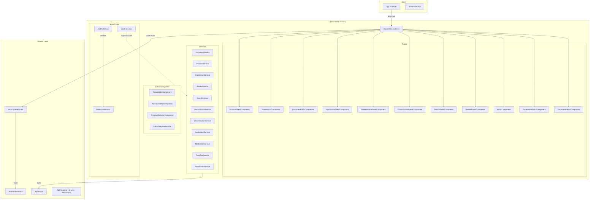

# Design Document: Documents Port Adaptation

## Overview

This design covers the adaptation of the documents feature ported from ApolloUI into the platform-frontend workspace. The feature spans 30+ components, 12 services, shared UI components, models, and a Tiptap-based editor subsystem under `src/app/features/documents/`.

The adaptation addresses five concerns:

1. **Import path resolution** — fixing broken relative paths in `attachments/` and `editor/` subdirectories, and resolving a duplicate `DocumentTemplate` interface conflict.
2. **Route configuration** — expanding `documents.routes.ts` from a single route to the full 11-route configuration matching ApolloUI, with lazy loading and security guards.
3. **CSS refactoring** — converting all component styles to SMACSS+BEM methodology, eliminating nested selectors, bare element selectors, and inconsistent naming.
4. **Dependency installation** — adding Tiptap packages (production) and zod + faker (dev).
5. **Mock layer** — creating zod schemas, faker generators, and mock services so the feature runs without a backend.

### Design Decisions

| Decision                                                            | Rationale                                                                                                                                                                                                                       |
| ------------------------------------------------------------------- | ------------------------------------------------------------------------------------------------------------------------------------------------------------------------------------------------------------------------------- |
| Fix import paths manually (not tsconfig path aliases)               | The project uses relative imports everywhere; introducing aliases would be inconsistent and a larger refactoring scope.                                                                                                         |
| Consolidate `DocumentTemplate` to `pages/models/document.models.ts` | The `editor/services/template.service.ts` defines a local `DocumentTemplate` that conflicts with the canonical model. The editor service should import from the shared models.                                                  |
| Keep `editor/services/template.service.ts` as a separate service    | It serves a different purpose (local template rendering with variable substitution) vs `pages/services/template.service.ts` (API-backed template CRUD). Rename the editor one to `EditorTemplateService` to avoid DI collision. |
| Use child routes under `documents.routes.ts`                        | The `app.routes.ts` already lazy-loads `documentsRoutes` under `intelligence/documents`. Child routes keep the feature self-contained.                                                                                          |
| Convert `documents-list.scss` to `.css`                             | All other components use `.css`. The SCSS file contains no SCSS-specific syntax.                                                                                                                                                |
| Place mock layer under `src/app/features/documents/mocks/`          | Co-located with the feature for discoverability; excluded from production builds via tree-shaking (mock services are only provided in dev environment configuration).                                                           |
| Use `securityLevelGuard` from `shared/guards/`                      | Already exists in platform-frontend with the same API as ApolloUI's guard.                                                                                                                                                      |

---

## Architecture



---

## Components and Interfaces

### Import Path Resolution

Files requiring path corrections:

| File                                         | Current Import                                | Correct Import                                   | Issue                                                            |
| -------------------------------------------- | --------------------------------------------- | ------------------------------------------------ | ---------------------------------------------------------------- |
| `attachments/services/attachment.service.ts` | `../../../shared/models/api-response.model`   | `../../../../shared/models/api-response.model`   | 3 levels instead of 4                                            |
| `attachments/services/attachment.service.ts` | `../../../shared/models/attachment.model`     | `../../../../shared/models/attachment.model`     | 3 levels instead of 4                                            |
| `attachments/services/attachment.service.ts` | `../../../shared/services/api.service`        | `../../../../shared/services/api.service`        | 3 levels instead of 4                                            |
| `attachments/services/attachment.service.ts` | `../../../shared/services/auth-state.service` | `../../../../shared/services/auth-state.service` | 3 levels instead of 4                                            |
| `attachments/services/attachment.service.ts` | `../../../shared/utils/constants`             | `../../../../shared/utils/constants`             | 3 levels instead of 4                                            |
| `editor/services/template.service.ts`        | `../../../shared/models/enums`                | `../../pages/models/document.models`             | Wrong source; should use feature-local `DocumentType` type alias |

**Depth analysis:** Files at `features/documents/X/Y/` (depth 4 from `src/app/`) need `../../../../shared/` (4 `../` segments). Files at `features/documents/pages/services/` already use the correct 4-level path.

**Template service conflict resolution:**

- `pages/services/template.service.ts` — API-backed service using `ApiService`. Uses `DocumentTemplate` from `pages/models/document.models.ts`. This is the canonical template service.
- `editor/services/template.service.ts` — Local template rendering service with hardcoded templates and variable substitution. Defines its own `DocumentTemplate` interface that conflicts.

Resolution: Rename the editor service class to `EditorTemplateService`, remove its local `DocumentTemplate` interface, and import `DocumentType` from `../../pages/models/document.models`. Define a new `EditorTemplate` interface local to the editor service (since its shape differs from the API-backed `DocumentTemplate`).

### Route Configuration

The expanded `documents.routes.ts`:

```typescript
import { Routes } from '@angular/router';
import { securityLevelGuard } from '../../shared/guards/security-level.guard';

export const documentsRoutes: Routes = [
  {
    path: '',
    loadComponent: () =>
      import('./pages/document-home/document-home').then((m) => m.DocumentHomeComponent),
  },
  {
    path: 'novo',
    loadComponent: () =>
      import('./pages/document-wizard/document-wizard').then((m) => m.DocumentWizardComponent),
  },
  {
    path: 'caixa-entrada',
    loadComponent: () => import('./pages/inbox/inbox').then((m) => m.InboxComponent),
  },
  {
    path: 'revisoes',
    loadComponent: () =>
      import('./pages/review-panel/review-panel').then((m) => m.ReviewPanelComponent),
  },
  {
    path: 'busca',
    loadComponent: () => import('./pages/search-panel/search-panel').then((m) => m.SearchComponent),
  },
  {
    path: 'formalizacao/:id',
    canActivate: [securityLevelGuard],
    data: { minSecurityLevel: 3 },
    loadComponent: () =>
      import('./pages/formalization-panel/formalization-panel').then(
        (m) => m.FormalizationComponent,
      ),
  },
  {
    path: 'difusao/:id',
    canActivate: [securityLevelGuard],
    data: { minSecurityLevel: 3 },
    loadComponent: () =>
      import('./pages/dissemination-panel/dissemination-panel').then(
        (m) => m.DisseminationComponent,
      ),
  },
  {
    path: 'apolizacao/:id',
    canActivate: [securityLevelGuard],
    data: { minSecurityLevel: 2 },
    loadComponent: () =>
      import('./pages/apolization-panel/apolization-panel').then((m) => m.ApolizationComponent),
  },
  {
    path: 'editor/:id',
    canActivate: [securityLevelGuard],
    data: { minSecurityLevel: 2 },
    loadComponent: () =>
      import('./pages/document-editor/document-editor').then((m) => m.DocumentEditorComponent),
  },
  {
    path: 'processos',
    canActivate: [securityLevelGuard],
    data: { minSecurityLevel: 2 },
    loadComponent: () =>
      import('./pages/process-list/process-list').then((m) => m.ProcessListComponent),
  },
  {
    path: 'processos/:id',
    canActivate: [securityLevelGuard],
    data: { minSecurityLevel: 2 },
    loadComponent: () =>
      import('./pages/process-detail/process-detail').then((m) => m.ProcessDetailComponent),
  },
];
```

**Guard mapping** (from ApolloUI `intelligence.routes.ts`):

- `formalizacao/:id` → minSecurityLevel: 3
- `difusao/:id` → minSecurityLevel: 3
- `apolizacao/:id` → minSecurityLevel: 2
- `editor/:id` → minSecurityLevel: 2
- `processos` → minSecurityLevel: 2
- `processos/:id` → minSecurityLevel: 2
- Remaining routes (home, novo, caixa-entrada, revisoes, busca) → no guard (accessible to all authenticated users; the parent shell route already has `AuthGuard`)

**Navigation path fix:** The `DocumentHomeComponent` uses `router.navigate(['/intelligence', 'documentos', ...])` but the platform-frontend routes use `documents` (English) not `documentos` (Portuguese). These navigation calls must be updated to use `/intelligence/documents/...`.

### CSS Refactoring Strategy

Each component's CSS will be refactored following these rules:

**BEM Block naming** — the component name in kebab-case becomes the Block:

| Component            | BEM Block               |
| -------------------- | ----------------------- |
| document-home        | `.document-home`        |
| inbox                | `.inbox`                |
| tiptap-editor        | `.tiptap-editor`        |
| document-wizard      | `.document-wizard`      |
| review-panel         | `.review-panel`         |
| search-panel         | `.search-panel`         |
| formalization-panel  | `.formalization-panel`  |
| dissemination-panel  | `.dissemination-panel`  |
| apolization-panel    | `.apolization-panel`    |
| document-editor      | `.document-editor`      |
| process-list         | `.process-list`         |
| process-detail       | `.process-detail`       |
| document-tree        | `.document-tree`        |
| document-viewer      | `.document-viewer`      |
| document-form-dialog | `.document-form-dialog` |
| version-history      | `.version-history`      |
| documents-list       | `.documents-list`       |
| classification-badge | `.classification-badge` |
| status-badge         | `.status-badge`         |
| doc-navigation       | `.doc-navigation`       |
| notification-badge   | `.notification-badge`   |
| routing-history      | `.routing-history`      |
| attachment-viewer    | `.attachment-viewer`    |
| file-upload          | `.file-upload`          |
| rich-text-editor     | `.rich-text-editor`     |
| template-selector    | `.template-selector`    |

**Transformation rules applied per file:**

1. **Nested selectors** → flat BEM elements:
   - `.document-home-header h2` → `.document-home__title`
   - `.kpi-section h3` → `.document-home__section-title`
   - `.dashboard-section h3` → `.document-home__section-title`
   - `.inbox-container h2` → `.inbox__title`
   - `.dialog-content label` → `.inbox__dialog-label`

2. **Layout prefixes** for grid/container concerns:
   - `.kpi-grid` → `.l-document-home__kpi-grid`
   - `.document-home-container` → `.l-document-home`

3. **State prefixes** for JS-toggled states:
   - `.notification-item.unread` → `.notification-item.is-unread`
   - `.tiptap-toolbar button.active` → `.tiptap-editor__toolbar-btn.is-active`

4. **Bare element selectors in tiptap-editor** — these target ProseMirror's generated DOM inside `.tiptap-content-area .ProseMirror`. Since ProseMirror generates its own HTML elements (h1, h2, table, etc.) that we cannot add classes to, these selectors are **exempt** from BEM conversion. They will remain scoped under `.tiptap-editor__content .ProseMirror` as a documented exception.

5. **File extension** — `documents-list.scss` → `documents-list.css` (update `styleUrl` in component).

### Dependency Installation

```bash
# Production dependencies (Tiptap)
pnpm add @tiptap/core@^3.20.4 \
  @tiptap/starter-kit@^3.20.4 \
  @tiptap/extension-underline@^3.20.4 \
  @tiptap/extension-text-align@^3.20.4 \
  @tiptap/extension-table@^3.20.4 \
  @tiptap/extension-table-row@^3.20.4 \
  @tiptap/extension-table-cell@^3.20.4 \
  @tiptap/extension-table-header@^3.20.4 \
  @tiptap/extension-link@^3.20.4 \
  @tiptap/extension-image@^3.20.4 \
  @tiptap/extension-placeholder@^3.20.4

# Dev dependencies (mock layer)
pnpm add -D zod @faker-js/faker
```

Version `^3.20.4` matches ApolloUI's pinned versions. `zod` and `@faker-js/faker` use latest stable with caret range.

---

## Data Models

### Model Interfaces (from `pages/models/document.models.ts`)

The feature defines 20+ interfaces organized by domain:

**Core entities:** `Process`, `Document`, `DocumentVersion`, `DocumentTemplate`, `Attachment`
**Tramitation:** `Tramitation`
**Review:** `DocumentReview`
**Formalization:** `FinalArtifact`, `IntegrityVerification`
**Dissemination:** `InternalDissemination`, `ExternalDissemination`
**Apolization:** `DocumentMention`
**Indexing:** `DocumentTextIndex`
**Workflow:** `WorkflowDefinition`, `WorkflowStep`, `WorkflowTransition`, `WorkflowInstance`
**Notifications:** `Notification`
**Access:** `DocumentAccess`
**Search:** `SearchRequest`, `SearchResult`, `DocumentSearchItem`

**Union types (used as enums):** `DocumentType`, `ProcessStatus`, `DocumentStatus`, `SecurityClassification`, `Priority`, `TramitationStatus`, `ReviewType`, `ReviewStatus`, `MentionType`, `MentionStatus`, `ExportFormat`, `DisseminationStatus`, `ExternalDisseminationStatus`, `WorkflowStatus`, `DocumentOrigin`

### Payload Interfaces (from `pages/models/document.payloads.ts`)

13 payload interfaces for create/update operations:
`CreateProcessPayload`, `UpdateProcessPayload`, `CreateDocumentPayload`, `UpdateDocumentPayload`, `CreateTramitationPayload`, `RejectTramitationPayload`, `SubmitReviewPayload`, `CompleteReviewPayload`, `CreateInternalDisseminationPayload`, `CreateExternalDisseminationPayload`, `ApolloizePayload`, `ReviewMentionPayload`, `ImportDocumentPayload`

### Shared Models

- `ApiResponse<T>` — `{ success: boolean; data?: T; error?: string; message?: string }`
- `Attachment` (shared) — snake_case fields (`document_id`, `file_name`, etc.) — differs from the feature-local `Attachment` which uses camelCase. The `attachment.service.ts` in `attachments/` imports the shared one; the `document.service.ts` in `pages/services/` uses the feature-local one. This is an existing inconsistency that will be documented but not resolved in this adaptation (it requires a backend contract decision).

### Mock Layer Architecture

```
src/app/features/documents/mocks/
├── schemas/
│   ├── model.schemas.ts        # Zod schemas for all model interfaces
│   └── payload.schemas.ts      # Zod schemas for all payload interfaces
├── generators/
│   ├── model.generators.ts     # Faker generators for all models
│   └── payload.generators.ts   # Faker generators for all payloads
├── services/
│   ├── mock-document.service.ts
│   ├── mock-process.service.ts
│   ├── mock-tramitation.service.ts
│   ├── mock-review.service.ts
│   ├── mock-search.service.ts
│   ├── mock-formalization.service.ts
│   ├── mock-dissemination.service.ts
│   ├── mock-apolization.service.ts
│   ├── mock-notification.service.ts
│   ├── mock-template.service.ts
│   └── mock-attachment.service.ts
└── mock-providers.ts           # Angular provider array for DI swap
```

**Zod schema pattern:**

```typescript
import { z } from 'zod';

// Union type schemas
export const DocumentTypeSchema = z.enum(['CAPA', 'DESPACHO', 'RELATORIO', 'OFICIO', 'ANEXO']);

export const ProcessStatusSchema = z.enum(['ATIVO', 'ARQUIVADO', 'CANCELADO', 'TRAMITANDO']);

// Model schemas
export const ProcessSchema = z.object({
  id: z.string().uuid(),
  nup: z.string(),
  title: z.string(),
  description: z.string().optional(),
  status: ProcessStatusSchema,
  securityClassification: SecurityClassificationSchema,
  priority: PrioritySchema,
  createdAt: z.string().datetime(),
  updatedAt: z.string().datetime(),
  creatorId: z.string().uuid(),
  currentSectorId: z.string().uuid(),
  assignedUserId: z.string().uuid().optional(),
  documents: z.lazy(() => DocumentSchema.array()).optional(),
});
```

**Faker generator pattern:**

```typescript
import { faker } from '@faker-js/faker';
import type { Process } from '../../pages/models/document.models';

export function generateProcess(overrides?: Partial<Process>): Process {
  return {
    id: faker.string.uuid(),
    nup: faker.string.numeric({ length: 17 }),
    title: faker.lorem.sentence(),
    description: faker.datatype.boolean() ? faker.lorem.paragraph() : undefined,
    status: faker.helpers.arrayElement(['ATIVO', 'ARQUIVADO', 'CANCELADO', 'TRAMITANDO']),
    securityClassification: faker.helpers.arrayElement(['PUBLICO', 'RESERVADO', 'SIGILOSO']),
    priority: faker.helpers.arrayElement(['NORMAL', 'ALTA', 'URGENTE']),
    createdAt: faker.date.past().toISOString(),
    updatedAt: faker.date.recent().toISOString(),
    creatorId: faker.string.uuid(),
    currentSectorId: faker.string.uuid(),
    ...overrides,
  };
}
```

**Mock service pattern:**

```typescript
import { Injectable } from '@angular/core';
import { Observable, of } from 'rxjs';
import { ApiResponse } from '../../../../shared/models/api-response.model';
import { Process } from '../../pages/models/document.models';
import { CreateProcessPayload } from '../../pages/models/document.payloads';
import { CreateProcessPayloadSchema } from '../schemas/payload.schemas';
import { generateProcess } from '../generators/model.generators';

@Injectable()
export class MockProcessService {
  getProcesses(
    params: Record<string, unknown> = {},
  ): Observable<ApiResponse<{ items: Process[]; total: number; page: number; limit: number }>> {
    const items = Array.from({ length: 5 }, () => generateProcess());
    return of({ success: true, data: { items, total: 25, page: 1, limit: 5 } });
  }

  createProcess(payload: CreateProcessPayload): Observable<ApiResponse<Process>> {
    const result = CreateProcessPayloadSchema.safeParse(payload);
    if (!result.success) {
      return of({ success: false, error: result.error.message });
    }
    return of({ success: true, data: generateProcess(payload) });
  }
}
```

**DI integration (`mock-providers.ts`):**

```typescript
import { Provider } from '@angular/core';
import { ProcessService } from '../pages/services/process.service';
import { MockProcessService } from './services/mock-process.service';
// ... other imports

export const DOCUMENT_MOCK_PROVIDERS: Provider[] = [
  { provide: ProcessService, useClass: MockProcessService },
  { provide: DocumentService, useClass: MockDocumentService },
  // ... all 11 services
];
```

These providers are added to the environment-specific configuration (e.g., `environment.development.ts`) or a feature-level provider array, so production builds never include mock code.

---

## Correctness Properties

_A property is a characteristic or behavior that should hold true across all valid executions of a system — essentially, a formal statement about what the system should do. Properties serve as the bridge between human-readable specifications and machine-verifiable correctness guarantees._

### Property 1: Schema round-trip with deep equality

_For any_ model or payload zod schema and its corresponding faker generator, generating a value and then parsing it with the schema SHALL produce a successful result that is deeply equal to the generated value.

**Validates: Requirements 5.1, 5.2, 5.3, 6.1, 6.2, 6.3**

### Property 2: Mock service response envelope validity

_For any_ mock service method call, the returned `Observable` SHALL emit an `ApiResponse` where `success` is `true` and the `data` field passes validation against the corresponding zod schema for that method's return type.

**Validates: Requirements 5.4, 5.6**

### Property 3: Mock service payload rejection

_For any_ mock service method that accepts a payload, when the payload has a required field removed or set to an invalid type, the returned `Observable` SHALL emit an `ApiResponse` with `success: false` and a non-empty `error` string.

**Validates: Requirements 5.7**

---

## Error Handling

### Import Resolution Errors

- If a path cannot be resolved after correction, the `ng build` step will surface the error with file and line number. The fix is deterministic — count directory depth and adjust `../` segments.

### Route Guard Failures

- When `securityLevelGuard` denies access, it redirects to `/dashboard` (existing behavior from `security-level.guard.ts`). No changes needed.

### Mock Layer Errors

- Invalid payloads return `ApiResponse` with `success: false` and the zod validation error message. This mirrors the real `ApiService.handleError` pattern.
- Mock services never throw; they always return an `Observable<ApiResponse<T>>` to match the real service contract.

### CSS Refactoring Errors

- If a BEM class rename is missed in the HTML template, the element will lose its styling. Visual regression is caught during manual review. The build will not error on unused CSS classes.

### Tiptap Editor Exception

- ProseMirror generates its own DOM elements (`h1`, `table`, `td`, etc.) that cannot have BEM classes added. The tiptap-editor CSS retains scoped element selectors under `.tiptap-editor__content .ProseMirror` as a documented exception to the SMACSS+BEM rules.

---

## Testing Strategy

### Unit Tests (example-based)

| Area                | What to Test                                                                 | Count                        |
| ------------------- | ---------------------------------------------------------------------------- | ---------------------------- |
| Route configuration | Each of the 11 routes exists with correct path, component, guard, and data   | 1 test suite, ~15 assertions |
| Import resolution   | Compilation succeeds (`ng build`)                                            | 1 smoke test                 |
| Navigation paths    | `DocumentHomeComponent` navigation methods use `/intelligence/documents/...` | 3-4 assertions               |
| Mock DI integration | `DOCUMENT_MOCK_PROVIDERS` correctly swaps all 11 services                    | 1 test per service           |
| CSS file extension  | `documents-list` uses `.css` not `.scss`                                     | 1 assertion                  |

### Property-Based Tests (fast-check)

Property-based testing applies to the mock layer's schema/generator consistency. The feature's other requirements (import paths, routes, CSS) are structural/configuration concerns best verified by compilation and example-based tests.

**Library:** `fast-check` (already in devDependencies)
**Minimum iterations:** 100 per property

| Property                           | Test File                                  | What It Validates                                                                 |
| ---------------------------------- | ------------------------------------------ | --------------------------------------------------------------------------------- |
| Property 1: Schema round-trip      | `mocks/schemas/model.schemas.pbt.spec.ts`  | Every faker generator produces data that passes its zod schema with deep equality |
| Property 2: Mock response validity | `mocks/services/mock-services.pbt.spec.ts` | Every mock service method returns schema-valid `ApiResponse` data                 |
| Property 3: Payload rejection      | `mocks/services/mock-services.pbt.spec.ts` | Corrupted payloads produce `success: false` responses                             |

**Property test tag format:**

```typescript
// Feature: documents-port-adaptation, Property 1: Schema round-trip with deep equality
```

**fast-check integration pattern:**

```typescript
import { fc } from 'fast-check';
import { ProcessSchema } from './model.schemas';
import { generateProcess } from '../generators/model.generators';

describe('Model Schema Round-Trip', () => {
  // Feature: documents-port-adaptation, Property 1: Schema round-trip with deep equality
  it('Process: generate → parse → deep equal', () => {
    fc.assert(
      fc.property(fc.constant(null), () => {
        const generated = generateProcess();
        const result = ProcessSchema.safeParse(generated);
        expect(result.success).toBe(true);
        if (result.success) {
          expect(result.data).toEqual(generated);
        }
      }),
      { numRuns: 100 },
    );
  });
});
```

The `fc.constant(null)` seed triggers fast-check's iteration engine while the randomness comes from faker. Each iteration produces a different faker-generated value, giving us 100 distinct data shapes per model.

### Compilation Verification

After all changes, run:

```bash
cd platform-frontend && pnpm build
```

This verifies:

- All import paths resolve (Req 1)
- All route lazy-load expressions resolve (Req 2)
- All standalone component imports are available (Req 8)
- Strict template checking passes with OnPush components (Req 8)
- Tiptap packages are installed and importable (Req 3)
