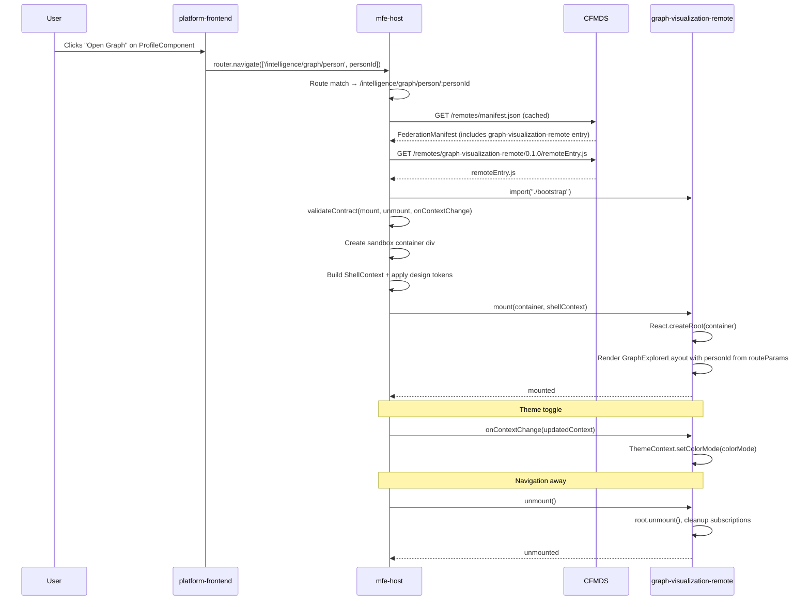

# Design Document: Graph Visualization MFE Integration

## Overview

This feature integrates the `graph-visualization-remote` as a fully federated micro-frontend into the SNAP Apolo platform. It covers three distinct concerns:

1. **Documentation** — A gold-standard `README.md` for `graph-visualization` that mirrors the `mfe-host` documentation pattern, covering architecture, boot sequence, CFMDS hosting, ShellContext contract, and developer workflows.
2. **MFE flow** — Publishing `graph-visualization` artifacts to CFMDS (MinIO), registering the remote in the federation manifest, and wiring the route overlay in `mfe-host` so the shell can load it at runtime.
3. **Profile integration** — Adding an "Open Graph" button to `platform-frontend`'s `ProfileComponent` that navigates to the graph visualization for the current person, using the `person.profile.openGraph` i18n key in both `pt-BR` and `en` locales.

The `graph-visualization-remote` is a React 18 + XState 5 + Cytoscape.js application already built with Rspack and Module Federation 2.0. It exposes `./bootstrap` from `remoteEntry.js` and implements the `RemoteModuleContract` (`mount`, `unmount`, `onContextChange`). No changes to its build configuration are required — only documentation, CFMDS registration, and the profile button wiring.

---

## Architecture

### System Topology After Integration

```
Browser
  └── Nginx reverse proxy (ports 80/443)
        ├── /                          → mfe-host (shell SPA)
        ├── /remotes/manifest.json     → CFMDS sidecar (port 8900)
        ├── /remotes/*                 → CFMDS ATS (port 8080) → MinIO CFMDS
        ├── /auth/realms/*             → Keycloak (port 8080)
        └── /api/v1/*                  → Backend microservices

mfe-host (shell)
  ├── eco-snap-design-system           (CSS tokens + web components, var-type)
  ├── platform-frontend                (Angular 21 ESM remote — POI, admin, docs, audit)
  └── graph-visualization-remote       (React 18 ESM remote — graph explorer)  ← NEW
```

### Dependency Graph

```
                    ┌─────────────────────────────────────────────┐
                    │              platform-runtime                │
                    │  (Makefile, .env, docker-compose, secrets)   │
                    └──────────────────┬──────────────────────────┘
                                       │ orchestrates
                    ┌──────────────────┼──────────────────────────┐
                    │                  │                           │
                    ▼                  ▼                           ▼
            ┌──────────────┐  ┌──────────────┐          ┌──────────────────┐
            │  shared-infra │  │  mfe-host    │          │  mfe-cfmds       │
            │  (nginx,      │  │  (shell)     │          │  (ATS + sidecar) │
            │   keycloak,   │  └──────┬───────┘          └────────┬─────────┘
            │   postgres)   │         │                           │
            └──────┬────────┘         │ loads at runtime          │ serves
                   │                  │                           │
                   │                  ├───────────────────────────┤
                   │                  │                           │
                   ▼                  ▼                           ▼
            ┌──────────────┐  ┌──────────────────────┐  ┌──────────────────┐
            │    Nginx      │  │ platform-frontend     │  │  MinIO CFMDS     │
            │  (reverse     │  │ (Angular 21 ESM)      │  │  (S3 artifact    │
            │   proxy)      │  └──────────────────────┘  │   storage)       │
            └───────────────┘  ┌──────────────────────┐  └──────────────────┘
                               │ graph-visualization-  │
                               │ remote (React 18 ESM) │  ← NEW
                               └──────────────────────┘
```

### Module Loading Sequence



---

## Components and Interfaces

### Component 1: graph-visualization README (`graph-visualization/README.md`)

**Purpose**: Gold-standard documentation for the `graph-visualization-remote` repository, following the same structure and depth as `mfe-host/README.md`. Serves as the authoritative reference for developers, AI agents, and operators working on this remote.

**Sections**:

- What This Project Delivers
- Architecture Overview (topology diagram, boot sequence)
- Project Structure (annotated file tree)
- Tech Stack table
- Running the Project (Option A: Standalone, Option B: Integrated via platform-runtime)
- How graph-visualization Interacts with Other Components (dependency graph, runtime flow, integration points table)
- Remote Module Contract (ShellContext mapping, events emitted/consumed)
- CFMDS Artifact Layout
- Scripts
- Testing
- Troubleshooting
- For AI Agents (key invariants, file ownership map, common modification patterns)

### Component 2: CFMDS Artifact Registration

**Purpose**: Publish `graph-visualization-remote` build artifacts to MinIO CFMDS so `mfe-host` can load them at runtime.

**Artifact layout in MinIO**:

```
/modules/graph-visualization-remote/0.1.0/
  ├── remoteEntry.js          (no-store cache)
  ├── *.chunk.js              (immutable, max-age=31536000)
  ├── checksums.json          (SHA256 per artifact)
  └── signature.sig           (ECDSA manifest signature)
```

**CFMDS sidecar manifest entry** (`manifest.json` aggregated by sidecar):

```json
{
  "graph-visualization-remote": {
    "activeVersion": "0.1.0",
    "routes": ["/intelligence/graph/person/**"],
    "loadTimeoutMs": 15000,
    "versions": {
      "0.1.0": {
        "remoteEntry": "/remotes/graph-visualization-remote/0.1.0/remoteEntry.js",
        "exposedModule": "./bootstrap",
        "remoteEntryType": "module",
        "requiredShellApiVersion": "^1.0.0",
        "requiredDesignTokenVersion": "^2.0.0",
        "requiredPermissions": ["intelligence:graph-viewer"],
        "supportedLocales": ["pt-BR", "en-US"],
        "integrity": "sha384-PLACEHOLDER",
        "shared": {
          "react": "18.2.0",
          "react-dom": "18.2.0",
          "xstate": "5.20.0",
          "@xstate/react": "4.1.3"
        }
      }
    },
    "contract": {
      "moduleName": "graphVisualization",
      "lifecycleHooks": ["mount", "unmount", "onContextChange"],
      "eventTypes": {
        "emits": ["graph:node-selected", "graph:edge-inspected", "graph:viewport-changed"],
        "listens": ["host:entity-focus", "host:filter-changed"]
      }
    }
  }
}
```

### Component 3: mfe-host Route Overlay Entry

**Purpose**: Register `graph-visualization-remote` in `mfe-host/src/shell/route-overlay.ts` so the shell knows which routes to hand off to this remote and what contract to validate.

**Route overlay entry**:

```typescript
// In src/shell/route-overlay.ts
{
  remoteName: 'graph-visualization-remote',
  // Path segment includes personId: /intelligence/graph/person/:personId
  // More specific than platform-frontend's /intelligence/** — takes precedence.
  routes: ['/intelligence/graph/person/**'],
  exposedModule: './bootstrap',
  remoteEntryType: 'module',   // ESM — loaded via import() with type: 'module'
  contract: {
    requiredPermission: 'intelligence:graph-viewer',
    lifecycleHooks: ['mount', 'unmount', 'onContextChange'],
  },
}
```

**mfe-host README update** — The route overlay table gains a new row:

| Remote                       | Routes                                                                              | Entry Type | Exposed Module       |
| ---------------------------- | ----------------------------------------------------------------------------------- | ---------- | -------------------- |
| `eco-snap-design-system`     | (none — loaded at boot)                                                             | `global`   | `./federation-entry` |
| `platform-frontend`          | `/poi/**`, `/intelligence/**`, `/documents`, `/admin/**`, `/audit-logs/**`, `/snap` | `module`   | `./bootstrap`        |
| `graph-visualization-remote` | `/intelligence/graph/person/**`                                                     | `module`   | `./bootstrap`        |

### Component 4: ProfileComponent "Open Graph" Button

**Purpose**: Add a button to `platform-frontend`'s `ProfileComponent` page header that navigates to the graph visualization for the current person. The person ID is embedded as a **path segment** in the route so the graph remote always loads the correct profile's graph — bookmarkable, shareable, and immune to query-param loss on reload.

**Location in template**: Inside `<div class="page-header__actions">`, alongside the existing Share, Edit Data, and Actions buttons.

**Button markup**:

```html
<button
  pButton
  [label]="'person.profile.openGraph' | translate"
  icon="pi pi-share-alt"
  [outlined]="true"
  size="small"
  (click)="openGraph()"
></button>
```

**Handler in ProfileComponent**:

```typescript
protected openGraph(): void {
  const id = this.personId();
  if (id) {
    // Person ID is a path segment, not a query param.
    // Route: /intelligence/graph/person/:personId
    // This ensures the graph remote always loads the correct profile's graph,
    // is bookmarkable, and survives page reloads without losing context.
    this.router.navigate(['/intelligence/graph/person', id]);
  }
}
```

**Route shape**: `/intelligence/graph/person/:personId`

The `graph-visualization-remote` receives the person ID via `ShellContext.routeParams.personId`. The remote's `bootstrap.tsx` reads this on mount and passes it to the graph state machine as the initial entity to load. This guarantees the graph always reflects the profile the user was viewing — not a default or previously cached entity.

**Why path segment over query param**:

- Query params can be stripped by proxies, redirects, or Angular router guards.
- A path segment is part of the canonical URL — the graph remote can be deep-linked directly.
- The mfe-host route overlay matches `/intelligence/graph/person/:personId` deterministically.

**Route overlay update**: The `routes` array in Component 3 must be updated to `/intelligence/graph/person/**` to match the new path shape.

**i18n keys added**:

`pt-BR.json` — under `person.profile`:

```json
"openGraph": "Ver Grafo de Vínculos"
```

`en.json` — under `person.profile`:

```json
"openGraph": "Open Relationship Graph"
```

### Component 5: platform-runtime Seed Script Update

**Purpose**: Extend `scripts/seed-modules.sh` (or equivalent) in `platform-runtime` to publish `graph-visualization-remote` artifacts to MinIO CFMDS alongside the existing remotes.

**Seed command pattern** (mirrors existing platform-frontend seeding):

```bash
# Seed graph-visualization-remote artifacts
mc cp --recursive \
  "${REPOS_ROOT}/graph-visualization/dist/" \
  "minio/${S3_BUCKET_CFMDS}/modules/graph-visualization-remote/0.1.0/"
```

---

## Data Models

### ShellContext Mapping for graph-visualization-remote

The `bootstrap.tsx` in `graph-visualization` already consumes `ShellContext` via `ShellContextProvider`. The mapping is:

| ShellContext property         | graph-visualization usage                                                     |
| ----------------------------- | ----------------------------------------------------------------------------- |
| `auth.getAccessToken()`       | `api-client-adapted.ts` — Bearer token for graph API calls                    |
| `auth.user`                   | Displayed in `StandaloneBanner` (standalone mode only)                        |
| `theme.colorMode`             | `ThemeContext` → Cytoscape stylesheet dark/light variants                     |
| `theme.tokens`                | `design-token-bridge.ts` — maps `--snap-*` to local CSS vars                  |
| `i18n.activeLocale`           | Locale passed to AG Grid and date formatters                                  |
| `navigation.navigate()`       | Cross-remote navigation (e.g., navigate to person profile)                    |
| `notifications.showToast()`   | Error and success toasts for graph operations                                 |
| `eventBus.on()`               | Listens for `host:entity-focus` to load initial entity                        |
| `eventBus.emit()`             | Emits `graph:node-selected` when user selects a node                          |
| `routeParams`                 | `personId` extracted from path segment `/intelligence/graph/person/:personId` |
| `permissions.hasPermission()` | Guards graph edit operations (`intelligence:graph-editor`)                    |

### Route Parameters

```typescript
// Extracted from route path: /intelligence/graph/person/:personId
interface GraphRouteParams {
  personId: string; // Path segment — always present, never stripped by proxies or guards
}
```

The `personId` path segment is the single source of truth for which profile's graph to display. The graph remote reads it from `ShellContext.routeParams.personId` on mount and uses it as the initial entity ID for the graph state machine.

---

## Error Handling

### Mount Failure

**Condition**: `bootstrap.tsx` `mount()` throws (React render error, missing provider).
**Response**: `mount()` catches, logs structured JSON, re-throws. `mfe-host` `RemoteLoader` renders fallback error UI with retry.
**Recovery**: User clicks Retry → fresh `loadAndMount()` cycle.

### Permission Denied

**Condition**: User lacks `intelligence:graph-viewer` permission.
**Response**: `mfe-host` route overlay checks permission before mounting. Shell renders a 403 fallback instead of loading the remote.
**Recovery**: User is redirected to their default landing page.

### CFMDS Artifact Not Found

**Condition**: `remoteEntry.js` returns 404 from CFMDS.
**Response**: `mf-runtime-service.ts` rejects the load promise. Shell machine transitions to error state and shows fallback UI.
**Recovery**: Operator runs `make seed-modules` from `platform-runtime` to re-publish artifacts.

### Context Change After Unmount

**Condition**: `onContextChange()` called after `unmount()` destroyed the React root.
**Response**: `bootstrap.tsx` guards with a `mounted` flag — silently ignores stale calls.
**Recovery**: No recovery needed — race condition resolves naturally on next navigation.

### Navigation Without Person ID

**Condition**: `openGraph()` called when `personId()` is null/empty.
**Response**: Button is conditionally disabled when `personId()` is falsy. Handler guards with early return.
**Recovery**: N/A — button is not interactive without a valid person ID.

---

## Testing Strategy

### graph-visualization Unit Tests

Existing test suite in `src/__tests__/` covers:

- `bootstrap.test.tsx` — mount/unmount lifecycle, ShellContext injection
- `bootstrap.property.test.tsx` — property-based invariants for mount/unmount
- `design-token-bridge.test.ts` — CSS token mapping correctness
- `eventbus-integration.test.ts` — event bus emit/consume
- `sandbox.test.ts` — sandbox isolation

No new unit tests required for the documentation or CFMDS registration changes.

### ProfileComponent Tests

New test cases for the "Open Graph" button:

- Renders button with correct i18n label when person is loaded
- Button is disabled/absent when `personId()` is null
- `openGraph()` navigates to `/intelligence/graph` with correct `entityId` and `entityType` query params
- Button does not appear in loading, 404, or 403 states

### Integration Tests (platform-runtime)

- `make up-full` → navigate to a person profile → click "Open Graph" → verify graph-visualization-remote mounts
- Verify `host:entity-focus` event is received by graph remote with correct `entityId`
- Toggle theme in shell → verify graph Cytoscape stylesheet updates
- Navigate away from `/intelligence/graph/**` → verify React root unmounts cleanly

---

## Performance Considerations

- **Bundle size**: `graph-visualization-remote` bundles React, Cytoscape.js, MapLibre GL, and AG Grid. These are not shared with `mfe-host` (vanilla TS) or `platform-frontend` (Angular). The remote is loaded lazily — only when the user navigates to `/intelligence/graph/**`.
- **Load timeout**: Manifest entry sets `loadTimeoutMs: 15000` (15s) to account for the larger bundle.
- **CSS injection**: `checksums.json` lists all chunk CSS files. `remote-loader.ts` injects them before `mount()` to avoid FOUC.
- **Shared singletons**: `react`, `react-dom`, `xstate`, and `@xstate/react` are declared as singletons in `rspack.config.ts`. If a future remote also uses React 18, they will share the same instance.

---

## Security Considerations

- **Permission gate**: `intelligence:graph-viewer` is required. The route overlay enforces this before loading the remote bundle — the JS is never fetched for unauthorized users.
- **Token isolation**: `graph-visualization-remote` never stores tokens. It calls `ShellContext.auth.getAccessToken()` on each API request via `api-client-adapted.ts`.
- **Artifact integrity**: SRI hashes in the manifest are validated by CFMDS ATS before serving. The `checksums.json` SHA256 values are generated by `scripts/generate-checksums.js` at build time.
- **CSP**: The host's CSP must allow `script-src` from the CFMDS origin. No additional CSP changes are needed beyond what `platform-frontend` already requires.

---

## Dependencies

| Dependency                    | Purpose                                       | Version   |
| ----------------------------- | --------------------------------------------- | --------- |
| `@module-federation/enhanced` | Rspack MF plugin (already in devDependencies) | `^0.8.0`  |
| `react`                       | UI framework (already in dependencies)        | `^18.2.0` |
| `xstate`                      | State machine (already in dependencies)       | `^5.20.0` |
| `cytoscape`                   | Graph rendering (already in dependencies)     | `^3.28.1` |
| `maplibre-gl`                 | Map view (already in dependencies)            | `^5.19.0` |

No new dependencies are introduced. All required packages are already present in `graph-visualization/package.json`.

### Cross-Repo Changes Required

| Repo                  | Change                                                                                                              |
| --------------------- | ------------------------------------------------------------------------------------------------------------------- |
| `graph-visualization` | Add `README.md` (gold-standard documentation)                                                                       |
| `mfe-host`            | Add route overlay entry for `graph-visualization-remote` in `src/shell/route-overlay.ts`; update README route table |
| `platform-frontend`   | Add "Open Graph" button to `ProfileComponent`; add `person.profile.openGraph` i18n keys                             |
| `platform-runtime`    | Extend `scripts/seed-modules.sh` to seed `graph-visualization-remote` artifacts to MinIO                            |
