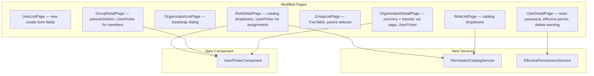

# Design Document: IAM Admin Panel v2

## Overview

This design document specifies the delta from the v1 IAM Admin Panel. The v1 spec built the full foundation: 10 page components, 6 Angular services, ActiveOrgService, routing with OrgContextGuard, sidebar integration, and all TypeScript models. This v2 addresses gaps identified during integration testing across three repositories.

The v2 changes fall into four categories:

1. **User lifecycle improvements** — Keycloak-integrated user creation (username+password), password reset, user search/picker.
2. **Organizational structure** — Group hierarchy with parent-child relationships, permission catalog for governed role editing.
3. **Saga-based operations** — Organization bootstrap, org recovery, and ownership transfer via coordinated backend sagas with compensating transactions.
4. **Observability** — Effective permissions view on UserDetailPage, enhanced delete warnings with role/group counts, last-owner 409 handling.

### Foundational Rules (carried from v1, enforced in v2)

| Rule | Summary |
|------|---------|
| FR-1 | UI uses `user.id` only. `external_auth_id` stays inside identity-service. Permission-service `subject_id` = internal `user.id`. |
| FR-2 | Cross-service operations use saga pattern with compensating transactions. |
| FR-3 | All mutation endpoints use audit-sdk. |

### Backend Services (unchanged from v1)

| Service | Base URL Config Key | New v2 Endpoints |
|---------|-------------------|-----------------|
| Identity Service | `environment.identityServiceUrl` | `POST /users` (modified), `POST /users/{id}/reset-password`, `GET /users?search=`, `POST /organizations/bootstrap`, `POST /organizations/{id}/recover`, `POST /organizations/{id}/transfer-ownership` |
| Permission Service | `environment.permissionServiceUrl` | `GET /groups/tree`, `GET /permissions/catalog`, `POST /authorize/effective-permissions` |

---

## Architecture

### Shared Utility: RequestState\<T\>

v1 pages manage async state via ad-hoc boolean signals (`loading`, `forbidden`, `creating`, `saving`, etc.) with duplicated error handling in every page. v2 introduces more complex async patterns (sagas, idempotent retries, debounced search, trace toggling) that require a unified state model to prevent duplicate submissions, race conditions, and inconsistent retry UX.

`RequestState<T>` is a lightweight, signals-based utility placed in `shared/utils/request-state.ts`. It is not a new architecture layer — it's a pure utility function that wraps Angular signals.

```typescript
// shared/utils/request-state.ts

export type RequestStatus = 'idle' | 'loading' | 'success' | 'error';

export interface RequestState<T> {
  status: RequestStatus;
  data: T | null;
  error: string | null;
  retryable: boolean;
}

/** Create a new RequestState signal initialized to idle. */
export function createRequestState<T>(): WritableSignal<RequestState<T>>;

/** Derived convenience signals from a RequestState signal. */
export function isLoading<T>(state: Signal<RequestState<T>>): Signal<boolean>;
export function isError<T>(state: Signal<RequestState<T>>): Signal<boolean>;
export function hasData<T>(state: Signal<RequestState<T>>): Signal<boolean>;

/**
 * Execute an Observable request, managing the RequestState lifecycle:
 * - Sets status to 'loading' (prevents double-submission)
 * - On success: sets status to 'success', stores data
 * - On error: classifies HTTP status → error message + retryable flag
 *   - 403 → not retryable (forbidden)
 *   - 404 → not retryable (not found)
 *   - 400/422 → not retryable (validation error, display err.error.detail)
 *   - 409 → not retryable (conflict, display err.error.detail)
 *   - 503 → retryable (service unavailable)
 *   - 0 → retryable (network error)
 * - Returns the Subscription for cleanup
 *
 * Double-submission guard: if status is already 'loading', the call is a no-op.
 */
export function executeRequest<T>(
  state: WritableSignal<RequestState<T>>,
  request$: Observable<T>,
  options?: { onSuccess?: (data: T) => void; onError?: (err: HttpErrorResponse) => void }
): Subscription;

/** Reset state to idle. */
export function resetRequestState<T>(state: WritableSignal<RequestState<T>>): void;
```

**How pages use it:**

```typescript
// Before (v1 pattern — 5+ signals per operation):
readonly loading = signal<boolean>(false);
readonly errorMessage = signal<string | null>(null);
readonly errorSeverity = signal<'error' | 'warn'>('error');
readonly showRetry = signal<boolean>(false);
readonly creating = signal<boolean>(false);

// After (v2 pattern — one state per operation):
readonly listState = createRequestState<PaginatedResponse<UserResponse>>();
readonly createState = createRequestState<UserResponse>();
readonly resetPasswordState = createRequestState<void>();
```

**Template usage:**

```html
@if (listState().status === 'error') {
  <p-message [severity]="listState().retryable ? 'warn' : 'error'">
    <span>{{ listState().error }}</span>
    @if (listState().retryable) {
      <p-button label="Retry" (onClick)="onRetry()" />
    }
  </p-message>
}
```

**Double-submission prevention:** `executeRequest` checks `state().status === 'loading'` before executing. If already loading, it's a no-op. This eliminates the need for per-button `[disabled]="creating()"` guards — the state itself prevents it.

**Error classification:** Centralized in `executeRequest`, replacing the duplicated `handleError()` methods across all 10 pages. Pages can still override via the `onError` callback for page-specific handling (e.g., 409 last-owner protection).

**Adoption strategy:** v2 page modifications will use `RequestState<T>` for all new async operations (reset password, bootstrap, recovery, transfer, effective permissions, catalog fetch). Existing v1 operations within modified pages may be migrated opportunistically but are not required to change.

### v2 Component Changes

The v2 does not add new page components. It modifies existing pages and adds one new shared component:



### Routing Structure

No routing changes from v1. All routes remain the same.

### Service Layer Changes

Two new services are added. Existing services gain new methods:

| Service | Change Type | Details |
|---------|------------|---------|
| `UserService` | Modified | Add `resetPassword()`, add `search` param to `listUsers()` |
| `OrganizationService` | Modified | Add `bootstrapOrganization()`, `recoverOrganization()`, `transferOwnership()` |
| `GroupService` | Modified | Add `getGroupTree()` |
| `PermissionCatalogService` | New | `getCatalog()` — calls `GET /permissions/catalog` |
| `EffectivePermissionsService` | New | `getEffectivePermissions()` — calls `POST /authorize/effective-permissions` |

---

## Components and Interfaces

### New Component: UserPickerComponent

A reusable standalone component providing search-as-you-type user selection.

```typescript
@Component({
  selector: 'app-user-picker',
  standalone: true,
  changeDetection: ChangeDetectionStrategy.OnPush,
  imports: [AutoComplete, TranslateModule, FormsModule],
})
export class UserPickerComponent {
  /** Emits the selected user's internal user.id (FR-1) */
  readonly userSelected = output<string>();

  /** Optional: scope search to a specific organization */
  readonly organizationId = input<string | null>(null);

  /** Placeholder i18n key */
  readonly placeholder = input<string>('admin.userPicker.placeholder');
}
```

**Behavior:**
- Uses PrimeNG `AutoComplete` component
- Triggers search on ≥2 characters typed
- **Debounce and race handling:** Internally uses an RxJS pipeline to prevent API flooding and stale results:
  ```typescript
  search$
    .pipe(
      filter(query => query.length >= 2),
      debounceTime(300),
      distinctUntilChanged(),
      switchMap(query => this.userService.listUsers({ search: query, organization_id: orgId }))
    )
  ```
  - `debounceTime(300)`: waits 300ms after the last keystroke before firing
  - `distinctUntilChanged()`: skips duplicate consecutive queries
  - `switchMap()`: cancels any in-flight request when a new query arrives, ensuring only the latest result is rendered (no stale results, no flickering)
- Displays `display_name` and `email` in suggestion dropdown
- On selection, emits `user.id` via `userSelected` output
- Scoped to current org via `ActiveOrgService.activeOrganizationId()` when `organizationId` input is not explicitly set
- Uses i18n keys: `admin.userPicker.placeholder`, `admin.userPicker.noResults`

### Modified Pages

#### UserListPage — Create User Dialog Changes

**v1 state:** Dialog has `external_auth_id`, `email`, `display_name`, `clearance_level` fields.

**v2 change:** Replace `external_auth_id` with `username` and `password` fields.

- `username`: `pInputText`, required
- `password`: `pInputText` with `type="password"`, required
- Remove `external_auth_id` field entirely
- Continue pre-filling `organization_id` from `ActiveOrgService`
- No client-side password policy validation (delegated to Keycloak via identity-service)
- Handle HTTP 422 from identity-service (Keycloak errors: duplicate username, policy violation) — display `err.error.detail`

#### UserDetailPage — New Sections and Actions

**v2 additions:**

1. **Reset Password button** — visible when `canMutate()` is true
   - Opens a dialog with a single `temporary_password` field (type="password")
   - Dialog includes audit trail text: `admin.users.detail.resetPassword.auditHint`
   - Calls `UserService.resetPassword(userId, { temporary_password })`
   - Handles 404 (user not found), 422 (password policy violation)

2. **Enhanced delete warning** — before showing delete confirmation:
   - Fetch role assignment count via `RoleService.listAssignments()` (use limit=1 to get `total_count`)
   - Fetch group membership count via `GroupService.listMembers()` (use limit=1 to get `total_count`)  
   - Display counts in confirmation message: `admin.users.detail.deleteWarning` with `{roleCount}` and `{groupCount}` interpolation
   - If both counts are 0, show standard confirmation without counts

3. **Last-owner 409 handling** — when deactivate/delete/lock returns HTTP 409:
   - Display `err.error.detail` message (backend provides descriptive text about last-owner protection)

4. **Effective Permissions section** — read-only section below user profile:
   - Calls `EffectivePermissionsService.getEffectivePermissions({ subject_id: user.id })`
   - Displays permission summary as a list of `resource_type:action` chips (same style as RoleDetailPage permissions)
   - "Show Trace" toggle button — when activated, re-fetches with `trace=true` and displays `evaluation_trace` in a collapsible panel
   - If 403 or 503, shows informational message "Effective permissions unavailable" without blocking the page
   - Uses i18n keys under `admin.users.detail.effectivePermissions.*`

#### OrganizationListPage — Bootstrap Dialog

**v1 state:** "Create Organization" dialog collects `name` and `status`.

**v2 change:** Replace with bootstrap flow dialog:

- Fields: `org_name`, `owner_username`, `owner_email`, `owner_display_name`, `owner_password` (type="password")
- On submit: generate UUID as `Idempotency-Key`, call `OrganizationService.bootstrapOrganization(body, idempotencyKey)`
- Store the idempotency key in component state for retry capability
- **Retry UX:** If the bootstrap request fails with a network error (status 0) or HTTP 503, the dialog remains open and displays a "Retry" button alongside the error message. The retry reuses the same `Idempotency-Key` to ensure idempotent behavior. A new idempotency key is only generated when the user opens a fresh dialog or changes the form data. If the request fails with HTTP 422 (saga step failure), the dialog displays the error but does NOT offer retry (the saga already compensated — the user should fix the input and resubmit with a new key).
- Handle 422: display `err.error.detail` (includes which saga step failed)
- Dialog includes audit trail text

#### OrganizationDetailPage — Recovery and Transfer Dialogs

**v1 state:** Recovery dialog has raw text input for target. Transfer dialog has raw `subject_id` input.

**v2 changes:**

1. **Recovery dialog** — replace raw text input with `UserPickerComponent`
   - Scope UserPicker to the target organization's users
   - On confirm: call `OrganizationService.recoverOrganization(orgId, { target_user_id: selectedUserId })`
   - Handle 422: display saga step failure message
   - Dialog text clearly states this is an administrative override and current owner's role will be revoked

2. **Transfer dialog** — replace raw `subject_id` input with `UserPickerComponent`
   - Scope UserPicker to active users within current organization
   - Add checkbox: "Revoke my ownership after transfer" (`revoke_current`), default unchecked
   - On confirm: call `OrganizationService.transferOwnership(orgId, { target_user_id, revoke_current })`
   - Handle 403: "Only the current Org Owner can transfer ownership"
   - Handle 422: display saga step failure message

#### GroupListPage — Tree View

**v1 state:** Flat PrimeNG Table with pagination.

**v2 change:** Replace with PrimeNG TreeTable:

- On load, call `GroupService.getGroupTree()` to get hierarchical data
- Display as TreeTable with expandable nodes
- Each node shows: name, description, version, created_at
- Tooltip on each node: `admin.groups.list.hierarchyTooltip` ("Organizational grouping — permissions are not inherited")
- "Create Group" dialog adds optional "Parent Group" selector (PrimeNG Select populated from flat group list)
- **UI-side cycle prevention:** The "Parent Group" selector in both the create dialog and the edit form must filter out the current group (when editing) and all its descendants from the selectable options. This prevents the user from even attempting a circular reference. The backend still validates as the authoritative guard (HTTP 422).
- Fallback: if `getGroupTree()` returns 503, fall back to flat table with `listGroups()`

#### GroupDetailPage — Hierarchy Display

**v2 additions:**

- Display parent group name with navigation link (if `parent_group_id` is set)
- Display child groups list with navigation links
- "Parent Group" selector in edit form (PrimeNG Select)
- **UI-side cycle prevention in edit form:** The "Parent Group" selector must exclude the current group and all its descendants from the options list, preventing circular reference attempts at the UI level.
- Handle 422 for circular reference violations
- Replace raw `subject_id` input in "Add Member" with `UserPickerComponent`
- Upgrade "no inheritance" banner from `info` to `warn` severity per Req 4.8

#### RoleDetailPage — Catalog-Driven Permission Editor

**v1 state:** Free-text `resource_type` and `action` inputs.

**v2 change:**

- On page load, fetch permission catalog via `PermissionCatalogService.getCatalog()`
- Cache catalog response in service (session-level cache)
- Replace `resource_type` text input with PrimeNG Select populated from catalog entries
- Replace `action` text input with PrimeNG Select, filtered by selected `resource_type`
- When `resource_type` changes, reset `action` and update action options
- Fallback: if catalog fetch returns 503, show warning + retry button and fall back to free-text inputs
- **Refresh Catalog button:** A small "Refresh" icon button next to the permission editor header. Calls `PermissionCatalogService.refreshCatalog()` to force re-fetch from backend. Useful when the catalog has been updated via governance process.
- Replace raw `subject_id` input in "Assign Role" form with `UserPickerComponent`

#### RoleListPage — Catalog-Driven Create Dialog

**v2 change:** Same catalog-driven dropdowns as RoleDetailPage for the "Create Role" dialog permission entry.

### Service Interface Changes

#### UserService (modified)

```typescript
// New method
resetPassword(userId: string, body: ResetPasswordRequest): Observable<void> {
  return this.http.post<void>(`${this.apiUrl}/${userId}/reset-password`, body);
}

// Modified: listUsers now accepts optional search param
// UserQueryParams gains: search?: string
```

#### OrganizationService (modified)

```typescript
// New methods
bootstrapOrganization(body: BootstrapOrganizationRequest, idempotencyKey: string): Observable<OrganizationResponse> {
  return this.http.post<OrganizationResponse>(
    `${this.apiUrl}/bootstrap`,
    body,
    { headers: { 'Idempotency-Key': idempotencyKey } }
  );
}

recoverOrganization(orgId: string, body: OrgRecoveryRequest): Observable<void> {
  return this.http.post<void>(`${this.apiUrl}/${orgId}/recover`, body);
}

transferOwnership(orgId: string, body: OwnershipTransferRequest): Observable<void> {
  return this.http.post<void>(`${this.apiUrl}/${orgId}/transfer-ownership`, body);
}
```

#### GroupService (modified)

```typescript
// New method
getGroupTree(): Observable<GroupTreeNode[]> {
  return this.http.get<GroupTreeNode[]>(`${this.apiUrl}/tree`);
}
```

#### PermissionCatalogService (new)

```typescript
@Injectable({ providedIn: 'root' })
export class PermissionCatalogService {
  private readonly http = inject(HttpClient);
  private readonly apiUrl = `${environment.permissionServiceUrl}/api/v1/permissions/catalog`;

  private cachedCatalog: PermissionCatalogResponse | null = null;

  getCatalog(): Observable<PermissionCatalogResponse> {
    if (this.cachedCatalog) {
      return of(this.cachedCatalog);
    }
    return this.http.get<PermissionCatalogResponse>(this.apiUrl).pipe(
      tap(catalog => this.cachedCatalog = catalog)
    );
  }

  /** Force re-fetch from backend. Called by the "Refresh Catalog" button in the UI. */
  refreshCatalog(): Observable<PermissionCatalogResponse> {
    this.cachedCatalog = null;
    return this.getCatalog();
  }

  clearCache(): void {
    this.cachedCatalog = null;
  }
}
```

**Cache invalidation strategy:** The permission catalog is governed data that changes infrequently (via governance process in CentralRepo). Instead of a TTL, the UI provides a manual "Refresh Catalog" button (visible in the permission editor area of RoleDetailPage and RoleListPage create dialog). This gives admins explicit control over when to pull the latest catalog without adding TTL complexity. The cache is also cleared on `clearCache()` for programmatic use.

#### EffectivePermissionsService (new)

```typescript
@Injectable({ providedIn: 'root' })
export class EffectivePermissionsService {
  private readonly http = inject(HttpClient);
  private readonly apiUrl = `${environment.permissionServiceUrl}/api/v1/authorize/effective-permissions`;

  getEffectivePermissions(
    body: EffectivePermissionsRequest,
    trace = false,
  ): Observable<EffectivePermissionsResponse> {
    let params = new HttpParams();
    if (trace) {
      params = params.set('trace', 'true');
    }
    return this.http.post<EffectivePermissionsResponse>(this.apiUrl, body, { params });
  }
}
```

---

## Data Models

### New and Modified Identity Service Models

```typescript
// --- Modified Request Models ---

/** v2: replaces external_auth_id with username + password */
export interface CreateUserRequest {
  username: string;
  password: string;
  email: string;
  display_name: string;
  clearance_level: number;
  organization_id: string;
}

export interface ResetPasswordRequest {
  temporary_password: string;
}

export interface BootstrapOrganizationRequest {
  org_name: string;
  owner_username: string;
  owner_email: string;
  owner_display_name: string;
  owner_password: string;
}

export interface OrgRecoveryRequest {
  target_user_id?: string;
  target_email?: string;
}

export interface OwnershipTransferRequest {
  target_user_id: string;
  revoke_current: boolean;
}

// --- Modified Query Params ---

/** v2: adds search param for UserPicker typeahead */
export interface UserQueryParams {
  limit: number;
  offset: number;
  organization_id?: string;
  status?: 'active' | 'inactive' | 'locked';
  search?: string;
}
```

### New and Modified Permission Service Models

```typescript
// --- Modified Response Models ---

/** v2: adds parent_group_id for hierarchy */
export interface GroupResponse {
  id: string;
  name: string;
  description: string | null;
  parent_group_id: string | null;
  version: number;
  created_at: string;
  updated_at: string;
}

/** v2: tree node for GET /groups/tree */
export interface GroupTreeNode {
  id: string;
  name: string;
  description: string | null;
  parent_group_id: string | null;
  version: number;
  created_at: string;
  updated_at: string;
  children: GroupTreeNode[];
}

// --- Modified Request Models ---

/** v2: adds parent_group_id */
export interface GroupCreate {
  name: string;
  description?: string;
  parent_group_id?: string | null;
}

/** v2: adds parent_group_id */
export interface GroupUpdate {
  name?: string;
  description?: string;
  parent_group_id?: string | null;
  version: number;
}

// --- New Models ---

export interface PermissionCatalogEntry {
  resource_type: string;
  actions: string[];
}

export interface PermissionCatalogResponse {
  entries: PermissionCatalogEntry[];
}

export interface EffectivePermissionsRequest {
  subject_id: string;
}

export interface EffectivePermissionEntry {
  resource_type: string;
  action: string;
}

export interface PermissionTraceEntry {
  resource_type: string;
  action: string;
  source_type: 'role' | 'group' | 'policy';
  source_id: string;
  source_name: string;
}

export interface EffectivePermissionsResponse {
  permissions: EffectivePermissionEntry[];
  evaluation_trace?: PermissionTraceEntry[];
}
```


---

## Correctness Properties

*A property is a characteristic or behavior that should hold true across all valid executions of a system — essentially, a formal statement about what the system should do. Properties serve as the bridge between human-readable specifications and machine-verifiable correctness guarantees.*

The following properties cover the v2 delta only. All v1 properties (1–30) remain in effect and are not repeated here. v2 properties are numbered starting at 31 to avoid collision.

### Property 31: CreateUserRequest contains username and password, not external_auth_id

*For any* valid user creation form submission (non-empty username, non-empty password, valid email, non-empty display_name, clearance_level ≥ 0), the constructed `CreateUserRequest` object must contain `username` and `password` fields and must NOT contain an `external_auth_id` field. The `organization_id` must equal `ActiveOrgService.activeOrganizationId()`.

**Validates: Requirements 1.1, 1.3, 14.1**

### Property 32: v2 API calls use internal user.id, never external_auth_id

*For any* user object, when calling `UserService.resetPassword(userId, body)` or `EffectivePermissionsService.getEffectivePermissions({ subject_id })`, the `userId` and `subject_id` parameters must equal the user's internal `user.id` field, not `external_auth_id`. This enforces FR-1 across all new v2 service methods.

**Validates: Requirements 2.3, 11.4, FR-1**

### Property 33: UserPicker triggers search only when input length ≥ 2

*For any* string typed into the UserPicker input, if the string length is ≥ 2, the component must call `UserService.listUsers()` with a `search` query parameter equal to the typed text. If the string length is < 2, no API call must be made. The `search` parameter must be included in the HTTP request query string.

**Validates: Requirements 3.3, 15.2**

### Property 34: UserPicker emits internal user.id on selection

*For any* user selected from the UserPicker suggestion list, the emitted value via the `userSelected` output must equal the selected user's `id` field (internal UUID). The emitted value must never equal the user's `external_auth_id`.

**Validates: Requirements 3.5, FR-1**

### Property 35: UserPicker scopes search to current organization

*For any* search call made by the UserPicker component, the `organization_id` parameter in the API request must equal the value provided via the `organizationId` input, or if not explicitly set, must equal `ActiveOrgService.activeOrganizationId()`.

**Validates: Requirements 3.8**

### Property 36: Catalog action dropdown is filtered by selected resource_type

*For any* permission catalog response and any selected `resource_type`, the action dropdown options must contain exactly the actions listed for that `resource_type` in the catalog. Selecting a different `resource_type` must update the action options accordingly, and the previously selected action must be cleared if it is not valid for the new resource_type.

**Validates: Requirements 5.4**

### Property 37: Permission catalog is cached for the session

*For any* sequence of `PermissionCatalogService.getCatalog()` calls within the same service instance, only the first call must result in an HTTP request. Subsequent calls must return the cached response without making additional HTTP requests. After `clearCache()` is called, the next `getCatalog()` call must make a new HTTP request.

**Validates: Requirements 5.7**

### Property 38: Bootstrap call includes Idempotency-Key header

*For any* organization bootstrap submission, the HTTP request to `POST /api/v1/organizations/bootstrap` must include an `Idempotency-Key` header with a non-empty string value. The idempotency key must be a valid UUID.

**Validates: Requirements 6.9**

### Property 39: User delete warning includes role and group counts

*For any* user deletion trigger where the user has `roleCount > 0` or `groupCount > 0`, the confirmation dialog message must include both the role assignment count and group membership count. *For any* user with `roleCount === 0` and `groupCount === 0`, the confirmation dialog must display the standard message without counts.

**Validates: Requirements 10.1, 10.2, 10.3**

### Property 40: Effective permissions summary displays all returned permissions

*For any* `EffectivePermissionsResponse` containing N permissions, the effective permissions section on the UserDetailPage must render exactly N permission entries, each showing the correct `resource_type` and `action` pair.

**Validates: Requirements 11.5**

### Property 41: Trace toggle sends trace=true query parameter

*For any* activation of the trace toggle in the effective permissions section, the subsequent API call to `POST /api/v1/authorize/effective-permissions` must include `trace=true` as a query parameter. When the trace toggle is deactivated, the API call must not include the `trace` parameter.

**Validates: Requirements 11.6**

### Property 42: UserPicker cancels stale requests (debounce + switchMap)

*For any* sequence of search inputs typed into the UserPicker where a new input arrives before the previous API call completes, only the result of the latest query must be rendered in the suggestion list. Previous in-flight requests must be cancelled. This ensures no stale results overwrite newer ones and no UI flickering occurs.

**Validates: Requirements 3.3 (search behavior)**

### Property 43: Group parent selector excludes self and descendants

*For any* group being edited, the "Parent Group" selector options must not include the group itself or any of its descendants (direct or transitive children). This prevents the user from selecting a parent that would create a circular reference. For new groups (create dialog), no filtering is needed since the group has no ID yet.

**Validates: Requirements 4.10 (circular reference prevention)**

### Property 44: Bootstrap retry reuses same Idempotency-Key

*For any* bootstrap submission that fails with a network error (status 0) or HTTP 503, the subsequent retry triggered by the "Retry" button must send the same `Idempotency-Key` header value as the original request. A new `Idempotency-Key` must only be generated when the dialog is freshly opened or form data changes.

**Validates: Requirements 6.7, 6.9**

### Property 45: RequestState prevents double-submission

*For any* `RequestState<T>` signal with `status === 'loading'`, calling `executeRequest()` with the same state signal must be a no-op — no HTTP request is made, no state transition occurs. This prevents duplicate submissions for saga endpoints (bootstrap, recovery, transfer), password reset, and any other mutation operation managed via `RequestState`.

**Validates: Design — RequestState utility (double-submission prevention)**

---

## Error Handling

v2 follows the same error handling strategy established in v1. The HTTP status code → UI pattern mapping is unchanged. This section documents only the new error scenarios introduced by v2.

### New Error Scenarios

| Endpoint | Status | Scenario | UI Behavior |
|----------|--------|----------|-------------|
| `POST /users` (v2) | 422 | Keycloak error (duplicate username, password policy) | Display `err.error.detail` in UserListPage |
| `POST /users/{id}/reset-password` | 404 | User not found | Display "user not found" message |
| `POST /users/{id}/reset-password` | 422 | Password policy violation | Display `err.error.detail` |
| `POST /organizations/bootstrap` | 422 | Saga step failure | Display `err.error.detail` (includes failed step) |
| `POST /organizations/{id}/recover` | 422 | Saga step failure or invalid target | Display `err.error.detail` |
| `POST /organizations/{id}/transfer-ownership` | 403 | Requester is not Org Owner | Display "only Org Owner can transfer" |
| `POST /organizations/{id}/transfer-ownership` | 422 | Saga step failure or target not in org | Display `err.error.detail` |
| `PUT /groups/{id}` (v2) | 422 | Circular reference violation | Display `err.error.detail` |
| `GET /permissions/catalog` | 503 | Catalog unavailable | Warning + retry, fall back to free-text inputs |
| `POST /authorize/effective-permissions` | 403/503 | Permissions unavailable | Informational message, page continues loading |
| Lifecycle actions (deactivate/delete/lock) | 409 | Last Org Owner protection | Display `err.error.detail` from backend |
| Role revocation | 409 | Last Org Owner protection | Display `err.error.detail` from backend |

### Graceful Degradation

Two v2 features implement graceful degradation:

1. **Permission catalog (503):** If the catalog endpoint is unavailable, the permission editor falls back to free-text inputs with a warning banner and retry button. The user can still create/edit roles manually.

2. **Effective permissions (403/503):** If the effective permissions endpoint fails, the section shows an informational message. The rest of the UserDetailPage (profile, lifecycle actions, edit form) continues to function normally.

### Last-Owner 409 Handling

The v1 design included client-side last-owner warnings (v1 Property 17). v2 adds backend enforcement via HTTP 409. The frontend handles both:

1. Client-side warning (v1): shown before the action, based on available data
2. Backend 409 (v2): shown after the action is rejected, with the authoritative error message from the backend

The backend is the authoritative enforcement layer. The client-side warning is a UX convenience that may have false negatives (e.g., if another owner was removed concurrently).

---

## Testing Strategy

### Testing Framework (unchanged from v1)

- **Test runner:** Vitest (via `@angular/build:unit-test`)
- **Property-based testing library:** [fast-check](https://github.com/dubzzz/fast-check)
- **Angular testing utilities:** `TestBed`, `provideHttpClientTesting`, `RouterTestingModule`

### Unit Tests (v2 additions)

Unit tests for v2 cover specific examples and edge cases:

- `UserListPage`: create dialog renders username + password fields, no external_auth_id field
- `UserDetailPage`: reset password dialog opens, calls correct endpoint, handles 404/422
- `UserDetailPage`: effective permissions section renders, trace toggle works, handles 403/503 gracefully
- `UserDetailPage`: delete confirmation fetches and displays role/group counts
- `UserDetailPage`: 409 on lifecycle actions displays backend error message
- `OrganizationListPage`: bootstrap dialog collects all required fields, sends Idempotency-Key
- `OrganizationDetailPage`: recovery dialog uses UserPicker, calls recover endpoint (not direct role assignment)
- `OrganizationDetailPage`: transfer dialog uses UserPicker, includes revoke_current checkbox, calls transfer endpoint
- `GroupListPage`: renders TreeTable from tree data, falls back to flat table on 503
- `GroupDetailPage`: displays parent group link and child groups, handles 422 circular reference
- `GroupDetailPage`: "Add Member" uses UserPicker instead of raw text input
- `RoleDetailPage`: permission editor uses catalog dropdowns, action filtered by resource_type
- `RoleDetailPage`: falls back to free-text on catalog 503
- `RoleDetailPage`: "Assign Role" uses UserPicker instead of raw text input
- `UserPickerComponent`: triggers search on ≥2 chars, emits user.id, scopes to org
- `UserPickerComponent`: debounces at 300ms, cancels stale requests via switchMap
- `GroupListPage`: parent selector in create dialog excludes nothing (new group has no descendants)
- `GroupDetailPage`: parent selector in edit form excludes current group and its descendants
- `OrganizationListPage`: bootstrap retry reuses same Idempotency-Key on network/503 failure, generates new key on fresh dialog
- `PermissionCatalogService`: caches response, clearCache works
- `PermissionCatalogService`: refreshCatalog() clears cache and re-fetches
- `EffectivePermissionsService`: sends trace param when requested

### Property-Based Tests (v2 additions)

Each v2 correctness property (31–45) is implemented as a single property-based test using fast-check. Each test runs a minimum of 100 iterations.

Each test is tagged with a comment referencing the design property:

```typescript
// Feature: iam-admin-panel-v2, Property 31: CreateUserRequest contains username and password, not external_auth_id
it('should construct CreateUserRequest with username+password for any valid inputs', () => {
  fc.assert(
    fc.property(
      fc.record({
        username: fc.string({ minLength: 1 }),
        password: fc.string({ minLength: 1 }),
        email: fc.emailAddress(),
        display_name: fc.string({ minLength: 1 }),
        clearance_level: fc.nat(),
        organization_id: fc.uuid(),
      }),
      (input) => {
        const request = buildCreateUserRequest(input);
        expect(request).toHaveProperty('username');
        expect(request).toHaveProperty('password');
        expect(request).not.toHaveProperty('external_auth_id');
        expect(request.organization_id).toBe(input.organization_id);
      }
    ),
    { numRuns: 100 }
  );
});
```

### Test File Organization (v2 additions)

```
features/iam/
  components/
    user-picker/user-picker.component.spec.ts
  services/
    permission-catalog.service.spec.ts
    effective-permissions.service.spec.ts
  properties/
    create-user-request.property.spec.ts      # Property 31
    fr1-identifier-boundary.property.spec.ts  # Property 32
    user-picker-search.property.spec.ts       # Properties 33, 34, 35
    catalog-filtering.property.spec.ts        # Property 36
    catalog-caching.property.spec.ts          # Property 37
    bootstrap-idempotency.property.spec.ts    # Properties 38, 44
    delete-warning-counts.property.spec.ts    # Property 39
    effective-permissions.property.spec.ts    # Properties 40, 41
    user-picker-debounce.property.spec.ts    # Property 42
    group-parent-selector.property.spec.ts   # Property 43
    request-state.property.spec.ts           # Property 45
```

### Test Commands (unchanged from v1)

```bash
pnpm test              # run all tests (watch mode)
ng test --no-watch     # single run
```
