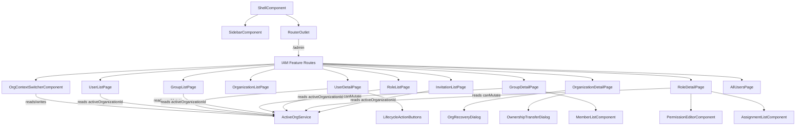
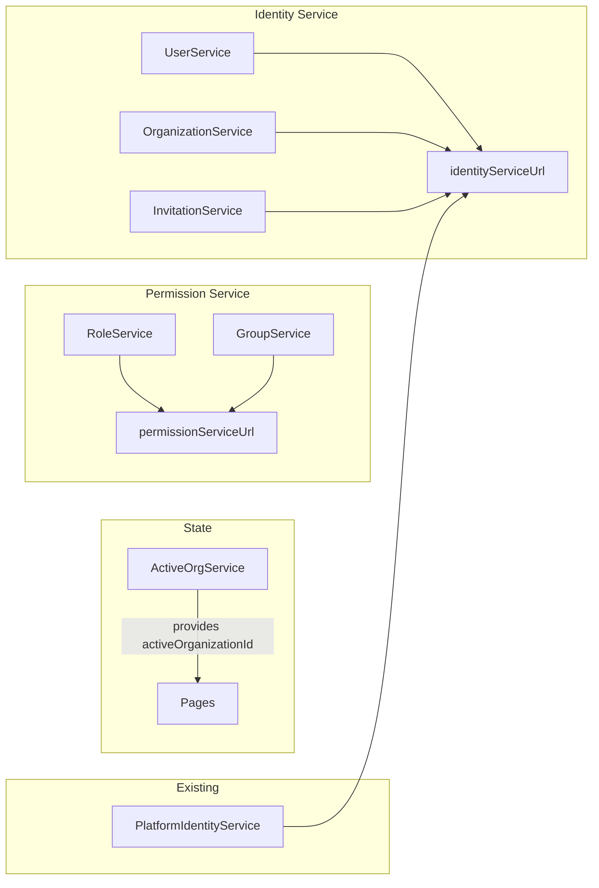
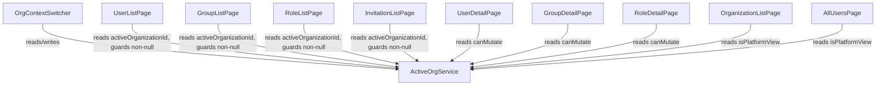

# Design Document: IAM Admin Panel

## Overview

The IAM Admin Panel is a feature module within the platform-frontend Angular application that provides the administrative UI for identity and access management. It enables Platform Admins and Org Admins to manage users, organizations, groups, roles, permissions, and invitations through a governed web interface.

The panel operates under two scope levels:
- **Global scope (Platform Admin):** Cross-organization governance — create/manage orgs, view all users read-only, assign GLOBAL-scoped roles, perform org recovery.
- **Org scope (Org Admin):** Organization-internal management — manage users, groups, org-scoped roles, and invitations within a single organization.

The frontend is strictly a consumption layer. All authorization enforcement happens backend-side (ADM-051). The UI hides or disables actions the current user cannot perform, but the backend remains the authoritative guard.

### Backend Services

| Service | Base URL Config Key | Endpoints |
|---------|-------------------|-----------|
| Identity Service | `environment.identityServiceUrl` (`http://localhost:8000`) | Users, Organizations, Invitations, Identity Context |
| Permission Service | `environment.permissionServiceUrl` (`http://localhost:8001`) | Roles, Role Assignments, Groups, Group Members |

### Key Design Decisions

1. **Follow audit feature pattern.** The existing audit feature (`features/audit/`) establishes the canonical pattern for feature modules: standalone components, signals-based state, PrimeNG UI, `@ngx-translate/core` i18n, `HttpClient`-based services, and URL query param sync. The IAM panel replicates this pattern.
2. **Feature directory: `features/iam/`.** Aligns with the existing `features/audit/` and `features/poi/` convention.
3. **Scope-aware sidebar.** Navigation items are conditionally registered based on the user's role (Platform Admin vs Org Admin), determined from the Identity Context (`GET /api/v1/identity/me?include=roles`).
4. **No client-side authorization logic.** The UI hides/disables controls as a convenience. The backend enforces all access rules.
5. **Optimistic locking for Permission Service entities.** Groups and Roles use a `version` field for concurrency control. The UI sends the current version with update/delete requests and handles HTTP 409 conflicts.
6. **Active Organization Context.** A central `ActiveOrgService` provides a single source of truth for which organization the user is currently operating in. All org-scoped pages and services read from this service instead of independently resolving scope. This eliminates invisible context and ensures consistency across pages.
7. **Platform Admin read-only outside SNAP.** When a Platform Admin switches to an org other than the System Organization (SNAP), all mutation controls (create, edit, delete, lifecycle actions) are hidden. A single computed signal (`isOwnOrg`) drives this behavior.

---

## Architecture

### Component Tree



### Routing Structure

All IAM routes are lazy-loaded under `/admin` within the `ShellComponent`:

```
/admin
  /admin/users                    → UserListPage
  /admin/users/:userId            → UserDetailPage
  /admin/organizations            → OrganizationListPage
  /admin/organizations/:orgId     → OrganizationDetailPage
  /admin/groups                   → GroupListPage
  /admin/groups/:groupId          → GroupDetailPage
  /admin/roles                    → RoleListPage
  /admin/roles/:roleId            → RoleDetailPage
  /admin/invitations              → InvitationListPage
  /admin/all-users                → AllUsersPage
```

### Route Registration

In `app.routes.ts`, a new lazy-loaded child route is added under the `ShellComponent`:

```typescript
{
  path: 'admin',
  loadChildren: () => import('./features/iam/iam.routes').then(m => m.iamRoutes),
}
```

The feature routes file (`features/iam/iam.routes.ts`) defines all child routes:

```typescript
export const iamRoutes: Routes = [
  // Platform-view routes (no org context required)
  { path: 'organizations', component: OrganizationListPage },
  { path: 'organizations/:orgId', component: OrganizationDetailPage },
  { path: 'all-users', component: AllUsersPage },

  // Org-scoped routes (require non-null activeOrganizationId)
  { path: 'users', component: UserListPage, canActivate: [OrgContextGuard] },
  { path: 'users/:userId', component: UserDetailPage, canActivate: [OrgContextGuard] },
  { path: 'groups', component: GroupListPage, canActivate: [OrgContextGuard] },
  { path: 'groups/:groupId', component: GroupDetailPage, canActivate: [OrgContextGuard] },
  { path: 'roles', component: RoleListPage, canActivate: [OrgContextGuard] },
  { path: 'roles/:roleId', component: RoleDetailPage, canActivate: [OrgContextGuard] },
  { path: 'invitations', component: InvitationListPage, canActivate: [OrgContextGuard] },

  { path: '', redirectTo: 'users', pathMatch: 'full' },
];
```

#### OrgContextGuard

The `OrgContextGuard` is a functional route guard that ensures org-scoped pages are only accessible when an active organization is selected:

```typescript
// guards/org-context.guard.ts
export const OrgContextGuard: CanActivateFn = () => {
  const activeOrg = inject(ActiveOrgService);
  const router = inject(Router);

  if (activeOrg.activeOrganizationId() !== null) {
    return true;
  }

  // Platform Admin with no org selected → redirect to organizations page
  if (activeOrg.isPlatformAdmin()) {
    return router.createUrlTree(['/admin/organizations']);
  }

  // Org Admin should always have an org — if somehow null, redirect to home
  return router.createUrlTree(['/']);
};
```

This guard eliminates the "select org" prompt pattern entirely. Platform Admins who directly navigate to `/admin/users` without selecting an org are cleanly redirected to the Organizations page where they can pick one.

### Service Layer

Six Angular services support the IAM panel — five for backend HTTP communication and one for active organization state:



The five HTTP services follow the audit feature pattern:
- `@Injectable({ providedIn: 'root' })`
- Inject `HttpClient` via `inject(HttpClient)`
- Construct base URL from `environment.identityServiceUrl` or `environment.permissionServiceUrl`
- Use `HttpParams` for query parameters
- Return `Observable<T>` from all public methods

The `ActiveOrgService` is a state service (no HTTP calls). It is injected by all org-scoped page components to determine the current organization context.

### State Management

#### Active Organization Context (`ActiveOrgService`)

The `ActiveOrgService` is the central piece of state for the IAM panel. It provides a single source of truth for which organization the user is currently operating in.

```typescript
@Injectable({ providedIn: 'root' })
export class ActiveOrgService {
  private readonly platformIdentity = inject(PlatformIdentityService);

  // The user's own org from Identity Context (immutable after login)
  readonly userOrganizationId: Signal<string | null>;
  readonly isPlatformAdmin: Signal<boolean>;

  // The currently active org (what the user is "looking at")
  // - Org Admin: always their own org (immutable)
  // - Platform Admin: selectable, defaults to null (platform view)
  //   - null = platform view (Organizations list, All Users)
  //   - string = org view (Users, Groups, Roles, Invitations scoped to that org)
  readonly activeOrganizationId: WritableSignal<string | null> = signal(null);
  readonly activeOrganizationName: WritableSignal<string | null> = signal(null);

  // Derived state
  readonly isOwnOrg: Signal<boolean> = computed(() =>
    this.activeOrganizationId() !== null &&
    this.activeOrganizationId() === this.userOrganizationId()
  );

  // Is the user in platform view (no org selected)?
  // Only meaningful for Platform Admin. Org Admin is never in platform view.
  readonly isPlatformView: Signal<boolean> = computed(() =>
    this.isPlatformAdmin() && this.activeOrganizationId() === null
  );

  // Is the user viewing an org (any org, including their own)?
  readonly isOrgView: Signal<boolean> = computed(() =>
    this.activeOrganizationId() !== null
  );

  // Can the user mutate resources in the current org context?
  // true when: Org Admin (always in own org) OR Platform Admin in own org (SNAP)
  // false when: Platform Admin viewing another org OR Platform Admin in platform view
  readonly canMutate: Signal<boolean> = computed(() => {
    if (!this.isOrgView()) return false; // platform view = no mutations
    return this.isOwnOrg() || !this.isPlatformAdmin();
  });

  // Switch active org (Platform Admin only)
  switchOrg(orgId: string, orgName: string): void { ... }

  // Switch to platform view (Platform Admin only)
  switchToPlatformView(): void { ... }

  // Reset to user's own org
  resetToOwnOrg(): void { ... }
}
```

**Context persistence (sessionStorage):**

The active org context is persisted in `sessionStorage` (per-tab, survives refresh, clears on tab close). This prevents Platform Admins from losing their working context on page refresh or deep links.

- On `switchOrg()`: write `{ orgId, orgName }` to `sessionStorage`
- On `switchToPlatformView()`: clear `sessionStorage` entry
- On `initialize()`: check `sessionStorage` first. If a stored org exists, validate it by calling `GET /api/v1/organizations/{orgId}`. If the org is valid (200, active status), restore context. If invalid (404, inactive), clear storage, reset to platform view, and show a toast: "Previously selected organization is no longer available."
- Deep links (`/admin/users`): on load, `ActiveOrgService` initializes from `sessionStorage`. If no stored context and user is Platform Admin, default to platform view (null). If user is Org Admin, always use own org.

**Three-state context model (Platform Admin):**

| State | `activeOrganizationId` | Visible Pages | `canMutate` |
|-------|----------------------|---------------|-------------|
| Platform view | `null` | Organizations, All Users | `false` |
| Own org (SNAP) | SNAP org ID | Users, Groups, Roles, Invitations | `true` |
| Foreign org | Other org ID | Users, Groups, Roles, Invitations (read-only) | `false` |

For Org Admin, the context is always their own org (no platform view, no switching).

**Behavior by role:**

| Role | `activeOrganizationId` | Changeable? | `canMutate` |
|------|----------------------|-------------|-------------|
| Org Admin | Own org from Identity Context | No | Always `true` |
| Platform Admin (platform view) | `null` | Yes (can switch to org) | `false` |
| Platform Admin (in SNAP) | SNAP org ID | Yes (can switch) | `true` |
| Platform Admin (viewing org X) | Org X ID | Yes (can switch back) | `false` (read-only) |

**How pages consume it:**

All org-scoped pages inject `ActiveOrgService` and use `activeOrganizationId()` for API calls. The `OrgContextGuard` ensures `activeOrganizationId` is never `null` when these pages load:

```typescript
// In UserListPage (guaranteed non-null org by OrgContextGuard)
private readonly activeOrg = inject(ActiveOrgService);

private fetchUsers(): void {
  const orgId = this.activeOrg.activeOrganizationId()!;
  this.userService.listUsers({ organization_id: orgId, limit: this.limit(), offset: this.offset() })
    .subscribe({ ... });
}
```

Mutation controls check `canMutate()`:

```typescript
// In template
@if (activeOrg.canMutate()) {
  <p-button label="Create User" (onClick)="openCreateDialog()" />
}
```

Role assignment `scope_id` is auto-filled from active org context (read-only):

```typescript
// In RoleDetailPage — assign role form
readonly scopeId = computed(() => this.activeOrg.activeOrganizationId());
// scope_id field is read-only in the template, always derived from context
```

#### Org Context Switcher (Platform Admin only)

The org context switcher is a UI element visible only to Platform Admin users. It appears in the IAM admin area (e.g., as a prominent selector above the page content or in the breadcrumb area) and shows:
- The current mode: "Platform" (when `activeOrganizationId` is `null`) or the active organization name
- A dropdown to switch to a specific org (fetched from `GET /api/v1/organizations`) or back to "Platform" view
- A visual indicator when viewing a foreign org (read-only badge)

**Page visibility depends on context:**

| Context | Visible Pages |
|---------|--------------|
| Platform view (`null`) | Organizations, All Users |
| Org view (any org) | Users, Groups, Roles, Invitations |

When the Platform Admin is in platform view and navigates to `/admin/users`, the UI should prompt them to select an org first (or redirect to `/admin/organizations`). Org-scoped pages require a non-null `activeOrganizationId`.



When the Platform Admin switches org:
1. `ActiveOrgService.switchOrg(orgId, orgName)` is called
2. All org-scoped pages reactively re-fetch data (via `effect()` or explicit subscription to the signal)
3. Mutation controls hide/show based on `canMutate()`
4. The breadcrumb/header updates to show the active org name

#### Component-Level State

Beyond the active org context, each page component manages its own local state via signals (consistent with the audit feature):

```typescript
// Example: UserListPage local state
readonly users = signal<UserResponse[]>([]);
readonly totalRecords = signal<number>(0);
readonly loading = signal<boolean>(false);
readonly forbidden = signal<boolean>(false);
readonly errorMessage = signal<string | null>(null);
```

### Scope-Aware Sidebar Integration

The `SidebarService` currently defines a static `sections` signal. The IAM panel extends the "administration" section with new navigation items. The items shown depend on the user's role, determined from the `ActiveOrgService`:

**All admin users (Org Admin + Platform Admin):**
- Users (`/admin/users`)
- Groups (`/admin/groups`)
- Roles (`/admin/roles`)

**Org Admin only (not Platform Admin):**
- Invitations (`/admin/invitations`)

**Platform Admin only:**
- Organizations (`/admin/organizations`)
- All Users (`/admin/all-users`)

The `SidebarService` sections signal will be updated to a `computed()` that derives the navigation items based on the user's roles from `ActiveOrgService.isPlatformAdmin()`.

Note: The sidebar items do NOT change when the Platform Admin switches org context. The sidebar reflects the user's role capabilities, not the active org. The org context switcher is a separate UI element within the admin area.

### Environment Configuration

Add `permissionServiceUrl` to the environment file:

```typescript
// environment.ts
export const environment = {
  // ... existing config
  permissionServiceUrl: 'http://localhost:8001',
};
```

Also add `http://localhost:8001` to the `trustedOrigins` array.

---

## Components and Interfaces

### Page Components

Each page component follows the audit feature pattern: standalone, `OnPush` change detection, signals for state, PrimeNG for UI, `@ngx-translate` for i18n.

| Component | Path | Responsibility |
|-----------|------|---------------|
| `UserListPage` | `pages/user-list/` | Paginated user table with status filter, create dialog, row click → detail |
| `UserDetailPage` | `pages/user-detail/` | User profile edit, lifecycle actions (deactivate/lock/unlock), delete |
| `OrganizationListPage` | `pages/organization-list/` | Paginated org table, create dialog with bootstrap flow |
| `OrganizationDetailPage` | `pages/organization-detail/` | Org edit, delete, org recovery, ownership transfer, display owners |
| `GroupListPage` | `pages/group-list/` | Paginated group table, create dialog |
| `GroupDetailPage` | `pages/group-detail/` | Group edit/delete, member list with add/remove |
| `RoleListPage` | `pages/role-list/` | Paginated role table, create dialog |
| `RoleDetailPage` | `pages/role-detail/` | Role edit/delete, permission editor, assignment list with assign/revoke |
| `InvitationListPage` | `pages/invitation-list/` | Paginated invitation table with status filter, create/revoke |
| `AllUsersPage` | `pages/all-users/` | Read-only cross-org user table with org/status filters |

### Shared Components

| Component | Path | Responsibility |
|-----------|------|---------------|
| `OrgContextSwitcherComponent` | `components/org-context-switcher/` | Org selector for Platform Admin — shows active org name, dropdown to switch, read-only indicator when viewing foreign org. Hidden for Org Admin. |
| `ForbiddenViewComponent` | `components/forbidden-view/` | Reusable 403 forbidden display (reuse from audit or create shared) |
| `ConfirmDialogContent` | (uses PrimeNG `ConfirmDialog`) | Confirmation with audit trail hint text |

### Service Interfaces

#### ActiveOrgService

```typescript
@Injectable({ providedIn: 'root' })
export class ActiveOrgService {
  // Initialized from Identity Context on app load
  readonly userOrganizationId: Signal<string | null>;
  readonly userOrganizationName: Signal<string | null>;
  readonly isPlatformAdmin: Signal<boolean>;

  // Active org context (writable for Platform Admin, immutable for Org Admin)
  readonly activeOrganizationId: Signal<string | null>;
  readonly activeOrganizationName: Signal<string | null>;

  // Derived
  readonly isOwnOrg: Signal<boolean>;
  readonly isPlatformView: Signal<boolean>;
  readonly isOrgView: Signal<boolean>;
  readonly canMutate: Signal<boolean>;

  // Actions (Platform Admin only)
  switchOrg(orgId: string, orgName: string): void;
  switchToPlatformView(): void;
  resetToOwnOrg(): void;

  // Initialize from Identity Context (called once on IAM panel load)
  // Checks sessionStorage for persisted context, validates if present
  initialize(identityContext: IdentityContextResponse): Promise<void>;
}
```

#### UserService

```typescript
@Injectable({ providedIn: 'root' })
export class UserService {
  listUsers(params: UserQueryParams): Observable<PaginatedResponse<UserResponse>>;
  getUser(userId: string): Observable<UserResponse>;
  createUser(body: CreateUserRequest): Observable<UserResponse>;
  updateUser(userId: string, body: UpdateUserRequest): Observable<UserResponse>;
  deactivateUser(userId: string): Observable<UserResponse>;
  lockUser(userId: string): Observable<UserResponse>;
  unlockUser(userId: string): Observable<UserResponse>;
  deleteUser(userId: string): Observable<void>;
}
```

#### OrganizationService

```typescript
@Injectable({ providedIn: 'root' })
export class OrganizationService {
  listOrganizations(params: OrgQueryParams): Observable<PaginatedResponse<OrganizationResponse>>;
  getOrganization(orgId: string): Observable<OrganizationResponse>;
  createOrganization(body: CreateOrganizationRequest): Observable<OrganizationResponse>;
  updateOrganization(orgId: string, body: UpdateOrganizationRequest): Observable<OrganizationResponse>;
  deleteOrganization(orgId: string): Observable<void>;
}
```

#### InvitationService

```typescript
@Injectable({ providedIn: 'root' })
export class InvitationService {
  listInvitations(orgId: string, params: InvitationQueryParams): Observable<PaginatedResponse<InvitationResponse>>;
  createInvitation(orgId: string, body: CreateInvitationRequest): Observable<InvitationResponse>;
  revokeInvitation(invitationId: string): Observable<InvitationResponse>;
}
```

#### RoleService

```typescript
@Injectable({ providedIn: 'root' })
export class RoleService {
  listRoles(params: PaginationParams): Observable<PaginatedResponse<RoleResponse>>;
  getRole(roleId: string): Observable<RoleResponse>;
  createRole(body: RoleCreate): Observable<RoleResponse>;
  updateRole(roleId: string, body: RoleUpdate): Observable<RoleResponse>;
  deleteRole(roleId: string, version: number): Observable<void>;
  listAssignments(roleId: string, params: PaginationParams): Observable<PaginatedResponse<RoleAssignmentResponse>>;
  assignRole(roleId: string, body: RoleAssignmentCreate): Observable<RoleAssignmentResponse>;
  revokeAssignment(roleId: string, subjectId: string): Observable<void>;
}
```

#### GroupService

```typescript
@Injectable({ providedIn: 'root' })
export class GroupService {
  listGroups(params: PaginationParams): Observable<PaginatedResponse<GroupResponse>>;
  getGroup(groupId: string): Observable<GroupResponse>;
  createGroup(body: GroupCreate): Observable<GroupResponse>;
  updateGroup(groupId: string, body: GroupUpdate): Observable<GroupResponse>;
  deleteGroup(groupId: string, version: number): Observable<void>;
  listMembers(groupId: string, params: PaginationParams): Observable<PaginatedResponse<GroupMemberResponse>>;
  addMember(groupId: string, body: GroupMemberCreate): Observable<GroupMemberResponse>;
  removeMember(groupId: string, subjectId: string): Observable<void>;
}
```

---

## Data Models

### Identity Service Models

```typescript
// --- Response Models ---

export interface UserResponse {
  id: string;
  external_auth_id: string;
  email: string;
  display_name: string;
  status: 'active' | 'inactive' | 'locked';
  organization_id: string | null;
  clearance_level: number;
  identity_version: number;
  created_at: string;
  updated_at: string;
}

export interface OrganizationResponse {
  id: string;
  name: string;
  status: 'active' | 'inactive';
  created_at: string;
  updated_at: string;
}

export interface InvitationResponse {
  id: string;
  organization_id: string;
  email: string;
  invited_by_user_id: string;
  status: 'pending' | 'accepted' | 'expired' | 'revoked';
  expires_at: string;
  accepted_at: string | null;
  created_at: string;
  updated_at: string;
}

// --- Request Models ---

export interface CreateUserRequest {
  external_auth_id: string;
  email: string;
  display_name: string;
  clearance_level: number;
  organization_id: string;
}

export interface UpdateUserRequest {
  email?: string;
  display_name?: string;
  clearance_level?: number;
}

export interface CreateOrganizationRequest {
  name: string;
  status: 'active' | 'inactive';
}

export interface UpdateOrganizationRequest {
  name?: string;
  status?: 'active' | 'inactive';
}

export interface CreateInvitationRequest {
  email: string;
}

// --- Query Params ---

export interface UserQueryParams {
  limit: number;
  offset: number;
  organization_id?: string;
  status?: 'active' | 'inactive' | 'locked';
}

export interface OrgQueryParams {
  limit: number;
  offset: number;
  include_deleted?: boolean;
}

export interface InvitationQueryParams {
  limit: number;
  offset: number;
  status?: 'pending' | 'accepted' | 'expired' | 'revoked';
}
```

### Permission Service Models

```typescript
// --- Response Models ---

export interface RoleResponse {
  id: string;
  name: string;
  type: 'platform' | 'service';
  version: number;
  permissions: PermissionResponse[];
  created_at: string;
  updated_at: string;
}

export interface PermissionResponse {
  id: string;
  resource_type: string;
  action: string;
  created_at: string;
}

export interface RoleAssignmentResponse {
  id: string;
  subject_id: string;
  role_id: string;
  scope_type: 'GLOBAL' | 'ORG';
  scope_id: string | null;
  created_at: string;
}

export interface GroupResponse {
  id: string;
  name: string;
  description: string | null;
  version: number;
  created_at: string;
  updated_at: string;
}

export interface GroupMemberResponse {
  id: string;
  group_id: string;
  subject_id: string;
  created_at: string;
}

// --- Request Models ---

export interface RoleCreate {
  name: string;
  type: 'platform' | 'service';
  permissions: { resource_type: string; action: string }[];
}

export interface RoleUpdate {
  name?: string;
  type?: 'platform' | 'service';
  permissions?: { resource_type: string; action: string }[];
  version: number;
}

export interface RoleAssignmentCreate {
  subject_id: string;
  scope_type: 'GLOBAL' | 'ORG';
  scope_id: string | null;
}

export interface GroupCreate {
  name: string;
  description?: string;
}

export interface GroupUpdate {
  name?: string;
  description?: string;
  version: number;
}

export interface GroupMemberCreate {
  subject_id: string;
}
```

### Generic Pagination

```typescript
export interface PaginatedResponse<T> {
  items: T[];
  total_count: number;
  limit: number;
  offset: number;
}

export interface PaginationParams {
  limit: number;
  offset: number;
}
```


---

## Correctness Properties

*A property is a characteristic or behavior that should hold true across all valid executions of a system — essentially, a formal statement about what the system should do. Properties serve as the bridge between human-readable specifications and machine-verifiable correctness guarantees.*

### Property 1: Sidebar navigation items match user role

*For any* user role configuration (Platform Admin, Org Admin, or both), the set of navigation items rendered in the "administration" sidebar section must exactly match the expected set: Platform Admin sees Organizations, All Users, Users, Groups, Roles (but not Invitations); Org Admin sees Users, Groups, Roles, Invitations (but not Organizations or All Users).

**Validates: Requirements 1.1, 8.3, 9.2, 9.3, 9.4**

### Property 2: All navigation item labels are valid i18n keys

*For any* navigation item registered by the IAM panel in the sidebar, its `label` field must be a string matching the pattern `shell.nav.*` or `admin.*`, ensuring all user-facing text is internationalized.

**Validates: Requirements 1.2, 13.2**

### Property 3: Service list methods construct correct pagination parameters

*For any* service list method (UserService.listUsers, OrganizationService.listOrganizations, InvitationService.listInvitations, RoleService.listRoles, RoleService.listAssignments, GroupService.listGroups, GroupService.listMembers) and any valid `limit` (1–1000) and `offset` (≥0) values, the resulting HTTP request must include `limit` and `offset` as query parameters with the correct values.

**Validates: Requirements 2.1, 4.1, 5.1, 5.9, 6.1, 7.1, 8.1**

### Property 4: Org-scoped operations use ActiveOrgService

*For any* user (Org Admin or Platform Admin), all org-scoped API calls (user list, group list, role list, invitation list, user creation) must use the `activeOrganizationId` from `ActiveOrgService` as the organization filter, not independently resolved values. This ensures a single source of truth for org context.

**Validates: Requirements 2.2, 3.3, 8.2, 9.5**

### Property 5: Pagination and filter state round-trips through URL query parameters

*For any* list page (UserListPage, OrganizationListPage, InvitationListPage, AllUsersPage) and any valid combination of pagination (limit, offset) and filter values, writing the state to URL query parameters and then reading it back must produce the same state.

**Validates: Requirements 2.6, 4.11, 8.12, 17.7**

### Property 6: HTTP error status codes map to correct UI patterns

*For any* HTTP error response from any backend service, the UI must display the correct pattern: 403 → forbidden view, 503 → warning with retry button, 400 → error message from response body, 404 (on detail pages) → not-found view with back navigation, 409 → context-appropriate conflict message, network error (status 0) → network error with retry button.

**Validates: Requirements 2.7, 2.8, 3.10, 3.11, 4.9, 5.6, 5.8, 5.12, 6.6, 6.8, 7.8, 7.9, 7.10, 8.10, 10.1, 10.2, 10.3, 10.4, 10.5, 10.6**

### Property 7: Lifecycle action buttons are conditionally visible based on user status

*For any* user status value (`active`, `inactive`, `locked`), the User Detail Page must show exactly the correct set of lifecycle action buttons: `active` → Deactivate and Lock visible; `locked` → Unlock visible; `inactive` → none visible.

**Validates: Requirements 3.6**

### Property 8: Lifecycle actions call the correct endpoint

*For any* lifecycle action type (deactivate, lock, unlock), the User Detail Page must call the corresponding endpoint (`POST /api/v1/users/{user_id}/deactivate`, `POST /api/v1/users/{user_id}/lock`, `POST /api/v1/users/{user_id}/unlock`) on the Identity Service.

**Validates: Requirements 3.7**

### Property 9: Destructive actions require confirmation with audit trail text

*For any* destructive action (user deletion, user deactivation, role revocation, group deletion, organization deletion, ownership transfer), the UI must display a confirmation dialog before execution, and the dialog must include the i18n-translated text "This action will be recorded in the audit trail."

**Validates: Requirements 3.9, 20.1**

### Property 10: Optimistic locking version is included in update and delete requests

*For any* update or delete request to a versioned entity (Group or Role) on the Permission Service, the request must include the current `version` field value. For updates, the version is in the request body. For deletes, the version is a query parameter.

**Validates: Requirements 5.5, 5.7, 6.5, 6.7**

### Property 11: Role type determines assignable scope type

*For any* role with type `platform`, the only assignable scope_type must be `GLOBAL`. *For any* role with type `service`, the only assignable scope_type must be `ORG`. The UI must enforce this binding by restricting the scope_type selector options based on the role's type.

**Validates: Requirements 18.4**

### Property 12: Scope options are restricted based on user role

*For any* non-Platform-Admin user, the scope_type selector must not include the `GLOBAL` option, and scope_type must default to `ORG` with scope_id pre-filled from the Identity Context organization_id. *For any* Platform Admin user, both `GLOBAL` and `ORG` options must be available.

**Validates: Requirements 7.4, 7.5, 7.6, 18.1, 18.2, 18.3**

### Property 13: GLOBAL scope implies null scope_id, ORG scope requires non-null scope_id

*For any* role assignment creation request, if `scope_type` is `GLOBAL` then `scope_id` must be `null`. If `scope_type` is `ORG` then `scope_id` must be a non-null valid UUID string.

**Validates: Requirements 7.5, 7.6**

### Property 14: Invitation revoke action availability matches invitation status

*For any* invitation displayed in the Invitation List Page, the "Revoke" action must be enabled if and only if the invitation status is `pending`. For all other statuses (`accepted`, `expired`, `revoked`), the action must be disabled.

**Validates: Requirements 8.8, 8.9**

### Property 15: Non-Platform-Admin users cannot create platform-type roles

*For any* user who does not hold the Platform Admin role, the role creation form must restrict the `type` field to `service` only, and the type field must be disabled.

**Validates: Requirements 6.9**

### Property 16: User missing organization or roles triggers informational messages

*For any* user displayed on the User Detail Page, if `organization_id` is null, an informational message about no operational access (ADM-044) must be displayed. If the user has zero role assignments, an informational message about no effective permissions (ADM-045) must be displayed.

**Validates: Requirements 15.1, 15.2**

### Property 17: Last Org Owner protection prevents orphaning

*For any* action that would remove the last Org Owner from an organization (role revocation, user deactivation, user deletion), the UI must display a warning and prevent the action when no other Org Owner exists for that organization.

**Validates: Requirements 20.2, 20.3**

### Property 18: Ownership transfer target must belong to same organization

*For any* ownership transfer action, the target user must belong to the same organization as the current Org Owner. The transfer form must only allow selection of active users within the current organization.

**Validates: Requirements 19.1, 19.5**

### Property 19: All Users Page is strictly read-only

*For any* interaction on the All Users Page, no mutation controls (create, edit, delete, lifecycle actions) must be present. The page must only display data and provide filtering/pagination.

**Validates: Requirements 17.4**

### Property 20: Service base URLs are derived from environment configuration

*For any* Angular service in the IAM panel, the HTTP request base URL must be constructed from `environment.identityServiceUrl` (for UserService, OrganizationService, InvitationService) or `environment.permissionServiceUrl` (for RoleService, GroupService), never hardcoded.

**Validates: Requirements 11.6**

### Property 21: User deletion warning includes active role and group counts

*For any* user deletion attempt where the user has active role assignments or group memberships, the warning message must include the count of active roles and groups that will be affected.

**Validates: Requirements 20.4**

### Property 22: Org Recovery button visibility is restricted to Platform Admin

*For any* user on the Organization Detail Page, the "Org Recovery" action button must be visible if and only if the user holds the Platform Admin role.

**Validates: Requirements 16.1**

### Property 23: ActiveOrgService defaults and persistence

*For any* user (Org Admin or Platform Admin), when the IAM panel loads:
- If `sessionStorage` contains a stored org context, `ActiveOrgService` must validate it via `GET /api/v1/organizations/{orgId}`. If valid (200, active), restore it. If invalid (404, inactive), clear storage and fall back to default.
- If no stored context: Org Admin defaults to own org. Platform Admin defaults to `null` (platform view).
- For Org Admin users, `activeOrganizationId` must be immutable (cannot be changed, no sessionStorage persistence needed).

**Validates: Requirements 9.5, Foundational Rule 3**

### Property 24: Platform Admin canMutate is false when viewing foreign org or in platform view

*For any* Platform Admin user: when `activeOrganizationId` is `null` (platform view), `canMutate` must be `false`. When `activeOrganizationId` differs from the user's own `organization_id`, `canMutate` must be `false`. When `activeOrganizationId` equals the user's own `organization_id`, `canMutate` must be `true`. For Org Admin users, `canMutate` must always be `true`.

**Validates: Foundational Rule 9**

### Property 25: Mutation controls are hidden when canMutate is false

*For any* org-scoped page (UserListPage, UserDetailPage, GroupListPage, GroupDetailPage, RoleListPage, RoleDetailPage, InvitationListPage), when `ActiveOrgService.canMutate()` is `false`, all mutation controls (create buttons, edit forms, delete buttons, lifecycle action buttons, assign/revoke buttons, add/remove member buttons) must be hidden or disabled.

**Validates: Foundational Rule 9**

### Property 26: Org context switcher is visible only to Platform Admin

*For any* user on any IAM panel page, the `OrgContextSwitcherComponent` must be visible if and only if the user holds the Platform Admin role. For Org Admin users, the component must be hidden.

**Validates: Foundational Rule 3**

### Property 27: Switching org context triggers data re-fetch

*For any* org-scoped page that is currently displayed, when the Platform Admin switches the active organization via `ActiveOrgService.switchOrg()`, the page must re-fetch its data using the new `activeOrganizationId`. Stale data from the previous org must not be displayed.

**Validates: Requirements 9.5**

### Property 28: ORG-scoped role assignment scope_id is auto-filled and read-only

*For any* role assignment creation with `scope_type` = `ORG`, the `scope_id` field must be automatically filled from `ActiveOrgService.activeOrganizationId()` and the field must be read-only (not user-editable). This ensures the assignment always targets the currently active org context, eliminating mismatch risk.

**Validates: Requirements 7.6, 15.3**

### Property 29: Org-scoped routes are guarded by OrgContextGuard

*For any* org-scoped route (users, groups, roles, invitations, and their detail pages), the `OrgContextGuard` must prevent navigation when `ActiveOrgService.activeOrganizationId()` is `null`. Platform Admin users must be redirected to `/admin/organizations`. Org Admin users (who should always have an org) must be redirected to `/` as a fallback.

**Validates: Foundational Rule 3**

### Property 30: Platform-view pages require null activeOrganizationId or Platform Admin role

*For any* platform-view page (OrganizationListPage, AllUsersPage), the page must be accessible only to Platform Admin users. The AllUsersPage always queries without org filter regardless of `activeOrganizationId`. The OrganizationListPage is always available to Platform Admin regardless of context.

**Validates: Requirements 9.2, 17.1**

---

## Error Handling

All IAM panel pages follow a consistent error handling strategy, matching the existing audit feature pattern.

### HTTP Status Code Mapping

| Status | Behavior | UI Element |
|--------|----------|-----------|
| 400 | Display error message from response body | PrimeNG `Message` with `error` severity |
| 403 | Switch to forbidden view | `ForbiddenViewComponent` |
| 404 | Display "not found" message with back navigation | PrimeNG `Message` with `error` severity + back button |
| 409 | Display context-appropriate conflict message | PrimeNG `Message` with `warn` severity |
| 422 | Display validation error from response body | PrimeNG `Message` with `error` severity |
| 503 | Display warning with retry button | PrimeNG `Message` with `warn` severity + retry button |
| 0 (network) | Display network error with retry button | PrimeNG `Message` with `error` severity + retry button |

### Error Handling Pattern (per component)

```typescript
error: (err: HttpErrorResponse) => {
  this.loading.set(false);

  if (err.status === 403) {
    this.forbidden.set(true);
    return;
  }
  if (err.status === 404) {
    this.notFound.set(true);
    return;
  }
  if (err.status === 400 || err.status === 422) {
    const message = err.error?.detail || err.error?.message || 'admin.error.badRequest';
    this.errorMessage.set(message);
    this.errorSeverity.set('error');
    this.showRetry.set(false);
    return;
  }
  if (err.status === 409) {
    this.errorMessage.set('admin.error.conflict');
    this.errorSeverity.set('warn');
    this.showRetry.set(false);
    return;
  }
  if (err.status === 503) {
    this.errorMessage.set('admin.error.serviceUnavailable');
    this.errorSeverity.set('warn');
    this.showRetry.set(true);
    return;
  }
  // Network error or unknown
  this.errorMessage.set('admin.error.networkError');
  this.errorSeverity.set('error');
  this.showRetry.set(true);
}
```

### Optimistic Locking Conflict (409)

For versioned entities (Groups, Roles), a 409 response indicates a version conflict. The UI:
1. Displays a warning message: "This resource was modified by another user. Please reload and try again."
2. Provides a "Reload" button that re-fetches the entity to get the latest version.

For duplicate resource conflicts (duplicate group member, duplicate role assignment), the 409 response indicates the resource already exists. The UI displays an appropriate message.

### Confirmation Dialogs

All destructive actions use PrimeNG `ConfirmationService` with:
- i18n-translated header and message
- Audit trail hint: "This action will be recorded in the audit trail"
- Accept/Reject buttons with appropriate labels

---

## Testing Strategy

### Testing Framework

- **Test runner:** Vitest (via `@angular/build:unit-test`, per tech stack)
- **Property-based testing library:** [fast-check](https://github.com/dubzzz/fast-check) for TypeScript
- **Angular testing utilities:** `TestBed`, `HttpClientTestingModule` (`provideHttpClientTesting`), `RouterTestingModule`

### Unit Tests

Unit tests cover specific examples, edge cases, and integration points:

- Service methods construct correct HTTP requests (URL, params, body)
- Component initialization restores state from URL query params
- Error handling for each HTTP status code
- Lifecycle action button visibility for each user status
- Confirmation dialog display before destructive actions
- Form validation (required fields, field constraints)
- Navigation on row click, back navigation on not-found

### Property-Based Tests

Each correctness property from the design document is implemented as a single property-based test using fast-check. Each test runs a minimum of 100 iterations.

Each test is tagged with a comment referencing the design property:

```typescript
// Feature: iam-admin-panel, Property 1: Sidebar navigation items match user role
it('should show correct nav items for any role configuration', () => {
  fc.assert(
    fc.property(
      fc.record({ isPlatformAdmin: fc.boolean(), isOrgAdmin: fc.boolean() }),
      (roles) => {
        // ... verify sidebar items match expected set for role config
      }
    ),
    { numRuns: 100 }
  );
});
```

Property tests focus on:
- Sidebar visibility rules across all role combinations (Property 1)
- Pagination parameter construction across all valid limit/offset values (Property 3)
- Org-scoped filtering via ActiveOrgService for all contexts (Property 4)
- URL query param round-trip for all filter/pagination combinations (Property 5)
- HTTP error status → UI pattern mapping (Property 6)
- Lifecycle button visibility for all user statuses (Property 7)
- Scope-type constraints based on role type (Property 11)
- Scope option restrictions based on user role (Property 12)
- GLOBAL/ORG scope_id invariant (Property 13)
- Invitation revoke availability based on status (Property 14)
- Role type restriction for non-platform-admin (Property 15)
- Last owner protection logic (Property 17)
- Ownership transfer org constraint (Property 18)
- ActiveOrgService defaults to user's own org (Property 23)
- canMutate is false for foreign orgs (Property 24)
- Mutation controls hidden when canMutate is false (Property 25)
- Org context switcher visibility (Property 26)

### Test File Organization

```
features/iam/
  services/
    active-org.service.spec.ts
    user.service.spec.ts
    organization.service.spec.ts
    invitation.service.spec.ts
    role.service.spec.ts
    group.service.spec.ts
  pages/
    user-list/user-list.component.spec.ts
    user-detail/user-detail.component.spec.ts
    organization-list/organization-list.component.spec.ts
    ...
  components/
    org-context-switcher/org-context-switcher.component.spec.ts
  properties/
    sidebar-visibility.property.spec.ts
    pagination-params.property.spec.ts
    scope-constraints.property.spec.ts
    error-handling.property.spec.ts
    lifecycle-buttons.property.spec.ts
    invitation-revoke.property.spec.ts
    url-roundtrip.property.spec.ts
    last-owner-protection.property.spec.ts
    active-org-context.property.spec.ts
    can-mutate.property.spec.ts
```

### Test Commands

```bash
pnpm test              # run all tests (watch mode)
ng test --no-watch     # single run
```
