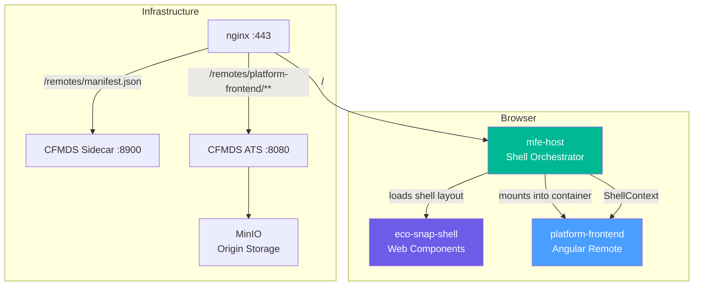
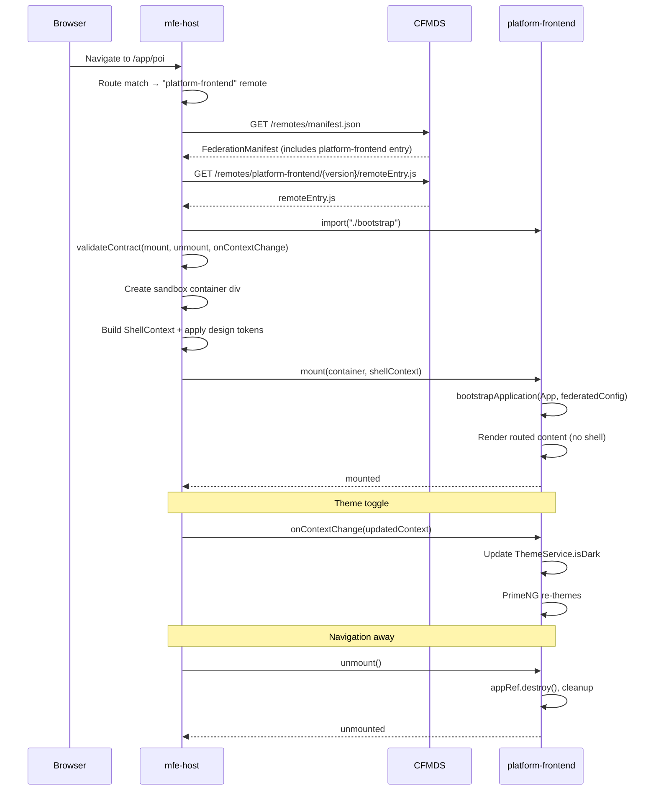

# Design Document: MFE Phase 3 — platform-frontend as Federated Module

## Overview

Phase 3 of the MFE Infrastructure Evolution transforms the Angular 21 platform-frontend from a standalone SPA into a Webpack Module Federation remote that is published to CFMDS and loaded at runtime by mfe-host. After this phase, platform-frontend renders only its routed content area (features like POI, documents, audit, IAM) while the shell layout (header, sidebar, breadcrumb) is owned by eco-snap-shell Web Components loaded by mfe-host.

The key challenge is dual-mode operation: platform-frontend must continue to work as a standalone app for local development (`pnpm start`) while also functioning as a headless federated module when loaded by mfe-host. This requires a runtime detection mechanism that conditionally enables/disables the shell, auth session management, and router configuration.

Auth token sharing is the second critical concern. When running as a federated module, the Angular app must not manage its own Keycloak session — it receives the access token from the host via `ShellContext.auth.getAccessToken()`. When running standalone, it uses its existing PKCE-based Keycloak flow unchanged.

## Architecture



### Module Loading Sequence



## Components and Interfaces

### Component 1: Bootstrap Module (`src/bootstrap.ts`)

**Purpose**: Implements the `RemoteModuleContract` lifecycle, serving as the entry point exposed by Module Federation. Bridges the mfe-host shell context into the Angular dependency injection system.

**Interface**:

```typescript
// Implements RemoteModuleContract from mfe-host
export interface RemoteModuleContract {
  mount(container: HTMLElement, context: ShellContext): Promise<void>;
  unmount(): Promise<void>;
  onContextChange(context: ShellContext): void;
}
```

**Responsibilities**:

- Bootstrap the Angular application into the host-provided container element
- Configure Angular providers to use host-provided auth, theme, i18n, and navigation
- Store `ApplicationRef` reference for clean teardown
- Forward `onContextChange` calls to the `ShellContextBridge` service
- Destroy the Angular application and clean up DOM on `unmount()`

### Component 2: ShellContextBridge Service (`src/app/shell/shell-context-bridge.service.ts`)

**Purpose**: Reactive bridge between the mfe-host `ShellContext` and Angular's dependency injection. Converts imperative `onContextChange` calls into Angular signals that components can consume.

**Interface**:

```typescript
@Injectable({ providedIn: 'root' })
export class ShellContextBridge {
  readonly shellContext: WritableSignal<ShellContext | null>;
  readonly isDark: Signal<boolean>;
  readonly locale: Signal<string>;
  readonly activePillar: Signal<string>;

  setContext(context: ShellContext): void;
  getAccessToken(): Promise<string>;
}
```

**Responsibilities**:

- Hold the current `ShellContext` as a writable signal
- Derive computed signals for theme, locale, and pillar from the context
- Provide `getAccessToken()` that delegates to `ShellContext.auth.getAccessToken()`
- Notify Angular's change detection when context changes via `NgZone.run()`

### Component 3: Federated Auth Token Provider (`src/app/auth/services/federated-token-provider.ts`)

**Purpose**: An alternative token provider used when running as a federated module. Instead of managing a Keycloak session, it delegates to the host's `ShellContext.auth.getAccessToken()`.

**Interface**:

```typescript
export interface TokenProvider {
  getAccessToken(): Promise<string | null>;
  isAuthenticated(): boolean;
}

@Injectable()
export class FederatedTokenProvider implements TokenProvider {
  getAccessToken(): Promise<string | null>;
  isAuthenticated(): boolean;
}

@Injectable()
export class StandaloneTokenProvider implements TokenProvider {
  getAccessToken(): Promise<string | null>;
  isAuthenticated(): boolean;
}
```

**Responsibilities**:

- `FederatedTokenProvider`: Delegates to `ShellContextBridge.getAccessToken()` — no Keycloak session management
- `StandaloneTokenProvider`: Wraps the existing `AuthService.getAccessToken()` — full Keycloak PKCE flow
- The `TOKEN_PROVIDER` injection token is resolved at bootstrap time based on the running mode

### Component 4: Execution Mode Service (`src/app/services/execution-mode.service.ts`)

**Purpose**: Runtime detection of whether the app is running as a federated module or standalone. This is the single source of truth for conditional behavior throughout the app.

**Interface**:

```typescript
@Injectable({ providedIn: 'root' })
export class ExecutionModeService {
  readonly isFederated: Signal<boolean>;
  readonly isStandalone: Signal<boolean>;

  markAsFederated(): void;
}
```

**Responsibilities**:

- Default to standalone mode
- `markAsFederated()` is called by `bootstrap.ts` during `mount()` — switches to federated mode
- All conditional behavior (shell rendering, auth strategy, router config) reads from this service

### Component 5: Federated Shell Component (`src/app/shell/shell.ts` — refactored)

**Purpose**: The existing `ShellComponent` is refactored to conditionally render the shell chrome (header, sidebar, breadcrumb) only in standalone mode. In federated mode, it renders only the `<router-outlet>`.

**Interface** (template logic):

```html
<!-- Federated mode: content only -->
@if (executionMode.isStandalone()) {
<div class="l-shell">
  <app-header />
  <app-sidebar />
  <div class="l-shell__main" [style.margin-left.px]="contentMargin()">
    <main class="l-shell__content">
      <app-breadcrumb />
      <router-outlet />
    </main>
  </div>
</div>
} @else {
<main class="l-shell__content l-shell__content--federated">
  <router-outlet />
</main>
}
```

### Component 6: Webpack Module Federation Configuration (`webpack.config.ts`)

**Purpose**: Configures the Angular build to produce a Module Federation remote bundle alongside the standard standalone build.

**Key Configuration**:

```typescript
// webpack.config.ts (used by @angular-architects/module-federation)
{
  name: 'platform_frontend',
  filename: 'remoteEntry.js',
  exposes: {
    './bootstrap': './src/bootstrap.ts',
  },
  shared: {
    '@angular/core': { singleton: true, strictVersion: true },
    '@angular/common': { singleton: true, strictVersion: true },
    '@angular/router': { singleton: true, strictVersion: true },
    '@angular/platform-browser': { singleton: true, strictVersion: true },
    'rxjs': { singleton: true, strictVersion: false },
  },
}
```

## Data Models

### Model 1: ShellContext (consumed from mfe-host)

```typescript
// From mfe-host/src/types/shell-api.ts — platform-frontend consumes this
interface ShellContext {
  auth: AuthContext;
  permissions: PermissionContext;
  navigation: NavigationService;
  theme: ThemeContext;
  notifications: NotificationService;
  i18n: I18nContext;
  eventBus: EventBus;
  routeParams: RouteParams;
}
```

**Mapping to Angular Services**:

- `auth.getAccessToken()` → `FederatedTokenProvider`
- `auth.user` → replaces `AuthService.snapshot.user`
- `theme.colorMode` → `ThemeService.isDark`
- `theme.tokens` → CSS custom properties on container
- `i18n.activeLocale` → `TranslateService.use(locale)`
- `navigation.navigate()` → Angular Router (sub-routes only)
- `notifications.showToast()` → PrimeNG `MessageService`
- `permissions.hasPermission()` → replaces local permission checks

### Model 2: Federation Manifest Entry (for CFMDS)

```typescript
// platform-frontend's entry in the aggregated FederationManifest
{
  "platform-frontend": {
    "activeVersion": "1.0.0",
    "routes": ["/app/**"],
    "loadTimeoutMs": 20000,
    "versions": {
      "1.0.0": {
        "remoteEntry": "/remotes/platform-frontend/1.0.0/remoteEntry.js",
        "exposedModule": "./bootstrap",
        "requiredShellApiVersion": "^1.0.0",
        "requiredDesignTokenVersion": "^1.0.0",
        "requiredPermissions": [],
        "supportedLocales": ["pt-BR", "en"],
        "integrity": "sha384-...",
        "shared": {
          "@angular/core": "21.2.0",
          "rxjs": "7.8.0"
        }
      }
    },
    "contract": {
      "moduleName": "platform_frontend",
      "lifecycleHooks": ["mount", "unmount", "onContextChange"],
      "eventTypes": {
        "emits": ["platform:navigation-changed"],
        "listens": ["host:theme-changed", "host:locale-changed"]
      }
    }
  }
}
```

### Model 3: Execution Mode

```typescript
type ExecutionMode = 'standalone' | 'federated';

interface FederatedBootstrapConfig {
  container: HTMLElement;
  shellContext: ShellContext;
}
```

## Error Handling

### Error Scenario 1: Mount Failure

**Condition**: `bootstrapApplication()` throws during `mount()` (missing provider, template error, etc.)
**Response**: The `mount()` function catches the error, logs it with structured JSON, and re-throws so mfe-host's `RemoteLoader` renders its fallback error UI.
**Recovery**: User clicks "Retry" in the mfe-host fallback, which triggers a fresh `loadAndMount()` cycle.

### Error Scenario 2: Auth Token Unavailable

**Condition**: `ShellContext.auth.getAccessToken()` rejects or returns an expired token while in federated mode.
**Response**: The `FederatedTokenProvider` returns `null`. The `AuthInterceptor` receives a 401, but instead of triggering a Keycloak redirect (which would break the federated context), it emits an event on the `ShellContext.eventBus` to notify the host.
**Recovery**: mfe-host handles the auth failure event and triggers its own re-authentication flow.

### Error Scenario 3: Context Change After Unmount

**Condition**: `onContextChange()` is called after `unmount()` has already destroyed the Angular app.
**Response**: The `bootstrap.ts` guards against this by checking if `appRef` is still alive before forwarding context changes. If destroyed, the call is silently ignored.
**Recovery**: No recovery needed — this is a race condition during navigation that resolves naturally.

### Error Scenario 4: Standalone Fallback

**Condition**: The Angular app is loaded directly (not via mfe-host) — e.g., developer runs `pnpm start`.
**Response**: `bootstrap.ts` is never called. The standard `main.ts` → `bootstrapApplication()` path runs, `ExecutionModeService` stays in standalone mode, and the full shell + auth flow operates as before.
**Recovery**: N/A — this is the expected standalone development path.

## Testing Strategy

### Unit Testing Approach

- Test `ShellContextBridge` signal reactivity: setting context updates derived signals
- Test `FederatedTokenProvider` delegates to bridge correctly
- Test `ExecutionModeService` mode transitions
- Test `ShellComponent` conditional rendering in both modes
- Test `bootstrap.ts` mount/unmount lifecycle (mock `bootstrapApplication`)

### Integration Testing Approach

- Verify the full mount → render → unmount cycle using a test harness that simulates mfe-host
- Verify auth token propagation: host token reaches Angular HTTP interceptor
- Verify theme propagation: `onContextChange` with new theme updates PrimeNG dark mode
- Verify router coexistence: Angular router handles sub-routes within the container

### E2E Testing Approach

- `make up` starts the full stack with platform-frontend published to CFMDS
- Navigate to `/app/poi` — verify platform-frontend loads inside eco-snap-shell layout
- Toggle theme in shell — verify Angular app re-themes
- Navigate between `/app/poi` and `/app/documents` — verify Angular router handles sub-routes
- Navigate away from `/app/**` — verify unmount cleans up Angular app

## Performance Considerations

- **Bundle Size**: The federation build must code-split aggressively. Shared dependencies (`@angular/core`, `rxjs`) are declared as singletons to avoid duplication with the host.
- **Load Timeout**: The manifest entry sets `loadTimeoutMs: 20000` (20s) to account for the larger Angular bundle compared to eco-snap-shell.
- **Lazy Routes**: All feature modules (`snap`, `audit`, `intelligence`, `admin`) remain lazy-loaded within the Angular remote — they are not exposed as separate federation entry points.
- **Mount Performance**: `bootstrapApplication()` is called once per mount. Subsequent navigations within the remote use Angular's router without re-bootstrapping.

## Security Considerations

- **Token Isolation**: In federated mode, the Angular app never stores or manages Keycloak tokens. It receives tokens on-demand via `ShellContext.auth.getAccessToken()`. No tokens are persisted in `localStorage` or `sessionStorage` by the federated module.
- **No Keycloak Redirect in Federated Mode**: The `AuthGuard` and `AuthInterceptor` must not trigger Keycloak login redirects when running as a federated module — this would navigate away from the host shell. Auth failures are delegated to the host via the event bus.
- **CSP Compatibility**: The `remoteEntry.js` is loaded via dynamic `import()` by mfe-host. The host's CSP must allow `script-src` from the CFMDS origin.
- **Artifact Integrity**: The federation bundle is signed and integrity-verified by CFMDS (same pipeline as eco-snap-shell). SRI hashes in the manifest are validated by ATS before serving.

## Dependencies

| Dependency                              | Purpose                                                       | Version                           |
| --------------------------------------- | ------------------------------------------------------------- | --------------------------------- |
| `@angular-architects/module-federation` | Angular Module Federation builder integration                 | Latest compatible with Angular 21 |
| `@angular/core`                         | Angular framework                                             | ^21.2.0                           |
| `@angular/router`                       | Client-side routing within the remote                         | ^21.2.0                           |
| `primeng`                               | UI component library (must theme correctly in federated mode) | ^21.1.4                           |
| `@ngx-translate/core`                   | i18n (locale synced from host in federated mode)              | ^17.0.0                           |
| `rxjs`                                  | Reactive programming                                          | ~7.8.0                            |

### Cross-Repo Dependencies

| Repo               | Change Required                                                                                    |
| ------------------ | -------------------------------------------------------------------------------------------------- |
| `platform-runtime` | Update `scripts/seed-modules.sh` to publish platform-frontend to CFMDS                             |
| `mfe-cmfds`        | Sidecar manifest aggregation includes platform-frontend entry (automatic if Phase 1 sidecar works) |
| `mfe-host`         | No code changes — remote-loader already handles arbitrary remotes from manifest                    |
