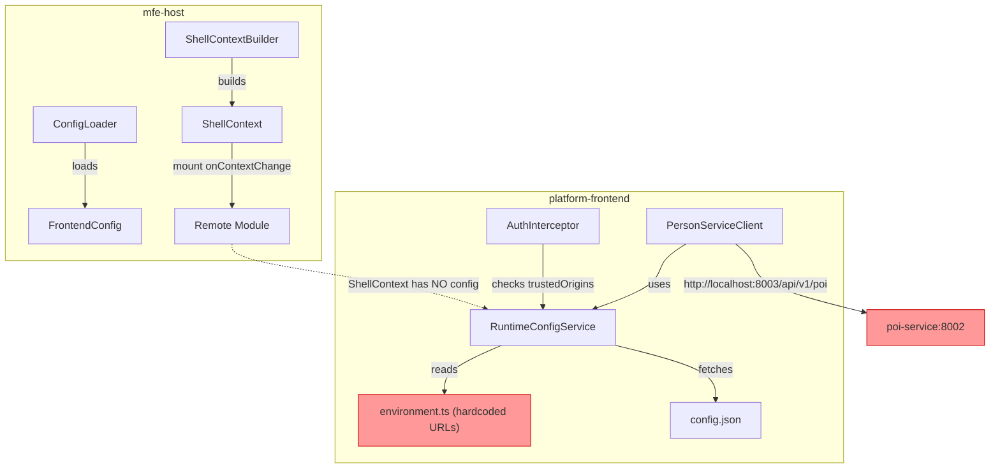
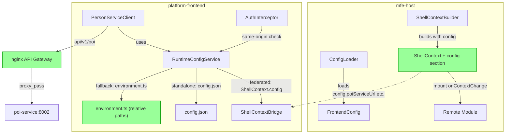
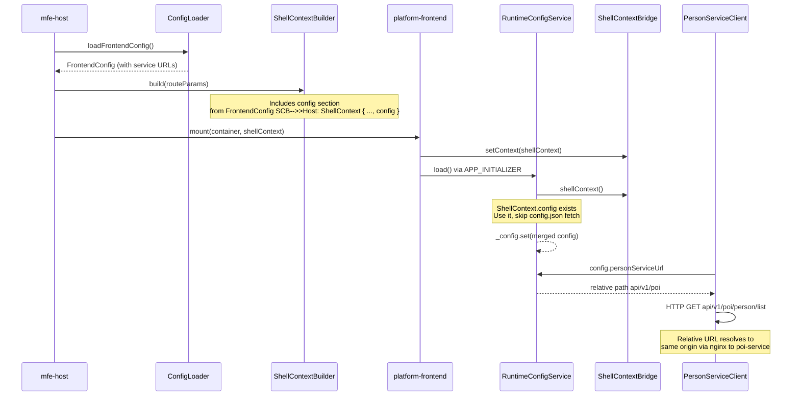
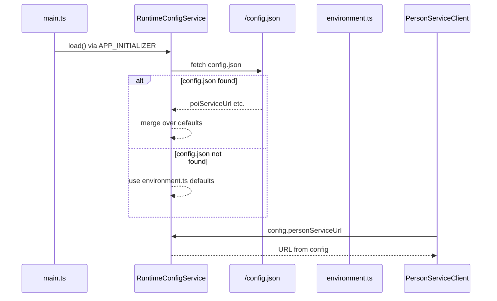
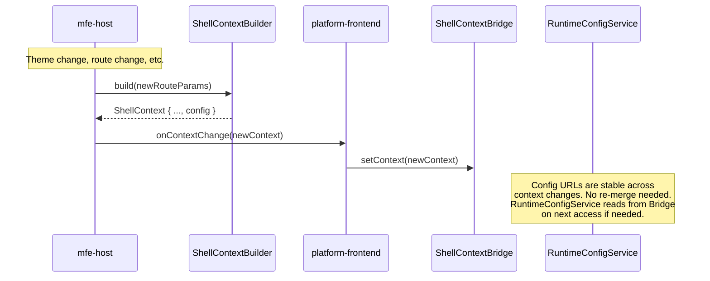

# Design Document: MFE Runtime Config Injection

## Overview

The platform-frontend micro-frontend currently hardcodes backend service URLs in `environment.ts` (e.g., `http://localhost:8003/api/v1/poi`), violating [ARCH-009] Rule 9 (all API requests go through the API Gateway) and [STD-001] (no hardcoded service addresses). The mfe-host already loads a `FrontendConfig` at boot containing all service URLs, but these are not passed through to mounted remotes via `ShellContext`.

This feature extends the `ShellContext` contract with an optional `config` section carrying API service URLs, updates `RuntimeConfigService` in platform-frontend to prefer ShellContext config in federated mode, changes `environment.ts` defaults to relative paths that work behind nginx, and simplifies the auth interceptor's `trustedOrigins` logic for same-origin federated mode.

The change spans two repositories — `mfe-host` (contract producer) and `platform-frontend` (contract consumer) — and must be backward-compatible so existing remotes that don't consume `config` continue to work.

## Architecture

### Current State



**Problems:**

- `FrontendConfig` service URLs are loaded by mfe-host but never forwarded to remotes
- `environment.ts` contains absolute `localhost:PORT` URLs — violates [STD-001]
- In federated mode, the remote still fetches `/config.json` and falls back to hardcoded defaults
- `trustedOrigins` lists individual service ports — unnecessary when behind nginx (same-origin)

### Target State



## Sequence Diagrams

### Federated Mode — Config Resolution



### Standalone Mode — Config Resolution (Unchanged)



### Context Change — Config Propagation



## Components and Interfaces

### Component 1: ShellContext Config Extension (mfe-host)

**Purpose**: Extend the `ShellContext` contract with an optional `config` section so the host can forward runtime configuration (API service URLs) to mounted remotes.

**Interface** (canonical — `mfe-host/src/types/shell-api.ts`):

```typescript
export interface ShellConfigContext {
  /** Base URL for the identity service API (e.g., "/api/v1/identity") */
  readonly identityServiceUrl: string;
  /** Base URL for the permission service API */
  readonly permissionServiceUrl: string;
  /** Base URL for the audit service API */
  readonly auditServiceUrl: string;
  /** Base URL for the POI service API */
  readonly poiServiceUrl: string;
  /** Base URL for the person service API (may be same as POI) */
  readonly personServiceUrl: string;
  /** Base URL for the document service API */
  readonly documentServiceUrl?: string;
}

export interface ShellContext {
  auth: AuthContext;
  permissions: PermissionContext;
  navigation: NavigationService;
  theme: ThemeContext;
  notifications: NotificationService;
  i18n: I18nContext;
  eventBus: EventBus;
  routeParams: RouteParams;
  /** Runtime configuration injected by the host. Optional for backward compatibility. */
  config?: ShellConfigContext;
}
```

**Responsibilities**:

- Define the shape of runtime config data passed from host to remotes
- Keep the `config` property optional so existing remotes that don't consume it are unaffected
- Serve as the canonical type definition — remotes mirror this interface locally

### Component 2: ShellContextBuilder Update (mfe-host)

**Purpose**: Populate the `config` section of `ShellContext` from the already-loaded `FrontendConfig`.

**Interface**:

```typescript
// mfe-host/src/shell/shell-context.ts

export class ShellContextBuilder {
  constructor(
    private authService: AuthContext,
    private permissionService: PermissionContext,
    private router: NavigationService,
    private themeService: ThemeContext,
    private notificationService: NotificationService,
    private i18nService: I18nContext,
    private eventBus: EventBus,
    private frontendConfig: FrontendConfig, // NEW parameter
  ) {}

  build(routeParams: RouteParams): ShellContext {
    return {
      // ... existing fields unchanged ...
      config: {
        identityServiceUrl: this.frontendConfig.identityServiceUrl,
        permissionServiceUrl: this.frontendConfig.permissionServiceUrl,
        auditServiceUrl: this.frontendConfig.auditServiceUrl,
        poiServiceUrl: this.frontendConfig.poiServiceUrl,
        personServiceUrl: this.frontendConfig.poiServiceUrl, // POI service serves person API
        documentServiceUrl: this.frontendConfig.documentServiceUrl,
      },
    };
  }
}
```

**Responsibilities**:

- Map `FrontendConfig` fields to `ShellConfigContext` fields
- Ensure the config section is always populated when the host has loaded config
- The `FrontendConfig` already contains all service URLs — no new config loading needed

### Component 3: RuntimeConfigService Update (platform-frontend)

**Purpose**: In federated mode, prefer config from `ShellContext.config` over `/config.json` fetch. In standalone mode, preserve existing behavior (fetch `/config.json`, fall back to `environment.ts`).

**Interface**:

```typescript
// platform-frontend/src/app/services/runtime-config.service.ts

@Injectable({ providedIn: 'root' })
export class RuntimeConfigService {
  private readonly executionMode = inject(ExecutionModeService);
  private readonly shellContextBridge = inject(ShellContextBridge);

  private _config = signal<RuntimeConfig>({
    keycloak: environment.keycloak,
    identityServiceUrl: environment.identityServiceUrl,
    permissionServiceUrl: environment.permissionServiceUrl,
    auditServiceUrl: environment.auditServiceUrl,
    personServiceUrl: environment.personServiceUrl,
    poiServiceUrl: environment.poiServiceUrl,
  });

  get config(): RuntimeConfig {
    return this._config();
  }

  async load(): Promise<void> {
    if (this.executionMode.isFederated()) {
      this.loadFromShellContext();
      return;
    }
    await this.loadFromConfigJson();
  }

  private loadFromShellContext(): void {
    const ctx = this.shellContextBridge.shellContext();
    if (ctx?.config) {
      this._config.set({
        ...this._config(),
        identityServiceUrl: ctx.config.identityServiceUrl,
        permissionServiceUrl: ctx.config.permissionServiceUrl,
        auditServiceUrl: ctx.config.auditServiceUrl,
        personServiceUrl: ctx.config.personServiceUrl,
        poiServiceUrl: ctx.config.poiServiceUrl,
      });
      console.log('[Config] Loaded runtime config from ShellContext');
    } else {
      console.warn('[Config] ShellContext.config not available, falling back to /config.json');
      this.loadFromConfigJson();
    }
  }

  private async loadFromConfigJson(): Promise<void> {
    // Existing /config.json fetch logic — unchanged
  }
}
```

**Responsibilities**:

- Detect execution mode and choose config source accordingly
- In federated mode: read from `ShellContext.config` (synchronous, no network call)
- In federated mode with missing config (backward compat): fall back to `/config.json`
- In standalone mode: fetch `/config.json`, fall back to `environment.ts` defaults
- Expose a single `config` signal consumed by all HTTP clients and the auth interceptor

### Component 4: Environment Defaults Update (platform-frontend)

**Purpose**: Change hardcoded absolute URLs to relative paths so they work behind nginx in any environment.

**Interface**:

```typescript
// platform-frontend/src/environments/environment.ts

export const environment = {
  production: false,
  useMocks: false,
  keycloak: {
    baseUrl: 'http://localhost:8180',
    realm: 'platform',
    clientId: 'platform-frontend',
    redirectUri: 'http://localhost:4200/auth/callback',
    postLogoutRedirectUri: 'http://localhost:4200',
  },
  // Relative paths — resolve against current origin
  identityServiceUrl: '/api/v1/identity',
  permissionServiceUrl: '/api/v1/permissions',
  auditServiceUrl: '/api/v1/audit',
  poiServiceUrl: '/api/v1/poi',
  personServiceUrl: '/api/v1/poi',
  // Trusted origins simplified — relative paths are always same-origin
  trustedOrigins: [] as string[],
  auth: {
    refreshBufferSeconds: 60,
    clockSkewToleranceSeconds: 30,
    idleTimeoutMinutes: 15,
    maxSessionLifetimeHours: 8,
    interceptorReplayLimit: 5,
    redirectLoopThreshold: 3,
    redirectLoopWindowMs: 10_000,
  },
  credentialStrategy: 'bearer' as const,
  csp: {
    reportUri: '',
  },
};
```

**Responsibilities**:

- Provide sensible defaults that work in Tier 1 (UI-only) and Tier 2 (standalone with backend) modes
- Relative paths (`/api/v1/poi`) resolve to `window.location.origin` — works behind nginx without knowing the hostname
- Keycloak URLs remain absolute because they point to a different service (port 8180 in standalone mode)
- `trustedOrigins` becomes empty — the interceptor logic changes to use origin comparison instead

### Component 5: Auth Interceptor Trusted Origins Update (platform-frontend)

**Purpose**: Simplify the trusted origin check. With relative URLs, all API calls are same-origin. The interceptor should attach credentials to any request whose resolved origin matches the current page origin, or whose origin matches a configured service URL.

**Interface**:

```typescript
// platform-frontend/src/app/auth/interceptors/auth.interceptor.ts (intercept method)

intercept(req: HttpRequest<unknown>, next: HttpHandler): Observable<HttpEvent<unknown>> {
  const reqUrl = new URL(req.url, window.location.origin);
  const reqOrigin = reqUrl.origin;
  const pageOrigin = window.location.origin;

  // Same-origin requests are always trusted (covers relative URLs behind nginx)
  if (reqOrigin === pageOrigin) {
    return this.attachCredentialsAndHandle(req, next);
  }

  // Cross-origin: check against configured service URLs (standalone mode with absolute URLs)
  const cfg = this.configService.config;
  const configuredUrls = [
    cfg.identityServiceUrl,
    cfg.permissionServiceUrl,
    cfg.auditServiceUrl,
    cfg.personServiceUrl,
    cfg.poiServiceUrl,
  ].filter(Boolean);

  const isTrusted = configuredUrls.some((url) => {
    try {
      return new URL(url, pageOrigin).origin === reqOrigin;
    } catch {
      return false;
    }
  });

  if (!isTrusted) {
    return next.handle(req);
  }

  return this.attachCredentialsAndHandle(req, next);
}
```

**Responsibilities**:

- Always trust same-origin requests (relative URLs resolve to page origin)
- For cross-origin requests (standalone mode with absolute URLs), check against configured service URLs
- Eliminate the static `trustedOrigins` array from `environment.ts`
- Work correctly in both standalone and federated modes without configuration changes

### Component 6: ShellContext Types Mirror Update (platform-frontend)

**Purpose**: Mirror the new `ShellConfigContext` interface in the platform-frontend local types file.

**Interface**:

```typescript
// platform-frontend/src/app/shell/shell-context.types.ts (additions)

export interface ShellConfigContext {
  readonly identityServiceUrl: string;
  readonly permissionServiceUrl: string;
  readonly auditServiceUrl: string;
  readonly poiServiceUrl: string;
  readonly personServiceUrl: string;
  readonly documentServiceUrl?: string;
}

export interface ShellContext {
  auth: AuthContext;
  permissions: PermissionContext;
  navigation: NavigationService;
  theme: ThemeContext;
  notifications: NotificationService;
  i18n: I18nContext;
  eventBus: EventBus;
  routeParams: RouteParams;
  config?: ShellConfigContext; // NEW — optional for backward compatibility
}
```

**Responsibilities**:

- Keep in sync with the canonical `mfe-host/src/types/shell-api.ts`
- The `config` property is optional (`?`) so the remote compiles even if mounted by an older host that doesn't provide config

## Data Models

### Model 1: ShellConfigContext

```typescript
interface ShellConfigContext {
  readonly identityServiceUrl: string;
  readonly permissionServiceUrl: string;
  readonly auditServiceUrl: string;
  readonly poiServiceUrl: string;
  readonly personServiceUrl: string;
  readonly documentServiceUrl?: string;
}
```

**Validation Rules**:

- All required URL fields must be non-empty strings
- URLs may be relative (e.g., `/api/v1/poi`) or absolute (e.g., `https://localhost/api/v1/poi`)
- No trailing slashes on URLs
- `documentServiceUrl` is optional — not all deployments have a document service

### Model 2: FrontendConfig (existing — mfe-host)

```typescript
interface FrontendConfig {
  keycloak: KeycloakConfig;
  identityServiceUrl: string;
  permissionServiceUrl: string;
  auditServiceUrl: string;
  poiServiceUrl: string;
  remotesBaseUrl: string;
  documentServiceUrl?: string; // NEW — add if not present
}
```

**Validation Rules**:

- All URL fields must be valid URLs (absolute in production, may be relative in dev)
- `remotesBaseUrl` is host-only — not forwarded to remotes
- `keycloak` config is host-only — remotes get auth via `ShellContext.auth`

### Model 3: RuntimeConfig (existing — platform-frontend)

```typescript
interface RuntimeConfig {
  keycloak: {
    baseUrl: string;
    realm: string;
    clientId: string;
    redirectUri: string;
    postLogoutRedirectUri: string;
  };
  identityServiceUrl: string;
  permissionServiceUrl: string;
  auditServiceUrl: string;
  personServiceUrl: string;
  poiServiceUrl: string;
}
```

**Validation Rules**:

- In federated mode, keycloak fields are unused (auth delegated to host) but must still be present for type safety
- Service URLs come from ShellContext.config (federated) or /config.json (standalone)
- All service URLs must be non-empty strings

## Key Functions with Formal Specifications

### Function 1: ShellContextBuilder.build()

```typescript
build(routeParams: RouteParams): ShellContext
```

**Preconditions:**

- `this.frontendConfig` is loaded and non-null (config-loader ran successfully at boot)
- All service URL fields in `frontendConfig` are non-empty strings
- All other constructor dependencies (authService, permissionService, etc.) are initialized

**Postconditions:**

- Returns a `ShellContext` with all existing fields populated (auth, permissions, navigation, theme, notifications, i18n, eventBus, routeParams)
- `result.config` is defined and contains all required `ShellConfigContext` fields
- `result.config.identityServiceUrl === this.frontendConfig.identityServiceUrl`
- `result.config.poiServiceUrl === this.frontendConfig.poiServiceUrl`
- No mutation of `this.frontendConfig`

**Loop Invariants:** N/A (no loops)

### Function 2: RuntimeConfigService.load()

```typescript
async load(): Promise<void>
```

**Preconditions:**

- Service is injected and Angular DI is initialized
- `ExecutionModeService` has been configured (in federated mode, `markAsFederated()` was called before `load()`)
- In federated mode: `ShellContextBridge.shellContext()` returns a non-null context (set by `APP_INITIALIZER` before `load()`)

**Postconditions:**

- `this._config()` contains merged configuration
- In federated mode with `ShellContext.config` present: service URLs come from ShellContext
- In federated mode without `ShellContext.config`: falls back to `/config.json` fetch
- In standalone mode: service URLs come from `/config.json` merged over `environment.ts` defaults
- If all sources fail: `environment.ts` defaults remain (relative paths)
- No thrown exceptions — failures are logged and defaults are preserved

**Loop Invariants:** N/A

### Function 3: AuthInterceptor.intercept()

```typescript
intercept(req: HttpRequest<unknown>, next: HttpHandler): Observable<HttpEvent<unknown>>
```

**Preconditions:**

- `req.url` is a valid URL string (absolute or relative)
- `RuntimeConfigService.config` is loaded
- `ExecutionModeService` is configured

**Postconditions:**

- If `req.url` resolves to same origin as `window.location.origin`: credentials are attached
- If `req.url` resolves to an origin matching any configured service URL origin: credentials are attached
- If `req.url` resolves to an untrusted origin: request passes through without credentials
- In federated mode: token obtained via `TOKEN_PROVIDER.getAccessToken()` (async)
- In standalone mode: token obtained via `CREDENTIAL_STRATEGY.attachCredentials()` (sync)
- No mutation of the original `req` object

**Loop Invariants:** N/A

## Algorithmic Pseudocode

### Algorithm 1: Config Resolution Strategy

```typescript
ALGORITHM resolveRuntimeConfig(executionMode, shellContextBridge)
INPUT: executionMode: ExecutionModeService, shellContextBridge: ShellContextBridge
OUTPUT: RuntimeConfig (merged into _config signal)

BEGIN
  defaults ← environment defaults (relative paths)
  _config ← defaults

  IF executionMode.isFederated() THEN
    ctx ← shellContextBridge.shellContext()

    IF ctx ≠ null AND ctx.config ≠ null THEN
      // Priority 1: ShellContext.config from host
      _config ← merge(_config, ctx.config)
      LOG "[Config] Loaded runtime config from ShellContext"
      RETURN
    ELSE
      LOG "[Config] ShellContext.config not available, falling back"
      // Fall through to /config.json
    END IF
  END IF

  // Priority 2: /config.json (standalone mode, or federated fallback)
  TRY
    response ← fetch("/config.json")
    IF response.ok THEN
      remote ← response.json()
      _config ← merge(_config, remote)
      LOG "[Config] Loaded runtime config from /config.json"
    ELSE
      LOG "[Config] /config.json not found, using defaults"
    END IF
  CATCH
    LOG "[Config] Failed to fetch /config.json, using defaults"
  END TRY

  // Priority 3: environment.ts defaults (already set as initial value)
END
```

**Preconditions:**

- Angular DI is initialized
- In federated mode: `markAsFederated()` and `setContext()` called before this algorithm runs

**Postconditions:**

- `_config` contains valid service URLs from the highest-priority available source
- Config source priority: ShellContext.config > /config.json > environment.ts defaults
- No exceptions thrown — all failures result in fallback to next source

### Algorithm 2: Trusted Origin Resolution

```typescript
ALGORITHM isTrustedOrigin(requestUrl, configService)
INPUT: requestUrl: string, configService: RuntimeConfigService
OUTPUT: boolean

BEGIN
  pageOrigin ← window.location.origin
  resolvedUrl ← new URL(requestUrl, pageOrigin)
  reqOrigin ← resolvedUrl.origin

  // Rule 1: Same-origin is always trusted
  IF reqOrigin = pageOrigin THEN
    RETURN true
  END IF

  // Rule 2: Check against configured service URL origins
  configuredUrls ← [
    configService.config.identityServiceUrl,
    configService.config.permissionServiceUrl,
    configService.config.auditServiceUrl,
    configService.config.personServiceUrl,
    configService.config.poiServiceUrl,
  ].filter(nonEmpty)

  FOR EACH url IN configuredUrls DO
    TRY
      configOrigin ← new URL(url, pageOrigin).origin
      IF configOrigin = reqOrigin THEN
        RETURN true
      END IF
    CATCH
      CONTINUE  // malformed URL, skip
    END TRY
  END FOR

  RETURN false
END
```

**Preconditions:**

- `requestUrl` is a valid URL string (absolute or relative)
- `configService.config` is loaded

**Postconditions:**

- Returns `true` if and only if the request origin matches the page origin or any configured service URL origin
- Relative URLs always resolve to page origin → always trusted
- Absolute URLs to unknown origins → not trusted

**Loop Invariants:**

- All previously checked URLs were either matching (returned true) or non-matching (continued)

### Algorithm 3: ShellContext Config Population

```typescript
ALGORITHM buildShellContextWithConfig(frontendConfig, routeParams, ...services)
INPUT: frontendConfig: FrontendConfig, routeParams: RouteParams, services: ShellServices
OUTPUT: ShellContext

BEGIN
  baseContext ← {
    auth: buildAuthContext(services.authService),
    permissions: buildPermissionContext(services.permissionService),
    navigation: buildNavigationContext(services.router),
    theme: buildThemeContext(services.themeService),
    notifications: buildNotificationContext(services.notificationService),
    i18n: buildI18nContext(services.i18nService),
    eventBus: services.eventBus,
    routeParams: routeParams,
  }

  // NEW: Attach config section from FrontendConfig
  configSection ← {
    identityServiceUrl: frontendConfig.identityServiceUrl,
    permissionServiceUrl: frontendConfig.permissionServiceUrl,
    auditServiceUrl: frontendConfig.auditServiceUrl,
    poiServiceUrl: frontendConfig.poiServiceUrl,
    personServiceUrl: frontendConfig.poiServiceUrl,  // POI serves person API
  }

  IF frontendConfig.documentServiceUrl IS DEFINED THEN
    configSection.documentServiceUrl ← frontendConfig.documentServiceUrl
  END IF

  baseContext.config ← configSection

  RETURN baseContext
END
```

**Preconditions:**

- `frontendConfig` is loaded and all required URL fields are non-empty
- All service dependencies are initialized

**Postconditions:**

- Returned `ShellContext` contains all existing fields plus `config`
- `config` contains all required service URLs from `frontendConfig`
- No mutation of input parameters

## Example Usage

### Federated Mode — Remote Receives Config

```typescript
// mfe-host builds ShellContext with config
const shellContext = shellContextBuilder.build(routeParams);
// shellContext.config = {
//   identityServiceUrl: "/api/v1/identity",
//   permissionServiceUrl: "/api/v1/permissions",
//   auditServiceUrl: "/api/v1/audit",
//   poiServiceUrl: "/api/v1/poi",
//   personServiceUrl: "/api/v1/poi",
// }

// Remote mounts and receives config
await mount(container, shellContext);

// Inside platform-frontend, RuntimeConfigService.load() runs:
// 1. Detects federated mode
// 2. Reads shellContext.config from ShellContextBridge
// 3. Sets _config signal with host-provided URLs
// 4. PersonServiceClient reads config.personServiceUrl → "/api/v1/poi"
// 5. HTTP request to /api/v1/poi/person/list → same-origin → nginx → poi-service
```

### Standalone Mode — Existing Behavior Preserved

```typescript
// main.ts bootstraps the app
// APP_INITIALIZER calls RuntimeConfigService.load()
// 1. Detects standalone mode
// 2. Fetches /config.json from Angular dev server (public/config.json)
// 3. Merges over environment.ts defaults
// 4. PersonServiceClient reads config.personServiceUrl
//    → "https://localhost/api/v1/poi" (from config.json)
//    or "/api/v1/poi" (from environment.ts defaults if config.json missing)
```

### Auth Interceptor — Same-Origin Detection

```typescript
// Federated mode: all API URLs are relative → same-origin
// Request: GET /api/v1/poi/person/list
// Resolved origin: https://localhost (same as page)
// → Credentials attached ✓

// Standalone mode with config.json absolute URLs:
// Request: GET https://localhost/api/v1/poi/person/list
// Page origin: http://localhost:4200
// Config has: https://localhost/api/v1/poi
// Config origin: https://localhost
// Request origin: https://localhost
// → Match found → Credentials attached ✓

// External request (e.g., CDN asset):
// Request: GET https://cdn.example.com/asset.js
// → No match → No credentials attached ✓
```

### Backward Compatibility — Old Host, New Remote

```typescript
// Old mfe-host (before this change) builds ShellContext WITHOUT config
const shellContext = shellContextBuilder.build(routeParams);
// shellContext.config === undefined

// New platform-frontend mounts
await mount(container, shellContext);

// RuntimeConfigService.load() runs:
// 1. Detects federated mode
// 2. Reads shellContext.config → undefined
// 3. Logs warning, falls back to /config.json fetch
// 4. /config.json served by nginx → works
// 5. All service URLs resolve correctly
```

## Correctness Properties

1. **∀ federated mount with ShellContext.config defined**: `RuntimeConfigService.config.poiServiceUrl === ShellContext.config.poiServiceUrl` — the remote uses exactly the URLs the host provides, not hardcoded defaults.

2. **∀ federated mount with ShellContext.config undefined**: `RuntimeConfigService` falls back to `/config.json` fetch, then to `environment.ts` defaults — no crash, no undefined URLs.

3. **∀ standalone boot**: Config resolution follows the chain `/config.json` → `environment.ts` defaults — behavior is identical to pre-change.

4. **∀ HTTP request with relative URL**: `new URL(relativeUrl, window.location.origin).origin === window.location.origin` — relative URLs are always same-origin, always trusted by the interceptor.

5. **∀ ShellContext built by updated mfe-host**: `shellContext.config` is defined and contains all required service URL fields — no partial config objects.

6. **∀ ShellContext built by old mfe-host**: `shellContext.config === undefined` — the optional property is simply absent, not null or malformed.

7. **∀ environment.ts default URL**: URL starts with `/api/v1/` (relative path) — no absolute `http://localhost:PORT` URLs remain in environment defaults.

8. **∀ request to configured service URL in standalone mode**: The interceptor resolves the configured URL's origin and compares it to the request origin — cross-origin requests to known services still get credentials.

## Error Handling

### Error Scenario 1: ShellContext.config Missing in Federated Mode

**Condition**: Remote is mounted by an older host that doesn't include `config` in ShellContext
**Response**: `RuntimeConfigService.load()` logs a warning and falls back to `/config.json` fetch
**Recovery**: `/config.json` is served by nginx (same as before this change) — full functionality preserved

### Error Scenario 2: /config.json Fetch Fails in Standalone Mode

**Condition**: Angular dev server doesn't have `public/config.json` (Tier 1 UI-only development)
**Response**: `RuntimeConfigService.load()` catches the error, logs a warning, keeps `environment.ts` defaults
**Recovery**: Relative path defaults (`/api/v1/poi`) work if a proxy is configured; otherwise, API calls fail with network errors (expected in Tier 1)

### Error Scenario 3: Malformed URL in Config

**Condition**: A service URL in ShellContext.config or /config.json is malformed (e.g., empty string, invalid characters)
**Response**: `new URL()` in the auth interceptor throws — caught by try/catch, URL is skipped
**Recovery**: The malformed URL is not added to trusted origins; requests to that service won't get credentials. Logged as a warning.

### Error Scenario 4: Config Mismatch Between Host and Remote

**Condition**: Host provides `ShellConfigContext` with a field the remote doesn't expect (e.g., a new `workflowServiceUrl`)
**Response**: TypeScript's structural typing ignores extra fields — no runtime error
**Recovery**: The remote simply doesn't use the extra field. When the remote is updated to consume it, it's already available.

## Testing Strategy

### Unit Testing Approach

**RuntimeConfigService:**

- Test federated mode: mock `ExecutionModeService.isFederated()` → true, mock `ShellContextBridge.shellContext()` with config → verify `_config` signal contains ShellContext values
- Test federated mode fallback: mock ShellContext without config → verify `/config.json` fetch is attempted
- Test standalone mode: mock `isFederated()` → false → verify `/config.json` fetch runs
- Test standalone mode fallback: mock failed fetch → verify `environment.ts` defaults remain

**AuthInterceptor:**

- Test same-origin relative URL: request to `/api/v1/poi/person/list` → credentials attached
- Test same-origin absolute URL: request to `${window.location.origin}/api/v1/poi` → credentials attached
- Test cross-origin trusted URL: request to `https://localhost/api/v1/poi` from `http://localhost:4200` with matching config → credentials attached
- Test cross-origin untrusted URL: request to `https://cdn.example.com/asset.js` → no credentials

**ShellContextBuilder (mfe-host):**

- Test that `build()` includes `config` section with all required fields
- Test that `config` field values match `FrontendConfig` input
- Test that existing ShellContext fields are unchanged

### Property-Based Testing Approach

**Property Test Library**: fast-check (already used in mfe-host test suite)

**Properties:**

- For any valid `FrontendConfig`, `ShellContextBuilder.build()` produces a `ShellContext` where `config` contains all required fields and no field is undefined
- For any valid URL string (relative or absolute), the trusted origin algorithm returns `true` if and only if the resolved origin matches the page origin or a configured service URL origin
- For any `RuntimeConfig` produced by `load()`, all service URL fields are non-empty strings

### Integration Testing Approach

**Contract Test (federation boundary):**

- Mount platform-frontend with a mock ShellContext that includes `config` → verify `RuntimeConfigService.config` reflects the provided URLs
- Mount platform-frontend with a mock ShellContext without `config` → verify fallback to `/config.json`

**E2E Smoke Test (Tier 3):**

- Full stack with nginx → navigate to platform-frontend route → verify API calls use relative paths through nginx → verify 200 responses from backend services

## Performance Considerations

- **No additional network calls**: In federated mode, config comes from ShellContext (in-memory) — eliminates the `/config.json` fetch entirely, saving one HTTP round-trip during mount
- **Signal-based reactivity**: `RuntimeConfigService._config` is an Angular signal — consumers react to changes without polling
- **No bundle size impact**: The `ShellConfigContext` interface is a type-only addition — zero runtime bytes in the host bundle

## Security Considerations

- **No secrets in ShellContext**: The `config` section contains only API base URLs (public routing information), not credentials, tokens, or secrets
- **Same-origin enforcement**: With relative URLs, all API traffic goes through nginx on the same origin — CSP `connect-src 'self'` covers all API calls without additional whitelist entries
- **[ARCH-009] Compliance**: Remote modules no longer call backend services directly on container ports — all traffic routes through the API Gateway (nginx)
- **[STD-001] Compliance**: No hardcoded service addresses remain in `environment.ts` — all URLs are either injected at runtime (federated) or loaded from `/config.json` (standalone)
- **Credential scope**: The auth interceptor only attaches Bearer tokens to same-origin or explicitly configured origins — no credential leakage to third-party domains

## Dependencies

### mfe-host (changes)

- `src/types/shell-api.ts` — Add `ShellConfigContext` interface, add optional `config` to `ShellContext`
- `src/types/config.ts` — Potentially add `documentServiceUrl` to `FrontendConfig` if not present
- `src/shell/shell-context.ts` — Update `ShellContextBuilder` constructor and `build()` method

### platform-frontend (changes)

- `src/app/shell/shell-context.types.ts` — Mirror `ShellConfigContext` and updated `ShellContext`
- `src/app/services/runtime-config.service.ts` — Add federated mode config resolution
- `src/environments/environment.ts` — Change URLs to relative paths, empty `trustedOrigins`
- `src/app/auth/interceptors/auth.interceptor.ts` — Update trusted origin logic
- `src/bootstrap.ts` — No changes needed (already calls `configService.load()` in APP_INITIALIZER)

### Shared infrastructure

- `shared-infra/config/nginx/nginx.conf` — No changes needed (already proxies `/api/v1/*` routes)
- `platform-runtime/.env.example` — No changes needed (env vars are for backend services)

### No new dependencies

- No new npm packages required
- No new environment variables required
- No database or infrastructure changes
