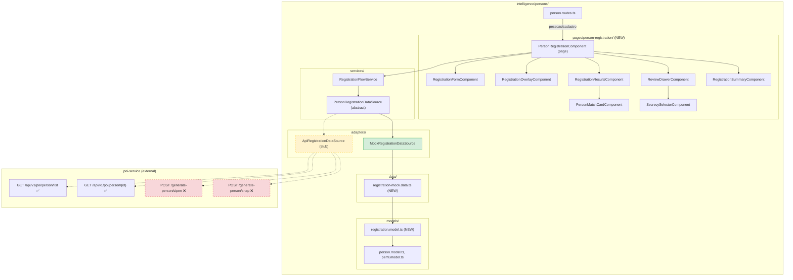
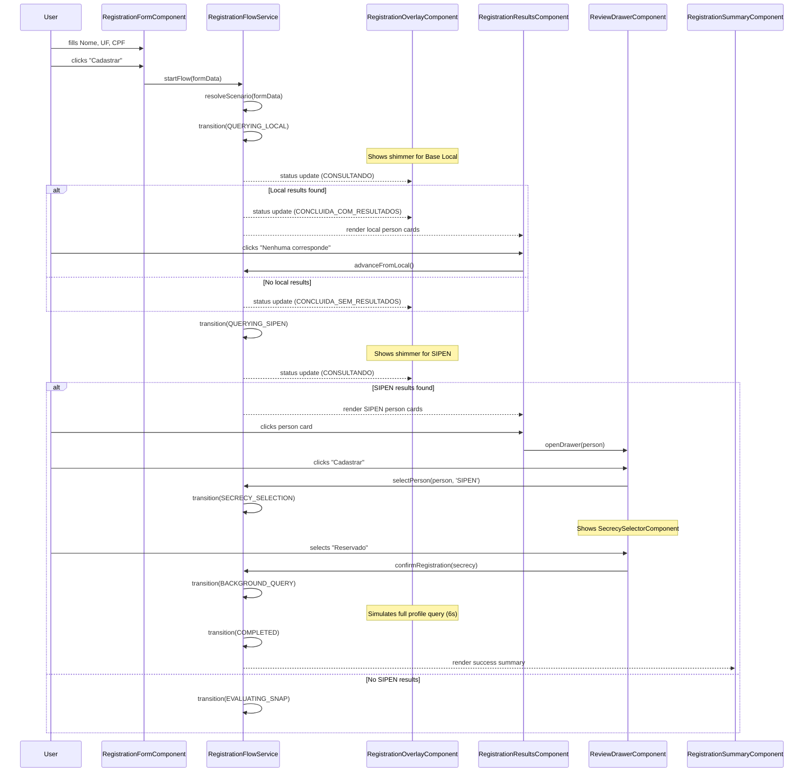
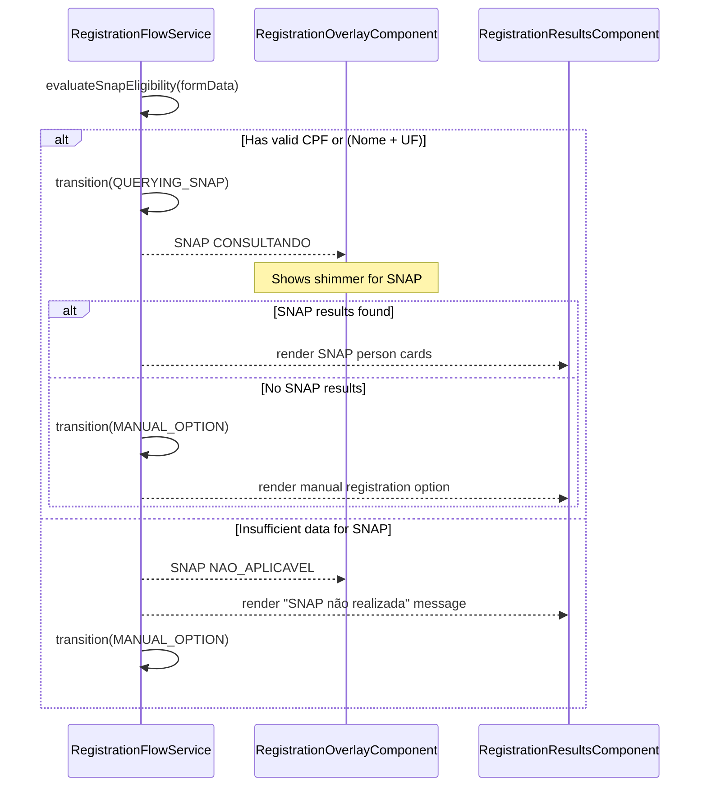

# Design Document: Person Creation Flow

## Overview

The person-creation-flow-ui prototype demonstrates a governed person registration flow for the Intelligence / Persons module. This design converts the static HTML/CSS/JS prototype into Angular 21 standalone components with PrimeNG 21, following DS-002 SMACSS/BEM CSS architecture and DS-001 PrimeNG component rules.

The flow is a multi-step verification pipeline: the user enters basic person data, the system sequentially queries the local database, SIPEN, and SNAP, presents matches for review, and allows the user to either register from an external source (with secrecy selection) or fall back to manual registration.

The implementation is frontend-only with a **service adapter pattern**: all data access goes through an abstract `PersonRegistrationDataSource` interface. The initial implementation ships with a `MockRegistrationDataSource` (static TypeScript data, simulated latency). When the poi-service backend endpoints become available, an `ApiRegistrationDataSource` can be swapped in via Angular DI provider configuration — no changes to components, templates, or flow service logic.

### Backend Integration Status

The poi-service currently provides:
- `GET /api/v1/poi/person/list` — paginated person listing with search and source filter (queries persisted persons)
- `GET /api/v1/poi/person/{person_id}` — full person detail (SIPEN + SNAP data)
- SIPEN and SNAP engines running in `fake` mode locally (`SIPEN_ENGINE_MODE=fake`, `SNAP_ENGINE_TYPE=fake`)

The poi-service does NOT yet provide:
- Live multi-source search endpoints (querying SIPEN/SNAP engines in real-time for candidate matches)
- Person creation endpoints (`POST /api/v1/poi/generate-person/sipen|snap`) — planned in poi-person-api spec
- Secrecy/visibility model on person records
- Confidence score calculation and match type classification

The mock adapter covers all 10 scenarios (CEN-001 through CEN-010) with full UX fidelity. Frontend implementation is not blocked by backend availability.

### Prototype-to-Angular Mapping

| Prototype File | Angular Component(s) | Purpose |
|---|---|---|
| `person-registration.html` + `.css` + `.js` | `PersonRegistrationComponent` (page orchestrator) | Main registration flow page |
| Form section | `RegistrationFormComponent` | Input form with validation |
| Status overlay | `RegistrationOverlayComponent` | Query progress display |
| Results panel + person cards | `RegistrationResultsComponent`, `PersonMatchCardComponent` | Source results display |
| Review drawer | `ReviewDrawerComponent` | Detailed person review |
| Secrecy selector | `SecrecySelectorComponent` | Visibility selection |
| Completion summary | `RegistrationSummaryComponent` | Success confirmation |
| `person-registration-data.js` | `registration-mock.data.ts` + model interfaces | Mock data and scenario matrix |
| `person-registration.js` (state machine) | `RegistrationFlowService` | Flow orchestration service |

## Architecture



**Legend**: Green = active implementation, Yellow dashed = stub (future), Red dashed = backend not yet available

## Sequence Diagrams

### Main Registration Flow



### SNAP Eligibility Evaluation



## Components and Interfaces

### Component: PersonRegistrationComponent (Page Orchestrator)

**Purpose**: Top-level page component that wires together all sub-components and the flow service. Renders the two-column layout (form card + results panel) with the background hero image.

```typescript
// pages/person-registration/person-registration.component.ts
@Component({
  selector: 'app-person-registration',
  standalone: true,
  changeDetection: ChangeDetectionStrategy.OnPush,
  templateUrl: './person-registration.component.html',
  styleUrl: './person-registration.component.scss',
  imports: [
    RegistrationFormComponent,
    RegistrationOverlayComponent,
    RegistrationResultsComponent,
    ReviewDrawerComponent,
    RegistrationSummaryComponent,
  ],
})
export class PersonRegistrationComponent {
  protected readonly flowService = inject(RegistrationFlowService);
}
```

### Component: RegistrationFormComponent

**Purpose**: The input form with Nome, UF, Vulgo, RG, CPF fields. Handles validation, CPF masking, and emits normalized form data on submit.

```typescript
@Component({
  selector: 'app-registration-form',
  standalone: true,
  changeDetection: ChangeDetectionStrategy.OnPush,
  imports: [ReactiveFormsModule, InputTextModule, SelectModule, ButtonModule],
})
export class RegistrationFormComponent {
  readonly formSubmit = output<NormalizedFormData>();

  protected readonly form = new FormGroup({
    nome: new FormControl('', [Validators.minLength(3)]),
    uf: new FormControl(''),
    vulgo: new FormControl('', [Validators.minLength(2)]),
    rg: new FormControl(''),
    cpf: new FormControl(''),
  });

  protected readonly ufOptions: SelectItem[] = UF_LIST.map(uf => ({ label: uf, value: uf }));
  protected readonly isDisabled = input<boolean>(false);

  protected onSubmit(): void {
    const normalized = this.normalizeFormData();
    if (!this.hasAnyValidData(normalized)) { /* show validation */ return; }
    if (this.cpfHasContent() && !this.isValidCPF()) { /* show CPF error */ return; }
    this.formSubmit.emit(normalized);
  }
}
```

### Component: RegistrationOverlayComponent

**Purpose**: Glassmorphism overlay showing query progress for each source. Displays shimmer bars for active queries, check/X icons for completed/errored queries.

```typescript
@Component({
  selector: 'app-registration-overlay',
  standalone: true,
  changeDetection: ChangeDetectionStrategy.OnPush,
})
export class RegistrationOverlayComponent {
  readonly isVisible = input<boolean>(false);
  readonly sourceStatuses = input<SourceStatus[]>([]);
}
```

### Component: RegistrationResultsComponent

**Purpose**: Renders groups of person match cards from each source, with action bars ("Nenhuma corresponde", "Avançar para SNAP", etc.).

```typescript
@Component({
  selector: 'app-registration-results',
  standalone: true,
  changeDetection: ChangeDetectionStrategy.OnPush,
  imports: [PersonMatchCardComponent],
})
export class RegistrationResultsComponent {
  readonly resultGroups = input<ResultGroup[]>([]);
  readonly personSelected = output<{ person: PersonMatch; source: DataSource }>();
  readonly advanceRequested = output<DataSource>();
}
```

### Component: PersonMatchCardComponent

**Purpose**: A single horizontal person card displaying identity data, source badge, confidence score, match type, and action buttons. Reusable across local, SIPEN, and SNAP result groups.

```typescript
@Component({
  selector: 'app-person-match-card',
  standalone: true,
  changeDetection: ChangeDetectionStrategy.OnPush,
  imports: [TagModule, ButtonModule, AvatarModule],
})
export class PersonMatchCardComponent {
  readonly person = input.required<PersonMatch>();
  readonly cardClicked = output<PersonMatch>();
  readonly registerClicked = output<PersonMatch>();
  readonly openProfileClicked = output<PersonMatch>();
}
```

### Component: ReviewDrawerComponent

**Purpose**: Slide-in side panel showing detailed person data from an external source. Contains the secrecy selector and registration confirmation button.

```typescript
@Component({
  selector: 'app-review-drawer',
  standalone: true,
  changeDetection: ChangeDetectionStrategy.OnPush,
  imports: [DrawerModule, ButtonModule, SecrecySelectorComponent],
})
export class ReviewDrawerComponent {
  readonly person = input<PersonMatch | null>(null);
  readonly fullProfile = input<FullProfile | null>(null);
  readonly isOpen = model<boolean>(false);
  readonly registerConfirmed = output<{ person: PersonMatch; secrecy: SecrecyOption }>();
}
```

### Component: SecrecySelectorComponent

**Purpose**: Radio-card selector for Public/Reserved visibility. Shows the reserved sector name when "Reservado" is selected.

```typescript
@Component({
  selector: 'app-secrecy-selector',
  standalone: true,
  changeDetection: ChangeDetectionStrategy.OnPush,
})
export class SecrecySelectorComponent {
  readonly selectedSecrecy = model<SecrecyOption | null>(null);
  readonly options = input<SecrecyOptionConfig[]>(DEFAULT_SECRECY_OPTIONS);
}
```

### Component: RegistrationSummaryComponent

**Purpose**: Success card displayed after simulated registration completion. Shows person name, CPF, source, secrecy level, and sector.

```typescript
@Component({
  selector: 'app-registration-summary',
  standalone: true,
  changeDetection: ChangeDetectionStrategy.OnPush,
})
export class RegistrationSummaryComponent {
  readonly summary = input<RegistrationSummary | null>(null);
}
```

### Service: RegistrationFlowService

**Purpose**: Manages the registration flow state machine. Holds all reactive state as signals. Orchestrates sequential queries, scenario resolution, and phase transitions. Depends on `PersonRegistrationDataSource` (abstract) — never on a concrete implementation.

```typescript
@Injectable()
export class RegistrationFlowService {
  private readonly dataSource = inject(PersonRegistrationDataSource);

  // ── State Signals ──
  readonly phase = signal<FlowPhase>('IDLE');
  readonly formData = signal<NormalizedFormData | null>(null);
  readonly scenario = signal<Scenario | null>(null);
  readonly localResults = signal<PersonMatch[]>([]);
  readonly sipenResults = signal<PersonMatch[]>([]);
  readonly snapResults = signal<PersonMatch[]>([]);
  readonly selectedPerson = signal<PersonMatch | null>(null);
  readonly selectedSource = signal<DataSource | null>(null);
  readonly selectedSecrecy = signal<SecrecyOption | null>(null);
  readonly sourceStatuses = signal<SourceStatus[]>(INITIAL_STATUSES);
  readonly resultGroups = signal<ResultGroup[]>([]);
  readonly summary = signal<RegistrationSummary | null>(null);

  // ── Computed ──
  readonly isOverlayVisible = computed(() => {
    const p = this.phase();
    return p !== 'IDLE' && p !== 'COMPLETED';
  });
  readonly isFormDisabled = computed(() => this.phase() !== 'IDLE');
  readonly isResultsVisible = computed(() => this.resultGroups().length > 0);

  // ── Actions ──
  startFlow(data: NormalizedFormData): void { /* ... */ }
  advanceFromSource(source: DataSource): void { /* ... */ }
  selectPerson(person: PersonMatch, source: DataSource): void { /* ... */ }
  confirmRegistration(secrecy: SecrecyOption): void { /* ... */ }
  reset(): void { /* ... */ }

  // ── Private ──
  private transition(newPhase: FlowPhase): void { /* ... */ }
}
```

### Abstract Class: PersonRegistrationDataSource

**Purpose**: Defines the contract for all data access in the registration flow. Components and services depend on this abstraction — never on mock data or HTTP clients directly. Swapping implementations is a single Angular provider change.

```typescript
// adapters/person-registration-data-source.ts

@Injectable()
export abstract class PersonRegistrationDataSource {
  /**
   * Search the local intelligence database for existing persons matching the input.
   * Returns empty array if no matches found.
   */
  abstract searchLocal(data: NormalizedFormData): Promise<PersonMatch[]>;

  /**
   * Search SIPEN (prison system) for persons matching the input.
   * Returns null to signal a query error (distinct from empty results).
   */
  abstract searchSipen(data: NormalizedFormData): Promise<PersonMatch[] | null>;

  /**
   * Search SNAP (intelligence enrichment) for persons matching the input.
   * Returns null to signal a query error (distinct from empty results).
   */
  abstract searchSnap(data: NormalizedFormData): Promise<PersonMatch[] | null>;

  /**
   * Fetch the full detailed profile for a person after the user selects them.
   * This is the "slow" query that retrieves all enrichment data.
   */
  abstract fetchFullProfile(personId: string, source: DataSource): Promise<FullProfile>;

  /**
   * Create a person record from the selected external source with the chosen secrecy level.
   * Returns the registration summary on success.
   */
  abstract registerPerson(
    person: PersonMatch,
    secrecy: SecrecyOption
  ): Promise<RegistrationSummary>;
}
```

### Implementation: MockRegistrationDataSource

**Purpose**: Mock implementation using static TypeScript data and simulated latency. Drives the full UX for all 10 scenarios. This is the active implementation during the mock phase.

```typescript
// adapters/mock-registration-data-source.ts

@Injectable()
export class MockRegistrationDataSource extends PersonRegistrationDataSource {
  async searchLocal(data: NormalizedFormData): Promise<PersonMatch[]> {
    const scenario = resolveScenario(data);
    const setName = scenario?.localResultSet ?? 'local-empty';
    const results = getResultSet(setName) ?? [];
    await this.delay(MOCK_CONFIG.latencyMs.localSearch);
    return results.sort((a, b) => b.confidenceScore - a.confidenceScore);
  }

  async searchSipen(data: NormalizedFormData): Promise<PersonMatch[] | null> {
    const scenario = resolveScenario(data);
    const setName = scenario?.sipenResultSet;
    if (setName === null || setName === undefined) {
      await this.delay(MOCK_CONFIG.latencyMs.sipenBasicSearch);
      return [];
    }
    const resultSetValue = RESULT_SETS[setName];
    await this.delay(MOCK_CONFIG.latencyMs.sipenBasicSearch);
    if (resultSetValue === null) return null; // signals error
    return (resultSetValue ?? []).sort((a, b) => b.confidenceScore - a.confidenceScore);
  }

  async searchSnap(data: NormalizedFormData): Promise<PersonMatch[] | null> {
    // Similar to searchSipen but with SNAP latency and result sets
    // ...
  }

  async fetchFullProfile(personId: string, source: DataSource): Promise<FullProfile> {
    const latency = source === 'SIPEN'
      ? MOCK_CONFIG.latencyMs.sipenFullProfile
      : MOCK_CONFIG.latencyMs.snapFullProfile;
    await this.delay(latency);
    return findFullProfile(personId, source)!;
  }

  async registerPerson(person: PersonMatch, secrecy: SecrecyOption): Promise<RegistrationSummary> {
    await this.delay(500); // brief simulated save
    return {
      personName: person.fullName,
      cpf: person.cpf,
      source: person.source,
      secrecy,
      sector: secrecy === 'RESERVADO' ? MOCK_CONFIG.reservedSector.name : undefined,
    };
  }

  private delay(ms: number): Promise<void> {
    return new Promise(resolve => setTimeout(resolve, ms));
  }
}
```

### Stub: ApiRegistrationDataSource

**Purpose**: Stub for the real API implementation. Documents the target poi-service endpoints. Will be implemented when backend endpoints become available.

```typescript
// adapters/api-registration-data-source.ts

@Injectable()
export class ApiRegistrationDataSource extends PersonRegistrationDataSource {
  private readonly http = inject(HttpClient);

  async searchLocal(data: NormalizedFormData): Promise<PersonMatch[]> {
    // TODO: Call GET /api/v1/poi/person/list?q=<name>&source=LOCAL
    // Backend dependency: local-only filter, match type classification, confidence scoring
    // Status: ⚠️ Endpoint exists but lacks local-only filter and scoring
    throw new Error('ApiRegistrationDataSource.searchLocal not implemented — backend endpoint not available');
  }

  async searchSipen(data: NormalizedFormData): Promise<PersonMatch[] | null> {
    // TODO: Call a live SIPEN search endpoint (not yet defined)
    // Backend dependency: real-time SIPEN engine query returning candidates with scores
    // Status: ❌ No live search endpoint — current list returns persisted persons only
    throw new Error('ApiRegistrationDataSource.searchSipen not implemented — backend endpoint not available');
  }

  async searchSnap(data: NormalizedFormData): Promise<PersonMatch[] | null> {
    // TODO: Call a live SNAP search endpoint (not yet defined)
    // Backend dependency: real-time SNAP engine query returning candidates with scores
    // Status: ❌ No live search endpoint — current list returns persisted persons only
    throw new Error('ApiRegistrationDataSource.searchSnap not implemented — backend endpoint not available');
  }

  async fetchFullProfile(personId: string, source: DataSource): Promise<FullProfile> {
    // TODO: Call GET /api/v1/poi/person/{person_id}
    // Backend dependency: works for persisted persons; for unpersisted candidates needs new endpoint
    // Status: ✅ Available for persisted persons
    throw new Error('ApiRegistrationDataSource.fetchFullProfile not implemented');
  }

  async registerPerson(person: PersonMatch, secrecy: SecrecyOption): Promise<RegistrationSummary> {
    // TODO: Call POST /api/v1/poi/generate-person/sipen or /snap
    // Backend dependency: creation endpoints, permission verification, audit event, secrecy model
    // Status: ❌ Not available — planned in poi-person-api spec (Requirements 9–11)
    throw new Error('ApiRegistrationDataSource.registerPerson not implemented — backend endpoint not available');
  }
}
```

### Provider Configuration

The active data source is configured at the component level:

```typescript
// person-registration.component.ts
@Component({
  // ...
  providers: [
    RegistrationFlowService,
    // Swap this single line to switch from mock to real:
    { provide: PersonRegistrationDataSource, useClass: MockRegistrationDataSource },
    // { provide: PersonRegistrationDataSource, useClass: ApiRegistrationDataSource },
  ],
})
export class PersonRegistrationComponent { }
```

Alternatively, for environment-based switching:

```typescript
// person-registration.component.ts
import { environment } from '@env/environment';

@Component({
  // ...
  providers: [
    RegistrationFlowService,
    {
      provide: PersonRegistrationDataSource,
      useClass: environment.useMockData
        ? MockRegistrationDataSource
        : ApiRegistrationDataSource,
    },
  ],
})
export class PersonRegistrationComponent { }
```

## Data Models

### Registration Models

```typescript
// models/registration.model.ts

export type DataSource = 'BASE_LOCAL' | 'SIPEN' | 'SNAP';

export type FlowPhase =
  | 'IDLE'
  | 'QUERYING_LOCAL' | 'LOCAL_RESULTS'
  | 'QUERYING_SIPEN' | 'SIPEN_RESULTS' | 'SIPEN_ERROR'
  | 'EVALUATING_SNAP' | 'QUERYING_SNAP' | 'SNAP_RESULTS' | 'SNAP_ERROR'
  | 'MANUAL_OPTION'
  | 'SECRECY_SELECTION' | 'BACKGROUND_QUERY' | 'COMPLETED';

export type QueryStatus =
  | 'AGUARDANDO_DADOS_SUFICIENTES'
  | 'NAO_APLICAVEL'
  | 'CONSULTANDO'
  | 'CONCLUIDA_SEM_RESULTADOS'
  | 'CONCLUIDA_COM_RESULTADOS'
  | 'ERRO'
  | 'IGNORADA_POR_PESSOA_LOCAL'
  | 'CADASTRO_COMPLETO_EM_ANDAMENTO'
  | 'CADASTRO_SIMULADO_CONCLUIDO';

export type MatchType =
  | 'CPF_EXATO' | 'RG_CORRESPONDENTE'
  | 'NOME_UF' | 'NOME_SEMELHANTE_UF'
  | 'VULGO_CORRESPONDENTE' | 'NOME_SEMELHANTE'
  | 'DADOS_PARCIAIS';

export type SipenProfileType =
  | 'PRESO' | 'EX_PRESO' | 'VISITANTE' | 'ADVOGADO'
  | 'FAMILIAR' | 'SERVIDOR' | 'PESSOA_RELACIONADA';

export type SecrecyOption = 'PUBLICO' | 'RESERVADO';

export interface NormalizedFormData {
  nome: string;
  nomeNormalized: string;
  uf: string;
  vulgo: string;
  rg: string;
  cpf: string;
  cpfNormalized: string;
  hasValidCPF: boolean;
  hasValidNome: boolean;
  hasValidVulgo: boolean;
  hasValidRG: boolean;
  isSnapEligible: boolean;
}

export interface PersonMatch {
  id: string;
  source: DataSource;
  profileType: SipenProfileType | null;
  fullName: string;
  normalizedName: string;
  uf: string;
  cpf: string;
  cpfNormalized: string;
  rg: string;
  aliases: string[];
  birthDate: string;
  age: number;
  motherName: string;
  fatherName: string;
  birthplace: string;
  photoUrl: string | null;
  phones: { number: string; type: string }[];
  emails: { email: string; type: string }[];
  addresses: { street: string; number: string; district: string; city: string; uf: string; zipCode: string }[];
  prisonStatus: string | null;
  currentPrisonUnit: string | null;
  matchType: MatchType;
  confidenceScore: number;
  confidenceLabel: string;
  possibleLocalDuplicate: boolean;
  alreadyRegistered: boolean;
  localDuplicateId: string | null;
  profileUrl: string | null;
  lastUpdatedAt: string;
}

export interface FullProfile extends PersonMatch {
  prisonData?: {
    status: string;
    currentUnit: string;
    wing: string | null;
    cell: string | null;
    admissionDate: string;
    lastMovementDate: string;
    riskLevel: string;
    factionIndication: string | null;
    factionRole: string | null;
    custodyHistory: { unit: string; startDate: string; endDate: string | null }[];
  };
  relatedPeople: { name: string; relationship: string; document: string; source: string }[];
}

export interface SourceStatus {
  source: DataSource;
  status: QueryStatus;
  message: string;
}

export interface ResultGroup {
  source: DataSource;
  title: string;
  icon: string;
  persons: PersonMatch[];
  type: 'results' | 'error' | 'not-applicable' | 'manual';
}

export interface Scenario {
  id: string;
  title: string;
  trigger: Record<string, string>;
  localResultSet: string;
  sipenResultSet: string | null;
  snapResultSet: string | null;
  snapApplicable?: boolean;
  missingSnapFieldsMessage?: string;
  expectedFlow: string;
}

export interface SecrecyOptionConfig {
  id: SecrecyOption;
  label: string;
  description: string;
}

export interface MockConfig {
  latencyMs: {
    localSearch: number;
    sipenBasicSearch: number;
    snapBasicSearch: number;
    sipenFullProfile: number;
    snapFullProfile: number;
  };
  manualRegistrationRedirectUrl: string;
  reservedSector: { id: string; name: string };
  defaultVisibilityOptions: SecrecyOptionConfig[];
  confidenceThresholds: { high: number; medium: number; low: number };
}

export interface RegistrationSummary {
  personName: string;
  cpf: string;
  source: DataSource;
  secrecy: SecrecyOption;
  sector?: string;
}
```

### UF List Constant

```typescript
export const UF_LIST = [
  'AC','AL','AP','AM','BA','CE','DF','ES','GO','MA','MT','MS','MG',
  'PA','PB','PR','PE','PI','RJ','RN','RS','RO','RR','SC','SP','SE','TO'
] as const;
```

## SMACSS/BEM CSS Architecture

### Token Mapping (Prototype → Platform-Frontend)

The prototype's `--snap-*` tokens are already present in `platform-frontend/src/styles/tokens/`. No new tokens are needed. The mapping:

| Prototype Token | Platform Token | Notes |
|---|---|---|
| `--snap-surface-1/2/3` | `--snap-surface-1/2/3` | Identical |
| `--snap-text-primary/secondary/muted` | `--snap-text-primary/secondary/muted` | Identical |
| `--snap-border-subtle/default` | `--snap-border-subtle/default` | Identical |
| `--snap-pillar-color/light/dark` | `--snap-pillar-color/light/dark` | Identical |
| `--snap-focus-ring` | `--snap-focus-ring` | Identical |
| `--space-*` | `--space-*` | Identical scale |
| `--text-*` | `--text-*` | Identical scale |
| `--radius-*` | `--radius-*` | From `_radius.scss` |
| `--shadow-*` | `--shadow-*` | From `_shadows.scss` |
| `--font-ui` | `'Inter Tight Variable', ...` | Already in `_base.scss` |
| `--font-accent` | `'Cygnito Mono', monospace` | Already in `styles.scss` as `.font-accent` |

### CSS Class Naming Convention

All classes follow DS-002 SMACSS + BEM. The feature prefix is `preg-` (person registration):

| SMACSS Category | Prefix | Examples |
|---|---|---|
| Layout | `l-` | `l-preg-layout`, `l-preg-row`, `l-preg-row--nome-uf` |
| Module (Block) | `preg-` | `preg-card`, `preg-form`, `preg-overlay`, `preg-pcard`, `preg-drawer` |
| Module (Element) | `__` | `preg-card__body`, `preg-pcard__photo`, `preg-drawer__head` |
| Module (Modifier) | `--` | `preg-card--query`, `preg-pcard__badge--sipen`, `preg-btn--primary` |
| State | `is-`/`has-` | `is-visible`, `is-active`, `is-disabled`, `is-filled`, `is-open`, `is-done`, `is-error`, `has-error` |

### Hardcoded Value Remediation

All prototype hardcoded values must be replaced with tokens:

| Hardcoded | Token Replacement |
|---|---|
| `padding: 36px 36px 40px` | `padding: var(--space-9) var(--space-9) var(--space-9)` |
| `gap: 24px` | `gap: var(--space-7)` |
| `gap: 16px` | `gap: var(--space-5)` |
| `gap: 20px` | `gap: var(--space-6)` |
| `height: 42px` | `height: calc(var(--space-9) + var(--space-1))` or a new `--input-height` token |
| `font-size: 34px` | `font-size: var(--text-5xl)` |
| `font-size: 14px` | `font-size: var(--text-lg)` |
| `font-size: 13px` | `font-size: var(--text-md)` |
| `font-size: 10px` | `font-size: var(--text-xs)` |
| `border-radius: 999px` | `border-radius: var(--radius-full)` |

## Key Functions with Formal Specifications

### Function: validateCPF()

```typescript
function validateCPF(cpf: string): boolean
```

**Preconditions:** `cpf` is a string (may contain mask characters)

**Postconditions:**
- Returns `true` if and only if: digits-only length is 11, not all same digit, both check digits are valid
- Returns `false` for empty strings, wrong length, repeated digits, invalid check digits

### Function: resolveScenario()

```typescript
function resolveScenario(data: NormalizedFormData): Scenario | null
```

**Preconditions:** `data` is a valid `NormalizedFormData` with at least one valid field

**Postconditions:**
- Matches against scenario matrix in priority: CPF → Nome+UF → RG → Vulgo
- Returns the first matching scenario, or `null` if no match

### Function: evaluateSnapEligibility()

```typescript
function evaluateSnapEligibility(data: NormalizedFormData): boolean
```

**Preconditions:** `data` is a valid `NormalizedFormData`

**Postconditions:**
- Returns `true` if `data.hasValidCPF` is true OR (`data.hasValidNome` is true AND `data.uf` is non-empty)
- Returns `false` otherwise

## File Structure

```
src/app/intelligence/persons/
├── pages/
│   └── person-registration/
│       ├── person-registration.component.ts
│       ├── person-registration.component.html
│       ├── person-registration.component.scss
│       ├── components/
│       │   ├── registration-form/
│       │   │   ├── registration-form.component.ts
│       │   │   ├── registration-form.component.html
│       │   │   └── registration-form.component.scss
│       │   ├── registration-overlay/
│       │   │   ├── registration-overlay.component.ts
│       │   │   ├── registration-overlay.component.html
│       │   │   └── registration-overlay.component.scss
│       │   ├── registration-results/
│       │   │   ├── registration-results.component.ts
│       │   │   ├── registration-results.component.html
│       │   │   └── registration-results.component.scss
│       │   ├── person-match-card/
│       │   │   ├── person-match-card.component.ts
│       │   │   ├── person-match-card.component.html
│       │   │   └── person-match-card.component.scss
│       │   ├── review-drawer/
│       │   │   ├── review-drawer.component.ts
│       │   │   ├── review-drawer.component.html
│       │   │   └── review-drawer.component.scss
│       │   ├── secrecy-selector/
│       │   │   ├── secrecy-selector.component.ts
│       │   │   ├── secrecy-selector.component.html
│       │   │   └── secrecy-selector.component.scss
│       │   └── registration-summary/
│       │       ├── registration-summary.component.ts
│       │       ├── registration-summary.component.html
│       │       └── registration-summary.component.scss
│       ├── adapters/
│       │   ├── person-registration-data-source.ts    (abstract class)
│       │   ├── mock-registration-data-source.ts      (active — mock data + simulated latency)
│       │   └── api-registration-data-source.ts       (stub — TODO markers for poi-service endpoints)
│       └── services/
│           └── registration-flow.service.ts
├── models/
│   ├── registration.model.ts          (NEW)
│   └── person.model.ts               (EXISTING)
└── data/
    └── registration-mock.data.ts      (NEW)
```

## Error Handling

### Error Scenario 1: SIPEN Query Error

**Condition**: Scenario CEN-008 triggers a simulated SIPEN error (result set is `null`)
**Response**: Display error card with "Não foi possível consultar o SIPEN neste momento." Offer "Tentar novamente" (re-runs SIPEN query) and "Avançar para SNAP" (skips to SNAP evaluation).

### Error Scenario 2: SNAP Not Applicable

**Condition**: User provides only RG or Vulgo (no CPF, no Nome+UF)
**Response**: Display informational card: "Para consultar o SNAP, informe um CPF válido ou preencha Nome e UF." Advance to manual registration option.

### Error Scenario 3: No Results from Any Source

**Condition**: All three sources return empty results (CEN-006)
**Response**: Display manual registration option: "Nenhuma pessoa correspondente foi encontrada nas fontes consultadas. Você pode iniciar o cadastro manual."

### Error Scenario 4: Invalid Form Submission

**Condition**: User clicks "Cadastrar" with no valid data or with invalid CPF
**Response**: Display inline validation message. Do not start the flow. Keep form enabled.

## Correctness Properties

### Property 1: Flow phase transitions are deterministic

*For any* valid `NormalizedFormData` and scenario, the sequence of phase transitions is deterministic and follows exactly one path through the state machine graph. No phase can be skipped except by explicit user action (e.g., "Nenhuma corresponde") or business rule (SNAP not applicable).

**Validates: Requirement 2**

### Property 2: SNAP eligibility is correctly evaluated

*For any* `NormalizedFormData`, SNAP is queried if and only if `hasValidCPF === true` OR (`hasValidNome === true` AND `uf !== ''`). In all other cases, SNAP status is set to NAO_APLICAVEL.

**Validates: Requirement 6.1, 6.2**

### Property 3: Results are always sorted by confidence score descending

*For any* non-empty result set from any source, the person cards are rendered in strictly descending order of `confidenceScore`.

**Validates: Requirements 4.1, 5.1, 6.3**

### Property 4: Flow interruption on person selection

*For any* phase where the user selects a person and confirms registration, no further source queries are initiated. The flow transitions directly to SECRECY_SELECTION.

**Validates: Requirement 2.3**

### Property 5: Secrecy is mandatory before completion

*For any* registration attempt, the flow cannot transition from SECRECY_SELECTION to BACKGROUND_QUERY unless `selectedSecrecy` is non-null.

**Validates: Requirement 7.5**
