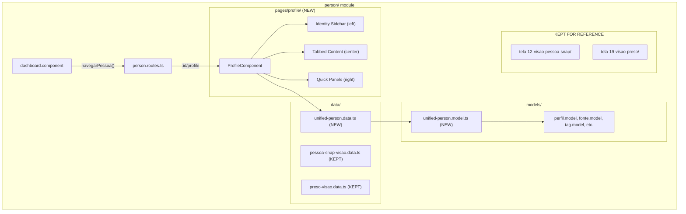
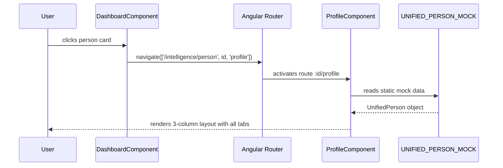
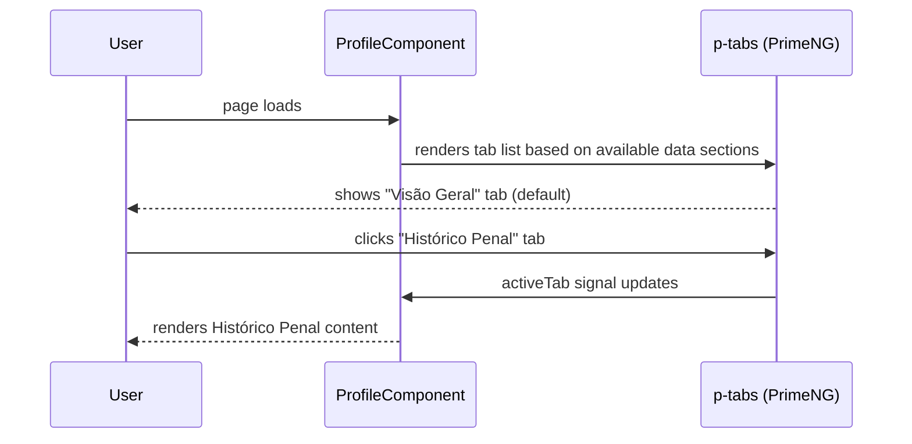

# Design Document: Person Profile Page

## Overview

The person module currently has two separate pages for viewing person data: **tela-12** (SNAP-enriched person view) and **tela-19** (SIPEN prison view with SNAP enrichment). These pages share significant structural overlap (identity sidebar, tabbed center, quick-access right sidebar) but use different data interfaces (`PessoaSnapVisao` vs `PresoVisaoMock`) and display different data sections.

This design creates a new **profile** page at `/intelligence/person/:id/profile` that coexists with the existing tela-12 and tela-19 pages (kept for reference). The unified page displays ALL data for a person regardless of their profile type (preso, alvo, visitante, etc.), using a single consolidated data interface and mock. The layout preserves the three-column structure both pages already use, with a superset of all tabs from both sources. Profile type determines display precedence and which sections are visually emphasized, but all sections remain accessible.

The existing pages (tela-12 and tela-19) and their routes are preserved as-is for reference during development. The old mock data files (`pessoa-snap-visao.data.ts`, `preso-visao.data.ts`) are also kept unchanged.

The change is frontend-only with static mock data. No backend, no services, no HTTP calls.

## Architecture



## Sequence Diagrams

### Navigation Flow



### Tab Rendering Flow



## Components and Interfaces

### Component: ProfileComponent

**Purpose**: Single page component that replaces both Tela12Component and Tela19Component. Renders the unified person profile with three-column layout.

```typescript
// pages/profile/profile.component.ts
@Component({
  selector: 'app-profile',
  standalone: true,
  changeDetection: ChangeDetectionStrategy.OnPush,
  templateUrl: './profile.component.html',
  styleUrl: './profile.component.scss',
  imports: [
    FormsModule,
    CardModule, ButtonModule, TagModule, TableModule,
    TabsModule, AvatarModule, TooltipModule, SkeletonModule,
    ImageModule, AccordionModule, BreadcrumbModule,
    TitleCasePipe, CurrencyPipe,
  ],
})
export class ProfileComponent {
  private readonly router = inject(Router);
  private readonly location = inject(Location);
  private readonly route = inject(ActivatedRoute);

  protected readonly personId = toSignal(
    this.route.paramMap.pipe(map(p => p.get('id') ?? ''))
  );

  protected readonly person: UnifiedPerson = UNIFIED_PERSON_MOCK;
  protected readonly activeTab = signal<number>(0);
  protected readonly timelinePage = signal<number>(0);
  protected readonly timelinePageSize = 5;
  protected readonly isLoading = signal<boolean>(false);

  // Computed: highest-priority active profile
  protected readonly primaryProfile = computed(() =>
    resolvePrimaryProfile(this.person.profiles)
  );

  // Computed: whether person has prison data
  protected readonly hasCustodyData = computed(() =>
    this.person.custody !== undefined
  );

  protected voltar(): void { this.location.back(); }

  protected formatDate(iso: string): string { /* same as tela-19 */ }
  protected tagStyle(tag: TagInfo): Record<string, string> { /* same as tela-19 */ }
}
```

**Responsibilities**:
- Read `:id` from route params
- Load unified person mock data
- Compute primary profile type for display precedence
- Manage active tab state via signal
- Manage timeline pagination for penal history
- Provide template helper methods (formatDate, tagStyle, etc.)

## Data Models

### Model: UnifiedPerson

The unified interface is a superset of both `PessoaSnapVisao` and `PresoVisaoMock`. It uses a flat structure with optional sections — sections are `undefined` when data is not available for that person type.

```typescript
// models/unified-person.model.ts

import { TipoPerfil } from './perfil.model';

/** Profile type with display precedence (lower index = higher priority) */
export const PROFILE_PRECEDENCE: TipoPerfil[] = [
  'alvo', 'preso', 'ex-preso', 'advogado', 'visitante', 'familiar', 'servidor'
];

export interface UnifiedPerson {
  // ── Core Identity ──────────────────────────────────────────────
  id: string;  // UUID v4 (e.g., 'a1b2c3d4-e5f6-7890-abcd-ef1234567890')
  name: string;
  aliases: string[];
  cpf: string;
  rg?: string;
  photoUrl?: string;
  birthDate: string;
  age: number;
  sex: string;
  father?: string;
  mother?: string;
  birthPlace?: string;
  nationality?: string;
  maritalStatus?: string;
  profession?: string;
  education?: string;
  religion?: string;
  ethnicity?: string;
  language?: string;
  cpfStatus?: string;

  // ── Classification ─────────────────────────────────────────────
  profiles: ProfileInfo[];
  tags: TagInfo[];
  riskLevel: 'critico' | 'alto' | 'medio' | 'baixo';
  monitoring: MonitoringInfo;

  // ── Custody (SIPEN — optional, present for preso/ex-preso) ────
  custody?: CustodyInfo;

  // ── Penal History (SIPEN — optional) ───────────────────────────
  penalHistory?: PenalHistoryInfo;

  // ── Legal Record (SIPEN — optional) ────────────────────────────
  legalRecord?: LegalRecordInfo;

  // ── Visitors & Communications (SIPEN — optional) ───────────────
  visitors?: VisitorsInfo;

  // ── Lawyers ────────────────────────────────────────────────────
  lawyers: LawyerInfo[];
  legalAppointments: LegalAppointmentInfo[];

  // ── Images (SIPEN — optional) ──────────────────────────────────
  images?: ImagesInfo;

  // ── Movements (SIPEN — optional) ───────────────────────────────
  movements?: MovementsInfo;

  // ── Contacts (SNAP) ────────────────────────────────────────────
  contacts: ContactsInfo;

  // ── Links / Relationships (SNAP) ───────────────────────────────
  relatedPersons: RelatedPersonInfo[];
  companies: CompanyInfo[];

  // ── Legal Processes (SNAP + SIPEN) ─────────────────────────────
  judicialProcesses: JudicialProcessInfo[];
  escavadorProcesses: EscavadorProcessInfo[];
  seeuProcesses: SeeuProcessInfo[];

  // ── Warrants (SNAP) ────────────────────────────────────────────
  warrants: WarrantInfo[];

  // ── Official Journals (SNAP) ───────────────────────────────────
  officialJournals: OfficialJournalInfo[];
  queridoDiarioJournals: QueridoDiarioInfo[];

  // ── Digital Profiles (SNAP) ────────────────────────────────────
  digitalProfiles: DigitalProfileInfo[];

  // ── Electoral Data (SNAP) ──────────────────────────────────────
  electoral: ElectoralInfo;

  // ── Transparency (SNAP) ────────────────────────────────────────
  publicServants: PublicServantInfo[];
  publicExpenses: PublicExpenseInfo[];

  // ── Occurrences (SIPEN — optional) ─────────────────────────────
  occurrences?: OccurrencesInfo;

  // ── Labor & Education (SIPEN — optional) ───────────────────────
  activities?: ActivitiesInfo;

  // ── Contextual Alert ───────────────────────────────────────────
  contextualAlert?: string;

  // ── Metadata ───────────────────────────────────────────────────
  lastEnrichmentDate?: string;
  availableSources: string[];
}
```

**Sub-interfaces** (each maps to a section of the page):

```typescript
export interface ProfileInfo {
  type: TipoPerfil;
  active: boolean;
  startDate: string;
  endDate?: string;
}

export interface TagInfo {
  label: string;
  category: string;
  color?: string;
}

export interface MonitoringInfo {
  monitored: boolean;
  target: boolean;
  startDate?: string;
  sector?: string;
  criticality?: 'critica' | 'alta' | 'media' | 'baixa';
}

export interface CustodyInfo {
  prisonStatus: string;
  securityClassification: string;
  dangerLevel: 'critico' | 'alto' | 'medio' | 'baixo';
  crime: string;
  article: string;
  regime: string;
  unit: string;
  pavilion?: string;
  gallery?: string;
  cell?: string;
  lastUpdateDate: string;
  faction?: string;
  factionRole?: string;
  sipenRegistration: string;
  sipenCode: string;
  pic: string;
  rji: string;
  dossierSipen: string;
  processDpj: string;
  environment: string;
  systemEntry: string;
  origin: string;
}

export interface PenalHistoryInfo {
  events: PenalEvent[];
  behaviorIndex: BehaviorIndex[];
  privileges: PrivilegeInfo[];
  benefits: BenefitInfo[];
  sentenceReduction: SentenceReductionInfo[];
}

export interface PenalEvent {
  type: string;
  title: string;
  description: string;
  date: string;
  status?: string;
}

export interface BehaviorIndex {
  referenceDate: string;
  index: string;
  observation?: string;
}

export interface PrivilegeInfo {
  date: string;
  type: string;
  status: string;
}

export interface BenefitInfo {
  date: string;
  type: string;
  status: string;
}

export interface SentenceReductionInfo {
  date: string;
  criterion: string;
  amount: string;
  status: string;
}

export interface LegalRecordInfo {
  sentenceCalculation: SentenceCalculation;
  benefitDates: BenefitDates;
  processes: SipenProcess[];
  legalOccurrences: LegalOccurrence[];
  vep: VepInfo;
}

export interface SentenceCalculation {
  arrestDate: string;
  seapEntry: string;
  sentenceEnd: string;
  totalSentence: string;
  timeServed: string;
  timeRemaining: string;
  daysWorked: string;
}

export interface BenefitDates {
  oneSixth: string;
  oneQuarter: string;
  oneThird: string;
  oneHalf: string;
  twoThirds: string;
}

export interface SipenProcess {
  number: string;
  court: string;
  status: string;
  crimeDate: string;
  sentences: { date: string; crime: string; conviction: string; penalty: string }[];
  charges: { article: string; description: string }[];
}

export interface LegalOccurrence {
  process: string;
  date: string;
  description: string;
  type: string;
  result: string;
}

export interface VepInfo {
  lastCalculationDate: string;
  sentence: string;
  process: string;
  charges: string;
}

export interface VisitorsInfo {
  familyVisitors: FamilyVisitor[];
  religiousVisitors: ReligiousVisitor[];
  consularAgents: ConsularAgent[];
  intimateVisits: IntimateVisit[];
}

export interface FamilyVisitor {
  rg: string;
  name: string;
  photoUrl?: string;
  qualification: string;
  cardStatus: string;
  criminalAnalysis?: string;
  prohibited: boolean;
}

export interface ReligiousVisitor {
  name: string;
  institution: string;
  status: string;
}

export interface ConsularAgent {
  name: string;
  country: string;
  status: string;
}

export interface IntimateVisit {
  date: string;
  status: string;
}

export interface LawyerInfo {
  name: string;
  oab: string;
  sectionState: string;
  status: string;
  clientCount: number;
  recurring: boolean;
}

export interface LegalAppointmentInfo {
  date: string;
  lawyer: string;
  type: string;
}

export interface ImagesInfo {
  photos: { url: string; type: string; date: string }[];
  distinguishingMarks: {
    slot: string;
    description: string;
    location: string;
    url: string;
  }[];
  civilDocumentation: { type: string; description: string; url?: string }[];
}

export interface MovementsInfo {
  transfers: TransferInfo[];
  locationHistory: LocationHistoryInfo[];
}

export interface TransferInfo {
  occurrence: string;
  event: string;
  eventDate: string;
  unit: string;
  destination?: string;
  conclusion: string;
}

export interface LocationHistoryInfo {
  startDate: string;
  endDate?: string;
  unit: string;
  pavilion?: string;
  gallery?: string;
  cell?: string;
}

export interface ContactsInfo {
  phones: { number: string; countryCode?: string; type: string }[];
  emails: { address: string; type: string; provider?: string }[];
  addresses: {
    street: string;
    number: string;
    city: string;
    state: string;
    zipCode: string;
    country?: string;
  }[];
}

export interface RelatedPersonInfo {
  name: string;
  relationship: string;
  classification: string;
}

export interface CompanyInfo {
  name: string;
  cnpj: string;
  status: string;
  cnae?: string;
  role?: string;
  currentRole?: string;
  startDate?: string;
  endDate?: string;
  partners: { name: string; cpf: string; qualification: string }[];
}

export interface JudicialProcessInfo {
  number: string;
  court: string;
  instance: string;
  date: string;
  lawyers: { name: string; oab: string }[];
}

export interface EscavadorProcessInfo {
  number: string;
  referralDate: string;
  filingDate: string;
  court: string;
  instance: string;
  parties: string[];
  lawyers: string[];
}

export interface SeeuProcessInfo {
  number: string;
  district: string;
  jurisdiction: string;
  filingDate: string;
  court: string;
  sentenceDate: string;
  judge: string;
  subjects: string;
}

export interface WarrantInfo {
  number: string;
  validityDate: string;
  biometrics?: string;
  issuingCourt?: string;
  arrestType: string;
  charges: string;
  penalty: string;
  regime: string;
}

export interface OfficialJournalInfo {
  date: string;
  location: string;
  description: string;
  link: string;
}

export interface QueridoDiarioInfo {
  date: string;
  location: string;
  link: string;
  state: string;
  extraEdition: boolean;
  phrases: string[];
}

export interface DigitalProfileInfo {
  platform: string;
  url: string;
  alias: string;
  profileId?: string;
}

export interface ElectoralInfo {
  donations: { candidate: string; amount: string; date: string; party: string }[];
  affiliations: {
    party: string;
    state: string;
    status: string;
    registrationDate: string;
    type?: string;
    cancellationDate?: string;
    cancellationReason?: string;
  }[];
  candidacies: {
    electionYear: string;
    electionType: string;
    description: string;
    electoralUnit: string;
    round: string;
    position: string;
    candidateNumber: string;
    party: string;
  }[];
  electoralLinks: {
    amount: string;
    description: string;
    date: string;
    type: string;
    label: string;
  }[];
}

export interface PublicServantInfo {
  source: string;
  institution: string;
  registration?: string;
  department: string;
  serviceTime?: string;
  career?: string;
  municipality?: string;
  functionalGroup?: string;
  employmentType?: string;
}

export interface PublicExpenseInfo {
  source: string;
  date: string;
  creditor?: string;
  commitmentNumber?: string;
  fundingSource?: string;
  classification?: string;
  amount?: number;
  departmentName?: string;
}

export interface OccurrencesInfo {
  serviceOrders: ServiceOrder[];
  occurrenceRecords: OccurrenceRecord[];
}

export interface ServiceOrder {
  number: string;
  date: string;
  type: string;
  purpose: string;
  status: string;
}

export interface OccurrenceRecord {
  date: string;
  description: string;
  responsible: string;
  sector: string;
}

export interface ActivitiesInfo {
  labor: LaborActivity[];
  educational: EducationalActivity[];
}

export interface LaborActivity {
  startDate: string;
  endDate?: string;
  description: string;
  program: string;
  status: string;
}

export interface EducationalActivity {
  startDate: string;
  endDate?: string;
  course: string;
  status: string;
}
```

**Validation Rules**:
- `id` is required and non-empty
- `name` is required and non-empty
- `cpf` is required (format: `###.###.###-##`)
- `profiles` must have at least one entry
- `riskLevel` must be one of the four allowed values
- Optional sections (`custody`, `penalHistory`, `legalRecord`, `visitors`, `images`, `movements`, `occurrences`, `activities`) are `undefined` when the person does not have that data source

## Key Functions with Formal Specifications

### Function: resolvePrimaryProfile()

```typescript
function resolvePrimaryProfile(profiles: ProfileInfo[]): TipoPerfil | undefined
```

**Preconditions:**
- `profiles` is a non-empty array
- Each profile has a valid `type` from `TipoPerfil`

**Postconditions:**
- Returns the `type` of the active profile with the highest precedence according to `PROFILE_PRECEDENCE`
- If no active profile exists, returns the highest-precedence type regardless of active status
- If `profiles` is empty, returns `undefined`

**Implementation:**

```typescript
export function resolvePrimaryProfile(profiles: ProfileInfo[]): TipoPerfil | undefined {
  if (profiles.length === 0) return undefined;

  const active = profiles.filter(p => p.active);
  const candidates = active.length > 0 ? active : profiles;

  let best: TipoPerfil | undefined;
  let bestIndex = Infinity;

  for (const p of candidates) {
    const idx = PROFILE_PRECEDENCE.indexOf(p.type);
    if (idx !== -1 && idx < bestIndex) {
      bestIndex = idx;
      best = p.type;
    }
  }

  return best ?? candidates[0]?.type;
}
```

### Function: mergePersonData() (build-time mock merge strategy)

```typescript
function mergePersonData(
  snap: PessoaSnapVisao,
  preso: PresoVisaoMock
): UnifiedPerson
```

**Preconditions:**
- Both inputs are valid, non-null mock objects
- This is a conceptual function — the actual merge is done manually in the static mock file

**Postconditions:**
- Identity fields (name, CPF, birthDate, RG) come from `preso` (SIPEN takes precedence)
- All SNAP-only data (electoral, transparency, escavador processes, querido diário) is preserved from `snap`
- All SIPEN-only data (custody, penal history, legal record, visitors, images, movements, occurrences, activities) is preserved from `preso`
- Overlapping data (contacts, companies, warrants, judicial processes, journals, digital profiles) is combined from both sources
- No data is lost from either source
- All person IDs use UUID v4 format

**Mock Data Strategy:**

The `unified-person.data.ts` file exports three mock constants:

1. **`UNIFIED_PERSON_MOCK`** — The primary merged person (Maurício Nascimento + Carlos Eduardo Fonseca data). SIPEN identity fields take precedence. Has all SIPEN + SNAP data. UUID: random v4.

2. **`SNAP_ONLY_PERSON_MOCK`** — Carlos Eduardo Fonseca as a standalone SNAP-only person (no custody/SIPEN data). UUID: random v4. Used by tela-12 reference page and appears in the dashboard monitored list.

3. **`SIPEN_ONLY_PERSON_MOCK`** — João Carlos Pires Ribeiro da Silva, a SIPEN-only preso with the same SIPEN data structure as Maurício (custody, penal history, legal record, visitors, etc.) but different identity (name, CPF, RG). UUID: random v4. Appears in the dashboard monitored list.

All three persons appear in the dashboard monitored list. The dashboard `navegarPessoa()` method navigates to `/intelligence/person/:uuid/profile` for all of them.

**Profile Array Consistency:**

All person mock data files must include a `perfis: Perfil[]` array using the existing `Perfil` interface from `perfil.model.ts`. This ensures consistent profile identification across the dashboard list, the profile page, and the reference pages (tela-12, tela-19). The `perfis` array determines the primary profile via `resolvePrimaryProfile()` and the profile tag displayed on person cards.

- `PESSOA_SNAP_MOCK` (tela-12): add `perfis` with at least one entry (e.g., `alvo` active)
- `MOCK_PRESO_VISAO` (tela-19): add `perfis` with at least one entry (e.g., `preso` active)
- `UNIFIED_PERSON_MOCK`: `profiles` array merges profiles from both sources
- `SNAP_ONLY_PERSON_MOCK`: `profiles` mirrors `PESSOA_SNAP_MOCK`
- `SIPEN_ONLY_PERSON_MOCK`: `profiles` mirrors `MOCK_PRESO_VISAO`

**Merge Precedence Rules:**

| Field Category | Source Priority | Strategy |
|---|---|---|
| Name, CPF, birth date, RG, sex | SIPEN (preso) | Override |
| Photo URL | SIPEN if available, else SNAP | Fallback |
| Aliases/vulgos | Union of both | Combine |
| Tags | Union of both | Combine |
| Contacts (phones, emails, addresses) | Union of both | Combine, deduplicate by key |
| Related persons | Union of both | Combine |
| Companies | Union of both | Combine, deduplicate by CNPJ |
| Warrants | Union of both | Combine, deduplicate by number |
| Judicial processes | Union of both | Combine, deduplicate by number |
| Official journals | Union of both | Combine |
| Digital profiles | Union of both | Combine |
| Electoral data | SNAP only | Copy |
| Transparency data | SNAP only | Copy |
| Custody, penal, legal, visitors, images, movements, occurrences, activities | SIPEN only | Copy |

## Algorithmic Pseudocode

### Tab Visibility Algorithm

The profile page shows ALL tabs, but some tabs only render content when the corresponding data section exists. This keeps the page structure consistent regardless of person type.

```typescript
// Tab configuration — static, all tabs always present
const PROFILE_TABS = [
  { index: 0,  label: 'Visão Geral',           alwaysVisible: true },
  { index: 1,  label: 'Histórico Penal',       requiresSection: 'penalHistory' },
  { index: 2,  label: 'Prontuário Jurídico',   requiresSection: 'legalRecord' },
  { index: 3,  label: 'Visitas e Comunicações', requiresSection: 'visitors' },
  { index: 4,  label: 'Imagens',               requiresSection: 'images' },
  { index: 5,  label: 'Movimentação',          requiresSection: 'movements' },
  { index: 6,  label: 'Contatos',              alwaysVisible: true },
  { index: 7,  label: 'Vínculos',              alwaysVisible: true },
  { index: 8,  label: 'Processos Judiciais',   alwaysVisible: true },
  { index: 9,  label: 'Mandados (BNMP)',       alwaysVisible: true },
  { index: 10, label: 'Diários Oficiais',      alwaysVisible: true },
  { index: 11, label: 'Perfis Digitais',       alwaysVisible: true },
  { index: 12, label: 'Dados Eleitorais',      alwaysVisible: true },
  { index: 13, label: 'Transparência',         alwaysVisible: true },
  { index: 14, label: 'Ocorrências',           requiresSection: 'occurrences' },
  { index: 15, label: 'Atividades',            requiresSection: 'activities' },
] as const;

// Computed visible tabs
function getVisibleTabs(person: UnifiedPerson): typeof PROFILE_TABS[number][] {
  return PROFILE_TABS.filter(tab => {
    if (tab.alwaysVisible) return true;
    return person[tab.requiresSection] !== undefined;
  });
}
```

**Preconditions:**
- `person` is a valid `UnifiedPerson` object

**Postconditions:**
- Returns only tabs whose data section exists on the person
- Tab order is preserved
- At minimum, all `alwaysVisible` tabs are returned

## Example Usage

### Route Configuration (after migration)

```typescript
// person.routes.ts
export const personRoutes: Routes = [
  { path: '', redirectTo: 'dashboard', pathMatch: 'full' },
  {
    path: 'dashboard',
    loadComponent: () =>
      import('./pages/dashboard/dashboard.component').then(m => m.DashboardComponent),
  },
  {
    path: 'pessoas/cadastro',
    loadComponent: () =>
      import('./pages/cadastro-integracao/cadastro-integracao.component').then(
        m => m.CadastroIntegracaoComponent,
      ),
  },
  // NEW: unified profile page
  {
    path: ':id/profile',
    loadComponent: () =>
      import('./pages/profile/profile.component').then(m => m.ProfileComponent),
  },
  // KEPT FOR REFERENCE:
  {
    path: 'pessoas/:id',
    loadComponent: () =>
      import('./pages/tela-12-visao-pessoa-snap/tela-12.component').then(m => m.Tela12Component),
  },
  {
    path: 'pessoas/:id/perfil/preso',
    loadComponent: () =>
      import('./pages/tela-19-visao-preso/tela-19.component').then(m => m.Tela19Component),
  },
];
```

### Dashboard Navigation (after migration)

```typescript
// dashboard.component.ts — updated method
protected navegarPessoa(pessoaId: string): void {
  this.router.navigate(['/intelligence/person', pessoaId, 'profile']);
}
```

### Template Usage — Left Sidebar Identity Card

```html
<aside class="coluna-identidade">
  <div class="cartao-identidade">
    @if (person.photoUrl) {
      <div class="cartao-foto" [style.background-image]="'url(' + person.photoUrl + ')'"></div>
    } @else {
      <div class="cartao-foto cartao-foto-placeholder">
        <span class="cartao-foto-inicial">{{ person.name.charAt(0) }}</span>
      </div>
    }
    <h2 class="cartao-nome">{{ person.name }}</h2>
    @if (person.aliases.length) {
      <span class="cartao-vulgo">"{{ person.aliases[0] }}"</span>
    }
    <div class="cartao-dados">
      <div class="cartao-campo"><span class="cartao-label">CPF</span><span class="cartao-valor">{{ person.cpf }}</span></div>
      @if (person.rg) {
        <div class="cartao-campo"><span class="cartao-label">RG</span><span class="cartao-valor">{{ person.rg }}</span></div>
      }
      @if (person.custody) {
        <div class="cartao-campo"><span class="cartao-label">Matrícula</span><span class="cartao-valor">{{ person.custody.sipenRegistration }}</span></div>
      }
    </div>
    <!-- Profile tags -->
    <div class="cartao-tags">
      @for (t of person.tags; track t.label) {
        <p-tag [value]="t.label" [rounded]="true" severity="secondary" [style]="tagStyle(t)" />
      }
    </div>
    <!-- Custody status (only if preso) -->
    @if (person.custody) {
      <div class="cartao-divider"></div>
      <div class="cartao-status">
        <span class="status-label">{{ person.custody.prisonStatus }}</span>
        <span class="status-seg">{{ person.custody.securityClassification }}</span>
      </div>
    }
    <!-- Risk level -->
    <div class="cartao-risco">
      <span [class]="'risco-dot risco-' + person.riskLevel"></span>
      <span class="risco-texto">Periculosidade {{ person.riskLevel }}</span>
    </div>
    <!-- Monitoring badges -->
    <div class="cartao-monitoramento">
      @if (person.monitoring.monitored) { <p-tag value="Monitorado" [rounded]="true" severity="info" /> }
      @if (person.monitoring.target) { <p-tag value="Alvo" [rounded]="true" severity="danger" /> }
    </div>
  </div>
</aside>
```

## Correctness Properties

*A property is a characteristic or behavior that should hold true across all valid executions of a system — essentially, a formal statement about what the system should do. Properties serve as the bridge between human-readable specifications and machine-verifiable correctness guarantees.*

### Property 1: UnifiedPerson core field invariants

*For any* valid `UnifiedPerson` object, the `id` field SHALL be a non-empty string matching UUID v4 format, `name` SHALL be non-empty, `cpf` SHALL be non-empty, `profiles` SHALL have at least one entry, and `riskLevel` SHALL be one of `critico`, `alto`, `medio`, `baixo`.

**Validates: Requirements 1.4, 1.5**

### Property 2: resolvePrimaryProfile returns highest-precedence active profile

*For any* non-empty array of `ProfileInfo` objects containing at least one active profile, `resolvePrimaryProfile` SHALL return the `type` of the active profile with the lowest index in the `PROFILE_PRECEDENCE` list (alvo=0, preso=1, ex-preso=2, advogado=3, visitante=4, familiar=5, servidor=6).

**Validates: Requirements 2.1, 2.2**

### Property 3: resolvePrimaryProfile fallback when no active profiles

*For any* non-empty array of `ProfileInfo` objects where all profiles have `active = false`, `resolvePrimaryProfile` SHALL return the `type` of the profile with the lowest index in the `PROFILE_PRECEDENCE` list, ignoring active status.

**Validates: Requirement 2.3**

### Property 4: Tab visibility is determined by custody data presence

*For any* `UnifiedPerson` object, `getVisibleTabs` SHALL always include the 9 SNAP tabs (Visão Geral, Contatos, Vínculos, Processos Judiciais, Mandados (BNMP), Diários Oficiais, Perfis Digitais, Dados Eleitorais, Transparência). Additionally, the 7 SIPEN tabs (Histórico Penal, Prontuário Jurídico, Visitas e Comunicações, Imagens, Movimentação, Ocorrências, Atividades) SHALL be included if and only if `custody` is defined.

**Validates: Requirements 3.1, 3.2, 3.3**

### Property 5: Tab ordering is preserved after filtering

*For any* `UnifiedPerson` object, the tabs returned by `getVisibleTabs` SHALL be in strictly ascending order by their original index in the `PROFILE_TABS` configuration array.

**Validates: Requirement 3.4**

## Error Handling

### Error Scenario 1: Missing Route Parameter

**Condition**: `:id` parameter is missing or empty in the route
**Response**: `personId` signal resolves to empty string; component renders with mock data (since all data is static)
**Recovery**: In future (with real API), redirect to dashboard with error toast

### Error Scenario 2: Unknown Profile Type

**Condition**: A profile type not in `PROFILE_PRECEDENCE` is encountered
**Response**: `resolvePrimaryProfile()` falls back to the first profile in the array
**Recovery**: No crash; the page renders with a generic layout

### Error Scenario 3: Missing Optional Sections

**Condition**: Person has no custody data (e.g., a SNAP-only person)
**Response**: SIPEN-specific tabs are hidden via `getVisibleTabs()`. Left sidebar omits custody-specific fields.
**Recovery**: Graceful degradation — the page still renders all available data

## Testing Strategy

### Unit Testing Approach

- Test `resolvePrimaryProfile()` with various profile combinations
- Test `getVisibleTabs()` with persons that have/lack optional sections
- Test `formatDate()` with ISO and dd/mm/yyyy formats
- Test `tagStyle()` for criminal classification tags

### Property-Based Testing Approach

**Property Test Library**: fast-check

- For any array of `ProfileInfo`, `resolvePrimaryProfile` returns a value in `PROFILE_PRECEDENCE` or `undefined`
- For any `UnifiedPerson`, `getVisibleTabs` always includes all `alwaysVisible` tabs
- For any `UnifiedPerson` with `custody !== undefined`, `getVisibleTabs` includes all SIPEN tabs

### Integration Testing Approach

- Verify route `/intelligence/person/<uuid>/profile` loads `ProfileComponent`
- Verify old routes `pessoas/:id` and `pessoas/:id/perfil/preso` still load their respective components
- Verify dashboard `navegarPessoa()` navigates to the new profile route
- Verify all three mock persons appear in the dashboard monitored list

## Performance Considerations

- The page uses `ChangeDetectionStrategy.OnPush` and signals for minimal change detection cycles
- Tab content is rendered lazily via `p-tabpanel` — only the active tab's DOM is in the viewport
- The unified mock is a single static import — no runtime merge cost
- Timeline pagination limits DOM nodes for penal history (5 events per page)

## Security Considerations

- No sensitive data is transmitted over HTTP (all data is static/mocked)
- No user input is interpolated into queries or URLs
- Route parameters are read-only and used only for mock data lookup
- When real API integration is added, all person data endpoints must require authentication and authorization

## Dependencies

- Angular 21 (standalone components, signals, `toSignal`)
- PrimeNG 21: Tabs, Tag, Avatar, Button, Card, Skeleton, Tooltip, Image, Accordion, Breadcrumb, Table
- Angular Router (route params, navigation)
- Angular Common (Location, TitleCasePipe, CurrencyPipe)
- Existing models: `TipoPerfil` from `perfil.model.ts`, `TipoFonte` from `fonte.model.ts`

## Layout Structure

```
┌─────────────────────────────────────────────────────────────────────┐
│ Header: Back button │ "Perfil da Pessoa" │ Actions (Share, Edit)    │
├──────────┬──────────────────────────────────────┬───────────────────┤
│          │                                      │                   │
│  LEFT    │         CENTER (Tabs)                │    RIGHT          │
│  SIDEBAR │                                      │    SIDEBAR        │
│          │  ┌─────────────────────────────────┐  │                   │
│  Photo   │  │ Tab Bar (dynamic based on data) │  │  Visitantes      │
│  Name    │  ├─────────────────────────────────┤  │  Recentes        │
│  Aliases │  │                                 │  │                   │
│  CPF/RG  │  │  Active Tab Content             │  │  Advogados       │
│  Tags    │  │                                 │  │                   │
│  ──────  │  │  (scrollable)                   │  │  Vínculos        │
│  Status  │  │                                 │  │                   │
│  Risk    │  │                                 │  │  Alertas e       │
│  ──────  │  │                                 │  │  Monitoramento   │
│  Monitor │  │                                 │  │                   │
│  Buttons │  └─────────────────────────────────┘  │  Grafo btn       │
│  Alert   │                                      │                   │
│          │                                      │                   │
└──────────┴──────────────────────────────────────┴───────────────────┘
```

## Files to Create

| File | Purpose |
|---|---|
| `models/unified-person.model.ts` | Unified interface + sub-interfaces + `resolvePrimaryProfile()` + `PROFILE_PRECEDENCE` |
| `data/unified-person.data.ts` | Three mock constants: `UNIFIED_PERSON_MOCK` (merged), `SNAP_ONLY_PERSON_MOCK` (Carlos Eduardo), `SIPEN_ONLY_PERSON_MOCK` (João Carlos). All with UUID v4 IDs. |
| `pages/profile/profile.component.ts` | Main profile component |
| `pages/profile/profile.component.html` | Three-column template with all tabs |
| `pages/profile/profile.component.scss` | Styles (merge of tela-12 + tela-19 styles) |

## Files to Modify

| File | Change |
|---|---|
| `person.routes.ts` | Add `:id/profile` route (keep existing `pessoas/:id` and `pessoas/:id/perfil/preso` routes) |
| `pages/dashboard/dashboard.component.ts` | Update `navegarPessoa()` to navigate to `:id/profile`. Add three mock persons to monitored list (Maurício, Carlos Eduardo, João Carlos). |
| `data/pessoa-snap-visao.data.ts` | Add `perfis: Perfil[]` field to `PessoaSnapVisao` interface and populate `PESSOA_SNAP_MOCK` with appropriate profiles (e.g., `alvo` active) |
| `data/preso-visao.data.ts` | Add `perfis: Perfil[]` field to `PresoVisaoMock` interface and populate `MOCK_PRESO_VISAO` with appropriate profiles (e.g., `preso` active) |

## Files Kept (no changes)

| File | Reason |
|---|---|
| `pages/tela-12-visao-pessoa-snap/` (entire directory) | Kept for reference |
| `pages/tela-19-visao-preso/` (entire directory) | Kept for reference |
| `data/pessoa-snap-visao.data.ts` | Kept for reference (used by tela-12) |
| `data/preso-visao.data.ts` | Kept for reference (used by tela-19) |
