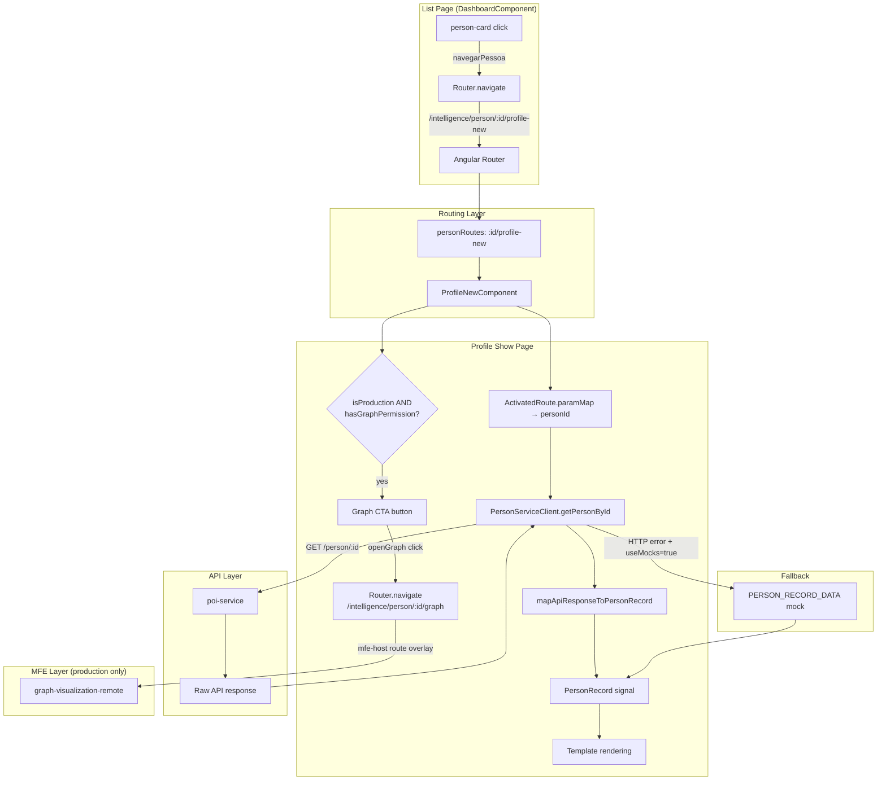
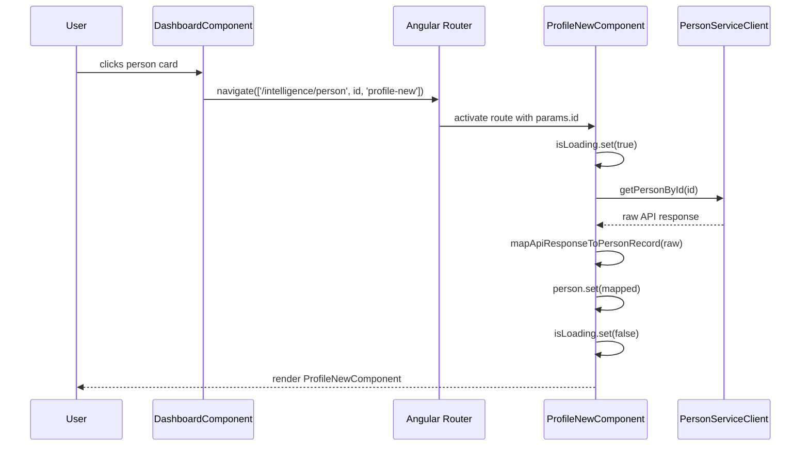
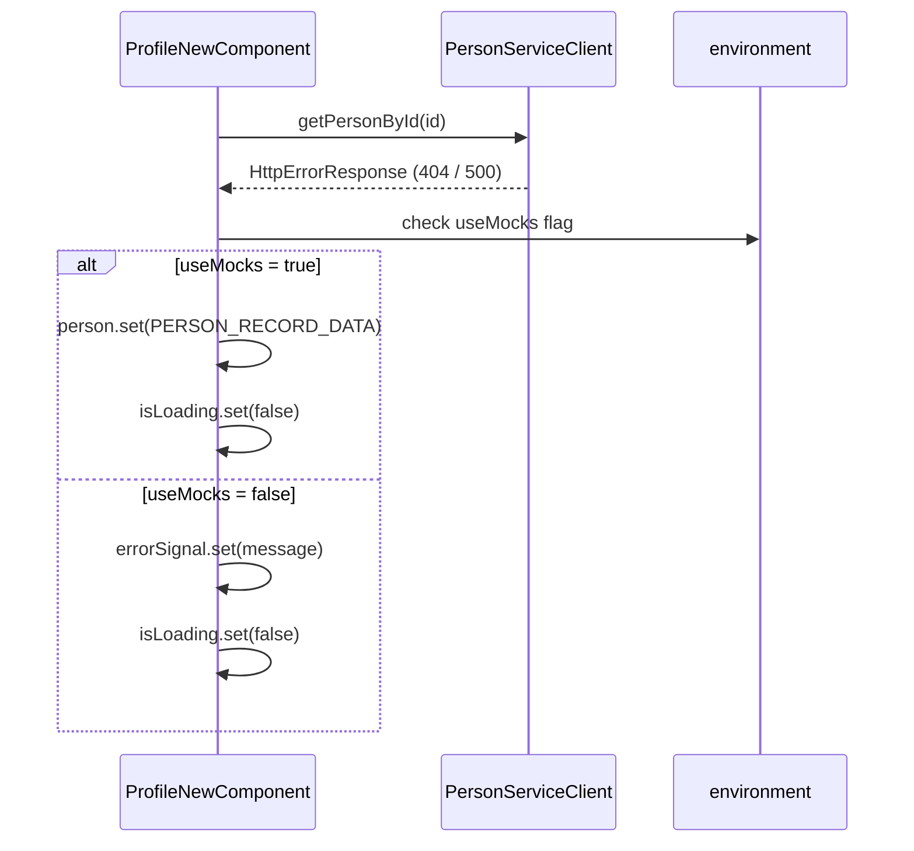

# Design Document: Person Profile UI Update

## Overview

This feature promotes `ProfileNewComponent` (introduced in commit `ec5530199adc49d1a8534d5b872deaa04498b1b7`) from a static preview to the canonical person profile show page. The work has three tightly coupled concerns:

1. **Route alignment** — the list page CTAs currently navigate to `/:id/profile` (the old `ProfileComponent`). They must be updated to navigate to `/:id/profile-new`, which maps to the route pattern `/intelligence/person/:person_id` already defined in the platform.

2. **Data contract wiring** — `ProfileNewComponent` currently renders a hardcoded `PERSON_RECORD_DATA` constant. It must be refactored to accept a dynamic `PersonRecord` built from the real API response via `PersonServiceClient.getPersonById()` and a new mapper (`profile-new-mapper.ts`).

3. **Mock/prototype cleanup** — all static data constants, prototype-era patterns, and the old `ProfileComponent` route entry must be removed or deprecated so the codebase has a single, live-data-backed profile show page.

---

## Architecture



---

## Sequence Diagrams

### CTA Navigation Flow (List → Profile)



### Error / Mock Fallback Flow



---

## Components and Interfaces

### Component 1: ProfileNewComponent (refactored)

**Purpose**: The canonical person profile show page. Replaces the static preview with a live-data-backed implementation.

**Current state**: Standalone component with `ChangeDetectionStrategy.OnPush`. Renders `PERSON_RECORD_DATA` (hardcoded constant). No route param reading, no API call.

**Target state**: Reads `:id` from `ActivatedRoute`, calls `PersonServiceClient.getPersonById()`, maps the response to `PersonRecord` via `mapApiResponseToPersonRecord()`, and renders the result reactively.

**Interface additions**:

```typescript
// New injections
private readonly route = inject(ActivatedRoute);
private readonly location = inject(Location);
private readonly personClient = inject(PersonServiceClient);
private readonly useMocks = environment.useMocks;

// New signals
readonly isLoading = signal<boolean>(true);
readonly errorSignal = signal<string | null>(null);
readonly httpStatus = signal<number | null>(null);
readonly person = signal<PersonRecord>(PERSON_RECORD_DATA); // replaces readonly person: PersonRecord

// New derived signal
readonly personId = toSignal(this.route.paramMap.pipe(map(p => p.get('id') ?? '')));
```

**Responsibilities**:
- Read `person_id` from route params
- Fetch person data from `PersonServiceClient`
- Map raw API response to `PersonRecord` via `mapApiResponseToPersonRecord()`
- Render loading skeleton, error state, and 404/403 states
- Preserve all existing UI interactions (scroll-spy, lightbox, drawer, tabs, map)

---

### Component 2: DashboardComponent (CTA update)

**Purpose**: The person list page. Contains all CTAs that navigate to the profile show page.

**Current state**: `navegarPessoa(pessoaId: string)` navigates to `['/intelligence/person', pessoaId, 'profile']`.

**Target state**: `navegarPessoa(pessoaId: string)` navigates to `['/intelligence/person', pessoaId, 'profile-new']`.

**Affected navigation points** (all in `dashboard.component.html`):
- Monitored tab cards: `(click)="navegarPessoa(m.id)"`
- Listing tab cards: `(click)="navegarPessoa(m.id)"`
- Search results tab cards: `(click)="navegarPessoa(m.id)"`
- Pending items navigation: `navegarPendencia(pendencia)` → `navegarPessoa(pendencia.pessoa.id)`

No template changes are needed — only the `navegarPessoa()` method body changes.

---

### Component 3: ProfileComponent (deprecated)

**Purpose**: The old profile show page. Will be kept in the codebase but its route entry will be removed from `person.routes.ts` to prevent accidental navigation.

**Action**: Remove the `{ path: ':id/profile', ... }` route entry. The component files themselves are preserved for reference.

---

### Component 4: Graph Visualization MFE Entrypoint

**Purpose**: A CTA button rendered inside `ProfileNewComponent` that navigates to the `graph-visualization-remote` federated module for the currently viewed person. Allows intelligence analysts to open the relationship graph without leaving the platform.

**Visibility conditions** (both must be true):
- `environment.production === true` — the `graph-visualization-remote` remote is loaded from CFMDS (MinIO artifact storage), which is only available in the production MFE environment. In local dev the remote is not served, so the button must be hidden to avoid a broken navigation.
- User has the `intelligence:graph-viewer` permission — as declared in the `graph-visualization-remote` route overlay contract.

**Route**: `/intelligence/person/:person_id/graph` — the canonical path registered in `mfe-host/src/shell/route-overlay.ts`. The `person_id` segment is extracted by `mfe-host` as a named route param and forwarded to the remote via `ShellContext.routeParams.person_id`. Path segments survive proxy rewrites and page reloads; query params do not.

**Why production-only**: `environment.production` (from `environment.prod.ts`) is the build-time boolean that signals the full MFE infrastructure is available. `environment.useMocks` is a separate flag for API mock fallback and must NOT be used as a proxy for this check.

**Handler**:

```typescript
protected openGraph(): void {
  const id = this.personId();
  if (id) {
    this.router.navigate(['/intelligence/person', id, 'graph']);
  }
}
```

**Template** (added to `profile-new.component.html`, inside the profile header action area, outside loading/error states):

```html
@if (isProduction && hasGraphPermission()) {
  <button
    pButton
    [label]="'person.profile.openGraph' | translate"
    icon="pi pi-share-alt"
    [outlined]="true"
    size="small"
    (click)="openGraph()"
    [disabled]="!personId()"
  ></button>
}
```

**Component additions** (`profile-new.component.ts`):

```typescript
// Build-time flag — read once at class level
protected readonly isProduction = environment.production;

// Permission signal — derived from PermissionService (same pattern as ProfileComponent)
protected readonly hasGraphPermission = this.permissionService.hasPermission('intelligence:graph-viewer');
```

**i18n**: Keys already exist in both locale files:
- `pt-BR.json`: `"person.profile.openGraph": "Ver Grafo de Vínculos"`
- `en.json`: `"person.profile.openGraph": "Open Relationship Graph"`

No new i18n keys need to be created.

**Route overlay**: The `graph-visualization-remote` entry is already registered in `mfe-host/src/shell/route-overlay.ts`. No changes to that file are required as part of this spec.

**Responsibilities**:
- Render the graph CTA button only when `environment.production === true` AND the user has `intelligence:graph-viewer` permission
- Navigate to `['/intelligence/person', personId, 'graph']` on activation
- Disable the button (not hide) when `personId` is empty or null
- Never render in loading, 404, or 403 states (those states suppress the entire profile content area)

---

## Data Models

### PersonRecord (existing — in `profile-new.component.ts`)

The `PersonRecord` interface is currently defined inline in `profile-new.component.ts`. It must remain there (no extraction needed for this feature) but the static constant `PERSON_RECORD_DATA` transitions from the primary data source to a mock fallback only.

```typescript
interface PersonRecord {
  id: string;
  photo: string;
  name: string;
  aliases: string[];
  cpf: string;
  rg: string;
  matriculaSipen: string;
  tags: PersonTag[];
  situation: Situation;
  monitoring: string[];
  criticalAlert: CriticalAlert;
  lastUpdateAlert: LastUpdateAlert;
  aiSummary: AiSummary;
  identification: SourcedField[];
  biography: SourcedField[];
  sipenCodes: SourcedField[];
  photos: PersonPhoto[];
  photosTotal: number;
  marks: PersonMark[];
  contacts: Contacts;
  addresses: Address[];
  sourceInfo: SourceInfo;
  documents: PersonDocument[];
  custody: Custody;
  legal: Legal;
  publicLife: PublicLife;
  relations: Relations;
}
```

### API Response → PersonRecord Mapping

The `poi-service` returns a `Record<string, unknown>` from `GET /person/:id`. The existing `mapPresoVisaoToUnifiedPerson()` maps this to `UnifiedPerson`. A new mapper `mapApiResponseToPersonRecord()` will map the same raw response directly to `PersonRecord` (the shape `ProfileNewComponent` consumes).

**Key field mappings** (raw API → PersonRecord):

| PersonRecord field | API source field(s) | Notes |
|---|---|---|
| `id` | `id` / `uuid` | |
| `photo` | `foto_url` / `fotoUrl` | Fallback to empty string |
| `name` | `nome` | |
| `aliases` | `vulgos` | Array |
| `cpf` | `cpf` | |
| `rg` | `rg` | |
| `matriculaSipen` | `matricula` / `prontuario_sipen` | |
| `tags` | `tagsRelevantes` | Map to `PersonTag[]` |
| `situation.status` | `situacao_prisional.status` / `custody.prisonStatus` | |
| `situation.unidade` | `situacao_prisional.unidade` / `custody.unit` | |
| `situation.regime` | `situacao_prisional.regime` / `custody.regime` | |
| `situation.localAtual` | `pavilhao` + `galeria` + `cela` | Concatenated |
| `situation.entradaSistema` | `data_entrada_sistema` / `custody.systemEntry` | |
| `situation.ultimaAtualizacao` | `data_ultima_atualizacao` | |
| `identification` | `nome`, `cpf`, `rg`, `sexo`, `nascimento`, `nacionalidade`, `naturalidade`, `estado_civil`, `etnia`, `religiao` | Each as `SourcedField` |
| `biography` | `mae`, `pai`, `escolaridade`, `profissao` | Each as `SourcedField` |
| `sipenCodes` | `prontuario_sipen`, `processo_dpj`, `ambiente`, `data_entrada`, `origem`, `pic` | Each as `SourcedField` |
| `contacts.phones` | `contatos.telefones` | |
| `contacts.emails` | `contatos.emails` | |
| `addresses` | `contatos.enderecos` | Map to `Address[]` |
| `custody.timeline` | `eventos` | Map `PenalEvent[]` to `CustodyTimelineEvent[]` |
| `custody.transfers` | `movimentacoes.transferencias` | |
| `custody.locationHistory` | `movimentacoes.historico_localizacao` | |
| `custody.incidents` | `ocorrencias` | |
| `legal.processes` | `condenacoes` + `processos_escavador` + `processos_seeu` | |
| `legal.warrants` | `mandados` | |
| `relations.items` | `vinculos` + `visitantes` + `advogados` | |
| `sourceInfo.sources` | `fontes[].tipo` | Deduplicated |
| `aiSummary` | Not available from API | Render empty/placeholder state |
| `documents` | Not available from API | Render empty state |
| `publicLife` | `informacoes_eleitorais`, `transparencia`, `perfis_digitais` | |

**Graceful degradation**: Fields not present in the API response must fall back to safe empty values (empty string, empty array, `null`) — never throw. The component template already handles optional rendering with `@if` blocks.

---

## Route Configuration

### Current state (`person.routes.ts`)

```typescript
{ path: ':id/profile', loadComponent: () => import('./pages/profile/profile.component') },
{ path: ':id/profile-new', component: ProfileNewComponent },  // eager, static preview
```

### Target state

```typescript
// :id/profile route REMOVED (ProfileComponent no longer reachable via routing)
{
  path: ':id/profile-new',
  loadComponent: () =>
    import('./pages/profile-new/profile-new.component').then(m => m.ProfileNewComponent),
},
```

**Rationale for lazy-loading**: The current eager import was a dev convenience for the static preview. With live data, lazy-loading is the correct pattern (consistent with all other routes in `person.routes.ts`).

**Route pattern alignment**: The full resolved URL for a person profile is `/intelligence/person/:person_id/profile-new`, which satisfies the platform's defined pattern `/intelligence/person/:person_id`.

---

## Algorithmic Pseudocode

### mapApiResponseToPersonRecord()

```pascal
FUNCTION mapApiResponseToPersonRecord(raw: Record<string, unknown>): PersonRecord
  INPUT: raw — raw API response from GET /person/:id
  OUTPUT: PersonRecord — fully mapped record for ProfileNewComponent

  PRECONDITIONS:
    - raw is a non-null object (may have missing fields)

  POSTCONDITIONS:
    - Returns a valid PersonRecord with no undefined fields
    - All missing API fields fall back to safe empty values
    - No exceptions thrown for missing optional fields

  BEGIN
    // Identity
    id ← g(raw, 'id') ?? g(raw, 'uuid') ?? ''
    photo ← g(raw, 'foto_url') ?? g(raw, 'fotoUrl') ?? ''
    name ← g(raw, 'nome') ?? ''
    aliases ← g(raw, 'vulgos') ?? []
    cpf ← g(raw, 'cpf') ?? ''
    rg ← g(raw, 'rg') ?? ''
    matriculaSipen ← g(raw, 'matricula') ?? g(raw, 'prontuario_sipen') ?? ''

    // Tags
    rawTags ← g(raw, 'tagsRelevantes') ?? []
    tags ← MAP rawTags TO PersonTag[]

    // Situation (custody)
    custody ← g(raw, 'situacao_prisional') ?? g(raw, 'custody') ?? {}
    situation ← buildSituation(custody, raw)

    // Identification fields
    identification ← buildIdentificationFields(raw)
    biography ← buildBiographyFields(raw)
    sipenCodes ← buildSipenCodeFields(raw)

    // Contacts & Addresses
    contatos ← g(raw, 'contatos') ?? {}
    contacts ← buildContacts(contatos)
    addresses ← buildAddresses(contatos)

    // Custody timeline
    eventos ← g(raw, 'eventos') ?? []
    transferencias ← g(raw, 'movimentacoes.transferencias') ?? []
    historico ← g(raw, 'movimentacoes.historico_localizacao') ?? []
    ocorrencias ← g(raw, 'ocorrencias') ?? []
    custodyData ← buildCustody(eventos, transferencias, historico, ocorrencias)

    // Legal
    condenacoes ← g(raw, 'condenacoes') ?? []
    mandados ← g(raw, 'mandados') ?? []
    legal ← buildLegal(condenacoes, mandados)

    // Relations
    vinculos ← g(raw, 'vinculos') ?? []
    visitantes ← g(raw, 'visitantes') ?? []
    advogados ← g(raw, 'advogados') ?? []
    relations ← buildRelations(vinculos, visitantes, advogados)

    // Public life
    eleitoral ← g(raw, 'informacoes_eleitorais') ?? {}
    transparencia ← g(raw, 'transparencia') ?? {}
    perfisDigitais ← g(raw, 'perfis_digitais') ?? []
    publicLife ← buildPublicLife(eleitoral, transparencia, perfisDigitais)

    // Source info
    fontes ← g(raw, 'fontes') ?? []
    sourceInfo ← buildSourceInfo(fontes, raw)

    // AI summary — not available from API, render placeholder
    aiSummary ← { paragraphs: [], sources: [] }

    // Documents — not available from API, render empty
    documents ← []

    // Photos & marks
    fotos ← g(raw, 'fotos') ?? []
    sinais ← g(raw, 'sinais_caracteristicos') ?? []
    photos ← MAP fotos TO PersonPhoto[]
    marks ← MAP sinais TO PersonMark[]

    // Critical alert — derive from contextual_alert field if present
    criticalAlert ← buildCriticalAlert(raw)
    lastUpdateAlert ← buildLastUpdateAlert(raw)

    RETURN PersonRecord {
      id, photo, name, aliases, cpf, rg, matriculaSipen,
      tags, situation, monitoring: [],
      criticalAlert, lastUpdateAlert, aiSummary,
      identification, biography, sipenCodes,
      photos, photosTotal: photos.length, marks,
      contacts, addresses, sourceInfo,
      documents, custody: custodyData, legal, publicLife, relations
    }
  END
```

### ProfileNewComponent.ngOnInit() — data loading

```pascal
PROCEDURE initDataLoading()
  INPUT: ActivatedRoute.paramMap
  OUTPUT: person signal updated

  PRECONDITIONS:
    - Component is initialized
    - ActivatedRoute is injected

  POSTCONDITIONS:
    - person signal contains live data or mock fallback
    - isLoading signal is false after resolution
    - errorSignal is set on non-recoverable errors

  BEGIN
    personFromApi ← toSignal(
      route.paramMap.pipe(
        map(p → p.get('id') ?? ''),
        tap(() → {
          isLoading.set(true)
          errorSignal.set(null)
          httpStatus.set(null)
        }),
        switchMap(id →
          IF id IS EMPTY THEN
            RETURN of(null).pipe(tap(() → isLoading.set(false)))
          END IF

          RETURN personClient.getPersonById(id).pipe(
            map(data → mapApiResponseToPersonRecord(data)),
            tap(() → isLoading.set(false)),
            catchError(err →
              status ← err.status ?? 0

              IF status = 404 THEN
                httpStatus.set(404)
                isLoading.set(false)
                RETURN of(null)
              END IF

              IF status = 403 THEN
                httpStatus.set(403)
                isLoading.set(false)
                RETURN of(null)
              END IF

              IF useMocks = true THEN
                isLoading.set(false)
                RETURN of(PERSON_RECORD_DATA)
              END IF

              errorSignal.set(err.message)
              isLoading.set(false)
              RETURN of(null)
            )
          )
        )
      ),
      { initialValue: null }
    )

    // Sync personFromApi signal to person signal via effect
    effect(() → {
      val ← personFromApi()
      IF val IS NOT NULL THEN
        person.set(val)
      END IF
    })
  END
```

---

## Key Functions with Formal Specifications

### navegarPessoa() — DashboardComponent

```typescript
protected navegarPessoa(pessoaId: string): void
```

**Preconditions:**
- `pessoaId` is a non-empty string (a valid person UUID from the API)

**Postconditions:**
- Router navigates to `['/intelligence/person', pessoaId, 'profile-new']`
- No side effects on component state

**Change from current**: Replace `'profile'` with `'profile-new'` in the route array.

---

### mapApiResponseToPersonRecord() — new mapper

```typescript
export function mapApiResponseToPersonRecord(raw: Record<string, unknown>): PersonRecord
```

**Preconditions:**
- `raw` is a non-null object (may have any subset of fields present)

**Postconditions:**
- Returns a `PersonRecord` with no `undefined` values in required fields
- All array fields default to `[]` when absent in `raw`
- All string fields default to `''` when absent in `raw`
- Does not mutate `raw`
- Does not throw for any missing field

**Loop invariants** (for array mapping loops):
- Each iteration produces exactly one output element per input element
- Output array length equals input array length

---

### ProfileNewComponent.voltar()

```typescript
protected voltar(): void
```

**Preconditions:**
- `Location` service is injected

**Postconditions:**
- Calls `this.location.back()` — navigates to the previous history entry
- No state mutation

---

## Error Handling

### Error Scenario 1: Person not found (404)

**Condition**: `PersonServiceClient.getPersonById(id)` returns HTTP 404  
**Response**: `httpStatus.set(404)`, `isLoading.set(false)`, `person` signal remains at initial value  
**Recovery**: Template renders a "Pessoa não encontrada" empty state with a back button  

### Error Scenario 2: Access denied (403)

**Condition**: `PersonServiceClient.getPersonById(id)` returns HTTP 403  
**Response**: `httpStatus.set(403)`, `isLoading.set(false)`  
**Recovery**: Template renders an "Acesso negado" state  

### Error Scenario 3: Generic API failure

**Condition**: Any other HTTP error or network failure  
**Response**:
- If `environment.useMocks = true`: fall back to `PERSON_RECORD_DATA`, render normally
- If `environment.useMocks = false`: `errorSignal.set(message)`, render error banner with retry  

### Error Scenario 4: Missing route param

**Condition**: Component activated without `:id` param (should not happen given route config)  
**Response**: `personId` resolves to `''`, API call is skipped, `isLoading.set(false)`, render empty state  

### Error Scenario 5: Mapper receives unexpected API shape

**Condition**: API returns a response with unexpected field names or types  
**Response**: `mapApiResponseToPersonRecord()` uses safe fallbacks (`?? ''`, `?? []`) — no throw, graceful degradation  

---

## Testing Strategy

### Unit Testing Approach

Test the new mapper function `mapApiResponseToPersonRecord()` in isolation:

- **Happy path**: Full API response → all `PersonRecord` fields populated correctly
- **Partial response**: API response with only `id` and `nome` → all other fields default to safe empty values
- **Null/undefined fields**: Individual fields set to `null` or `undefined` → fallback values used
- **Type coercion**: Numeric fields as strings, boolean fields as integers → handled gracefully

Test `navegarPessoa()` in `DashboardComponent`:
- Verify navigation target is `['/intelligence/person', id, 'profile-new']`

### Property-Based Testing Approach

**Property Test Library**: `fast-check`

**Property 1**: For any raw API object, `mapApiResponseToPersonRecord()` never throws and always returns a `PersonRecord` with no `undefined` required fields.

```typescript
fc.property(
  fc.record({ id: fc.string(), nome: fc.string() }, { withDeletedKeys: true }),
  (raw) => {
    const result = mapApiResponseToPersonRecord(raw as Record<string, unknown>);
    expect(result.id).toBeDefined();
    expect(result.name).toBeDefined();
    expect(Array.isArray(result.aliases)).toBe(true);
    expect(Array.isArray(result.tags)).toBe(true);
  }
)
```

**Property 2**: `mapApiResponseToPersonRecord()` is a pure function — calling it twice with the same input produces identical output.

```typescript
fc.property(
  fc.record({ id: fc.string(), nome: fc.string() }),
  (raw) => {
    const r1 = mapApiResponseToPersonRecord(raw as Record<string, unknown>);
    const r2 = mapApiResponseToPersonRecord(raw as Record<string, unknown>);
    expect(r1).toEqual(r2);
  }
)
```

### Integration Testing Approach

- Verify that clicking a person card in `DashboardComponent` navigates to `/intelligence/person/:id/profile-new`
- Verify that `ProfileNewComponent` renders the person name from the API response (not the hardcoded mock name) when `useMocks = false`
- Verify that `ProfileNewComponent` renders the mock fallback when the API returns a 500 and `useMocks = true`

---

## Performance Considerations

- `ProfileNewComponent` uses `ChangeDetectionStrategy.OnPush` — no change needed
- The `person` signal is updated once per navigation; all computed signals (`filteredRelations`, `groupedRelations`, `visiblePhotos`) derive from it reactively
- The Leaflet map (`AfterViewInit`) must be initialized only after `isLoading()` becomes `false` to avoid rendering against an empty address list
- The `toSignal()` + `switchMap()` pattern automatically cancels in-flight requests on re-navigation (no manual unsubscribe needed)

---

## Security Considerations

- `PersonServiceClient.getPersonById()` uses the existing `HttpClient` with the auth interceptor already in place — no new auth logic needed
- The `person_id` route param is passed directly to the API URL. The `HttpClient` handles URL encoding; no additional sanitization is required
- PII fields (CPF, RG, addresses, contacts) are rendered read-only — no user input is accepted on this page
- The `useMocks` flag is read from `environment.ts` (build-time constant) — it cannot be toggled at runtime

---

## Dependencies

| Dependency | Already present | Notes |
|---|---|---|
| `@angular/router` (ActivatedRoute, Router) | ✅ | Used by ProfileComponent — same pattern |
| `@angular/common` (Location) | ✅ | Used by ProfileComponent |
| `PersonServiceClient` | ✅ | Used by ProfileComponent |
| `environment.useMocks` | ✅ | Used by ProfileComponent |
| `toSignal` from `@angular/core/rxjs-interop` | ✅ | Used by ProfileComponent |
| `fast-check` | ✅ | Already in devDependencies (used by registration flow tests) |
| Leaflet (`leaflet`) | ✅ | Added in commit ec55301 |

No new dependencies are required.

---

## Files Affected

| File | Change type | Description |
|---|---|---|
| `pages/profile-new/profile-new.component.ts` | Modify | Add route param reading, API call, signal-based person data, loading/error states; add `openGraph()` handler, `isProduction` flag, `hasGraphPermission()` signal |
| `pages/profile-new/profile-new.component.html` | Modify | Add loading skeleton, error state, 404 state; replace `person.` with `person().` (signal access); add graph CTA button (production-only, permission-gated) |
| `pages/profile-new/profile-new.component.scss` | No change | Styles are complete |
| `pages/profile-new/profile-new-mapper.ts` | Create | `mapApiResponseToPersonRecord()` function |
| `pages/profile-new/profile-new-mapper.spec.ts` | Create | Unit + property-based tests for the mapper |
| `pages/dashboard/dashboard.component.ts` | Modify | `navegarPessoa()`: change `'profile'` → `'profile-new'` |
| `person.routes.ts` | Modify | Remove `:id/profile` entry; convert `:id/profile-new` to lazy-loaded |

---

## Correctness Properties

*A property is a characteristic or behavior that should hold true across all valid executions of a system — essentially, a formal statement about what the system should do. Properties serve as the bridge between human-readable specifications and machine-verifiable correctness guarantees.*

### Property 1: CTA navigation target consistency

For any non-empty `pessoaId` string, every call to `DashboardComponent.navegarPessoa(pessoaId)` — regardless of which tab (monitored, listing, search results) triggered it — must navigate to exactly `['/intelligence/person', pessoaId, 'profile-new']`.

**Validates: Requirements 1.1, 1.2, 1.3, 1.4, 1.5**

### Property 2: Mapper totality — no throw, no undefined required fields

For any non-null object `raw` (including `{}`), `mapApiResponseToPersonRecord(raw)` must return a `PersonRecord` where every required field is defined (not `undefined`), and the function must not throw an exception.

**Validates: Requirements 5.1, 5.15**

### Property 3: Mapper field defaults — strings and arrays

For any input `raw` that omits string fields (`id`, `photo`, `name`, `cpf`, `rg`, `matriculaSipen`) or array fields (`aliases`, `tags`, `photos`, `marks`), `mapApiResponseToPersonRecord(raw)` must return `''` for missing string fields and `[]` for missing array fields.

**Validates: Requirements 5.3, 5.4, 5.5, 5.6, 5.15**

### Property 4: Mapper data fidelity — nome → name

For any input `raw` that contains a `nome` field, `mapApiResponseToPersonRecord(raw).name` must equal `raw.nome`.

**Validates: Requirements 5.2**

### Property 5: Mapper purity — determinism and no mutation

For any input `raw`, calling `mapApiResponseToPersonRecord(raw)` twice must produce identical output (deep equality), and the `raw` object must be unchanged after each call.

**Validates: Requirements 5.16, 5.17**

### Property 6: isLoading resolves to false for any API outcome

For any API response outcome (success, 404, 403, generic error, or empty personId), `ProfileNewComponent` must set `isLoading` to `false` after the outcome is processed — it must never remain `true` indefinitely.

**Validates: Requirements 4.5, 6.2, 7.2, 8.2, 9.2**

### Property 7: API call uses route param ID

For any non-empty `personId` extracted from the route, `ProfileNewComponent` must call `PersonServiceClient.getPersonById()` with that exact `personId` value.

**Validates: Requirements 4.2**

### Property 8: No static data in production

While `useMocks` is `false`, for any API response (including errors), `ProfileNewComponent` must never set the `person` signal to `PERSON_RECORD_DATA`.

**Validates: Requirements 12.1**

### Property 9: Graph CTA production isolation

When `environment.production` is `false`, `ProfileNewComponent` must NOT render the graph CTA button, regardless of the person ID or user permissions. The `isProduction` flag is a build-time constant — no runtime condition, user action, or permission state can override it.

**Validates: Requirement 14.3**
