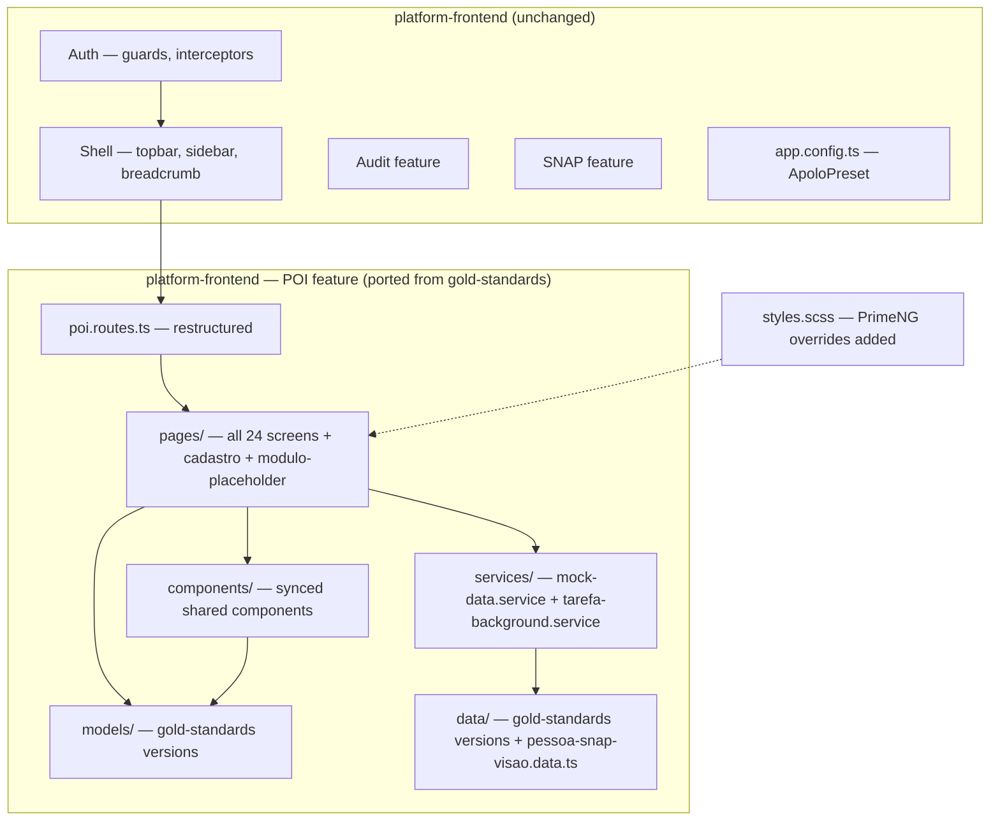
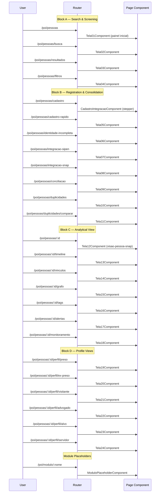

# Design Document: Port Person Flow Screens from Gold-Standards to Platform-Frontend

## Overview

This feature ports all person flow screens, models, mock data, services, shared components, and global PrimeNG style overrides from the `gold-standards-prototype/snap-pessoas` project into the production `platform-frontend` application. The gold-standards project is the source of truth for the POI module's screen implementations, containing recent improvements including a new SNAP-enriched person view (tela-12-visao-pessoa-snap), updated data models, new mock data, a background task service, and a generic module placeholder component. The port also restructures routes from the current `/pessoas/tela-XX` pattern to a cleaner `/pessoas` and `/pessoas/:id` pattern, and updates all internal navigation links accordingly.

The platform-frontend is the production app with its own auth, shell, and theme infrastructure. The port must preserve these existing systems while replacing the POI feature layer with gold-standards' latest implementations. This is a large-scope migration that touches models, data, services, components, pages, routes, and global styles — all within the `features/poi/` boundary plus targeted additions to `styles.scss`.

## Architecture

The port operates entirely within the platform-frontend's existing architecture. No new modules, layers, or external dependencies are introduced. The shell (topbar, sidebar, breadcrumb) remains untouched.



## Components and Interfaces

### Porting Scope by Layer

#### 1. Models (`features/poi/models/`)

The gold-standards project is the source of truth. Three model files have divergent interfaces that must be aligned:

**`pessoa.model.ts` — IndicadoresAnaliticos**

| Platform-frontend (current)    | Gold-standards (target)                                 |
| ------------------------------ | ------------------------------------------------------- |
| `grauPericulosidade?: string`  | `periculosidade?: string`                               |
| `nivelRisco?: string`          | `nivelRisco: 'critico' \| 'alto' \| 'medio' \| 'baixo'` |
| `pontuacaoRelevancia?: number` | `relevancia: number`                                    |
| `totalAlertas?: number`        | `qtdAlertas: number`                                    |
| `totalVinculos?: number`       | `qtdVinculos: number`                                   |
| `totalDocumentos?: number`     | `qtdDocumentosCitantes: number`                         |

**`pessoa.model.ts` — Monitoramento**

| Platform-frontend (current) | Gold-standards (target)                                   |
| --------------------------- | --------------------------------------------------------- |
| `ativo: boolean`            | `monitorado: boolean`                                     |
| `dataInicio?: string`       | `dataInicioMonitoramento?: string`                        |
| `dataFim?: string`          | _(removed)_                                               |
| `responsavel?: string`      | `setorResponsavel?: string`                               |
| `motivo?: string`           | _(removed)_                                               |
| `criticidade?: string`      | `criticidade?: 'critica' \| 'alta' \| 'media' \| 'baixa'` |
| _(none)_                    | `alvo: boolean`                                           |

**`pessoa.model.ts` — SituacaoPrisional**

| Platform-frontend (current) | Gold-standards (target)         |
| --------------------------- | ------------------------------- |
| `status: string`            | `status: string`                |
| `unidade?: string`          | `unidade: string` (required)    |
| `regime?: string`           | `regime: string` (required)     |
| `dataIngresso?: string`     | `dataUltimaAtualizacao: string` |
| `previsaoSaida?: string`    | _(removed)_                     |

All other model files (`alerta.model.ts`, `fonte.model.ts`, `perfil.model.ts`, `tag.model.ts`, `vinculo.model.ts`) are identical between the two projects and require no changes.

The `index.ts` barrel file must be updated to export the new `Monitoramento` and `SituacaoPrisional` shapes.

#### 2. Mock Data (`features/poi/data/`)

| File                          | Action                                                                          |
| ----------------------------- | ------------------------------------------------------------------------------- |
| `pessoas.data.ts`             | Overwrite with gold-standards version (uses new model shapes)                   |
| `alertas.data.ts`             | Compare and sync if divergent                                                   |
| `cadastro-integracao.data.ts` | Compare and sync if divergent                                                   |
| `preso-visao.data.ts`         | Compare and sync if divergent                                                   |
| `tags.data.ts`                | Compare and sync if divergent                                                   |
| `vinculos.data.ts`            | Compare and sync if divergent                                                   |
| `pessoa-snap-visao.data.ts`   | **New file** — copy from gold-standards (required by tela-12-visao-pessoa-snap) |

Import paths in data files must be adjusted from `'../models/pessoa.model'` to `'../models'` (using the barrel).

#### 3. Services (`features/poi/services/`)

| Service                        | Action                                                                    |
| ------------------------------ | ------------------------------------------------------------------------- |
| `mock-data.service.ts`         | Sync to gold-standards version (functionally identical, minor formatting) |
| `tarefa-background.service.ts` | **New file** — copy from gold-standards                                   |

#### 4. Shared Components (`features/poi/components/`)

All 6 shared components exist in both projects. Each must be compared file-by-file (`.ts`, `.html`, `.scss`) and synced to the gold-standards version:

- `divergence-indicator/`
- `empty-state/`
- `loading-content/`
- `partial-data-indicator/`
- `placeholder/`
- `source-badge/`

The `index.ts` barrel and `poi-component.types.ts` in platform-frontend should be preserved (gold-standards doesn't have these).

#### 5. Page Components (`features/poi/pages/`)

**Existing pages to overwrite** (sync all `.ts`, `.html`, `.scss` files):

- `tela-01-painel-inicial/` through `tela-04-filtros-avancados/`
- `cadastro-integracao/`
- `tela-10-fila-duplicidades/` through `tela-11-comparacao-duplicidade/`
- `tela-13-timeline/` through `tela-24-visao-servidor/`

**Pages to replace**:

- `tela-12-visao-geral/` → Replace with `tela-12-visao-pessoa-snap/` from gold-standards (the active tela-12 in gold-standards routes). The old `tela-12-visao-geral/` directory should be removed.

**New pages to add from gold-standards**:

- `tela-05-cadastro-rapido/`
- `tela-06-identidade-incompleta/`
- `tela-07-integracao-sipen/`
- `tela-08-integracao-snap/`
- `tela-09-conciliacao/`
- `modulo-placeholder/` (generic reusable component)

**Existing module placeholder pages** in platform-frontend (`modulo-analise/`, `modulo-busca/`, `modulo-configuracoes/`, `modulo-documentos/`, `modulo-monitoramento/`) should be evaluated — if gold-standards uses the generic `modulo-placeholder` component instead of individual ones, the platform-frontend should adopt the same pattern.

#### 6. Route Restructuring (`poi.routes.ts`)

**Current pattern**: `/poi/pessoas/tela-XX`
**Target pattern**: `/poi/pessoas` (list) and `/poi/pessoas/:id` (person detail)



**Route mapping summary**:

| Block | Route                           | Component                    |
| ----- | ------------------------------- | ---------------------------- |
| A     | `pessoas`                       | Tela01 (painel inicial)      |
| A     | `pessoas/busca`                 | Tela02                       |
| A     | `pessoas/resultados`            | Tela03                       |
| A     | `pessoas/filtros`               | Tela04                       |
| B     | `pessoas/cadastro`              | CadastroIntegracao (stepper) |
| B     | `pessoas/cadastro-rapido`       | Tela05                       |
| B     | `pessoas/identidade-incompleta` | Tela06                       |
| B     | `pessoas/integracao-sipen`      | Tela07                       |
| B     | `pessoas/integracao-snap`       | Tela08                       |
| B     | `pessoas/conciliacao`           | Tela09                       |
| B     | `pessoas/duplicidades`          | Tela10                       |
| B     | `pessoas/duplicidades/comparar` | Tela11                       |
| C     | `pessoas/:id`                   | Tela12 (visao-pessoa-snap)   |
| C     | `pessoas/:id/timeline`          | Tela13                       |
| C     | `pessoas/:id/vinculos`          | Tela14                       |
| C     | `pessoas/:id/grafo`             | Tela15                       |
| C     | `pessoas/:id/tags`              | Tela16                       |
| C     | `pessoas/:id/alertas`           | Tela17                       |
| C     | `pessoas/:id/monitoramento`     | Tela18                       |
| D     | `pessoas/:id/perfil/preso`      | Tela19                       |
| D     | `pessoas/:id/perfil/ex-preso`   | Tela20                       |
| D     | `pessoas/:id/perfil/visitante`  | Tela21                       |
| D     | `pessoas/:id/perfil/advogado`   | Tela22                       |
| D     | `pessoas/:id/perfil/alvo`       | Tela23                       |
| D     | `pessoas/:id/perfil/servidor`   | Tela24                       |
| —     | `modulo/:nome`                  | ModuloPlaceholder            |

Legacy `tela-XX` routes should have redirects to the new paths for backward compatibility.

#### 7. Internal Navigation Links

All `router.navigate()` calls and `routerLink` directives within ported components must be updated from gold-standards paths (e.g., `/pessoas/tela-12`) to the new platform-frontend paths (e.g., `/poi/pessoas/:id`). This includes:

- The `voltar()` method in tela-12 (`/pessoas/tela-01` → `/poi/pessoas`)
- All inter-screen navigation across all 24 screens
- Sidebar/module links within page components

#### 8. Global Styles (`styles.scss`)

The following PrimeNG overrides from gold-standards `styles.scss` must be added to platform-frontend's `styles.scss`. Only add what's missing — do not duplicate existing SNAP design tokens.

**Missing overrides to add**:

```scss
// Fix: borda verde do Aura no focus de selects e inputs
.p-select:focus,
.p-select.p-focus,
.p-select-open {
  border-color: var(--snap-pillar-color) !important;
  box-shadow: 0 0 0 1px var(--snap-focus-ring) !important;
}

.p-inputtext:focus {
  border-color: var(--snap-pillar-color) !important;
  box-shadow: 0 0 0 1px var(--snap-focus-ring) !important;
}

// Fix: tamanho do select na barra de título
.select-listar .p-select { ... }

// Global override: PrimeNG multiselect highlight (Aura green → pillar color)
.p-multiselect-overlay, ... { ... }

// Dialog consulta: separador no header, fundo semi-transparente, blur no backdrop
.dialog-consulta .p-dialog-header { ... }
.dialog-consulta[data-pc-section="root"] { ... }
.dialog-consulta-mask.p-dialog-mask { ... }

// p-tag: remover bold global
.p-tag .p-tag-label { font-weight: 400; }

// p-card: borda consistente com distribuicao-base
.coluna-direita [data-pc-section="root"][data-pc-name="card"] { ... }

// p-avatar: fotos 3x4 — alinhar topo na máscara circular
.p-avatar img { object-fit: cover; object-position: center top; }
```

**What NOT to add** (already present or not needed):

- SNAP design tokens (light mode) — already in platform-frontend `:root`
- Dark mode tokens — platform-frontend uses `.p-dark` via ApoloPreset, not `.snap-dark` class
- `@font-face` declarations — platform-frontend uses `@fontsource-variable/inter-tight`
- Profile color tokens for `--snap-perfil-alvo`, `--snap-perfil-visitante`, `--snap-perfil-familiar`, `--snap-perfil-pessoa-relacionada`, `--snap-perfil-advogado`, `--snap-perfil-servidor` — these ARE missing from platform-frontend and must be added to `:root`

## Data Models

### New Data Type: PessoaSnapVisao

The `pessoa-snap-visao.data.ts` file introduces a rich data structure for the SNAP-enriched person view (tela-12). This is a standalone data file with its own interfaces — it does not modify the core `Pessoa` model but provides a parallel enriched view.

Key interfaces defined in this file:

- `PessoaSnapVisao` — root type with identity, contacts, links, processes, warrants, official gazettes, digital profiles, party affiliations, candidacies, electoral links, public servants, public expenses, monitoring
- `IdentidadeSnap`, `ContatosSnap`, `TelefoneSnap`, `EmailSnap`, `EnderecoSnap`
- `VinculoPessoa`, `VinculoEmpresa`, `SocioEmpresa`
- `ProcessoEscavador`, `ProcessoSeeu`, `MandadoBnmp`
- `DiarioOficialEscavador`, `DiarioOficialQueridoDiario`
- `PerfilDigital`, `FiliacaoPartidaria`, `CandidaturaEleitoral`, `VinculoEleitoral`
- `ServidorPublico`, `DespesaPublica`, `MonitoramentoSnap`

This file should be placed at `features/poi/data/pessoa-snap-visao.data.ts`.

### New Service: TarefaBackgroundService

Manages background task state with tooltip visibility for SIPEN/SNAP integration feedback. Uses signals for reactive state management. Should be placed at `features/poi/services/tarefa-background.service.ts`.

## Error Handling

### Import Path Errors

When copying components from gold-standards, import paths must be adjusted:

- Gold-standards: `'../../models/pessoa.model'` → Platform-frontend: `'../../models'` (barrel)
- Gold-standards: `'../../data/pessoa-snap-visao.data'` → Platform-frontend: `'../../data/pessoa-snap-visao.data'` (same relative path)
- Gold-standards: `'../../services/tarefa-background.service'` → Platform-frontend: `'../../services/tarefa-background.service'` (same relative path)
- Gold-standards: `'../../components/...'` → Platform-frontend: `'../../components/...'` (same relative path)

### Route Navigation Errors

All hardcoded route strings in gold-standards components use paths like `/pessoas/tela-12`. These must be updated to the new route pattern. A systematic find-and-replace across all ported `.ts` and `.html` files is required:

- `/pessoas/tela-01` → `/poi/pessoas`
- `/pessoas/tela-02` → `/poi/pessoas/busca`
- `/pessoas/tela-03` → `/poi/pessoas/resultados`
- `/pessoas/tela-04` → `/poi/pessoas/filtros`
- `/pessoas/cadastro` → `/poi/pessoas/cadastro`
- `/pessoas/tela-05` → `/poi/pessoas/cadastro-rapido`
- `/pessoas/tela-06` → `/poi/pessoas/identidade-incompleta`
- `/pessoas/tela-07` → `/poi/pessoas/integracao-sipen`
- `/pessoas/tela-08` → `/poi/pessoas/integracao-snap`
- `/pessoas/tela-09` → `/poi/pessoas/conciliacao`
- `/pessoas/tela-10` → `/poi/pessoas/duplicidades`
- `/pessoas/tela-11` → `/poi/pessoas/duplicidades/comparar`
- `/pessoas/tela-12` → `/poi/pessoas/:id` (dynamic)
- `/pessoas/tela-13` → `/poi/pessoas/:id/timeline`
- `/pessoas/tela-14` → `/poi/pessoas/:id/vinculos`
- `/pessoas/tela-15` → `/poi/pessoas/:id/grafo`
- `/pessoas/tela-16` → `/poi/pessoas/:id/tags`
- `/pessoas/tela-17` → `/poi/pessoas/:id/alertas`
- `/pessoas/tela-18` → `/poi/pessoas/:id/monitoramento`
- `/pessoas/tela-19` → `/poi/pessoas/:id/perfil/preso`
- `/pessoas/tela-20` → `/poi/pessoas/:id/perfil/ex-preso`
- `/pessoas/tela-21` → `/poi/pessoas/:id/perfil/visitante`
- `/pessoas/tela-22` → `/poi/pessoas/:id/perfil/advogado`
- `/pessoas/tela-23` → `/poi/pessoas/:id/perfil/alvo`
- `/pessoas/tela-24` → `/poi/pessoas/:id/perfil/servidor`
- `/modulo/busca` → `/poi/modulo/busca`
- `/modulo/analise` → `/poi/modulo/analise`
- `/modulo/documentos` → `/poi/modulo/documentos`
- `/modulo/monitoramento` → `/poi/modulo/monitoramento`
- `/modulo/configuracoes` → `/poi/modulo/configuracoes`

### Missing Asset Errors

Gold-standards references photos at `assets/images/photos/pessoa-XX.png`. Platform-frontend uses `/images/photos/pessoa-XX.png`. Photo paths in mock data must match the platform-frontend convention.

## Testing Strategy

### Verification Approach

Since this is a static prototype port (no backend, no real data), testing focuses on:

1. **Build verification**: `pnpm build` must succeed with zero errors after all changes
2. **Route verification**: Every route in the new `poi.routes.ts` must resolve to a valid component
3. **Import verification**: All import paths must resolve correctly — no missing modules
4. **Visual verification**: Each screen must render without console errors when navigated to
5. **Navigation verification**: All internal links between screens must navigate to the correct new routes
6. **Model consistency**: All mock data must conform to the updated model interfaces (gold-standards versions)

### Risk Areas

- **Model migration**: Changing `IndicadoresAnaliticos`, `Monitoramento`, and `SituacaoPrisional` interfaces affects every component that reads these fields. All templates referencing old field names (e.g., `pessoa.monitoramento.ativo`) must be updated to new names (e.g., `pessoa.monitoramento.monitorado`).
- **Route parameter injection**: Screens in Block C and D now receive `:id` as a route parameter. Components must be updated to read this parameter and use it to look up the person from `MockDataService`.
- **Style conflicts**: Adding PrimeNG overrides to `styles.scss` could affect components outside the POI feature. Overrides should be scoped where possible.

## Performance Considerations

- All page components use `loadComponent` for lazy loading — this pattern is preserved
- All components use `ChangeDetectionStrategy.OnPush` — this pattern is preserved
- No new external dependencies are introduced
- The `pessoa-snap-visao.data.ts` file is large (~300 lines of mock data) but only loaded by tela-12

## Security Considerations

- No authentication or authorization logic is modified
- No new API endpoints or external integrations are introduced
- All changes are within the frontend presentation layer
- Mock data contains fictional PII only (placeholder names, CPFs, addresses)

## Dependencies

No new npm dependencies are required. All PrimeNG modules used by gold-standards components are already available in platform-frontend's `package.json`:

- `primeng` (CardModule, ButtonModule, TagModule, TabsModule, AvatarModule, TooltipModule, SkeletonModule, etc.)
- `@angular/router`
- `@angular/common`
- `@angular/forms`

## Correctness Properties

_A property is a characteristic or behavior that should hold true across all valid executions of a system — essentially, a formal statement about what the system should do. Properties serve as the bridge between human-readable specifications and machine-verifiable correctness guarantees._

### Property 1: Model file identity

_For any_ model file that the design identifies as "source of truth from gold-standards" (specifically `pessoa.model.ts`), the platform-frontend version after porting must be byte-identical to the gold-standards version.

**Validates: Requirement 1.1**

### Property 2: Import path convention in data files

_For any_ data file in `features/poi/data/`, all model import statements must use the barrel path `'../models'` and all photo asset paths must use the Platform_Frontend convention `/images/photos/`.

**Validates: Requirements 2.4, 2.5**

### Property 3: Import resolution completeness

_For any_ import statement in any file within `features/poi/`, the imported module must resolve to an existing file in the platform-frontend project, producing zero unresolved import errors at build time.

**Validates: Requirements 5.5, 10.2**

### Property 4: Navigation path correctness

_For any_ `router.navigate()` call or `routerLink` directive in any ported component file, the target path must use the new `/poi/` prefixed semantic route pattern (not the old `/pessoas/tela-XX` pattern), and person-specific routes must use dynamic ID parameters instead of hardcoded identifiers.

**Validates: Requirements 7.1, 7.2, 7.3**

### Property 5: Route parameter integration in person views

_For any_ Block C or Block D page component, the component must read the `:id` parameter from the activated route and use MockDataService to look up the corresponding person data.

**Validates: Requirements 8.1, 8.2**

### Property 6: Legacy route redirect completeness

_For any_ legacy `tela-XX` route path that existed in the old route configuration, the new `poi.routes.ts` must contain a redirect entry mapping it to the corresponding semantic route.

**Validates: Requirement 6.6**

### Property 7: Lazy loading on all page routes

_For any_ route entry in `poi.routes.ts` that loads a page component, the route must use `loadComponent` for lazy loading.

**Validates: Requirements 6.7, 12.3**

### Property 8: Style additivity

_For any_ line present in the original `styles.scss` before the port, that line must remain unchanged after the port, and no added CSS rule must duplicate a rule already present in the original file.

**Validates: Requirements 9.9, 9.10**

### Property 9: Component architecture consistency

_For any_ ported component (page or shared), the component decorator must include `standalone: true` and `changeDetection: ChangeDetectionStrategy.OnPush`.

**Validates: Requirements 12.1, 12.2**

### Property 10: Data-model conformance

_For any_ mock data object in `features/poi/data/`, the object must satisfy the TypeScript interface it declares, producing zero type errors at build time.

**Validates: Requirements 2.1, 10.3**
