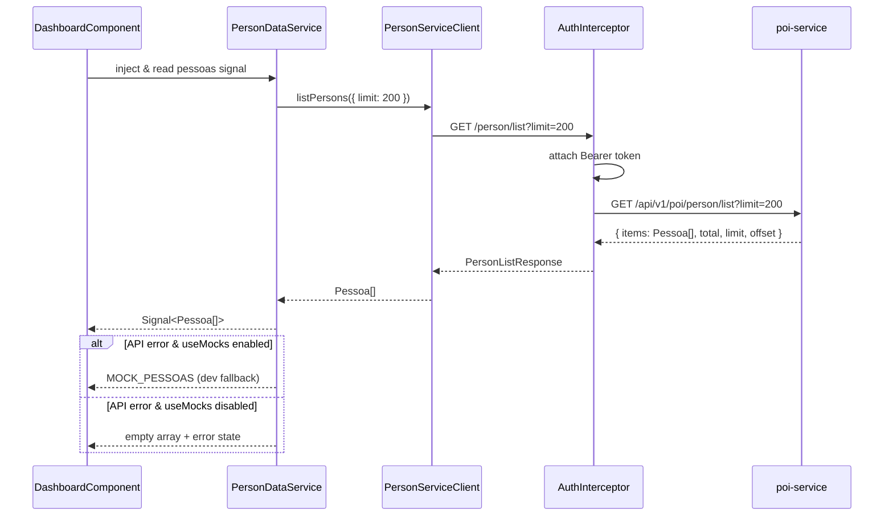
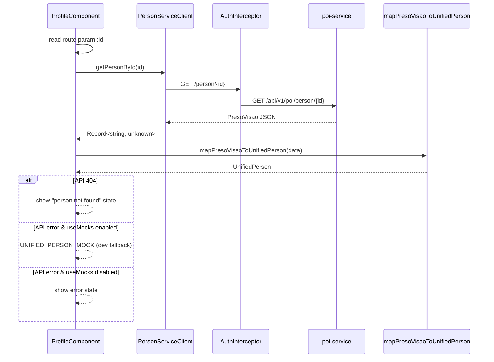
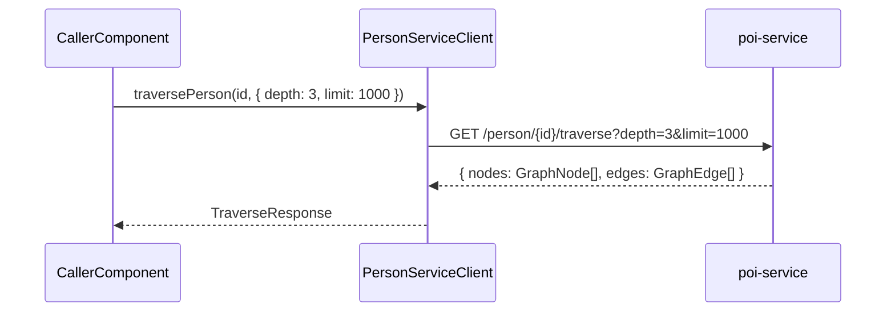

# Design Document: POI Person Integration

## Overview

This feature replaces mock data fallbacks in the platform-frontend's person module with real HTTP calls to the poi-service person API endpoints. The platform-frontend already has a `PersonServiceClient` that communicates with the poi-service, and components already attempt real API calls — but they silently fall back to hardcoded mock data on error or empty results. The goal is to remove these mock fallbacks so the UI reflects real data from the poi-service, while preserving a development-mode flag that re-enables mocks when the poi-service is unavailable during standalone development.

Three poi-service endpoints are integrated: `GET /person/list` (paginated listing), `GET /person/{id}` (detail), and `GET /person/{id}/traverse` (graph traversal). The existing `PersonServiceClient` already covers list and detail; traverse support needs to be added. The `MockDataService` and `ProfileComponent` need their mock fallbacks commented out and replaced with proper error/loading states.

## Architecture

```mermaid
graph TD
    subgraph platform-frontend
        DC[DashboardComponent] --> PDS[PersonDataService]
        PC[ProfileComponent] --> PSC[PersonServiceClient]
        PDS --> PSC[PersonServiceClient]
        PSC --> RCS[RuntimeConfigService]
        PSC -->|HTTP GET| POI[poi-service]
        AI[AuthInterceptor] -->|Bearer token| PSC
    end

    subgraph poi-service
        POI --> PR[person_routes.py]
        PR --> MGQS[MultiGraphQueryService]
        PR --> PERM[PermissionClient]
        MGQS --> NEO[Graph DB]
    end

    subgraph environment
        ENV[environment.ts] -->|personServiceUrl| RCS
        CFG[/config.json] -->|runtime override| RCS
    end
```

## Sequence Diagrams

### Person List Flow (Dashboard)



### Person Detail Flow (Profile)



### Graph Traverse Flow (Future)



## Components and Interfaces

### Component 1: PersonServiceClient (enhanced)

**Purpose**: HTTP client for all poi-service person endpoints. Already exists; needs traverse method added and return type for `listPersons` enhanced to include pagination metadata.

**Interface**:

```typescript
interface PersonListResponse {
  items: Pessoa[];
  total: number;
  limit: number;
  offset: number;
}

interface TraverseParams {
  depth?: number; // 1-5, default 3
  limit?: number; // 1-2000, default 1000
}

interface TraverseResponse {
  nodes: GraphNode[];
  edges: GraphEdge[];
}

interface GraphNode {
  id: string;
  label: string;
  properties: Record<string, unknown>;
  _node_id: string;
  _graph_id: string | null;
  _graph_name: string | null;
  _sources: Array<{ graph_id: string; display_name: string }>;
  _merged_from: number;
}

interface GraphEdge {
  start_id: string;
  end_id: string;
  label: string;
  properties?: Record<string, unknown>;
  _graph_id: string;
  _graph_name: string;
}

@Injectable({ providedIn: "root" })
class PersonServiceClient {
  listPersons(params?: {
    source?: string;
    q?: string;
    limit?: number;
    offset?: number;
  }): Observable<PersonListResponse>;

  getPersonById(personId: string): Observable<Record<string, unknown>>;

  traversePerson(
    personId: string,
    params?: TraverseParams,
  ): Observable<TraverseResponse>;
}
```

**Responsibilities**:

- Build HTTP requests to poi-service person endpoints
- Pass query parameters for filtering, pagination, and traversal depth
- Return typed observables; error handling is the caller's responsibility

### Component 2: PersonDataService (replaces MockDataService)

**Purpose**: Renamed from `MockDataService` to `PersonDataService`. Provides reactive signals for person data consumed by dashboard and other components. Removes mock fallbacks in production; optionally enables them in development mode.

**Interface**:

```typescript
@Injectable({ providedIn: "root" })
class PersonDataService {
  readonly pessoas: Signal<Pessoa[]>;
  readonly isLoading: Signal<boolean>;
  readonly error: Signal<string | null>;

  getPessoaById(id: string): Signal<Pessoa | undefined>;
  getAlertasByPessoaId(pessoaId: string): Signal<Alerta[]>;
  getVinculosByPessoaId(pessoaId: string): Signal<Vinculo[]>;
  getTagsByPessoaId(pessoaId: string): Signal<Tag[]>;
}
```

**Responsibilities**:

- Fetch person list from PersonServiceClient on initialization
- Expose loading and error states as signals
- Provide computed signals for per-person lookups
- When `environment.useMocks` is true and API fails, fall back to mock data (dev only)
- When `environment.useMocks` is false, propagate errors to the UI

### Component 3: ProfileComponent (modified)

**Purpose**: Displays full person detail. Currently falls back to `UNIFIED_PERSON_MOCK` on error. Must be changed to show proper loading/error states instead.

**Responsibilities**:

- Fetch person detail via `PersonServiceClient.getPersonById()`
- Map response through `mapPresoVisaoToUnifiedPerson()`
- Show loading skeleton while fetching
- Show error state on API failure (no mock fallback in production)
- In dev mode with `useMocks`, fall back to mock for convenience

### Component 4: DashboardComponent (modified)

**Purpose**: Displays person listing, monitoring cards, alerts. Currently uses `MockDataService`. Must switch to `PersonDataService` and handle loading/error states.

**Responsibilities**:

- Read `pessoas` signal from `PersonDataService`
- Show skeleton loading state while data is being fetched
- Show error banner if API call fails
- Remove hardcoded `MONITORADOS_EXTRAS` mock data in favor of real API data

## Data Models

### Model 1: Pessoa (existing — no changes)

```typescript
interface Pessoa {
  id: string;
  nome: string;
  vulgos: string[];
  cpf?: string;
  rg?: string;
  matricula?: string;
  dataNascimento?: string;
  sexo?: string;
  fotoUrl?: string;
  pai?: string;
  mae?: string;
  naturalidade?: string;
  nacionalidade?: string;
  perfis: Perfil[];
  fontes: Fonte[];
  resumoAnalitico: string;
  statusReconciliacao: StatusDivergencia;
  indicadoresAnaliticos?: IndicadoresAnaliticos;
  monitoramento?: Monitoramento;
  situacaoPrisionalAtual?: SituacaoPrisional;
  tagsRelevantes: Tag[];
}
```

**Validation Rules**:

- `id` is required, non-empty UUID
- `nome` is required, non-empty string
- `perfis` must have at least one entry
- `fontes` must have at least one entry

### Model 2: PersonListResponse (existing — enhanced usage)

```typescript
interface PersonListResponse {
  items: Pessoa[];
  total: number;
  limit: number;
  offset: number;
}
```

**Validation Rules**:

- `items` is an array (may be empty)
- `total >= 0`
- `limit` is between 1 and 200
- `offset >= 0`

### Model 3: TraverseResponse (new)

```typescript
interface TraverseResponse {
  nodes: GraphNode[];
  edges: GraphEdge[];
}
```

**Validation Rules**:

- `nodes` and `edges` are arrays (may be empty)
- Each node has `id`, `label`, and `properties`
- Each edge has `start_id`, `end_id`, and `label`

## Key Functions with Formal Specifications

### Function 1: PersonServiceClient.listPersons()

```typescript
listPersons(params?: {
  source?: string;
  q?: string;
  limit?: number;
  offset?: number;
}): Observable<PersonListResponse>
```

**Preconditions:**

- `params.source` is either `'SIPEN'`, `'SNAP'`, or undefined
- `params.limit` is between 1 and 200 if provided
- `params.offset >= 0` if provided
- Auth token is available (handled by interceptor)

**Postconditions:**

- Returns `PersonListResponse` with `items`, `total`, `limit`, `offset`
- On HTTP error, observable emits error (caller handles)
- No side effects on input parameters

### Function 2: PersonServiceClient.traversePerson()

```typescript
traversePerson(
  personId: string,
  params?: TraverseParams
): Observable<TraverseResponse>
```

**Preconditions:**

- `personId` is a non-empty UUID string
- `params.depth` is between 1 and 5 if provided
- `params.limit` is between 1 and 2000 if provided
- Auth token is available

**Postconditions:**

- Returns `TraverseResponse` with `nodes` and `edges` arrays
- On 404, observable emits HttpErrorResponse with status 404
- No mutations to input parameters

### Function 3: PersonDataService.pessoas (signal initialization)

```typescript
readonly pessoas: Signal<Pessoa[]> = toSignal(
  this.personClient.listPersons({ limit: 200 }).pipe(
    map(res => res.items),
    catchError(err => {
      if (this.useMocks) return of(MOCK_PESSOAS);
      this.errorSignal.set(err.message);
      return of([]);
    }),
  ),
  { initialValue: [] },
);
```

**Preconditions:**

- `PersonServiceClient` is injected and configured
- `RuntimeConfigService` has resolved `personServiceUrl`

**Postconditions:**

- Signal emits `Pessoa[]` from API on success
- Signal emits `MOCK_PESSOAS` on error when `useMocks` is true
- Signal emits `[]` on error when `useMocks` is false, and `error` signal is set
- `isLoading` transitions from `true` to `false` after resolution

### Function 4: ProfileComponent.personFromApi (signal initialization)

```typescript
private readonly personFromApi = toSignal(
  this.route.paramMap.pipe(
    map(p => p.get('id') ?? ''),
    switchMap(id => id
      ? this.personClient.getPersonById(id).pipe(
          map(data => mapPresoVisaoToUnifiedPerson(data)),
          catchError(err => {
            if (this.useMocks) return of(UNIFIED_PERSON_MOCK);
            this.errorSignal.set(err.message);
            return of(null);
          }),
        )
      : of(null),
    ),
  ),
  { initialValue: null },
);
```

**Preconditions:**

- Route contains `:id` parameter
- `PersonServiceClient` is injected

**Postconditions:**

- Returns `UnifiedPerson` mapped from API response on success
- Returns `UNIFIED_PERSON_MOCK` on error when `useMocks` is true
- Returns `null` on error when `useMocks` is false, and `error` signal is set
- Returns `null` when route has no id

## Algorithmic Pseudocode

### Development Mode Flag Resolution

```typescript
// environment.ts — add useMocks flag
export const environment = {
  // ... existing config ...
  useMocks: false, // true only in environment.development.ts
};

// Components/services read this at injection time:
// private readonly useMocks = environment.useMocks;
```

**Preconditions:**

- `environment.ts` is the active environment file
- `environment.development.ts` overrides `useMocks` to `true` for standalone dev

**Postconditions:**

- Production builds always have `useMocks === false`
- Standalone dev builds have `useMocks === true`
- Mock imports are tree-shaken in production when `useMocks` is false (dead code)

### MockDataService → PersonDataService Refactoring Algorithm

```
ALGORITHM refactorMockDataService
INPUT: MockDataService source file
OUTPUT: PersonDataService with conditional mock fallback

BEGIN
  1. Rename class MockDataService → PersonDataService
  2. Rename file mock-data.service.ts → person-data.service.ts
  3. Add useMocks flag from environment
  4. Change pessoas signal:
     - REMOVE: map(items => items.length > 0 ? items : MOCK_PESSOAS)
     - CHANGE: catchError to check useMocks before falling back
     - ADD: isLoading and error signals
  5. Keep alertas, vinculos, tags as-is (these remain mock until
     poi-service exposes dedicated endpoints)
  6. Update all import paths in consumers (DashboardComponent, etc.)
END
```

### ProfileComponent Mock Removal Algorithm

```
ALGORITHM removeProfileMockFallback
INPUT: ProfileComponent source file
OUTPUT: ProfileComponent with conditional mock fallback

BEGIN
  1. Add useMocks flag from environment
  2. Add error and isLoading signals
  3. Change personFromApi signal:
     - REMOVE: initialValue of UNIFIED_PERSON_MOCK
     - CHANGE: initialValue to null
     - CHANGE: catchError to check useMocks:
       IF useMocks THEN return of(UNIFIED_PERSON_MOCK)
       ELSE set error signal, return of(null)
  4. Change person getter:
     - REMOVE: ?? UNIFIED_PERSON_MOCK fallback
     - CHANGE: return this.personFromApi() (may be null)
  5. Add null guard in template for person === null (show error/loading)
  6. Keep UNIFIED_PERSON_MOCK import (used only when useMocks is true)
END
```

### DashboardComponent Mock Removal Algorithm

```
ALGORITHM removeDashboardMockData
INPUT: DashboardComponent source file
OUTPUT: DashboardComponent using real API data

BEGIN
  1. Replace MockDataService injection → PersonDataService
  2. Comment out MONITORADOS_EXTRAS hardcoded array
  3. Change monitorados computed:
     - USE only this.personData.pessoas() (real API data)
     - REMOVE concatenation with MONITORADOS_EXTRAS
  4. Add isLoading and error computed signals from PersonDataService
  5. Show skeleton loading state when isLoading is true
  6. Show error banner when error is non-null
  7. Keep mock imports commented (for reference)
END
```

## Example Usage

```typescript
// 1. PersonServiceClient — listing with pagination
this.personClient.listPersons({ source: 'SNAP', q: 'João', limit: 50, offset: 0 })
  .subscribe(response => {
    console.log(`Found ${response.total} persons`);
    console.log(`Showing ${response.items.length} items`);
  });

// 2. PersonServiceClient — traverse
this.personClient.traversePerson('uuid-123', { depth: 3, limit: 1000 })
  .subscribe(graph => {
    console.log(`${graph.nodes.length} nodes, ${graph.edges.length} edges`);
  });

// 3. PersonDataService — reactive signal in component
@Component({ /* ... */ })
export class DashboardComponent {
  private readonly personData = inject(PersonDataService);

  protected readonly pessoas = this.personData.pessoas;
  protected readonly isLoading = this.personData.isLoading;
  protected readonly error = this.personData.error;
}

// 4. ProfileComponent — person detail with error handling
private readonly personFromApi = toSignal(
  this.route.paramMap.pipe(
    map(p => p.get('id') ?? ''),
    switchMap(id => id
      ? this.personClient.getPersonById(id).pipe(
          map(data => mapPresoVisaoToUnifiedPerson(data)),
          catchError(() => {
            this.errorSignal.set('Failed to load person');
            return of(null);
          }),
        )
      : of(null),
    ),
  ),
  { initialValue: null },
);
```

## Correctness Properties

1. **∀ environment where `useMocks === false`: no mock data is ever returned to the UI.** If the API fails, the component shows an error state, not mock data.

2. **∀ PersonListResponse from API: `response.items` is used directly without filtering against mock data.** The `map(items => items.length > 0 ? items : MOCK_PESSOAS)` pattern is removed.

3. **∀ person detail request: if API returns 404, the UI shows "person not found" — not a mock person.**

4. **∀ environment where `useMocks === true`: mock fallback is available on API error, preserving standalone development workflow.**

5. **∀ HTTP request to poi-service: the AuthInterceptor attaches a Bearer token because `personServiceUrl` origin is in `trustedOrigins`.**

6. **∀ traverse request: `depth` is clamped to [1, 5] and `limit` to [1, 2000] before sending to the API.**

7. **The `PersonDataService.isLoading` signal is `true` while the API call is in flight and `false` after resolution (success or error).**

8. **The rename from `MockDataService` to `PersonDataService` updates all import paths across the codebase without breaking any existing functionality.**

## Error Handling

### Error Scenario 1: poi-service Unreachable

**Condition**: poi-service is not running or network is down (connection refused / timeout)
**Response**: `catchError` in PersonDataService catches the HttpErrorResponse. If `useMocks` is true, returns mock data. If false, sets `error` signal with a user-friendly message.
**Recovery**: User can retry by refreshing the page. A retry button can be added in the error banner.

### Error Scenario 2: Person Not Found (404)

**Condition**: `GET /person/{id}` returns 404 (person doesn't exist or is in an inaccessible graph)
**Response**: ProfileComponent detects 404 status and shows a "Person not found" state with a back button.
**Recovery**: User navigates back to the dashboard.

### Error Scenario 3: Permission Denied (403)

**Condition**: User lacks `poi_entity:*:read` or `poi_entity:{id}:read` permission
**Response**: API returns 403. Component shows "Access denied" message.
**Recovery**: User contacts admin for permission grant.

### Error Scenario 4: Empty Result Set

**Condition**: `GET /person/list` returns `{ items: [], total: 0 }` — no persons in the system
**Response**: Dashboard shows an empty state with a message like "No persons found" and a prompt to run a SNAP/SIPEN query.
**Recovery**: User initiates a person generation via the SNAP or SIPEN dialog.

### Error Scenario 5: Partial API Response (Malformed Data)

**Condition**: API returns data but with missing or unexpected fields
**Response**: `mapPresoVisaoToUnifiedPerson()` already uses defensive `g()` helper with null coalescing. Missing fields default to empty strings/arrays.
**Recovery**: No user action needed; the mapper handles gracefully.

## Testing Strategy

### Unit Testing Approach

- **PersonServiceClient**: Test that `listPersons`, `getPersonById`, and `traversePerson` construct correct URLs and query params. Use `HttpClientTestingModule` to mock HTTP responses.
- **PersonDataService**: Test that `pessoas` signal emits API data on success, mock data when `useMocks` is true and API fails, and empty array with error when `useMocks` is false and API fails.
- **ProfileComponent**: Test that person detail is fetched on route param change, error state is shown on 404, and loading skeleton is shown during fetch.
- **DashboardComponent**: Test that it reads from `PersonDataService.pessoas` signal and renders cards.

### Integration Testing Approach

- Start poi-service locally, seed test data, and verify end-to-end flow from dashboard → person list → profile detail.
- Verify that the auth interceptor correctly attaches tokens for poi-service requests.
- Verify that standalone mode with `useMocks: true` works when poi-service is not running.

## Dependencies

| Dependency             | Purpose                                             | Already Present |
| ---------------------- | --------------------------------------------------- | --------------- |
| `@angular/common/http` | HttpClient for API calls                            | Yes             |
| `rxjs`                 | Observables, operators (map, switchMap, catchError) | Yes             |
| `@angular/core`        | Signals, inject, computed, toSignal                 | Yes             |
| `poi-service`          | Backend API (external service)                      | Yes (port 8003) |
| `RuntimeConfigService` | Provides `personServiceUrl` at runtime              | Yes             |
| `AuthInterceptor`      | Attaches Bearer token to trusted origins            | Yes             |
