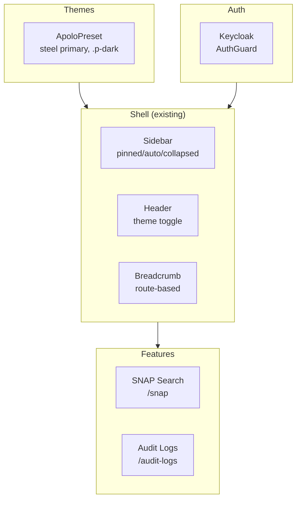
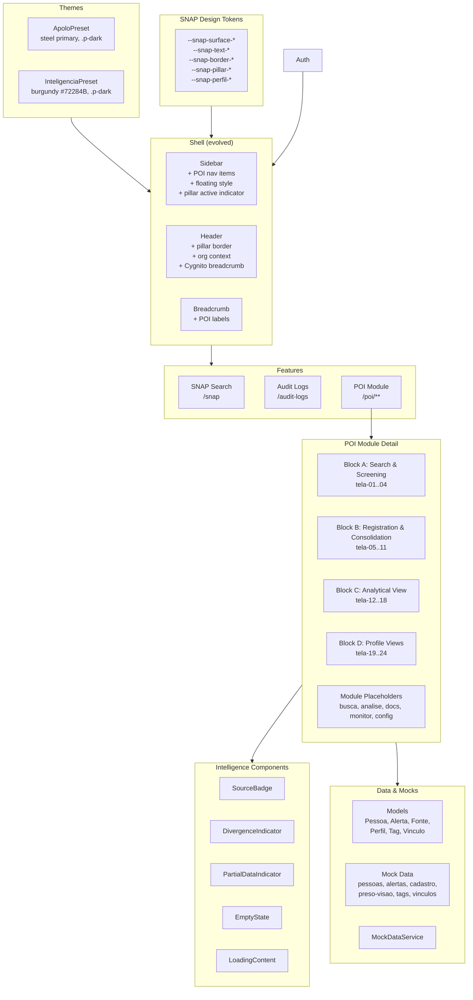
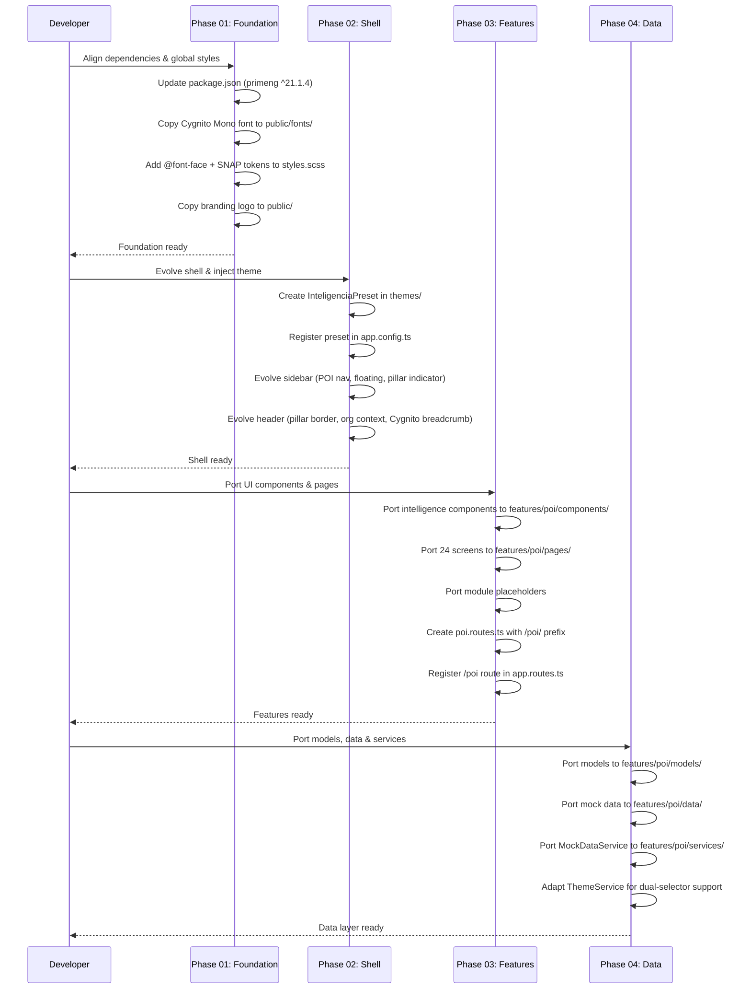
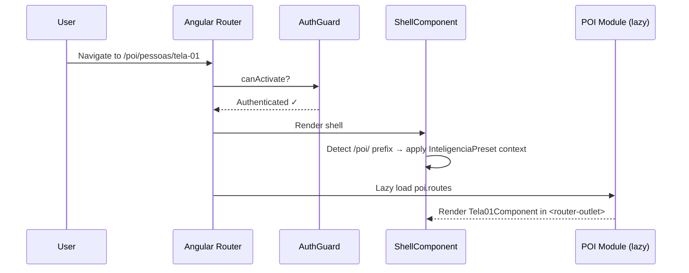

# Design Document: SNAP-Pessoas Portability

## Overview

This design describes the 4-phase portability of the "Gold Standard" SNAP-Pessoas prototype (`PrototipoPOI/snap-pessoas/`) into the production target project (`platform-frontend/`). The prototype contains 24 screens for the People of Interest (POI) Intelligence module, complete with a custom SnapPreset theme, SNAP design tokens, intelligence-specific UI components, rich data models, and mock data.

The target project already has a working shell (sidebar, header, breadcrumb), an ApoloPreset theme (steel/blue-gray), a Keycloak auth system, a SNAP search page, and an audit feature. The portability must preserve all existing functionality while integrating the prototype's Intelligence pillar features under a `/poi/` route prefix, adding a second theme preset (`theme-inteligencia`), evolving the existing shell to support SNAP-specific visual features, and porting all 24 screens with their supporting models, data, services, and components.

The effort is organized into four sequential phases: Foundation (dependencies & global styles), Structural Replacement (layout & shell evolution), Feature Porting (UI components & pages), and Data & Mocks (mocked intelligence layer). Each phase builds on the previous one, ensuring the application remains functional at every step.

## Architecture

### Current State (Target)



### Target State (After Portability)



## Sequence Diagrams

### Phase Execution Flow



### Route Resolution Flow



## Components and Interfaces

### Component 1: InteligenciaPreset (Theme)

**Purpose**: PrimeNG theme preset for the Intelligence pillar, based on Aura with burgundy `#72284B` as primary color. Coexists with ApoloPreset.

**Interface**:

```typescript
// themes/inteligencia-preset.ts
import { definePreset } from '@primeuix/themes';
import Aura from '@primeuix/themes/aura';

export const InteligenciaPreset = definePreset(Aura, {
  semantic: {
    primary: {
      50: '#fdf2f6',
      100: '#fbe6ee',
      200: '#f9cedf',
      300: '#f4a5c4',
      400: '#ec6f9e',
      500: '#e1437c',
      600: '#c9265d',
      700: '#a91b48',
      800: '#8c193d',
      900: '#72284B',
      950: '#4a0e28',
    },
  },
});
```

**Responsibilities**:

- Provide burgundy primary palette for Intelligence pillar
- Maintain Aura base for all other tokens (surface, danger, info, success, warn)
- Used alongside ApoloPreset — the active preset is determined by route context

**Design Decision — Theme Switching Strategy**:
The target currently uses `ApoloPreset` globally in `app.config.ts`. The prototype uses `SnapPreset` as the only preset. For coexistence, the `InteligenciaPreset` is registered as an additional preset. The `providePrimeNG` configuration keeps `ApoloPreset` as the default. When the user navigates to `/poi/**` routes, the shell applies the `InteligenciaPreset` context via PrimeNG's runtime theme API or CSS class scoping. This allows both presets to coexist without conflict.

### Component 2: SNAP Design Tokens (Global CSS Variables)

**Purpose**: Custom CSS variables for SNAP-specific styling that go beyond PrimeNG tokens. These tokens control surfaces, text, borders, pillar colors, and profile colors.

**Interface**:

```scss
// Added to styles.scss
:root {
  // Light mode SNAP tokens
  --snap-surface-1: #f8f9fa;
  --snap-surface-2: #ffffff;
  --snap-surface-3: #f0f1f3;
  --snap-text-primary: #1e1f27;
  --snap-text-secondary: #697e89;
  --snap-text-muted: #a0adb5;
  --snap-border-subtle: #e9eced;
  --snap-border-default: #c2cfd6;
  --snap-pillar-color: #72284b;
  --snap-pillar-light: #9b4d72;
  --snap-pillar-dark: #5a1f3b;
  --snap-focus-ring: rgba(114, 40, 75, 0.35);
  --snap-overlay-bg: rgba(0, 0, 0, 0.4);
  --snap-perfil-preso: #72284b;
  --snap-perfil-ex-preso: #e97320;
  --snap-perfil-alvo: #fe473c;
  --snap-perfil-visitante: #3b82f6;
  --snap-perfil-familiar: #22c55e;
  --snap-perfil-advogado: #eab308;
  --snap-perfil-servidor: #889ea3;
  // ... semantic colors
}

.p-dark {
  // Dark mode SNAP tokens (overrides)
  --snap-surface-1: #000000;
  --snap-surface-2: #111114;
  --snap-surface-3: #2a2b35;
  --snap-text-primary: #e9eced;
  --snap-text-secondary: #a0adb5;
  --snap-text-muted: #697e89;
  --snap-border-subtle: #2a2b35;
  --snap-border-default: #3d3e4a;
  --snap-pillar-color: #9b4d72;
  --snap-pillar-light: #b8709a;
  --snap-pillar-dark: #72284b;
  --snap-focus-ring: rgba(155, 77, 114, 0.45);
  --snap-overlay-bg: rgba(0, 0, 0, 0.6);
  // ... dark profile colors
}
```

**Design Decision — Dark Mode Selector Unification**:
The prototype uses `.snap-dark` / `.snap-light` as dark mode selectors. The target uses `.p-dark`. To avoid maintaining two parallel dark mode systems, the portability standardizes on `.p-dark` (the target's existing selector). All SNAP token dark overrides are placed under `.p-dark` instead of `.snap-dark`. The prototype's `ThemeService` (which toggles `.snap-dark`) is NOT ported; the target's existing `ThemeService` (which toggles `.p-dark`) is kept. This means the prototype's SCSS that references `.snap-dark` or `:host-context(.snap-dark)` must be adapted to `.p-dark` / `:host-context(.p-dark)`.

### Component 3: Evolved Sidebar

**Purpose**: Extend the existing `SidebarComponent` and `SidebarService` to include POI navigation items under the Intelligence section, while preserving the existing nav structure.

**Interface**:

```typescript
// sidebar.service.ts — sections signal updated
readonly sections: Signal<NavSection[]> = signal([
  {
    id: 'intelligence',
    label: 'shell.nav.intelligence',
    icon: 'pi pi-shield',
    items: [
      { label: 'shell.nav.snapSearch', icon: 'pi pi-database', route: '/snap' },
      { label: 'shell.nav.poi', icon: 'pi pi-users', route: '/poi' },
    ],
  },
  {
    id: 'administration',
    label: 'shell.nav.administration',
    icon: 'pi pi-lock',
    items: [
      { label: 'shell.nav.audit', icon: 'pi pi-shield', route: '/audit-logs' },
    ],
  },
]);
```

**Responsibilities**:

- Add POI entry point under Intelligence section
- Evolve sidebar styling to support floating appearance (rounded corners, offset from edges, subtle border) when in POI context
- Active item indicator uses `--snap-pillar-color` (vertical line on right)
- Preserve existing pinned/auto/collapsed modes

**Design Decision — Shell Evolution vs. Replacement**:
The target already has a working shell with `SidebarService` (pinned/auto/collapsed modes), `HeaderComponent`, and `BreadcrumbComponent`. The prototype has its own sidebar/topbar with SNAP-specific features. Rather than replacing the target's shell, we evolve it:

- Sidebar: Add POI nav items, add floating style via CSS (conditional on route or always applied), add pillar-color active indicator
- Header: Add pillar border-top (7px `--snap-pillar-color`), add org context (SEAP-RJ), adapt breadcrumb to use Cygnito Mono for POI routes
- This preserves auth integration, i18n, user menu, and all existing shell behavior

### Component 4: Evolved Header

**Purpose**: Extend the existing `HeaderComponent` to include the 7px pillar border-top, organizational context display, and Cygnito Mono breadcrumb styling for POI routes.

**Interface**:

```typescript
// header.ts — enhanced with pillar border and org context
@Component({
  selector: 'app-header',
  // ... existing setup + new template elements
})
export class HeaderComponent {
  protected readonly theme = inject(ThemeService);
  // New: detect if current route is under /poi/ to apply pillar styling
}
```

**Responsibilities**:

- 7px `border-top` in `--snap-pillar-color` when in POI context
- Display organizational context (SEAP-RJ) in topbar-right area
- Breadcrumb uses `.font-accent` (Cygnito Mono) class for POI routes
- Notification bell with badge count
- Preserve existing theme toggle and i18n

### Component 5: POI Route Module

**Purpose**: Lazy-loaded route module for all People of Interest screens, mounted at `/poi/` prefix.

**Interface**:

```typescript
// features/poi/poi.routes.ts
export const poiRoutes: Routes = [
  { path: '', redirectTo: 'pessoas/tela-01', pathMatch: 'full' },

  // Block A — Search & Screening
  {
    path: 'pessoas/tela-01',
    loadComponent: () => import('./pages/tela-01/tela-01').then((m) => m.Tela01Component),
  },
  {
    path: 'pessoas/tela-02',
    loadComponent: () => import('./pages/tela-02/tela-02').then((m) => m.Tela02Component),
  },
  // ... tela-03, tela-04

  // Block B — Registration & Consolidation
  {
    path: 'pessoas/cadastro',
    loadComponent: () =>
      import('./pages/cadastro-integracao/cadastro-integracao').then(
        (m) => m.CadastroIntegracaoComponent,
      ),
  },
  // ... tela-05..11 (redirects + components)

  // Block C — Analytical View
  // ... tela-12..18

  // Block D — Profile Views
  // ... tela-19..24

  // Module Placeholders
  {
    path: 'modulo/busca',
    loadComponent: () =>
      import('./pages/modulo-busca/modulo-busca').then((m) => m.ModuloBuscaComponent),
  },
  // ... analise, documentos, monitoramento, configuracoes
];
```

**Responsibilities**:

- All 24 screens + module placeholders under `/poi/` prefix
- Lazy-loaded via `loadComponent` for each screen
- Registered in `app.routes.ts` as a child of `ShellComponent`

### Component 6: Intelligence UI Components

**Purpose**: Reusable UI components specific to the Intelligence domain, ported from the prototype.

**Components**:

| Component                       | Purpose                                          | Inputs                                                              |
| ------------------------------- | ------------------------------------------------ | ------------------------------------------------------------------- |
| `SourceBadgeComponent`          | Displays data source origin (SIPEN/SNAP/Manual)  | `fonte: TipoFonte`                                                  |
| `DivergenceIndicatorComponent`  | Shows divergence status between sources          | `status: StatusDivergencia`, `fonteA`, `fonteB`, `valorA`, `valorB` |
| `PartialDataIndicatorComponent` | Signals incomplete identity data                 | `missingFields: string[]`, `message: string`                        |
| `EmptyStateComponent`           | Contextual empty state with icon, title, actions | `icon`, `title`, `subtitle`, `actions: EmptyStateAction[]`          |
| `LoadingContentComponent`       | Skeleton or progress loading state               | `mode: 'skeleton' \| 'progress'`                                    |

**Location**: `features/poi/components/`

**Responsibilities**:

- Standalone components with OnPush change detection
- Use SNAP design tokens for styling
- No dependency on shell or auth — purely presentational

### Component 7: MockDataService

**Purpose**: Provides signal-based access to mock data for all POI screens during the prototype phase.

**Interface**:

```typescript
// features/poi/services/mock-data.service.ts
@Injectable({ providedIn: 'root' })
export class MockDataService {
  readonly pessoas: Signal<Pessoa[]>;
  readonly alertas: Signal<Alerta[]>;
  readonly vinculos: Signal<Vinculo[]>;
  readonly tags: Signal<Tag[]>;

  getPessoaById(id: string): Signal<Pessoa | undefined>;
  getAlertasByPessoaId(pessoaId: string): Signal<Alerta[]>;
  getVinculosByPessoaId(pessoaId: string): Signal<Vinculo[]>;
  getTagsByPessoaId(pessoaId: string): Signal<Tag[]>;
}
```

**Responsibilities**:

- Wraps all mock data in signals for reactive consumption
- Provides computed lookups by person ID
- Located in `features/poi/services/` — scoped to POI module

## Data Models

### Model 1: Pessoa (Person)

```typescript
interface Pessoa {
  id: string;
  nome: string;
  nomeSocial?: string;
  vulgos: string[];
  cpf?: string;
  rg?: string;
  matricula?: string;
  dataNascimento?: string;
  sexo?: string;
  fotoUrl?: string;
  pai?: string;
  mae?: string;
  naturalidade?: string;
  nacionalidade?: string;
  perfis: Perfil[];
  fontes: Fonte[];
  resumoAnalitico: string;
  statusReconciliacao: StatusDivergencia;
  indicadoresAnaliticos?: IndicadoresAnaliticos;
  monitoramento?: Monitoramento;
  situacaoPrisionalAtual?: SituacaoPrisional;
  tagsRelevantes: Tag[];
}
```

**Validation Rules**:

- `id` is required and unique
- `nome` is required (minimum 1 character)
- `perfis` must have at least one entry
- `fontes` must have at least one entry
- `cpf`, `rg`, `matricula` are all optional (incomplete identity is a valid domain state)

### Model 2: Alerta (Alert)

```typescript
interface Alerta {
  id: string;
  tipo: string;
  severidade: 'critica' | 'alta' | 'media' | 'baixa';
  descricao: string;
  dataGeracao: string;
  lido: boolean;
  pessoaId: string;
  fonte: TipoFonte;
}
```

### Model 3: Fonte (Source)

```typescript
type TipoFonte = 'sipen' | 'snap' | 'manual';

interface Fonte {
  tipo: TipoFonte;
  prioridade: number;
  dataConsulta: string;
  status: 'ativa' | 'divergente' | 'reconciliada';
}

type StatusDivergencia =
  | 'sem-divergencia'
  | 'divergencia-identificada'
  | 'divergencia-resolvida'
  | 'divergencia-mantida-como-sinal';
```

### Model 4: Perfil (Profile)

```typescript
type TipoPerfil =
  | 'preso'
  | 'ex-preso'
  | 'visitante'
  | 'familiar'
  | 'advogado'
  | 'alvo'
  | 'pessoa-relacionada'
  | 'servidor';

interface Perfil {
  tipo: TipoPerfil;
  ativo: boolean;
  dataInicio: string;
  dataFim?: string;
  detalhes: Record<string, string | number | boolean>;
}
```

### Model 5: Tag

```typescript
interface Tag {
  id: string;
  rotulo: string;
  categoria: string;
  cor?: string;
  dataAplicacao: string;
}
```

### Model 6: Vinculo (Connection)

```typescript
type TipoVinculo =
  | 'familiar'
  | 'prisional'
  | 'documental'
  | 'juridico'
  | 'institucional'
  | 'faccional';

interface Vinculo {
  id: string;
  pessoaOrigemId: string;
  pessoaDestinoId: string;
  tipo: TipoVinculo;
  rotulo: string;
  dataIdentificacao: string;
  fonte: TipoFonte;
  ativo: boolean;
}
```

## Correctness Properties

_A property is a characteristic or behavior that should hold true across all valid executions of a system — essentially, a formal statement about what the system should do. Properties serve as the bridge between human-readable specifications and machine-verifiable correctness guarantees._

### Property 1: SNAP Token Completeness and Dark Mode Switching

_For all_ SNAP design tokens (surface, text, border, pillar, focus-ring, overlay, and perfil tokens), each token must have a value defined under `:root` (light mode) AND under `.p-dark` (dark mode), and toggling the `.p-dark` class must cause each token's computed value to switch to its dark-mode value.

**Validates: Requirements 3.1, 3.2, 3.3, 15.2**

### Property 2: Theme Navigation Round-Trip

_For any_ sequence of route navigations between `/poi/` routes and non-`/poi/` routes, ending on a non-`/poi/` route must always result in the ApoloPreset being active with no residual InteligenciaPreset state, and ending on a `/poi/` route must always result in the InteligenciaPreset context being active.

**Validates: Requirements 4.3, 4.4**

### Property 3: InteligenciaPreset Scope Restriction

_For all_ token categories in the InteligenciaPreset definition, only the `primary` semantic palette is overridden; the preset does not define overrides for surface, danger, info, success, or warn palettes.

**Validates: Requirement 4.5**

### Property 4: POI Route Completeness and Lazy Loading

_For all_ expected POI screen identifiers (tela-01 through tela-24) and module placeholder identifiers (busca, analise, documentos, monitoramento, configuracoes), a corresponding route definition must exist in `poi.routes.ts` under the `/poi/` prefix, and each non-redirect route must use `loadComponent` for lazy loading.

**Validates: Requirements 8.2, 8.3**

### Property 5: Breadcrumb Label Resolution for POI Routes

_For all_ POI route segments defined in the POI route configuration, the Breadcrumb_Service must resolve each segment into a non-empty descriptive Portuguese label.

**Validates: Requirement 7.1**

### Property 6: POI Component Standards Compliance

_For all_ POI screen components and intelligence UI components in `features/poi/`, each component must be standalone, use `ChangeDetectionStrategy.OnPush`, and contain no references to `.snap-dark` or `.snap-light` in its SCSS.

**Validates: Requirements 9.4, 9.5, 10.2**

### Property 7: Intelligence Component Isolation

_For all_ intelligence UI components (SourceBadge, DivergenceIndicator, PartialDataIndicator, EmptyState, LoadingContent), the component's import statements must not reference any module from `shell/`, `auth/`, or any path outside `features/poi/`.

**Validates: Requirements 10.4, 10.7**

### Property 8: Intelligence Component Union-Type Rendering

_For all_ values of the `TipoFonte` union (`sipen`, `snap`, `manual`), the SourceBadge component must render the corresponding source label. _For all_ values of the `StatusDivergencia` union, the DivergenceIndicator component must render a corresponding visual state.

**Validates: Requirements 10.5, 10.6**

### Property 9: Mock Data Referential Integrity

_For all_ Alerta objects in mock data, the `pessoaId` field must reference an `id` that exists in the Pessoa mock data array. _For all_ Vinculo objects in mock data, both `pessoaOrigemId` and `pessoaDestinoId` must reference IDs that exist in the Pessoa mock data array.

**Validates: Requirement 12.2**

### Property 10: Mock Data Model Validity

_For all_ Pessoa objects in mock data, `perfis` must have at least one entry AND `fontes` must have at least one entry. `id` and `nome` must be non-empty strings.

**Validates: Requirements 11.2, 12.3**

### Property 11: MockDataService Lookup Correctness

_For any_ string ID, `MockDataService.getPessoaById(id)` must return a Signal containing the Pessoa with matching `id` if one exists in the mock data, or a Signal containing `undefined` if no match exists.

**Validates: Requirements 13.3, 13.4**

### Property 12: MockDataService Filtered Query Correctness

_For any_ pessoaId, `MockDataService.getAlertasByPessoaId(pessoaId)` must return exactly the set of alertas whose `pessoaId` matches, with no omissions and no false inclusions. Similarly, `getVinculosByPessoaId(pessoaId)` must return exactly the vinculos where `pessoaOrigemId` or `pessoaDestinoId` matches.

**Validates: Requirements 13.5, 13.6**

## Error Handling

### Error Scenario 1: Theme Preset Conflict

**Condition**: Both ApoloPreset and InteligenciaPreset attempt to set conflicting PrimeNG token values simultaneously.
**Response**: Only one preset is active at a time. The shell detects the current route context and applies the appropriate preset. PrimeNG's `providePrimeNG` uses ApoloPreset as the default; InteligenciaPreset is applied via runtime theme switching or CSS scoping when in `/poi/` context.
**Recovery**: If theme state becomes inconsistent, navigating away from `/poi/` and back resets the theme context.

### Error Scenario 2: Missing Font File

**Condition**: Cygnito Mono font file is not copied to `public/fonts/`.
**Response**: The `.font-accent` class falls back to `monospace` as defined in the font-family stack.
**Recovery**: Copy the font file from `PrototipoPOI/snap-pessoas/src/assets/fonts/cygnito-mono-2.otf` to `platform-frontend/public/fonts/`.

### Error Scenario 3: Lazy Load Failure for POI Routes

**Condition**: A POI page component fails to load (e.g., missing file, build error).
**Response**: Angular's default route error handling displays an error. The shell remains functional.
**Recovery**: Fix the component file and rebuild. The lazy loading will retry on next navigation.

### Error Scenario 4: Mock Data Reference Mismatch

**Condition**: An alert or connection references a `pessoaId` that doesn't exist in `MOCK_PESSOAS`.
**Response**: `MockDataService.getPessoaById()` returns `undefined`. Components must handle the `undefined` case gracefully with empty state or fallback UI.
**Recovery**: Fix the mock data to ensure referential consistency.

## Testing Strategy

### Unit Testing Approach

- Test each intelligence UI component in isolation (SourceBadge, DivergenceIndicator, etc.) to verify correct rendering based on inputs
- Test `MockDataService` computed lookups: `getPessoaById`, `getAlertasByPessoaId`, `getVinculosByPessoaId`
- Test that `InteligenciaPreset` is a valid PrimeNG preset (can be passed to `providePrimeNG`)
- Test sidebar service sections include POI nav items
- Test breadcrumb service resolves POI route segments to correct labels

**Property-Based Testing**: Use `fast-check` (already in devDependencies) for:

- Model validation: generate arbitrary `Pessoa` objects and verify required fields
- Route consistency: generate route paths and verify they resolve correctly under `/poi/` prefix

### Integration Testing Approach

- Verify that navigating to `/poi/pessoas/tela-01` lazy-loads the correct component within the shell
- Verify that existing routes (`/snap`, `/audit-logs`) continue to work after POI routes are added
- Verify dark mode toggle correctly switches all SNAP design tokens
- Verify sidebar shows POI nav items and highlights the active one with pillar color

## Performance Considerations

- All 24 POI screens use `loadComponent` for lazy loading — no upfront bundle cost
- Mock data is loaded once via signals — no repeated computation
- Intelligence UI components use `OnPush` change detection
- Cygnito Mono font is a single OTF file (~50KB) — minimal impact
- SNAP design tokens are pure CSS variables — no runtime cost

## Security Considerations

- No changes to authentication or authorization logic — existing `AuthGuard` protects all `/poi/` routes via the `ShellComponent` parent route
- No new API integrations — all data is mocked locally
- No hardcoded credentials or secrets
- Font files and branding assets are static public files — no security implications

## Dependencies

### Existing (no changes needed)

- `primeng: ^21.1.4` (bump from ^21.1.3 — minor version alignment)
- `@primeng/themes: ^21.0.4` (already present)
- `@primeuix/themes: ^2.0.3` (already present)
- `primeicons: ^7.0.0` (already present)
- `@fontsource-variable/inter-tight: ^5.2.7` (already present)

### New Assets (not npm packages)

- `public/fonts/cygnito-mono-2.otf` — Cygnito Mono font file (copied from prototype)
- `public/00_branding_logo_snap.svg` — SNAP branding logo (copied from prototype, if not already present as snap-black.svg/snap-white.svg)

### No New npm Dependencies

The target project already has all required npm packages. The only change is bumping `primeng` from `^21.1.3` to `^21.1.4` for exact alignment with the prototype.

## Key Design Decisions Summary

| Decision           | Choice                                             | Rationale                                                |
| ------------------ | -------------------------------------------------- | -------------------------------------------------------- |
| Dark mode selector | `.p-dark` (target's existing)                      | Avoid maintaining two parallel dark mode systems         |
| Theme strategy     | ApoloPreset default + InteligenciaPreset for /poi/ | Pillar-based presets per SNAP steering rules             |
| Shell approach     | Evolve existing shell                              | Preserve auth, i18n, sidebar modes, user menu            |
| Route prefix       | `/poi/`                                            | Coexist with `/snap` and `/audit-logs`                   |
| Font strategy      | Keep npm Inter Tight + add Cygnito Mono file       | Minimal change, Cygnito not available as npm package     |
| SNAP tokens        | Global CSS variables in styles.scss                | Available to all components, light/dark via `.p-dark`    |
| Component location | `features/poi/components/`                         | Scoped to POI module, not polluting shared space         |
| Model location     | `features/poi/models/`                             | Scoped to POI module                                     |
| Mock data location | `features/poi/data/`                               | Scoped to POI module                                     |
| Package manager    | pnpm (target's existing)                           | No change needed                                         |
| SSR                | Not ported                                         | Target doesn't use SSR; prototype's SSR setup is skipped |

## File Structure After Portability

```
platform-frontend/src/
  app/
    features/
      poi/                          ← NEW: POI module
        components/
          source-badge/
          divergence-indicator/
          partial-data-indicator/
          empty-state/
          loading-content/
          placeholder/
        data/
          pessoas.data.ts
          alertas.data.ts
          cadastro-integracao.data.ts
          preso-visao.data.ts
          tags.data.ts
          vinculos.data.ts
        models/
          pessoa.model.ts
          alerta.model.ts
          fonte.model.ts
          perfil.model.ts
          tag.model.ts
          vinculo.model.ts
        pages/
          tela-01-painel-inicial/
          tela-02-busca-geral/
          tela-03-resultado-busca/
          tela-04-filtros-avancados/
          tela-05-cadastro-rapido/     ← redirect to cadastro
          tela-06-identidade-incompleta/ ← redirect to cadastro
          tela-07-integracao-sipen/     ← redirect to cadastro
          tela-08-integracao-snap/      ← redirect to cadastro
          tela-09-conciliacao/          ← redirect to cadastro
          cadastro-integracao/
          tela-10-fila-duplicidades/
          tela-11-comparacao-duplicidade/
          tela-12-visao-geral/
          tela-13-timeline/
          tela-14-vinculos/
          tela-15-grafo/
          tela-16-tags/
          tela-17-alertas/
          tela-18-monitoramento/
          tela-19-visao-preso/
          tela-20-visao-ex-preso/
          tela-21-visao-visitante/
          tela-22-visao-advogado/
          tela-23-visao-alvo/
          tela-24-visao-servidor/
          modulo-busca/
          modulo-analise/
          modulo-documentos/
          modulo-monitoramento/
          modulo-configuracoes/
        services/
          mock-data.service.ts
        poi.routes.ts
      snap/                         ← EXISTING: unchanged
      audit/                        ← EXISTING: unchanged
    shell/                          ← EXISTING: evolved
      sidebar/
        sidebar.ts                  ← MODIFIED: add POI nav items
        sidebar.service.ts          ← MODIFIED: add POI section items
        sidebar.html                ← MODIFIED: floating style, pillar indicator
        sidebar.scss                ← MODIFIED: floating style, pillar indicator
      header/
        header.ts                   ← MODIFIED: pillar border, org context
        header.html                 ← MODIFIED: pillar border, org context
        header.scss                 ← MODIFIED: pillar border, Cygnito breadcrumb
      breadcrumb/
        breadcrumb.service.ts       ← MODIFIED: add POI route labels
    themes/
      apolo-preset.ts               ← EXISTING: unchanged
      inteligencia-preset.ts        ← NEW: Intelligence pillar preset
    app.config.ts                   ← MODIFIED: register InteligenciaPreset
    app.routes.ts                   ← MODIFIED: add /poi/ route
  styles.scss                       ← MODIFIED: add SNAP tokens, Cygnito @font-face, PrimeNG overrides
  public/
    fonts/
      cygnito-mono-2.otf            ← NEW: Cygnito Mono font file
```
