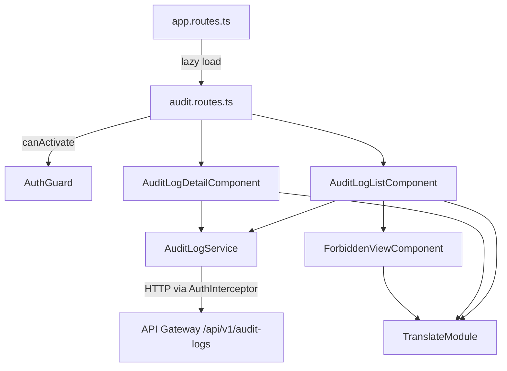
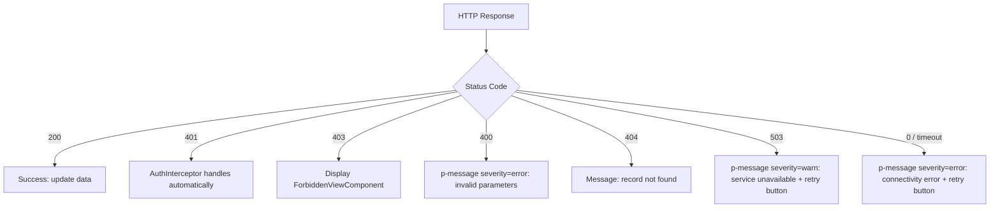

# Design Document: Audit UI

## Overview

This document describes the technical architecture of the audit-ui feature for the platform-frontend. The feature provides an interface for viewing, filtering, and inspecting audit logs consumed from the audit-service REST API. The design uses Angular 21 standalone components with signals, PrimeNG 21 (Aura preset), and @ngx-translate/core for i18n — without introducing new dependencies.

The feature consists of two page components (list and detail), an HTTP service, TypeScript interfaces for the API models, and an access-denied view component. Filter and pagination state is managed via URL query parameters, enabling shareable and reproducible queries.

**Implements:** Requirements 1–6

## Architecture

### Module Boundary

The entire feature lives under `src/app/features/audit/` as an independent lazy-loaded module. It depends only on existing infrastructure: `AuthGuard` for route protection, `AuthInterceptor` for Bearer token injection, and `TranslateModule` for i18n.

```
src/app/features/audit/
├── audit.routes.ts                    # Feature routes (lazy-loaded)
├── models/
│   └── audit-log.model.ts            # TypeScript interfaces (AuditLogResponse, PaginatedAuditLogResponse, AuditLogFilters)
├── services/
│   └── audit-log.service.ts          # HTTP service for API communication
├── pages/
│   ├── audit-log-list/
│   │   └── audit-log-list.component.ts   # List page with table and filters
│   └── audit-log-detail/
│       └── audit-log-detail.component.ts # Event detail page
└── components/
    └── forbidden-view/
        └── forbidden-view.component.ts   # Access denied component (403)
```

### Dependency Diagram



## Components and Interfaces

### 1. AuditLogService

Injectable service responsible for all HTTP communication with the audit-logs API. Uses `HttpClient` — the existing `AuthInterceptor` automatically attaches the Bearer token for requests to `apiGatewayUrl`.

**Implements:** Requirements 1 (AC 1, 3, 5), 2 (AC 2, 3), 3 (AC 1), 4 (AC 1, 3–5)

```typescript
@Injectable({ providedIn: 'root' })
class AuditLogService {
  private readonly http = inject(HttpClient);
  private readonly apiUrl = `${environment.apiGatewayUrl}/api/v1/audit-logs`;

  /**
   * Fetches a paginated list of audit logs with optional filters.
   * Null/undefined parameters are omitted from the query string.
   * Returns Observable<PaginatedAuditLogResponse>.
   */
  getAuditLogs(filters: AuditLogFilters): Observable<PaginatedAuditLogResponse>

  /**
   * Fetches a single audit log record by event_id.
   * Returns Observable<AuditLogResponse>.
   */
  getAuditLogByEventId(eventId: string): Observable<AuditLogResponse>
}
```

The `getAuditLogs` method builds `HttpParams` by iterating over the `AuditLogFilters` object, including only fields with non-null values. Date fields (`occurred_after`, `occurred_before`) are converted to ISO 8601 strings before sending.

### 2. AuditLogListComponent

Main feature page. Contains the paginated table (`p-table`) and the filter panel. Manages state via URL query parameters.

**Implements:** Requirements 1 (AC 1–8), 2 (AC 1–4), 4 (AC 1, 3–6), 5 (AC 2)

```typescript
@Component({
  selector: 'app-audit-log-list',
  standalone: true,
  changeDetection: ChangeDetectionStrategy.OnPush,
  imports: [
    TableModule, ButtonModule, InputTextModule, SelectModule,
    DatePickerModule, MessageModule, ProgressSpinnerModule,
    SkeletonModule, TranslateModule, ForbiddenViewComponent
  ]
})
class AuditLogListComponent implements OnInit {
  private readonly auditLogService = inject(AuditLogService);
  private readonly route = inject(ActivatedRoute);
  private readonly router = inject(Router);
  private readonly messageService = inject(MessageService);

  // State signals
  readonly logs = signal<AuditLogResponse[]>([]);
  readonly totalRecords = signal<number>(0);
  readonly loading = signal<boolean>(false);
  readonly forbidden = signal<boolean>(false);
  readonly errorMessage = signal<string | null>(null);

  // Pagination signals
  readonly limit = signal<number>(50);
  readonly offset = signal<number>(0);
  readonly rowsPerPageOptions = [20, 50, 100];

  // Filter signals (initialized from query params)
  readonly filters = signal<Partial<AuditLogFilterParams>>({});

  ngOnInit(): void
  // Reads query params from URL and initializes filter and pagination signals
  // Triggers the first request

  onPageChange(event: TablePageEvent): void
  // Calculates new offset from event.first and event.rows
  // Updates signals and URL query params
  // Triggers new request

  onApplyFilters(filterValues: Partial<AuditLogFilterParams>): void
  // Validates occurred_before > occurred_after
  // Resets offset to 0
  // Updates URL query params
  // Triggers new request

  onClearFilters(): void
  // Clears all filters
  // Resets offset to 0
  // Updates URL query params
  // Triggers new request

  onRowClick(log: AuditLogResponse): void
  // Navigates to /audit-logs/{event_id}

  private fetchLogs(): void
  // Sets loading = true
  // Calls auditLogService.getAuditLogs(...)
  // On subscribe:
  //   - Success: updates logs, totalRecords, loading = false
  //   - Error 403: forbidden = true, loading = false
  //   - Error 400: displays message via p-message
  //   - Error 503/network: displays message with retry option

  private syncQueryParams(): void
  // Updates the URL with current filters and pagination via router.navigate
  // with queryParamsHandling: 'merge' and replaceUrl: true
}
```

**Table columns (Requirement 1, AC 2):**

| Column | Field | Formatting |
|--------|-------|------------|
| Date/Time | `occurred_at` | Formatted by active locale (en: `MM/dd/yyyy HH:mm:ss`, pt: `dd/MM/yyyy HH:mm:ss`) |
| Event Type | `event_type` | Plain text |
| Actor | `actor_id` | Truncated UUID with full tooltip |
| Action | `action` | Plain text |
| Resource Type | `resource_type` | Plain text |
| Resource ID | `resource_id` | Truncated UUID with full tooltip |
| Outcome | `outcome` | Translated via i18n (`audit.outcome.success` / `audit.outcome.failure`) with colored badge |
| Producer | `producer` | Plain text |

**State management via query params (Requirement 3, AC 6):**

Filters and pagination are bidirectionally synchronized with URL query parameters:
- On initialization, query params populate the filter/pagination signals
- When filters or page change, query params are updated via `router.navigate` with `replaceUrl: true`
- This allows sharing URLs with preserved state (e.g., `/audit-logs?event_type=AuditDocumentCreated&limit=50&offset=0`)

### 3. AuditLogDetailComponent

Detail page that displays all 18 fields of an audit record.

**Implements:** Requirements 3 (AC 1–9), 4 (AC 1, 3–6)

```typescript
@Component({
  selector: 'app-audit-log-detail',
  standalone: true,
  changeDetection: ChangeDetectionStrategy.OnPush,
  imports: [
    CardModule, ButtonModule, PanelModule, ProgressSpinnerModule,
    MessageModule, TranslateModule, ClipboardModule, ForbiddenViewComponent
  ]
})
class AuditLogDetailComponent implements OnInit {
  private readonly auditLogService = inject(AuditLogService);
  private readonly route = inject(ActivatedRoute);
  private readonly router = inject(Router);
  private readonly messageService = inject(MessageService);

  readonly log = signal<AuditLogResponse | null>(null);
  readonly loading = signal<boolean>(true);
  readonly notFound = signal<boolean>(false);
  readonly forbidden = signal<boolean>(false);
  readonly metadataExpanded = signal<boolean>(false);

  ngOnInit(): void
  // Reads eventId from route param
  // Calls auditLogService.getAuditLogByEventId(eventId)
  // Handles errors: 404 → notFound, 403 → forbidden, others → message

  onBack(): void
  // Navigates to /audit-logs preserving previous query params
  // (listing query params remain in the origin URL)

  onCopyToClipboard(value: string): void
  // Copies value to clipboard via Clipboard API
  // Displays confirmation toast via messageService

  toggleMetadata(): void
  // Toggles metadataExpanded signal

  formatDateTime(date: string): string
  // Formats according to active locale
}
```

**Detail layout:**

The 18 fields are organized into logical sections using `p-card`:

1. **Event Identification**: `event_id`, `event_type`, `event_version`, `id`
2. **Timestamps**: `occurred_at`, `received_at`
3. **Traceability**: `correlation_id`, `request_id`, `trace_id`, `producer`
4. **Actor & Action**: `actor_id`, `actor_type`, `action`
5. **Resource**: `resource_type`, `resource_id`
6. **Outcome**: `outcome`, `failure_reason`
7. **Metadata**: expandable `<pre><code>` block with indented JSON, max-height with scroll

UUID fields (`event_id`, `correlation_id`, `actor_id`, `resource_id`, `request_id`) have a copy-to-clipboard button (PrimeNG `pi-copy` icon).

### 4. ForbiddenViewComponent

Reusable component displayed when the API returns HTTP 403.

**Implements:** Requirement 4 (AC 1), Requirement 5 (AC 2)

```typescript
@Component({
  selector: 'app-forbidden-view',
  standalone: true,
  changeDetection: ChangeDetectionStrategy.OnPush,
  imports: [CardModule, ButtonModule, TranslateModule]
})
class ForbiddenViewComponent {
  // Displays i18n message informing lack of permission
  // No technical details from the error response
  // Button to navigate to home page
}
```

### 5. Route Configuration

**Implements:** Requirement 5 (AC 1–3)

```typescript
// src/app/features/audit/audit.routes.ts
export const auditRoutes: Routes = [
  {
    path: '',
    component: AuditLogListComponent,
  },
  {
    path: ':eventId',
    component: AuditLogDetailComponent,
  },
];
```

```typescript
// Addition in src/app/app.routes.ts
{
  path: 'audit-logs',
  loadChildren: () => import('./features/audit/audit.routes').then(m => m.auditRoutes),
  canActivate: [AuthGuard],
}
```

The route uses `loadChildren` for lazy loading the module. The `AuthGuard` protects both routes (list and detail) via `canActivate` at the parent level.

## Data Models

### TypeScript Interfaces

```typescript
// src/app/features/audit/models/audit-log.model.ts

export interface AuditLogResponse {
  id: string;
  event_id: string;
  event_type: string;
  event_version: string;
  occurred_at: string;       // ISO 8601
  correlation_id: string;
  request_id: string | null;
  trace_id: string | null;
  producer: string;
  actor_id: string;
  actor_type: string;
  action: string;
  resource_type: string;
  resource_id: string;
  outcome: 'success' | 'failure';
  metadata: Record<string, unknown> | null;
  failure_reason: string | null;
  received_at: string;       // ISO 8601
}

export interface PaginatedAuditLogResponse {
  items: AuditLogResponse[];
  total: number;
  limit: number;
  offset: number;
}

export interface AuditLogFilterParams {
  event_type: string | null;
  resource_type: string | null;
  outcome: 'success' | 'failure' | null;
  producer: string | null;
  actor_id: string | null;
  correlation_id: string | null;
  resource_id: string | null;
  occurred_after: string | null;   // ISO 8601
  occurred_before: string | null;  // ISO 8601
}

export interface AuditLogQueryParams extends Partial<AuditLogFilterParams> {
  limit: number;
  offset: number;
}

export interface ApiErrorResponse {
  error: string;
  message: string;
  request_id: string;
}
```

### API → PrimeNG Table Mapping

The `PaginatedAuditLogResponse` envelope maps directly to `p-table`:

| API Field | p-table Property | Description |
|-----------|------------------|-------------|
| `items` | `[value]` | Array of displayed records |
| `total` | `[totalRecords]` | Total for pagination |
| `limit` | `[rows]` | Records per page |
| `offset` | `[first]` | Index of first visible record |

The `p-table` is configured with `[lazy]="true"` and `(onLazyLoad)` for server-side pagination.

## Correctness Properties

*A property is a characteristic or behavior that must be true in all valid executions of a system — essentially, a formal statement about what the system must do. Properties serve as a bridge between human-readable specifications and machine-verifiable correctness guarantees.*

### Property 1: Pagination Envelope Mapping

*For any* valid `PaginatedAuditLogResponse` with arbitrary `items`, `total`, `limit`, and `offset`, the mapping to `p-table` must result in: `[value]` containing exactly the items from `items`, `[totalRecords]` equal to `total`, `[rows]` equal to `limit`, and `[first]` equal to `offset`.

**Validates: Requirements 1.3, 1.6**

### Property 2: Filter and Pagination to HTTP Query Params Mapping

*For any* combination of filter values (some filled, some null) and pagination state (`limit`, `offset`), the HTTP request generated by `AuditLogService.getAuditLogs()` must include as query parameters only the filters with non-null values, plus `limit` and `offset`. When filters are applied, `offset` must be reset to 0.

**Validates: Requirements 1.5, 2.2**

### Property 3: Date Range Validation

*For any* pair of dates where `occurred_before` is earlier than `occurred_after`, filter validation must reject the submission and prevent the request from being sent. *For any* pair where `occurred_before` is later than or equal to `occurred_after`, validation must accept.

**Validates: Requirements 2.4**

### Property 4: Field Completeness in Detail

*For any* randomly generated `AuditLogResponse` (with optional fields null or filled), the `AuditLogDetailComponent` must render all 18 model fields. Null fields (`request_id`, `trace_id`, `metadata`, `failure_reason`) must display an absence indicator.

**Validates: Requirements 3.2**

### Property 5: Metadata Formatting as JSON

*For any* `metadata` object (arbitrary dictionary with nested values), the detail rendering must produce a valid, indented JSON string that, when parsed via `JSON.parse()`, is equivalent to the original object.

**Validates: Requirements 3.3**

### Property 6: Date/Time Formatting by Locale

*For any* valid ISO 8601 date string and *for each* locale (`en`, `pt`), the formatting function must produce a string in the expected format: `MM/dd/yyyy HH:mm:ss` for `en` and `dd/MM/yyyy HH:mm:ss` for `pt`.

**Validates: Requirements 3.5, 6.3**

### Property 7: Copy-to-Clipboard Preserves Exact Value

*For any* UUID string, the copy-to-clipboard function must copy exactly the original value without modification (no extra spaces, truncation, or transformation).

**Validates: Requirements 3.9**

### Property 8: Error Message Sanitization

*For any* `ApiErrorResponse` containing `error`, `message`, and `request_id`, the message displayed to the user via `p-message`/`p-toast` must not contain the `request_id` field, stack traces, or the raw error response body.

**Validates: Requirements 4.6**

### Property 9: Translation Key Completeness and Format

*For every* translation key in the `audit` namespace present in `en.json`, there must be a corresponding key in `pt.json` (and vice versa). All keys must follow the format `audit.{section}.{element}`.

**Validates: Requirements 6.1, 6.2**

## Error Handling

### HTTP Error Handling Strategy

Error handling is centralized in the `fetchLogs()` method of `AuditLogListComponent` and in the `ngOnInit()` of `AuditLogDetailComponent`. The logic follows a decision chain based on HTTP status:



### Detail by Error Code

| HTTP Status | Component | Behavior | i18n Key |
|-------------|-----------|----------|----------|
| 403 | `ForbiddenViewComponent` | Replaces entire page content | `audit.error.forbidden` |
| 400 | `p-message` | Inline message above table | `audit.error.badRequest` |
| 404 | `p-message` | Message on detail page with back button | `audit.error.notFound` |
| 503 | `p-message` | Message with "Try again" button | `audit.error.serviceUnavailable` |
| 0 / timeout | `p-message` | Message with "Try again" button | `audit.error.networkError` |

### Security Rules

- Error messages NEVER expose `request_id`, stack traces, or raw response body
- The `message` field from `ApiErrorResponse` is NOT displayed to the user — only predefined i18n keys
- The `ForbiddenViewComponent` does not mention specific permissions (`audit_log, read`) — only generically informs that access is not allowed

### Retry

Errors 503 and network errors offer a "Try again" button that re-executes `fetchLogs()` or reloads the detail. There is no automatic retry — the user decides when to try again.

## Testing Strategy

### Dual Approach: Unit Tests + Property Tests

The feature uses **Vitest** as the testing framework, as already configured in the project.

#### Unit Tests (specific examples and edge cases)

Focus on concrete scenarios and boundary conditions:

- **AuditLogService**: mock `HttpClient`, verify URLs and params for specific scenarios
- **AuditLogListComponent**: table rendering with mock data, empty state, loading state, handling of each HTTP error code (403, 400, 503, network)
- **AuditLogDetailComponent**: rendering of all fields, null vs. filled metadata, failure_reason present vs. absent, 404 handling
- **ForbiddenViewComponent**: message rendering without technical details
- **Routes**: AuthGuard verification in canActivate, lazy loading configured
- **i18n**: outcome correctly translated for both locales

#### Property-Based Testing

Uses **fast-check** as the property-based testing library for Vitest.

**Configuration**: minimum 100 iterations per property test.

Each property test references the design document property via tag:

```typescript
// Feature: audit-ui, Property 1: Pagination envelope mapping
test.prop('pagination envelope maps correctly to p-table inputs', [paginatedResponseArbitrary], (response) => {
  // ...
}, { numRuns: 100 });
```

**Properties to implement:**

| Property | Description | Generators |
|----------|-------------|------------|
| 1 | Pagination envelope mapping | `PaginatedAuditLogResponse` with random items, total, limit, offset |
| 2 | Filter mapping to query params | `Partial<AuditLogFilterParams>` with random combinations of null/filled filters |
| 3 | Date range validation | Random `Date` pairs |
| 4 | Field completeness in detail | `AuditLogResponse` with optional fields null/filled |
| 5 | Metadata formatting as JSON | Random nested `Record<string, unknown>` objects |
| 6 | Date/time formatting by locale | Random ISO 8601 strings × locales (en, pt) |
| 7 | Copy-to-clipboard preserves value | Random UUIDs |
| 8 | Error message sanitization | `ApiErrorResponse` with random request_id and messages |
| 9 | Translation key completeness | Static verification of JSON files (executed once) |

### Generators (fast-check Arbitraries)

```typescript
// Arbitrary for AuditLogResponse
const auditLogResponseArb = fc.record({
  id: fc.uuid(),
  event_id: fc.uuid(),
  event_type: fc.string({ minLength: 1, maxLength: 50 }),
  event_version: fc.constant('1.0.0'),
  occurred_at: fc.date().map(d => d.toISOString()),
  correlation_id: fc.uuid(),
  request_id: fc.option(fc.uuid()),
  trace_id: fc.option(fc.string({ minLength: 1 })),
  producer: fc.string({ minLength: 1, maxLength: 30 }),
  actor_id: fc.uuid(),
  actor_type: fc.string({ minLength: 1, maxLength: 20 }),
  action: fc.string({ minLength: 1, maxLength: 30 }),
  resource_type: fc.string({ minLength: 1, maxLength: 30 }),
  resource_id: fc.uuid(),
  outcome: fc.constantFrom('success', 'failure'),
  metadata: fc.option(fc.dictionary(fc.string(), fc.jsonValue())),
  failure_reason: fc.option(fc.string({ minLength: 1 })),
  received_at: fc.date().map(d => d.toISOString()),
});

// Arbitrary for PaginatedAuditLogResponse
const paginatedResponseArb = fc.record({
  items: fc.array(auditLogResponseArb, { maxLength: 100 }),
  total: fc.nat({ max: 10000 }),
  limit: fc.constantFrom(20, 50, 100),
  offset: fc.nat({ max: 9999 }),
});

// Arbitrary for partial filters
const filterParamsArb = fc.record({
  event_type: fc.option(fc.string({ minLength: 1 })),
  resource_type: fc.option(fc.string({ minLength: 1 })),
  outcome: fc.option(fc.constantFrom('success', 'failure')),
  producer: fc.option(fc.string({ minLength: 1 })),
  actor_id: fc.option(fc.uuid()),
  correlation_id: fc.option(fc.uuid()),
  resource_id: fc.option(fc.uuid()),
  occurred_after: fc.option(fc.date().map(d => d.toISOString())),
  occurred_before: fc.option(fc.date().map(d => d.toISOString())),
});
```

### Test File Structure

```
src/app/features/audit/
├── services/
│   └── audit-log.service.spec.ts        # Unit tests + properties 1, 2
├── pages/
│   ├── audit-log-list/
│   │   └── audit-log-list.component.spec.ts  # Unit tests + property 3
│   └── audit-log-detail/
│       └── audit-log-detail.component.spec.ts # Unit tests + properties 4, 5, 6, 7
├── components/
│   └── forbidden-view/
│       └── forbidden-view.component.spec.ts   # Unit tests + property 8
└── models/
    └── audit-log.model.spec.ts               # Property 9 (i18n validation)
```

## Dependency Summary

No new dependencies outside the approved stack in [ARCH-001]:

| Dependency | Purpose | Status |
|------------|---------|--------|
| `@angular/core`, `@angular/router`, `@angular/common/http` | Framework | In stack |
| `primeng` (TableModule, CardModule, ButtonModule, InputTextModule, SelectModule, DatePickerModule, MessageModule, PanelModule, ProgressSpinnerModule, SkeletonModule) | UI Components | In stack |
| `@ngx-translate/core` | i18n | In stack |
| `fast-check` | Property-based testing | Dev dependency for tests |

## i18n — Translation Keys

Namespace: `audit`

### Key Structure

```json
{
  "audit": {
    "page": {
      "title": "Audit Logs / Logs de Auditoria"
    },
    "table": {
      "occurredAt": "Date/Time / Data/Hora",
      "eventType": "Event Type / Tipo de Evento",
      "actorId": "Actor / Ator",
      "action": "Action / Ação",
      "resourceType": "Resource Type / Tipo de Recurso",
      "resourceId": "Resource ID / ID do Recurso",
      "outcome": "Outcome / Resultado",
      "producer": "Producer / Produtor",
      "empty": "No records found. / Nenhum registro encontrado.",
      "totalRecords": "{{count}} records / {{count}} registros"
    },
    "filter": {
      "eventType": "Event Type / Tipo de Evento",
      "resourceType": "Resource Type / Tipo de Recurso",
      "outcome": "Outcome / Resultado",
      "producer": "Producer / Produtor",
      "actorId": "Actor ID",
      "correlationId": "Correlation ID",
      "resourceId": "Resource ID",
      "occurredAfter": "From / De",
      "occurredBefore": "To / Até",
      "apply": "Apply Filters / Aplicar Filtros",
      "clear": "Clear / Limpar",
      "dateValidation": "End date must be after start date. / Data final deve ser posterior à data inicial."
    },
    "outcome": {
      "success": "Success / Sucesso",
      "failure": "Failure / Falha"
    },
    "detail": {
      "title": "Audit Event Detail / Detalhe do Evento",
      "back": "Back to list / Voltar à listagem",
      "copied": "Copied to clipboard / Copiado para a área de transferência",
      "metadata": "Metadata",
      "metadataEmpty": "No metadata / Sem metadata",
      "failureReason": "Failure Reason / Motivo da Falha",
      "failureReasonEmpty": "N/A",
      "sectionIdentification": "Event Identification / Identificação do Evento",
      "sectionTemporal": "Timestamps",
      "sectionTraceability": "Traceability / Rastreabilidade",
      "sectionActor": "Actor & Action / Ator e Ação",
      "sectionResource": "Resource / Recurso",
      "sectionOutcome": "Outcome / Resultado"
    },
    "error": {
      "forbidden": "You do not have permission to access audit logs. / Você não tem permissão para acessar logs de auditoria.",
      "forbiddenAction": "Return to home / Voltar ao início",
      "badRequest": "Invalid query parameters. Please review your filters. / Parâmetros de consulta inválidos. Revise seus filtros.",
      "notFound": "Audit record not found. / Registro de auditoria não encontrado.",
      "serviceUnavailable": "Audit service is temporarily unavailable. / Serviço de auditoria temporariamente indisponível.",
      "networkError": "Connection error. Please check your network. / Erro de conexão. Verifique sua rede.",
      "retry": "Try again / Tentar novamente"
    }
  }
}

> Note: The values above show English only. In the actual files, each locale will have only its values in the corresponding language.

## References

- [DS-001] PrimeNG Design System — Aura preset, standard components
- [ARCH-001] System Architecture — Communication via API Gateway
- [ARCH-002] API Standards — Pagination envelope `{items, total, limit, offset}`
- [ARCH-008] i18n Standards — Key format `namespace.section.element`
- [SEC-002] Authorization Model — RBAC on backend, frontend handles 403
- Requirement 7 from login-ui — Token refresh flow (AuthInterceptor)
