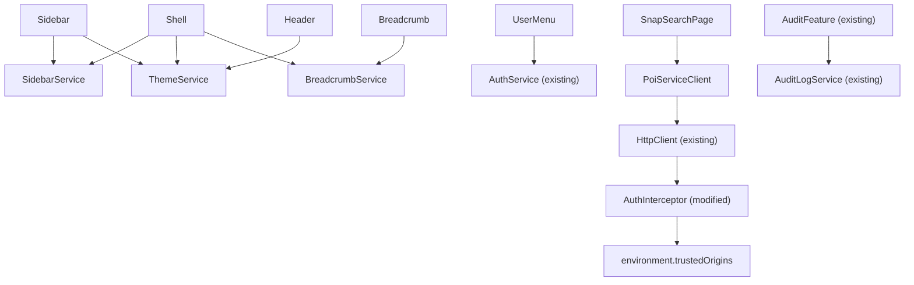
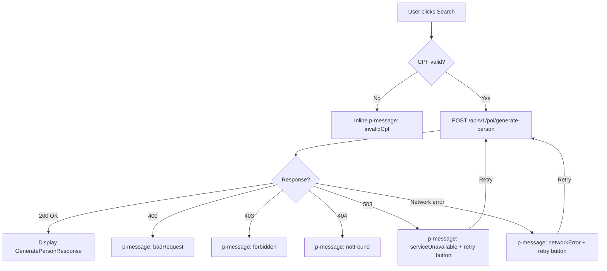

# Design Document — POI SNAP Integration

## Overview

This design covers the integration of the POI SNAP feature into platform-frontend, spanning five areas:

1. **Application Shell** — A layout component (sidebar, header, breadcrumb, content area) that wraps all protected routes, ported from the ApolloUI prototype and adapted to the existing Keycloak auth system.
2. **SNAP Search** — A CPF lookup page that calls `POST /api/v1/poi/generate-person` via the API Gateway and displays report generation confirmation.
3. **Audit Adaptation** — The existing audit feature re-parented under the Shell layout with no business logic changes.
4. **ApoloPreset** — A custom PrimeNG theme preset using OKLCH color tokens on top of the Aura base.
5. **Multi-Origin Auth** — Refactoring `AuthInterceptor` from single-origin (`apiGatewayUrl`) to a whitelist-based `trustedOrigins` array.

All components are Angular 21 standalone, use `ChangeDetectionStrategy.OnPush` with signals, and are tested with Vitest. PrimeNG 21 components are used exclusively for UI patterns. i18n uses `@ngx-translate/core` with `en.json` and `pt.json` locales.

## Architecture

### High-Level Layout

```
┌─────────────────────────────────────────────────────┐
│                    AppComponent                      │
│                   <router-outlet />                  │
│                                                      │
│  ┌─── Auth Routes (/auth/*) ───────────────────────┐ │
│  │  callback, session-expired, auth-error          │ │
│  └─────────────────────────────────────────────────┘ │
│                                                      │
│  ┌─── ShellComponent (protected routes) ───────────┐ │
│  │ ┌──────────┐ ┌────────────────────────────────┐ │ │
│  │ │          │ │ HeaderComponent                 │ │ │
│  │ │ Sidebar  │ ├────────────────────────────────┤ │ │
│  │ │Component │ │ BreadcrumbComponent             │ │ │
│  │ │          │ ├────────────────────────────────┤ │ │
│  │ │          │ │ <router-outlet /> (content)    │ │ │
│  │ │          │ │  - /snap → SnapSearchPage      │ │ │
│  │ │          │ │  - /audit-logs → AuditFeature  │ │ │
│  │ └──────────┘ └────────────────────────────────┘ │ │
│  └─────────────────────────────────────────────────┘ │
└─────────────────────────────────────────────────────┘
```

### Route Tree

```
/auth/*              → Auth pages (outside Shell, no guard)
/                    → ShellComponent (AuthGuard)
  ├── (default)      → redirectTo /snap
  ├── snap           → lazy SnapSearchPage
  └── audit-logs     → lazy AuditFeature (existing)
        ├── (list)
        └── :eventId (detail)
**                   → redirectTo /
```

### Module Organization

```
src/app/
  shell/
    shell.ts, shell.html, shell.scss          # ShellComponent (layout)
    sidebar/
      sidebar.ts, sidebar.html, sidebar.scss  # SidebarComponent
      sidebar.service.ts                      # SidebarService (mode, hover, sections)
      sidebar.model.ts                        # NavSection, NavItem types
    header/
      header.ts, header.html, header.scss     # HeaderComponent
    breadcrumb/
      breadcrumb.ts, breadcrumb.html          # BreadcrumbComponent
      breadcrumb.service.ts                   # BreadcrumbService (label overrides)
    user-menu/
      user-menu.ts, user-menu.html            # UserMenuComponent
    theme.service.ts                          # ThemeService (light/dark, localStorage)
  features/
    snap/
      snap.routes.ts                          # Lazy-loaded routes
      pages/
        snap-search/
          snap-search.ts, snap-search.html, snap-search.scss
      services/
        poi-service-client.ts                 # POI_Service_Client
      models/
        poi.model.ts                          # GeneratePersonRequest/Response
    audit/                                    # (existing, unchanged)
  auth/                                       # (existing, unchanged except interceptor)
    interceptors/
      auth.interceptor.ts                     # Modified: trustedOrigins whitelist
  themes/
    apolo-preset.ts                           # ApoloPreset (custom PrimeNG preset)
```

### Dependency Flow



## Components and Interfaces

### 1. ShellComponent

- **Selector:** `app-shell`
- **Role:** Layout wrapper for all protected routes. Renders Sidebar, Header, Breadcrumb, `<router-outlet />`, `p-toast`, and `p-confirmdialog`.
- **Template structure:**
  ```html
  <div class="shell" [style.margin-left.px]="contentMargin()">
    <app-sidebar />
    <div class="shell__main">
      <app-header />
      <app-breadcrumb />
      <main class="shell__content">
        <router-outlet />
      </main>
    </div>
  </div>
  <p-toast position="top-right" />
  <p-confirmdialog />
  ```
- **Signals:**
  - `contentMargin = computed(() => sidebarService.isPinned() ? 280 : 64)` — drives dynamic `margin-left`.
- **Layout:** Flex row, `height: 100vh`, overflow hidden on outer, scroll on `.shell__content`.

### 2. SidebarComponent

- **Selector:** `app-sidebar`
- **Role:** Side navigation with three display modes.
- **Inputs:** None (reads from `SidebarService`).
- **Behavior:**
  - Renders navigation sections from `SidebarService.sections` signal.
  - Listens to `mouseenter`/`mouseleave` for auto-expand in `auto` mode.
  - Displays `snap-black.svg` or `snap-white.svg` based on `ThemeService.isDark()`.
  - Pin button toggles `pinned` ↔ `auto`; collapse button sets `collapsed`; hamburger cycles modes.
- **Styles:**
  - Width: `280px` (expanded) / `64px` (collapsed).
  - In `auto` mode when hovered: `position: fixed`, `z-index: 10`, `box-shadow` (floating, no content displacement).
  - In `pinned` mode: static positioning, content displaced via Shell's `margin-left`.

### 3. SidebarService

- **Injectable:** `providedIn: 'root'`
- **State (signals):**
  - `mode: WritableSignal<'pinned' | 'auto' | 'collapsed'>` — current display mode.
  - `isHovered: WritableSignal<boolean>` — whether cursor is over sidebar.
  - `openSections: WritableSignal<Set<string>>` — expanded section IDs.
  - `isExpanded = computed(() => mode() === 'pinned' || (mode() === 'auto' && isHovered()))` — derived.
  - `isPinned = computed(() => mode() === 'pinned')` — derived.
  - `effectiveWidth = computed(() => isExpanded() ? 280 : 64)` — derived.
- **Methods:**
  - `togglePin()` — toggles between `pinned` and `auto`.
  - `collapse()` — sets mode to `collapsed`.
  - `cycleMode()` — `pinned` → `auto` → `collapsed` → `pinned`.
  - `setHovered(value: boolean)` — updates `isHovered`.
  - `toggleSection(sectionId: string)` — toggles section in `openSections`.
- **Navigation data:**
  - `sections: Signal<NavSection[]>` — static configuration:
    ```typescript
    [
      {
        id: 'intelligence',
        label: 'shell.nav.intelligence',
        icon: 'pi pi-shield',
        items: [{ label: 'shell.nav.snapSearch', icon: 'pi pi-database', route: '/snap' }],
      },
      {
        id: 'administration',
        label: 'shell.nav.administration',
        icon: 'pi pi-lock',
        items: [{ label: 'shell.nav.audit', icon: 'pi pi-shield', route: '/audit-logs' }],
      },
    ];
    ```

### 4. HeaderComponent

- **Selector:** `app-header`
- **Role:** Top bar with logo, brand name, subtitle, and theme toggle.
- **Template:** Organization logo (`logo_seap_rio.png`), brand text, `p-toggleswitch` bound to `ThemeService.isDark()`.
- **Style:** Fixed height `64px`, bottom border, flex row with `justify-content: space-between`.

### 5. ThemeService

- **Injectable:** `providedIn: 'root'`
- **State:**
  - `isDark: WritableSignal<boolean>` — initialized from localStorage (`apolo-theme`) or `prefers-color-scheme`.
- **Methods:**
  - `toggle()` — flips `isDark`, updates `<html>` class `p-dark`, persists to localStorage key `apolo-theme`.
- **Initialization logic:**
  1. Read `localStorage.getItem('apolo-theme')`.
  2. If `'dark'` → `isDark = true`. If `'light'` → `isDark = false`.
  3. If absent → `isDark = window.matchMedia('(prefers-color-scheme: dark)').matches`.
  4. Apply `p-dark` class to `document.documentElement` accordingly.

### 6. BreadcrumbComponent

- **Selector:** `app-breadcrumb`
- **Role:** Hierarchical navigation from URL segments.
- **Behavior:**
  - Subscribes to `Router.events` (or uses `BreadcrumbService`) to build items from URL.
  - Maps known segments to labels: `snap` → `shell.breadcrumb.snap`, `audit-logs` → `shell.breadcrumb.audit`.
  - Last item rendered as plain text; others as `routerLink`.
  - Separator: `›`.

### 7. BreadcrumbService

- **Injectable:** `providedIn: 'root'`
- **State:**
  - `overrides: WritableSignal<Map<string, string>>` — segment → label overrides (e.g., UUID → readable name).
- **Methods:**
  - `setOverride(segment: string, label: string)` — adds override.
  - `clearOverride(segment: string)` — removes override.
  - `getLabel(segment: string): string` — returns override if present, else known label, else segment.

### 8. UserMenuComponent

- **Selector:** `app-user-menu`
- **Role:** Displays logged-in user info in sidebar footer.
- **Behavior:**
  - Reads user from `AuthService.sessionState$` → `UserProfile` (`name`, `preferredUsername`).
  - Computes initials from first two words of `name` (e.g., "Victor Salles" → "VS").
  - When sidebar expanded: shows avatar (initials), full name, role. Click opens popup menu with "Sign Out".
  - When sidebar collapsed: shows avatar only with tooltip.
  - "Sign Out" calls `AuthService.logout()`.
- **Note:** Role information comes from the Keycloak token. The existing `UserProfile` has `sub`, `preferredUsername`, `name`, `email`. If role is not available in the current token claims, the component will display `preferredUsername` as a fallback. No changes to `UserProfile` model are made without explicit approval.

### 9. SnapSearchPage

- **Selector:** `app-snap-search`
- **Role:** CPF lookup page for SNAP report generation.
- **State (signals):**
  - `cpfInput: WritableSignal<string>` — raw formatted CPF value.
  - `cpfDigits = computed(() => cpfInput().replace(/\D/g, ''))` — digits only.
  - `isValid = computed(() => cpfDigits().length === 11)` — validation.
  - `loading: WritableSignal<boolean>` — request in progress.
  - `result: WritableSignal<GeneratePersonResponse | null>` — success response.
  - `error: WritableSignal<SnapSearchError | null>` — error state.
- **CPF formatting:** As user types, apply mask `000.000.000-00` (max 14 chars). Strip to digits before sending.
- **Search flow:**
  1. User enters CPF, clicks search or presses Enter.
  2. Validate 11 digits. If invalid, show inline error via `p-message`.
  3. Set `loading(true)`, disable button.
  4. Call `PoiServiceClient.generatePerson(cpfDigits())`.
  5. On success: set `result()`, clear `error()`.
  6. On error: map HTTP status to user-friendly message, set `error()`.
- **Error mapping:**
  - 400 → `snap.error.badRequest`
  - 403 → `snap.error.forbidden`
  - 404 → `snap.error.notFound`
  - 503 → `snap.error.serviceUnavailable` (with retry button)
  - Network error → `snap.error.networkError` (with retry button)

### 10. PoiServiceClient

- **Injectable:** `providedIn: 'root'`
- **Interface:**

  ```typescript
  @Injectable({ providedIn: 'root' })
  export class PoiServiceClient {
    private readonly http = inject(HttpClient);
    private readonly apiUrl = `${environment.apiGatewayUrl}/api/v1/poi`;

    generatePerson(cpf: string): Observable<GeneratePersonResponse> {
      const sanitized = cpf.replace(/\D/g, '');
      return this.http.post<GeneratePersonResponse>(`${this.apiUrl}/generate-person`, {
        cpf: sanitized,
      });
    }
  }
  ```

- **Design decision:** Uses `environment.apiGatewayUrl` for the base URL (same as `AuditLogService`). The `AuthInterceptor` handles token attachment automatically since the API Gateway origin is in `trustedOrigins`.

### 11. ApoloPreset

- **Location:** `src/app/themes/apolo-preset.ts`
- **Approach:** Uses PrimeNG's `definePreset()` with Aura as base, overriding color semantic tokens.
- **Color palettes (OKLCH):**
  - **Primary (steel/blue-gray):** 50–950 scale.
  - **Surface (gray-brand):** 0–950 scale for backgrounds, borders, text.
  - **Danger (crimson)**, **Info (blue)**, **Success (green)**, **Warn (orange)**: semantic palettes.
- **Integration:** Configured in `app.config.ts` via `providePrimeNG({ theme: { preset: ApoloPreset } })`, replacing the current `Aura` import.
- **Light/dark:** PrimeNG handles mode switching automatically via the `p-dark` CSS class managed by `ThemeService`.

### 12. AuthInterceptor (Modified)

- **Change scope:** Replace single-origin check with whitelist-based check.
- **Current logic:**
  ```typescript
  const apiOrigin = new URL(environment.apiGatewayUrl).origin;
  const reqOrigin = new URL(req.url, window.location.origin).origin;
  if (reqOrigin !== apiOrigin) {
    return next.handle(req);
  }
  ```
- **New logic:**
  ```typescript
  const reqOrigin = new URL(req.url, window.location.origin).origin;
  const isTrusted = environment.trustedOrigins.some(
    (origin) => new URL(origin).origin === reqOrigin,
  );
  if (!isTrusted) {
    return next.handle(req);
  }
  ```
- **All other interceptor logic remains unchanged:** token refresh, 401 retry, replay backpressure, credential redaction.
- **⚠️ Security note:** This change modifies authentication logic and requires security review before merge per [SEC-001].

## Data Models

### Navigation Models (`sidebar.model.ts`)

```typescript
export interface NavItem {
  label: string; // i18n translation key
  icon: string; // PrimeNG icon class (e.g., 'pi pi-database')
  route: string; // Router path (e.g., '/snap')
}

export interface NavSection {
  id: string; // Unique section identifier
  label: string; // i18n translation key
  icon: string; // PrimeNG icon class
  items: NavItem[]; // Navigation items in this section
}
```

### POI Models (`poi.model.ts`)

```typescript
export interface GeneratePersonRequest {
  cpf: string; // 11 numeric digits, no formatting
}

export interface GeneratePersonResponse {
  file_path: string;
  bucket: string;
  report_name: string;
}
```

### SNAP Search Error Model

```typescript
export type SnapSearchErrorCode =
  | 'badRequest'
  | 'forbidden'
  | 'notFound'
  | 'serviceUnavailable'
  | 'networkError';

export interface SnapSearchError {
  code: SnapSearchErrorCode;
  retryable: boolean;
}
```

### Environment Configuration (Modified)

```typescript
// environment.ts — changes only
export const environment = {
  // ... existing keycloak, auth, credentialStrategy, csp fields unchanged
  apiGatewayUrl: 'http://localhost:8080', // kept for backward compat (AuditLogService, PoiServiceClient base URL)
  trustedOrigins: [
    'http://localhost:8080', // API Gateway
  ],
};
```

**Design decision:** `apiGatewayUrl` is retained as the base URL for HTTP services (`AuditLogService`, `PoiServiceClient`). `trustedOrigins` is a separate array used exclusively by `AuthInterceptor` for the credential attachment whitelist. This avoids a breaking change to existing services that reference `apiGatewayUrl`.

### i18n Keys (New Namespaces)

**`shell` namespace** (added to `en.json` / `pt.json`):

```json
{
  "shell": {
    "nav": {
      "intelligence": "Intelligence",
      "snapSearch": "SNAP Search",
      "administration": "Administration",
      "audit": "Audit"
    },
    "breadcrumb": {
      "home": "Home",
      "snap": "SNAP Search",
      "audit": "Audit",
      "auditDetail": "Event Detail"
    },
    "userMenu": {
      "signOut": "Sign Out"
    },
    "brand": {
      "name": "SNAP Apolo",
      "subtitle": "Intelligence Platform"
    }
  }
}
```

**`snap` namespace** (added to `en.json` / `pt.json`):

```json
{
  "snap": {
    "title": "SNAP Search",
    "subtitle": "Search for person reports by CPF",
    "cpfLabel": "CPF",
    "cpfPlaceholder": "000.000.000-00",
    "searchButton": "Search",
    "loading": "Generating report...",
    "result": {
      "title": "Report Generated",
      "reportName": "Report Name",
      "filePath": "File Path",
      "bucket": "Storage Bucket"
    },
    "error": {
      "invalidCpf": "Please enter a valid CPF with 11 digits.",
      "badRequest": "Invalid CPF or request parameters.",
      "forbidden": "You do not have permission to perform SNAP searches.",
      "notFound": "No results found for the given CPF.",
      "serviceUnavailable": "SNAP service is temporarily unavailable.",
      "networkError": "Connection error. Please check your network.",
      "retry": "Try again"
    }
  }
}
```

### Static Assets

| File                | Source           | Destination               | Usage                               |
| ------------------- | ---------------- | ------------------------- | ----------------------------------- |
| `logo_seap_rio.png` | ApolloUI/public/ | platform-frontend/public/ | Header organization logo            |
| `snap-black.svg`    | ApolloUI/public/ | platform-frontend/public/ | Sidebar logo (light theme)          |
| `snap-white.svg`    | ApolloUI/public/ | platform-frontend/public/ | Sidebar logo (dark theme)           |
| `favicon.ico`       | ApolloUI/public/ | platform-frontend/public/ | Browser tab icon (replaces default) |

## Correctness Properties

_A property is a characteristic or behavior that should hold true across all valid executions of a system — essentially, a formal statement about what the system should do. Properties serve as the bridge between human-readable specifications and machine-verifiable correctness guarantees._

### Property 1: Sidebar effective width follows mode and hover state

_For any_ sidebar mode (`pinned`, `auto`, `collapsed`) and any hover state (`true`, `false`), the `SidebarService.effectiveWidth` signal shall return:

- `280` when mode is `pinned` (regardless of hover),
- `280` when mode is `auto` and hovered is `true`, `64` when hovered is `false`,
- `64` when mode is `collapsed` (regardless of hover).

And the Shell's `contentMargin` shall equal `280` when mode is `pinned`, and `64` otherwise.

**Validates: Requirements 1.2, 2.2, 2.3, 2.5**

### Property 2: togglePin is a round-trip between pinned and auto

_For any_ starting mode that is either `pinned` or `auto`, calling `SidebarService.togglePin()` twice shall return the mode to its original value.

**Validates: Requirements 2.6**

### Property 3: collapse always sets mode to collapsed

_For any_ starting sidebar mode, calling `SidebarService.collapse()` shall result in the mode being `collapsed`.

**Validates: Requirements 2.7**

### Property 4: cycleMode follows the defined sequence

_For any_ current sidebar mode, calling `SidebarService.cycleMode()` shall produce the next mode in the sequence `pinned` → `auto` → `collapsed` → `pinned`.

**Validates: Requirements 2.8**

### Property 5: Section toggle is a round-trip

_For any_ section ID, calling `SidebarService.toggleSection(id)` twice shall return the section's open state to its original value.

**Validates: Requirements 3.4**

### Property 6: Theme toggle flips isDark and updates p-dark class

_For any_ current theme state, calling `ThemeService.toggle()` shall flip the `isDark` signal and the presence of the `p-dark` class on `document.documentElement` shall equal the new `isDark` value.

**Validates: Requirements 4.4, 5.2**

### Property 7: Theme persistence round-trip

_For any_ theme preference (`dark` or `light`) stored in localStorage under key `apolo-theme`, initializing a new `ThemeService` instance shall result in `isDark` matching the stored preference (`dark` → `true`, `light` → `false`). Conversely, after toggling the theme, localStorage shall contain the corresponding value.

**Validates: Requirements 5.3, 5.4**

### Property 8: Breadcrumb generates correct items from URL segments

_For any_ valid URL path composed of known segments, the `BreadcrumbService` shall produce breadcrumb items where each item's label matches the known mapping for that segment (or the override if one is set).

**Validates: Requirements 6.1, 6.2**

### Property 9: Breadcrumb last item is non-navigable

_For any_ breadcrumb with two or more items, all items except the last shall be navigable links, and the last item shall be plain text.

**Validates: Requirements 6.3**

### Property 10: Breadcrumb label override round-trip

_For any_ URL segment and any override label string, calling `BreadcrumbService.setOverride(segment, label)` then `getLabel(segment)` shall return the override label. Calling `clearOverride(segment)` then `getLabel(segment)` shall return the default label.

**Validates: Requirements 6.5**

### Property 11: User initials computation

_For any_ name string with at least two words, the computed initials shall be the uppercase first character of the first word concatenated with the uppercase first character of the second word. For a single-word name, the initial shall be the uppercase first character only.

**Validates: Requirements 7.5**

### Property 12: Sidebar logo matches theme

_For any_ theme state, the sidebar logo `src` shall be `snap-black.svg` when `isDark` is `false` and `snap-white.svg` when `isDark` is `true`.

**Validates: Requirements 8.2**

### Property 13: ApoloPreset color tokens use OKLCH format

_For any_ color token in the ApoloPreset's primary and surface palettes, the value shall be a valid OKLCH color string (matching the pattern `oklch(...)`).

**Validates: Requirements 9.2, 9.4**

### Property 14: CPF formatting mask

_For any_ sequence of 1 to 11 numeric digits, the CPF formatting function shall produce a string matching the progressive mask `0`, `00`, `000`, `000.0`, ..., `000.000.000-00`, and the output shall contain exactly the same digits in the same order as the input.

**Validates: Requirements 10.2**

### Property 15: CPF validation gates search

_For any_ input string, the search button shall be enabled if and only if the string contains exactly 11 numeric digits. The `generatePerson` request shall not be sent for inputs that do not satisfy this condition.

**Validates: Requirements 10.3, 10.7**

### Property 16: POI service client strips non-numeric characters

_For any_ string containing a mix of digits and non-digit characters, `PoiServiceClient.generatePerson(input)` shall send a POST request where the `cpf` field in the payload contains only the numeric digits from the input, in their original order.

**Validates: Requirements 10.4, 12.3**

### Property 17: Successful response displays all fields

_For any_ valid `GeneratePersonResponse` with non-empty `report_name`, `file_path`, and `bucket`, the SNAP search result display shall contain all three values.

**Validates: Requirements 10.6**

### Property 18: Error messages do not expose technical details

_For any_ HTTP error response (with any status code, response body, or headers), the error message displayed to the user shall not contain raw HTTP status codes, stack traces, response body content, or internal URLs.

**Validates: Requirements 11.6**

### Property 19: Translation key parity between locales

_For all_ translation keys in the `snap` and `shell` namespaces, every key present in `en.json` shall have a corresponding key in `pt.json`, and vice versa.

**Validates: Requirements 15.2, 15.3, 15.4, 15.5**

### Property 20: Trusted origins credential attachment

_For any_ HTTP request URL and any `trustedOrigins` configuration, the `AuthInterceptor` shall attach the `Authorization: Bearer <token>` header if and only if the request's origin is present in the `trustedOrigins` list. Requests to origins not in the list shall be forwarded without the `Authorization` header.

**Validates: Requirements 16.2, 16.3**

## Error Handling

### SNAP Search Error Flow



### Error Mapping Strategy

The `SnapSearchPage` maps HTTP errors to user-friendly messages using the `SnapSearchError` model:

| HTTP Status | Error Code           | Retryable | i18n Key                        |
| ----------- | -------------------- | --------- | ------------------------------- |
| 400         | `badRequest`         | No        | `snap.error.badRequest`         |
| 403         | `forbidden`          | No        | `snap.error.forbidden`          |
| 404         | `notFound`           | No        | `snap.error.notFound`           |
| 503         | `serviceUnavailable` | Yes       | `snap.error.serviceUnavailable` |
| 0 / timeout | `networkError`       | Yes       | `snap.error.networkError`       |

Error mapping is done in the component's subscription handler. The raw `HttpErrorResponse` is never exposed to the template — only the `SnapSearchError` model with its i18n key is used.

### Input Validation

- **CPF format:** Client-side validation ensures exactly 11 numeric digits before the request is sent. The search button is disabled until validation passes.
- **CPF sanitization:** `PoiServiceClient.generatePerson()` strips all non-numeric characters as a defense-in-depth measure, even though the component already validates.

### Auth Interceptor Error Handling (Unchanged)

The existing `AuthInterceptor` error handling remains intact:

- **401 responses:** Trigger token refresh via `AuthService.handleUnauthorized()`. Idempotent requests (GET, HEAD, OPTIONS) are retried with the new token. Non-idempotent requests throw `AuthSessionRefreshedError`.
- **Replay backpressure:** Max 5 concurrent replays (`environment.auth.interceptorReplayLimit`).
- **Credential redaction:** Error responses are sanitized to prevent credential leakage in logs.

### Global Error Display

- `p-toast` (top-right) is available in the Shell for transient notifications.
- `p-confirmdialog` is available for destructive action confirmations.
- SNAP search errors use inline `p-message` components within the page, not toast, to keep errors contextual.

## Testing Strategy

### Testing Framework

- **Test runner:** Vitest (via `@angular/build:unit-test`)
- **Property-based testing library:** [fast-check](https://github.com/dubzzz/fast-check) — the standard PBT library for TypeScript/JavaScript
- **Angular testing utilities:** `TestBed`, `ComponentFixture`, `HttpClientTestingModule`
- **Command:** `pnpm test` (or `ng test --no-watch` for single run)

> **Note:** `fast-check` is not currently in the project dependencies. Adding it requires explicit approval per tech stack restrictions. It is a dev-only dependency with no production footprint.

### Dual Testing Approach

Both unit tests and property-based tests are required for comprehensive coverage:

- **Unit tests** verify specific examples, edge cases, integration points, and error conditions.
- **Property-based tests** verify universal properties across randomly generated inputs (minimum 100 iterations per property).

Avoid writing excessive unit tests for scenarios already covered by property tests. Unit tests should focus on:

- Specific integration examples (e.g., "navigating to /audit-logs shows Audit breadcrumb")
- Edge cases (e.g., empty name for initials, single-character CPF)
- Error condition examples (e.g., HTTP 400 maps to badRequest error code)
- Component rendering checks (e.g., Shell contains Sidebar, Header, Breadcrumb)

### Property-Based Test Plan

Each correctness property maps to a single property-based test. Tests must be tagged with the design property reference.

**Tag format:** `Feature: poi-snap-integration, Property {number}: {title}`

| Property                                   | Test Target           | Generator Strategy                                                             |
| ------------------------------------------ | --------------------- | ------------------------------------------------------------------------------ |
| P1: Sidebar effective width                | `SidebarService`      | Generate random `mode` ∈ {pinned, auto, collapsed} × `hovered` ∈ {true, false} |
| P2: togglePin round-trip                   | `SidebarService`      | Generate random starting mode ∈ {pinned, auto}, call togglePin twice           |
| P3: collapse always collapsed              | `SidebarService`      | Generate random starting mode, call collapse()                                 |
| P4: cycleMode sequence                     | `SidebarService`      | Generate random starting mode, verify next mode                                |
| P5: Section toggle round-trip              | `SidebarService`      | Generate random section IDs, toggle twice                                      |
| P6: Theme toggle flips state               | `ThemeService`        | Generate random initial isDark, toggle, verify flip + p-dark class             |
| P7: Theme persistence round-trip           | `ThemeService`        | Generate random preference, store in localStorage, init new service            |
| P8: Breadcrumb from URL segments           | `BreadcrumbService`   | Generate random paths from known segments                                      |
| P9: Breadcrumb last item non-navigable     | `BreadcrumbComponent` | Generate random multi-segment paths                                            |
| P10: Breadcrumb override round-trip        | `BreadcrumbService`   | Generate random segment/label pairs                                            |
| P11: User initials                         | Pure function         | Generate random name strings (1–5 words, unicode)                              |
| P12: Sidebar logo matches theme            | `SidebarComponent`    | Generate random isDark boolean                                                 |
| P13: ApoloPreset OKLCH format              | `ApoloPreset` object  | Iterate all primary + surface palette entries                                  |
| P14: CPF formatting mask                   | Pure function         | Generate random digit strings (1–11 digits)                                    |
| P15: CPF validation gates search           | `SnapSearchPage`      | Generate random strings (valid 11-digit, short, long, with letters)            |
| P16: POI client strips non-numeric         | `PoiServiceClient`    | Generate random strings with mixed digits and non-digits                       |
| P17: Successful response displays fields   | `SnapSearchPage`      | Generate random `GeneratePersonResponse` objects                               |
| P18: Error messages no technical details   | `SnapSearchPage`      | Generate random `HttpErrorResponse` with various bodies/headers                |
| P19: Translation key parity                | Locale JSON files     | Load both locale files, compare key sets for snap + shell namespaces           |
| P20: Trusted origins credential attachment | `AuthInterceptor`     | Generate random URLs × random trustedOrigins arrays                            |

### Unit Test Plan (Examples and Edge Cases)

| Test                                                         | Type    | Validates |
| ------------------------------------------------------------ | ------- | --------- |
| Shell renders Sidebar, Header, Breadcrumb, router-outlet     | Example | Req 1.1   |
| Shell includes p-toast and p-confirmdialog                   | Example | Req 1.5   |
| Sidebar displays correct navigation sections                 | Example | Req 3.1   |
| Sidebar expanded shows labels and chevrons                   | Example | Req 3.2   |
| Sidebar collapsed shows icons with tooltips                  | Example | Req 3.3   |
| Header displays logo, brand name, subtitle                   | Example | Req 4.1   |
| Header contains p-toggleswitch                               | Example | Req 4.2   |
| ThemeService uses OS preference when no localStorage         | Example | Req 5.5   |
| Breadcrumb uses › separator                                  | Example | Req 6.4   |
| UserMenu shows avatar, name, role when expanded              | Example | Req 7.1   |
| UserMenu shows avatar only when collapsed                    | Example | Req 7.2   |
| UserMenu Sign Out calls AuthService.logout()                 | Example | Req 7.4   |
| Header displays logo_seap_rio.png                            | Example | Req 8.3   |
| ApoloPreset defines danger, info, success, warn palettes     | Example | Req 9.3   |
| SNAP page renders title, subtitle, CPF input, search button  | Example | Req 10.1  |
| SNAP page shows loading spinner during request               | Example | Req 10.5  |
| HTTP 400 maps to badRequest error                            | Example | Req 11.1  |
| HTTP 403 maps to forbidden error                             | Example | Req 11.2  |
| HTTP 404 maps to notFound error                              | Example | Req 11.3  |
| HTTP 503 maps to serviceUnavailable with retry               | Example | Req 11.4  |
| Network error maps to networkError with retry                | Example | Req 11.5  |
| /audit-logs is child route of Shell                          | Example | Req 13.2  |
| /audit-logs breadcrumb shows "Audit"                         | Example | Req 13.3  |
| /audit-logs/:eventId breadcrumb shows "Audit > Event Detail" | Example | Req 13.4  |
| Default route redirects to /snap                             | Example | Req 14.4  |
| Auth routes are outside Shell                                | Example | Req 14.5  |
| trustedOrigins includes API Gateway in dev environment       | Example | Req 16.4  |

### Test File Organization

```
src/app/
  shell/
    shell.spec.ts                    # Shell layout tests
    sidebar/
      sidebar.spec.ts                # Sidebar rendering tests
      sidebar.service.spec.ts        # SidebarService unit + property tests (P1–P5)
    header/
      header.spec.ts                 # Header rendering tests
    breadcrumb/
      breadcrumb.spec.ts             # Breadcrumb rendering tests (P9)
      breadcrumb.service.spec.ts     # BreadcrumbService unit + property tests (P8, P10)
    user-menu/
      user-menu.spec.ts              # UserMenu rendering + initials tests (P11)
    theme.service.spec.ts            # ThemeService unit + property tests (P6, P7)
  features/
    snap/
      pages/
        snap-search/
          snap-search.spec.ts        # SNAP page tests (P14, P15, P17, P18)
      services/
        poi-service-client.spec.ts   # PoiServiceClient tests (P16)
  themes/
    apolo-preset.spec.ts             # ApoloPreset tests (P13)
  auth/
    interceptors/
      auth.interceptor.spec.ts       # AuthInterceptor tests (P20, existing tests preserved)
  locales/
    locale-parity.spec.ts            # Translation key parity test (P19)
```

### Security Testing Notes

- **Property 20 (trusted origins)** is security-critical. The property test must verify that tokens are never sent to untrusted origins. This test should include adversarial origins (e.g., origins that are substrings of trusted origins, origins with different ports/protocols).
- The `AuthInterceptor` change requires security review before merge per [SEC-001].
- No credentials, tokens, or PII should appear in test fixtures. Use placeholder values.
